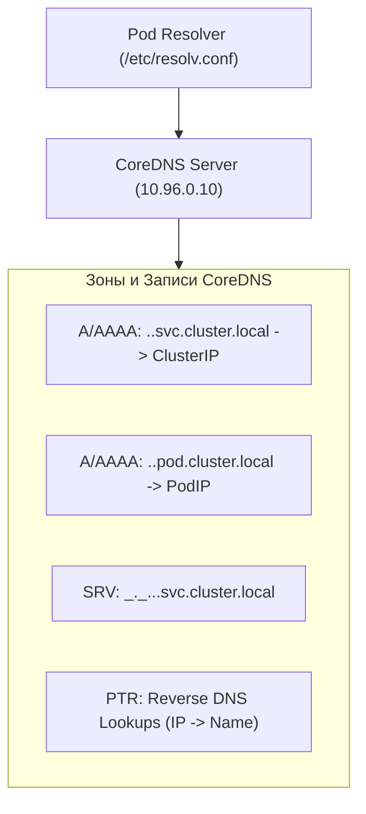
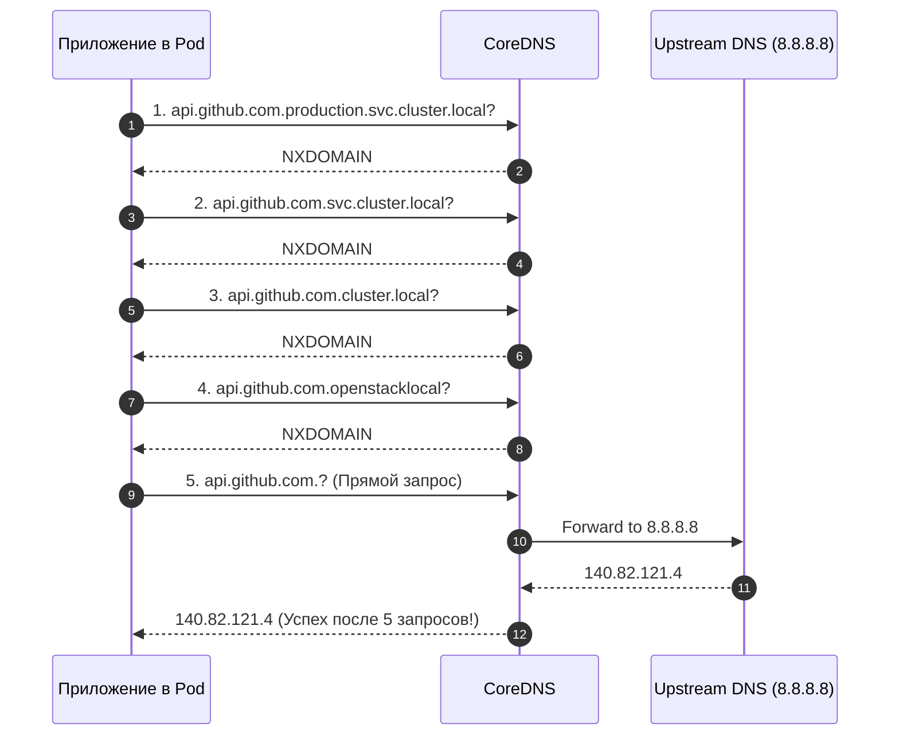

# 🔍 21. DNS и CoreDNS: Service Discovery и Оптимизация

> CoreDNS — стандартный DNS-сервер Kubernetes, обеспечивающий автоматическое обнаружение сервисов внутри кластера. Неоптимальная настройка DNS способна добавить до 5 секунд задержки на каждый внешний HTTP-запрос.

---

## 🏛️ Спецификация Kubernetes DNS и Типы Записей

CoreDNS непрерывно отслеживает Services и Endpoints через `kube-apiserver` и генерирует DNS-записи по единому стандарту:



### Форматы DNS-записей:
1. **Стандартный Service:**
   `my-svc.production.svc.cluster.local` $\to$ `10.96.45.12` (ClusterIP)
2. **Headless Service Pods:**
   `redis-0.redis-hs.database.svc.cluster.local` $\to$ `10.244.2.15` (Pod IP)
3. **SRV-записи для именованных портов:**
   `_http._tcp.web-service.default.svc.cluster.local` $\to$ порт `8080`, хост `web-service.default.svc.cluster.local`

---

## 🌪️ Проблема `ndots:5` и Раздувание Запросов

По умолчанию Kubelet генерирует файл `/etc/resolv.conf` внутри каждого контейнера со следующими параметрами:

```
nameserver 10.96.0.10
search production.svc.cluster.local svc.cluster.local cluster.local openstacklocal
options ndots:5
```

### В чем опасность `ndots:5`?
Опция `ndots:5` означает: *«Если в запрашиваемом домене содержится менее 5 точек, сначала перебрать все суффиксы из списка `search`»*.

При обращении приложения к внешнему домену, например `api.github.com` (2 точки < 5):



Каждый внешний запрос порождает **4-8 лишних запросов** (IPv4 A + IPv6 AAAA), создавая колоссальную паразитную нагрузку на CoreDNS и риски 5-секундных таймаутов conntrack.

---

## 🚀 Решение: NodeLocal DNSCache

`NodeLocal DNSCache` запускается как `DaemonSet` на каждом узле, поднимает виртуальный IP (`169.254.20.10`) и кэширует DNS-запросы локально, переводя протокол взаимодействия с UDP на устойчивый TCP.

```mermaid
graph TD
    Pod["Pod"] -->|UDP/TCP Query| NodeDNS["NodeLocal DNSCache (169.254.20.10)<br/>Local DaemonSet"]
    NodeDNS -->|Cache Hit| Pod
    NodeDNS -->|Cache Miss: Cluster Zone (TCP)| CoreDNS["Cluster CoreDNS (10.96.0.10)"]
    NodeDNS -->|Cache Miss: External Zone (UDP/TCP)| ExtDNS["Upstream External DNS"]
```

---

## 🛠️ Production-Ready Конфигурации

### 1. Кастомизация Corefile (`CoreDNS ConfigMap`)

```yaml
apiVersion: v1
kind: ConfigMap
metadata:
  name: coredns
  namespace: kube-system
data:
  Corefile: |
    .:53 {
        errors
        health {
            lameduck 5s
        }
        ready
        # Внутренняя зона Kubernetes
        kubernetes cluster.local in-addr.arpa ip6.arpa {
            pods insecure
            fallthrough in-addr.arpa ip6.arpa
            ttl 30
        }
        prometheus :9153
        # Оптимизация перенаправления внешних запросов
        forward . /etc/resolv.conf {
            max_concurrent 1000
            prefer_udp
        }
        cache 30 {
            success 9984 30
            denial 9984 5
        }
        loop
        reload
        loadbalance round_robin
    }
    # Пользовательская Stub-зона для внутренней корпоративной сети
    corp.internal:53 {
        forward . 192.168.1.10 192.168.1.11
        cache 60
    }
```

### 2. Оптимизация `dnsConfig` в манифесте Pod

```yaml
apiVersion: apps/v1
kind: Deployment
metadata:
  name: external-crawler
  namespace: production
spec:
  replicas: 3
  selector:
    matchLabels:
      app: external-crawler
  template:
    metadata:
      labels:
        app: external-crawler
    spec:
      # Уменьшение ndots для сервисов, активно работающих с внешними API
      dnsConfig:
        options:
        - name: ndots
          value: "2"
        - name: timeout
          value: "1"
        - name: attempts
          value: "2"
      containers:
      - name: crawler
        image: registry.example.com/crawler:v1.0
        resources:
          requests: {cpu: "500m", memory: "512Mi"}
```

---

## ⚡ CLI Шпаргалка: Диагностика CoreDNS

```bash
# 1. Проверка разрешения внутреннего имени из временного пода
kubectl run -it --rm dns-bench --image=nicolaka/netshoot -- dig +search my-svc.production.svc.cluster.local

# 2. Проверка разрешения внешнего имени с отображением всех попыток
kubectl run -it --rm dns-bench --image=nicolaka/netshoot -- dig +trace api.github.com

# 3. Мониторинг логов CoreDNS в реальном времени
kubectl logs -n kube-system -l k8s-app=kube-dns -f --tail=100

# 4. Проверка частоты ошибок DNS в Prometheus
# rate(coredns_dns_responses_total{rcode="SERVFAIL"}[5m])
# rate(coredns_dns_responses_total{rcode="NXDOMAIN"}[5m])

# 5. Перезапуск подов CoreDNS
kubectl rollout restart deployment coredns -n kube-system
```

---

## 🚒 Troubleshooting: Реальные Инциденты и Решения

### Сценарий 1: CoreDNS падает в `CrashLoopBackOff` (`Loop plugin detected loop`)

- **Симптом:** CoreDNS перезапускается с логом: `plugin/loop: Loop (127.0.0.1:53 -> :53) detected for zone "."`.
- **Первопричина:** На хосте работает `systemd-resolved` (на `127.0.0.53`), и Kubelet скопировал `/etc/resolv.conf` хоста в CoreDNS, вызвав циклическую пересылку запроса самому себе.
- **Решение:**
  Указать Kubelet путь к реальному файлу DNS вышестоящего провайдера:
  ```bash
  # В /var/lib/kubelet/config.yaml:
  resolvConf: /run/systemd/resolve/resolv.conf
  ```
  И перезапустить `systemctl restart kubelet coredns`.

---

### Сценарий 2: Периодические 5-секундные задержки при DNS-запросах

- **Симптом:** HTTP-запросы внутри подов спорадически висят ровно 5.00 секунд.
- **Первопричина:** Гонка в ядре Linux при одновременной отправке A и AAAA UDP-пакетов через один сокет в таблице Conntrack (`glibc` DNS issue).
- **Решение:**
  1. Внедрить **NodeLocal DNSCache** (запросы идут по TCP).
  2. Либо добавить опцию `single-request-reopen` в `dnsConfig` пода:
     ```yaml
     dnsConfig:
       options:
       - name: single-request-reopen
     ```
