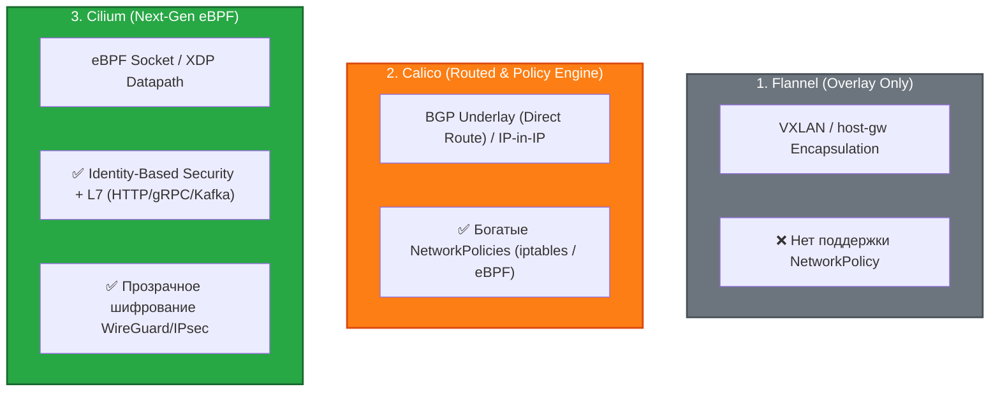
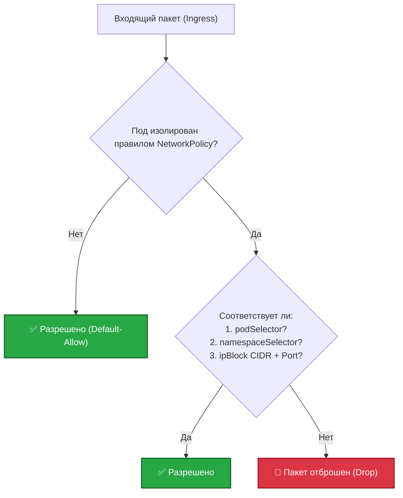

# 🛡️ 22. CNI и NetworkPolicy: Сетевая Безопасность и Датаплейны

> Сетевой плагин CNI (Container Network Interface) формирует единую плоскую сеть кластера (Pod-to-Pod без NAT), а NetworkPolicy обеспечивает микросегментацию и нулевое доверие (Zero Trust) на уровнях L3/L4/L7.

---

## 🌐 Сравнение CNI Плагинов: Flannel vs Calico vs Cilium



| Характеристика | Flannel | Calico | Cilium |
|---|---|---|---|
| **Архитектура датаплейна** | Linux Bridge / VXLAN | iptables / Linux IP routing / eBPF | Pure Linux Kernel **eBPF** |
| **Маршрутизация** | Только Overlay (VXLAN) | Direct BGP (без инкапсуляции) или VXLAN | Direct Routing, VXLAN, Geneve |
| **Поддержка NetworkPolicy** | ❌ Нет | ✅ Стандартные K8s + расширенные Calico | ✅ Стандартные K8s + Cilium L7 + FQDN |
| **Наблюдаемость (Observability)** | Базовая | Calico Enterprise | **Hubble** (L3/L4/L7 Flow Tracing) |
| **Шифрование трафика** | ❌ Нет | WireGuard | WireGuard, IPsec |
| **Подходит для** | Тестовые стенды, edge | Энтерпрайз On-Premises (BGP) | Высоконагруженные облака и прод |

---

## 🔒 Модель Безопасности NetworkPolicy

По умолчанию в Kubernetes действует модель **Default-Allow**: любой под может взаимодействовать с любым другим подом в любом пространстве имен.

### Логика применения правил:
1. Если на под **не ссылается** ни одна NetworkPolicy $\to$ трафик разрешен.
2. Как только создается хотя бы одна NetworkPolicy, выбирающая под через `podSelector` $\to$ под переходит в режим изоляции (**Default-Deny** для выбранного типа `Ingress` или `Egress`).



---

## 🛠️ Production-Ready Конфигурации

### 1. Zero Trust: Default Deny All (Ingress + Egress)

Фундаментальное правило для каждого production namespace:

```yaml
apiVersion: networking.k8s.io/v1
kind: NetworkPolicy
metadata:
  name: default-deny-all
  namespace: production
spec:
  podSelector: {} # Применяется ко ВСЕМ подам в namespace
  policyTypes:
  - Ingress
  - Egress
```

### 2. Комплексная трехуровневая NetworkPolicy (Web $\to$ Backend $\to$ Database)

```yaml
apiVersion: networking.k8s.io/v1
kind: NetworkPolicy
metadata:
  name: backend-security-policy
  namespace: production
spec:
  podSelector:
    matchLabels:
      app.kubernetes.io/tier: backend
  policyTypes:
  - Ingress
  - Egress

  # Разрешенный входящий трафик (Ingress)
  ingress:
  # 1. Трафик от Web-фронтенда внутри этого же namespace на порт 8080
  - from:
    - podSelector:
        matchLabels:
          app.kubernetes.io/tier: frontend
    ports:
    - protocol: TCP
      port: 8080
  # 2. Трафик от Ingress-контроллера из системного namespace
  - from:
    - namespaceSelector:
        matchLabels:
          kubernetes.io/metadata.name: ingress-nginx
      podSelector:
        matchLabels:
          app.kubernetes.io/name: ingress-nginx
    ports:
    - protocol: TCP
      port: 8080

  # Разрешенный исходящий трафик (Egress)
  egress:
  # 1. Обязательно: доступ к CoreDNS (kube-system) для резолва имен!
  - to:
    - namespaceSelector:
        matchLabels:
          kubernetes.io/metadata.name: kube-system
      podSelector:
        matchLabels:
          k8s-app: kube-dns
    ports:
    - protocol: UDP
      port: 53
    - protocol: TCP
      port: 53

  # 2. Доступ к базе данных PostgreSQL в namespace 'database'
  - to:
    - namespaceSelector:
        matchLabels:
          kubernetes.io/metadata.name: database
      podSelector:
        matchLabels:
          app.kubernetes.io/name: postgresql
    ports:
    - protocol: TCP
      port: 5432
```

---

## ⚡ CLI Шпаргалка: Мониторинг и Проверка Сетевых Политик

```bash
# 1. Просмотр всех NetworkPolicies во всех неймспейсах
kubectl get networkpolicies -A -o wide

# 2. Проверка статуса Cilium CNI
cilium status

# 3. Инспекция трафика в реальном времени через Hubble CLI (Cilium)
hubble observe --namespace production --follow --verdict DROPPED

# 4. Проверка статуса BGP-сессий в Calico
calicoctl node status

# 5. Тестирование соединения между подами
kubectl run -it --rm net-test --image=nicolaka/netshoot -- nc -zvw3 postgres.database.svc.cluster.local 5432
```

---

## 🚒 Troubleshooting: Реальные Инциденты и Решения

### Сценарий 1: Pod теряет связь с миром и DNS после применения NetworkPolicy

- **Симптом:** После применения NetworkPolicy приложение начинает выдавать ошибки `dial tcp: lookup postgres: i/o timeout`.
- **Первопричина:** Была включена политика с `policyTypes: ["Egress"]`, но забыто правило, разрешающее исходящий трафик к CoreDNS на порт 53 (UDP/TCP).
- **Решение:**
  Всегда добавлять правило доступа к CoreDNS во все Egress-политики (см. пример конфигурации выше).

---

### Сценарий 2: NetworkPolicy создана, но трафик не блокируется

- **Симптом:** `kubectl get netpol` показывает созданные правила, но тестовый под свободно подключается к изолированной БД.
- **Первопричина:** В кластере установлен CNI плагин (например, чистый Flannel), который не имеет Policy Engine и игнорирует спецификацию NetworkPolicy.
- **Решение:**
  Установить CNI с поддержкой политик безопасности (Cilium или Calico).
