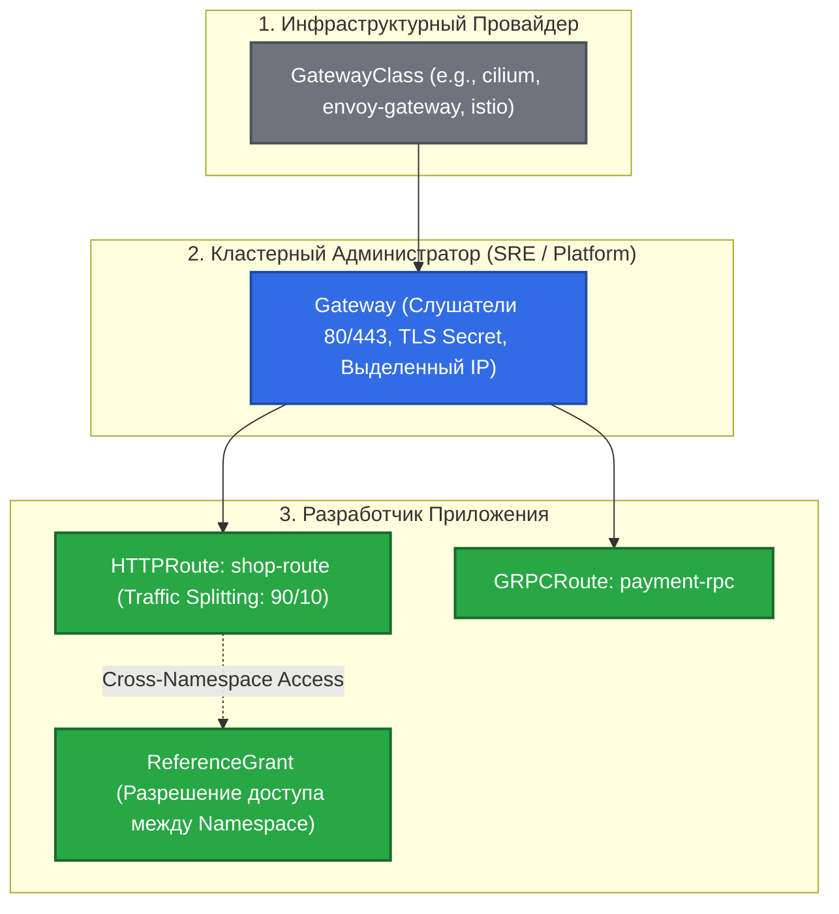

# 🚪 23. Ingress и Gateway API: Эволюция L7-Маршрутизации

> Традиционный Kubernetes Ingress создавался для простой HTTP-маршрутизации, но исчерпал себя в современных микросервисных архитектурах. Gateway API — это официальная замена следующего поколения, предлагающая ролевое разделение ответственности, нативный канареечный деплой и поддержку протоколов gRPC, TLS и TCP.

---

## 🏛️ Ingress vs Gateway API: Сравнение Архитектур

### Ограничения Ingress:
1. **Хаос аннотаций:** Поведение балансировщиков (Rate limiting, Canary, Rewrite) задается через несовместимые аннотации вендоров (`nginx.ingress.kubernetes.io/...`, `traefik.ingress...`).
2. **Монолитная модель владения:** Один манифест `Ingress` объединяет и инфраструктуру (TLS-сертификаты, IP-адреса), и правила маршрутизации приложений.
3. **Отсутствие поддержки gRPC, Header-based routing и кросс-неймспейс маршрутизации.**

---

### Ролевая модель Gateway API

Gateway API разделяет управление сетевой инфраструктурой между тремя ключевыми ролями:



---

## 🛠️ Production-Ready Конфигурации

### 1. Объект Gateway (Уровень Кластерного Администратора)

Создается в пространстве имен `gateway-infra`, открывает внешние порты и подключает TLS-сертификат:

```yaml
apiVersion: gateway.networking.k8s.io/v1
kind: Gateway
metadata:
  name: prod-edge-gateway
  namespace: gateway-infra
spec:
  gatewayClassName: cilium # или envoy-gateway
  listeners:
  - name: https
    protocol: HTTPS
    port: 443
    hostname: "*.example.com"
    tls:
      mode: Terminate
      certificateRefs:
      - kind: Secret
        name: wildcard-example-tls
    allowedRoutes:
      namespaces:
        from: All # Разрешить маршрутам из всех namespace подключаться к шлюзу
```

### 2. Кросс-неймспейс доступ: ReferenceGrant

Позволяет безопасно передавать трафик из `gateway-infra` в namespace `production`:

```yaml
apiVersion: gateway.networking.k8s.io/v1beta1
kind: ReferenceGrant
metadata:
  name: allow-gateway-to-backend
  namespace: production
spec:
  from:
  - group: gateway.networking.k8s.io
    kind: Gateway
    namespace: gateway-infra
  to:
  - group: ""
    kind: Service
    name: shop-service-v1
  - group: ""
    kind: Service
    name: shop-service-v2
```

### 3. HTTPRoute с Canary-разделением трафика (90/10) и Header Matching

```yaml
apiVersion: gateway.networking.k8s.io/v1
kind: HTTPRoute
metadata:
  name: shop-canary-route
  namespace: production
spec:
  parentRefs:
  - name: prod-edge-gateway
    namespace: gateway-infra
  hostnames:
  - "shop.example.com"
  rules:
  # Правило 1: Тестировщики и внутренние сотрудники всегда направляются на v2 (Header Match)
  - matches:
    - headers:
      - name: X-Beta-Tester
        value: "true"
    backendRefs:
    - name: shop-service-v2
      port: 8080

  # Правило 2: Основной продакшн-трафик с весовым разделением 90% v1 / 10% v2
  - matches:
    - path:
        type: PathPrefix
        value: /
    backendRefs:
    - name: shop-service-v1
      port: 8080
      weight: 90
    - name: shop-service-v2
      port: 8080
      weight: 10
```

---

## ⚡ CLI Шпаргалка: Управление Gateway API

```bash
# 1. Проверка доступных GatewayClass в кластере
kubectl get gatewayclasses

# 2. Список активных Gateway и их IP-адресов
kubectl get gateways -A

# 3. Детальная проверка статуса HTTPRoute
kubectl describe httproute shop-canary-route -n production

# 4. Тестирование канареечного маршрута через curl с заголовком
curl -k -H "Host: shop.example.com" -H "X-Beta-Tester: true" https://<gateway-ip>/api/version

# 5. Тестирование стандартного распределения трафика
for i in {1..10}; do
  curl -s -k -H "Host: shop.example.com" https://<gateway-ip>/api/version
done
```

---

## 🚒 Troubleshooting: Реальные Инциденты и Решения

### Сценарий 1: HTTPRoute в статусе `Accepted: False` или `Programmed: False`

- **Симптом:** Маршрут создан, но трафик не проходит (возвращается 404 Not Found на шлюзе).
- **Первопричина:** Не совпадает `parentRef` (шлюз не существует или находится в другом namespace) либо `allowedRoutes` на шлюзе запрещает привязку из неймспейса маршрута.
- **Диагностика:**
  ```bash
  kubectl describe httproute shop-canary-route -n production | grep -A 8 "Status:"
  ```
- **Решение:**
  Убедиться, что в манифесте Gateway указан `allowedRoutes.namespaces.from: All` или `Selector`.

---

### Сценарий 2: Ошибка `ResolvedRefs: False` (ReferenceGrant Missing)

- **Симптом:** Трафик на кросс-неймспейс Service блокируется со статусом `ReferenceGrant is required to refer to Service in different namespace`.
- **Решение:**
  Создать манифест `ReferenceGrant` в целевом пространстве имен бэкенда, явно разрешающий объекту `Gateway` доступ к сервисам.
