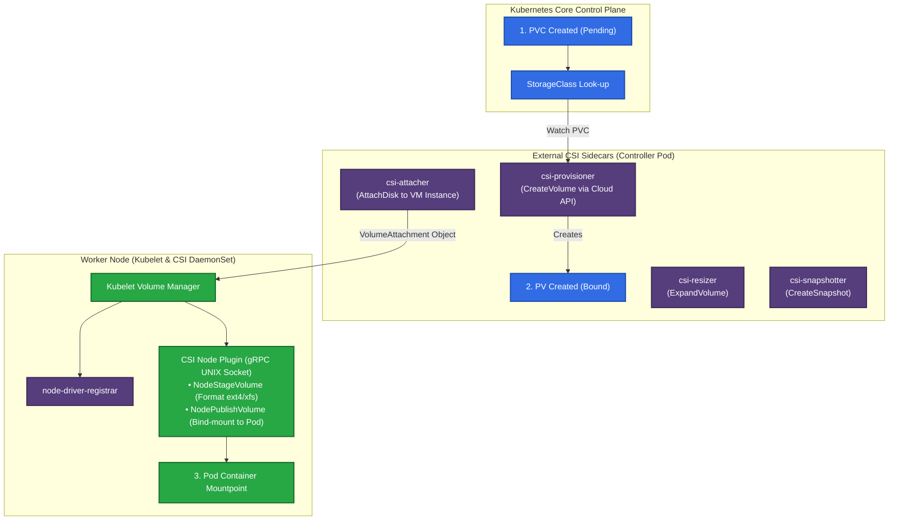

# 💽 24. Storage и CSI: Персистентность Данных в Kubernetes

> Kubernetes абстрагирует блочные, файловые и объектные хранилища через стандарт Container Storage Interface (CSI). StorageClass, PersistentVolume (PV) и PersistentVolumeClaim (PVC) реализуют двухуровневую модель управления жизненным циклом дисков.

---

## 🏛️ Архитектура CSI и Жизненный Цикл Тома

CSI разделяет логику взаимодействия с хранилищем на **Control Plane контроллеры** (выделение дисков в облаке) и **Node агенты** (форматирование и монтирование на хосте).



---

## ⚖️ StorageClass и Режимы Привязки Томов

### 1. `volumeBindingMode`: Immediate vs WaitForFirstConsumer

- **`Immediate` (По умолчанию):** PV создается облачным провайдером сразу при создании PVC.
  > [!WARNING]
  > В мультизональных кластерах это часто приводит к тупику: диск создается в зоне `us-east-1a`, а планировщик позже решает запустить под в зоне `us-east-1b`, куда диск физически невозможно смонтировать!
- **`WaitForFirstConsumer` (Рекомендуется для всех Production SC):** Создание PV откладывается до тех пор, пока планировщик не выберет конкретный рабочий узел для пода с учетом ресурсов, Taints и зоны.

### 2. `reclaimPolicy`: Retain vs Delete
- **`Delete`:** При удалении PVC физический том в облаке уничтожается вместе со всеми данными.
- **`Retain`:** При удалении PVC объект PV переходит в статус `Released`, а данные на физическом диске сохраняются для ручного восстановления администратором.

### 3. Режимы доступа (AccessModes)
- `ReadWriteOnce` (**RWO**): Том может быть смонтирован на чтение/запись только к **одному узлу**.
- `ReadOnlyMany` (**ROX**): Том может быть смонтирован только на чтение **многими узлами**.
- `ReadWriteMany` (**RWX**): Том может монтироваться на чтение/запись **многими узлами** одновременно (NFS, CephFS, AWS EFS).
- `ReadWriteOncePod` (**RWOP**): Доступ на чтение/запись строго к **одному поду** (K8s 1.22+).

---

## 🛠️ Production-Ready Конфигурации

### 1. Production StorageClass (AWS EBS gp3 с шифрованием и динамическим расширением)

```yaml
apiVersion: storage.k8s.io/v1
kind: StorageClass
metadata:
  name: ebs-gp3-sc
provisioner: ebs.csi.aws.com
volumeBindingMode: WaitForFirstConsumer # Создание диска в зоне размещения пода
allowVolumeExpansion: true             # Возможность онлайн-расширения диска
reclaimPolicy: Retain                  # Защита от случайной потери данных
parameters:
  type: gp3
  iops: "3000"
  throughput: "125"
  encrypted: "true"
```

### 2. PVC и Pod с динамическим монтированием

```yaml
apiVersion: v1
kind: PersistentVolumeClaim
metadata:
  name: postgres-data-pvc
  namespace: database
spec:
  accessModes:
    - ReadWriteOnce
  storageClassName: ebs-gp3-sc
  resources:
    requests:
      storage: 50Gi
---
apiVersion: v1
kind: Pod
metadata:
  name: postgres-single
  namespace: database
spec:
  containers:
  - name: postgres
    image: postgres:15-alpine
    volumeMounts:
    - name: data
      mountPath: /var/lib/postgresql/data
  volumes:
  - name: data
    persistentVolumeClaim:
      claimName: postgres-data-pvc
```

### 3. Снимок тома (VolumeSnapshot)

```yaml
apiVersion: snapshot.storage.k8s.io/v1
kind: VolumeSnapshot
metadata:
  name: postgres-snapshot-before-upgrade
  namespace: database
spec:
  volumeSnapshotClassName: ebs-snapshot-class
  source:
    persistentVolumeClaimName: postgres-data-pvc
```

---

## ⚡ CLI Шпаргалка: Управление Дисками и Снимками

```bash
# 1. Просмотр классов хранилищ и их провайдеров
kubectl get storageclass

# 2. Проверка связывания PV и PVC
kubectl get pvc,pv -A -o wide

# 3. Онлайн-расширение диска (просто меняем storage в PVC!)
kubectl patch pvc postgres-data-pvc -n database -p '{"spec":{"resources":{"requests":{"storage":"100Gi"}}}}'

# 4. Просмотр активных вложений томов к узлам (VolumeAttachments)
kubectl get volumeattachments

# 5. Проверка доступных снимков томов
kubectl get volumesnapshots -A
```

---

## 🚒 Troubleshooting: Реальные Инциденты и Решения

### Сценарий 1: Расширение диска зависло в `FileSystemResizePending`

- **Симптом:** `kubectl describe pvc` показывает статус `FileSystemResizePending: Waiting for user to (re-)start a pod to finish file system resize of volume on node`.
- **Первопричина:** Облачный диск успешно увеличен контроллером CSI (`csi-resizer`), но файловая система (`ext4`/`xfs`) расширяется только Kubelet'ом при активном монтировании тома.
- **Решение:**
  Если под не был запущен, запустите под, использующий данный PVC. Kubelet автоматически выполнит `resize2fs` или `xfs_growfs` в фоновом режиме.

---

### Сценарий 2: Ошибка зоны `1 node(s) had volume node-affinity conflict`

- **Симптом:** Под висит в `Pending`, в Event: `volume node-affinity conflict`.
- **Первопричина:** Использовался StorageClass с `volumeBindingMode: Immediate`. Диск был создан в `zone-a`, но свободные CPU/RAM были доступны только на нодах в `zone-b`.
- **Решение:**
  Пересоздать StorageClass с параметром `volumeBindingMode: WaitForFirstConsumer`.
