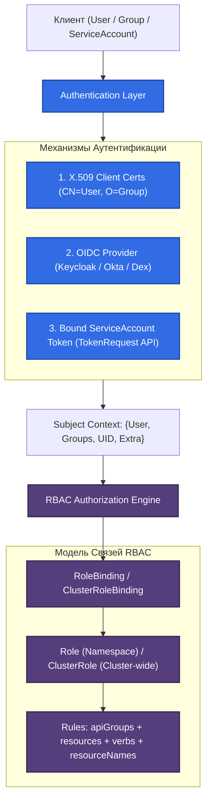

# 🔑 25. RBAC и Аутентификация: Глубокое Погружение

> Role-Based Access Control (RBAC) — основной механизм авторизации в Kubernetes. В сочетании с современным TokenRequest API и OIDC-аутентификацией он обеспечивает гранулярное разграничение привилегий (Principle of Least Privilege) и предотвращает эскалацию прав.

---

## 🏛️ Архитектура Аутентификации и Авторизации

API-сервер сначала устанавливает личность инициатора запроса (**Subject**), а затем сопоставляет его с разрешенными действиями над ресурсами через **RBAC Engine**.



---

## 🔐 Bound ServiceAccount Tokens (TokenRequest API)

Начиная с Kubernetes 1.22+, устаревшие бесконечные секреты `kubernetes.io/service-account-token` заменены на **Bound ServiceAccount Tokens**:
1. Токены генерируются Kubelet'ом через `TokenRequest API`.
2. Имеют жесткий срок жизни (`exp`, по умолчанию 1 час) с автоматической ротацией.
3. Привязаны к конкретному поду (`bound to Pod UID`): если под удален, токен мгновенно становится недействительным в API-сервере.
4. Содержат поле `aud` (Audience), защищающее от использования токена в других системах.

---

## 🛠️ Production-Ready Конфигурации

### 1. Минимальные права для CI/CD Pipeline (Least Privilege Role)

```yaml
apiVersion: v1
kind: ServiceAccount
metadata:
  name: gitlab-ci-deployer
  namespace: production
automountServiceAccountToken: false # Токен монтируется только там, где явно требуется
---
apiVersion: rbac.authorization.k8s.io/v1
kind: Role
metadata:
  name: gitlab-ci-deployer-role
  namespace: production
rules:
# 1. Управление развертываниями конкретного приложения
- apiGroups: ["apps"]
  resources: ["deployments"]
  verbs: ["get", "list", "watch", "update", "patch"]
  resourceNames: ["shop-frontend", "shop-backend"]

# 2. Отслеживание статуса подов и просмотр логов
- apiGroups: [""]
  resources: ["pods", "pods/log"]
  verbs: ["get", "list", "watch"]

# 3. Управление конфигурациями
- apiGroups: [""]
  resources: ["configmaps"]
  verbs: ["get", "list", "create", "update", "patch"]
---
apiVersion: rbac.authorization.k8s.io/v1
kind: RoleBinding
metadata:
  name: gitlab-ci-deployer-binding
  namespace: production
subjects:
- kind: ServiceAccount
  name: gitlab-ci-deployer
  namespace: production
roleRef:
  kind: Role
  name: gitlab-ci-deployer-role
  apiGroup: rbac.authorization.k8s.io
```

### 2. Агрегированная ClusterRole для Custom Resources

```yaml
apiVersion: rbac.authorization.k8s.io/v1
kind: ClusterRole
metadata:
  name: custom-metrics-admin
  # Автоматически включает в себя все роли с соответствующей меткой
  aggregationRule:
    clusterRoleSelectors:
    - matchLabels:
        rbac.example.com/aggregate-to-metrics: "true"
rules: [] # Заполняется контроллером RBAC автоматически!
---
apiVersion: rbac.authorization.k8s.io/v1
kind: ClusterRole
metadata:
  name: custom-metrics-crds
  labels:
    rbac.example.com/aggregate-to-metrics: "true"
rules:
- apiGroups: ["metrics.k8s.io", "custom.metrics.k8s.io"]
  resources: ["*"]
  verbs: ["get", "list", "watch"]
```

---

## ⚡ CLI Шпаргалка: Аудит и Проверка Прав через `kubectl auth`

```bash
# 1. Проверка: может ли текущий пользователь создавать поды в namespace production?
kubectl auth can-i create pods -n production

# 2. Проверка прав от имени конкретного ServiceAccount (Имперсонация)
kubectl auth can-i delete deployments \
  --as=system:serviceaccount:production:gitlab-ci-deployer \
  -n production

# 3. Полный список всех разрешенных действий для ServiceAccount
kubectl auth can-i --list \
  --as=system:serviceaccount:production:gitlab-ci-deployer \
  -n production

# 4. Поиск всех пользователей с правами cluster-admin
kubectl get clusterrolebindings -o json | jq -r '
  .items[] | select(.roleRef.name=="cluster-admin") | 
  .metadata.name as $crb | .subjects[]? | "\($crb) -> \(.kind): \(.name)"'

# 5. Ручной выпуск временного токена для ServiceAccount (срок: 2 часа)
kubectl create token gitlab-ci-deployer -n production --duration=2h
```

---

## 🚒 Troubleshooting: Реальные Инциденты и Решения

### Сценарий 1: Ошибка `403 Forbidden: is forbidden: User "system:serviceaccount:..." cannot get resource`

- **Симптом:** Приложение падает с логом `403 Forbidden: User "system:serviceaccount:production:app-sa" cannot get resource "secrets" in API group "" at the cluster scope`.
- **Первопричина:** Приложение пытается прочитать ресурс на уровне кластера (`ClusterRole`), но к нему привязан обычный `RoleBinding`, действующий только внутри namespace, либо в `apiGroups` указано неверное значение.
- **Диагностика:**
  ```bash
  kubectl auth can-i get secrets --as=system:serviceaccount:production:app-sa -A
  ```
- **Решение:**
  Использовать `ClusterRoleBinding` для cluster-wide ресурсов или скорректировать список `rules.resources`.

---

### Сценарий 2: Ошибка `escalate` / `bind` при попытке создать Role

- **Симптом:** Администратор или CI/CD процесс получает ошибка `User cannot create resource "roles" in API group "rbac.authorization.k8s.io": cannot grant permissions outside of its own scope`.
- **Первопричина:** Механизм защиты от эскалации привилегий. Пользователь не может создать или обновить `Role`/`RoleBinding` с правами, которых у него нет самого, пока у него нет специального верба `escalate` или `bind`.
- **Решение:**
  Выполнять создание ролей от имени учетной записи с достаточным объемом прав либо предоставить верб `escalate` на ресурс `roles`.
