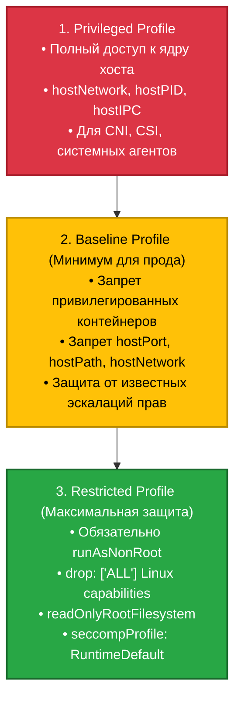
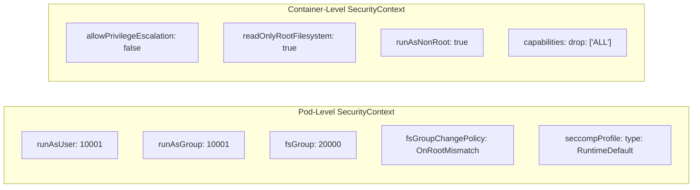

# 🛡️ 26. Pod Security Standards (PSS) и SecurityContext

> Pod Security Standards (PSS) и встроенный контроллер допуска Pod Security Admission (PSA) пришли на смену устаревшим PSP (PodSecurityPolicies). Они определяют три уровня политик безопасности контейнеров, а директива `securityContext` реализует эти требования на уровне ядра Linux.

---

## 🏛️ Уровни Pod Security Standards (PSS)



---

## ⚙️ Pod Security Admission (PSA): Режимы и Метки

PSA настраивается на уровне неймспейса с помощью специальных меток. Поддерживаются три режима работы (могут действовать одновременно):

1. **`enforce`:** Жестко блокирует создание подов, нарушающих политику (возвращает `403 Forbidden`).
2. **`audit`:** Разрешает создание, но записывает нарушение в Audit Log кластера.
3. **`warn`:** Разрешает создание, но возвращает предупреждение пользователю в терминал `kubectl`.

```yaml
# Пример меток на Namespace:
apiVersion: v1
kind: Namespace
metadata:
  name: payment-production
  labels:
    # Жесткий запрет отклонений от Restricted
    pod-security.kubernetes.io/enforce: restricted
    pod-security.kubernetes.io/enforce-version: latest
    # Предупреждение и аудит при малейших несоответствиях
    pod-security.kubernetes.io/warn: restricted
    pod-security.kubernetes.io/audit: restricted
```

---

## 🔒 SecurityContext: Уровни Pod и Container



### Разница параметров:
- **`fsGroup` & `fsGroupChangePolicy: OnRootMismatch`:** Автоматически назначает группу владельца для всех смонтированных томов. Опция `OnRootMismatch` предотвращает зависание старта пода при рекурсивном `chown` на больших дисках с миллионами файлов.
- **`allowPrivilegeEscalation: false`:** Устанавливает флаг `no_new_privs` в ядре Linux, запрещая бинарникам с битами SUID/SGID (например, `sudo` или `ping`) повышать права процесса.

---

## 🛠️ Production-Ready Конфигурации

### Полностью защищенный Deployment (100% Restricted PSS Compliant)

```yaml
apiVersion: apps/v1
kind: Deployment
metadata:
  name: secure-microservice
  namespace: payment-production
  labels:
    app.kubernetes.io/name: secure-microservice
spec:
  replicas: 3
  selector:
    matchLabels:
      app.kubernetes.io/name: secure-microservice
  template:
    metadata:
      labels:
        app.kubernetes.io/name: secure-microservice
    spec:
      # 1. Pod-level Security Context
      securityContext:
        runAsNonRoot: true
        runAsUser: 10001
        runAsGroup: 10001
        fsGroup: 10001
        fsGroupChangePolicy: OnRootMismatch
        seccompProfile:
          type: RuntimeDefault

      containers:
      - name: app
        image: registry.example.com/app:v3.2.1
        ports:
        - containerPort: 8080
          name: http

        # 2. Container-level Security Context
        securityContext:
          allowPrivilegeEscalation: false
          readOnlyRootFilesystem: true # Запрет записи в корень контейнера!
          privileged: false
          capabilities:
            drop:
              - ALL # Сброс абсолютно всех Linux capabilities

        volumeMounts:
        # Для приложений, которым требуются временные файлы (/tmp и кэш)
        - name: tmp-volume
          mountPath: /tmp
        - name: cache-volume
          mountPath: /app/cache

        resources:
          requests: {cpu: "250m", memory: "256Mi"}
          limits: {cpu: "500m", memory: "512Mi"}

      volumes:
      - name: tmp-volume
        emptyDir: {}
      - name: cache-volume
        emptyDir:
          medium: Memory # Хранение кэша в RAM для скорости и безопасности
```

---

## ⚡ CLI Шпаргалка: Тестирование и Диагностика PSA

```bash
# 1. Проверка неймспейсов на соответствие политикам PSS (Сухой прогон / Dry-Run)
kubectl label --dry-run=server --overwrite ns default \
  pod-security.kubernetes.io/enforce=restricted

# 2. Проверка событий блокировки подов контроллером допуска
kubectl get events -n payment-production --field-selector reason=FailedCreate

# 3. Просмотр UID и GID процесса внутри запущенного контейнера
kubectl exec -it <pod-name> -- id

# 4. Проверка статуса readonly файловой системы внутри пода
kubectl exec -it <pod-name> -- touch /root/test.txt # Должно вернуть Read-only file system
```

---

## 🚒 Troubleshooting: Реальные Инциденты и Решения

### Сценарий 1: Pod отклонен при создании (`violates PodSecurity "restricted:latest"`)

- **Симптом:** При деплое Deployment ReplicaSet не создает поды. Ошибка: `Pods "app-xxx" is forbidden: violates PodSecurity "restricted:latest": allowPrivilegeEscalation != false, unrestricted capabilities, runAsNonRoot != true`.
- **Первопричина:** В манифесте пода отсутствуют обязательные атрибуты защищенного профиля.
- **Решение:**
  Добавить `allowPrivilegeEscalation: false`, `capabilities: {drop: ["ALL"]}` и `runAsNonRoot: true` в манифест контейнера.

---

### Сценарий 2: Приложение падает с ошибкой `EROFS: read-only file system`

- **Симптом:** После включения `readOnlyRootFilesystem: true` контейнер падает в `CrashLoopBackOff` при попытке создать сокет, лог или временный файл в `/tmp` или `/var/run`.
- **Решение:**
  Смонтировать том `emptyDir` в директорию, куда приложению требуется временная запись (например, `/tmp` или `/var/log`).
