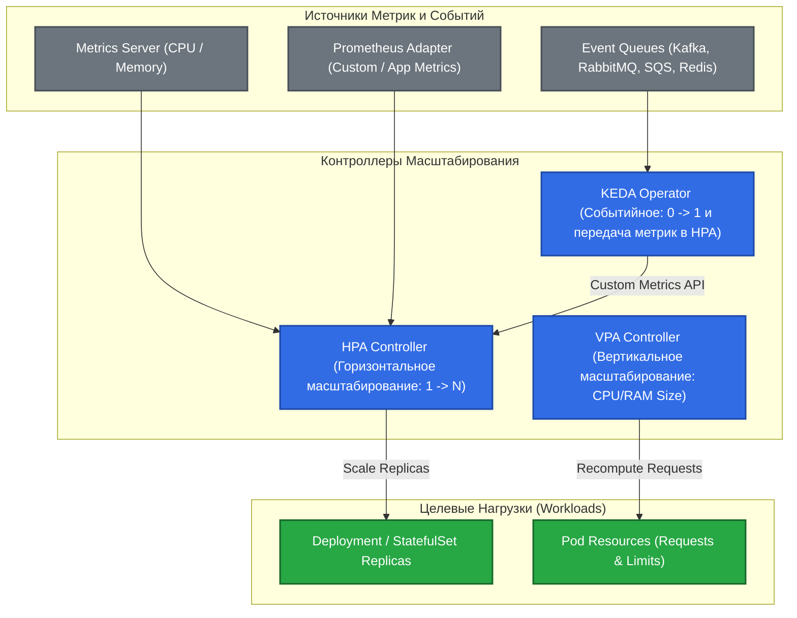

# 📈 27. HPA, VPA и KEDA: Трехуровневый Автоскейлинг Pod

> Масштабирование подов в Kubernetes охватывает три взаимодополняющих измерения: горизонтальное (HPA), вертикальное (VPA) и событийное (KEDA). Правильное совмещение этих инструментов позволяет экономить до 60% облачного бюджета и выдерживать внезапные всплески трафика.

---

## 🏛️ Трехуровневая Архитектура Автоскейлинга



---

## 📊 Математика и Поведение HPA (Horizontal Pod Autoscaler)

### Формула расчета желаемого числа реплик:
$$\text{desiredReplicas} = \left\lceil \text{currentReplicas} \times \left( \frac{\text{currentMetricValue}}{\text{targetMetricValue}} \right) \right\rceil$$

### Предотвращение флаппинга (Thrashing / Flapping):
HPA v2 поддерживает блок `behavior`, задающий скорость и задержку скейлинга:
- **`scaleDown.stabilizationWindowSeconds` (по умолчанию 300с):** HPA анализирует исторические метрики за последние 5 минут и выбирает наивысшее значение, предотвращая преждевременное гашение подов при кратковременных просадках нагрузки.
- **`scaleUp.policies`:** Позволяет мгновенно увеличивать поды на $100\%$ или фиксированное число реплик без задержек.

---

## ⚠️ Взаимодействие HPA и VPA: Как избежать конфликтов

> [!CAUTION]
> **Никогда не используйте HPA и VPA в режиме `Auto` по одним и тем же метрикам (CPU/Memory)!**
> Это приведет к петле положительной обратной связи: при росте нагрузки HPA добавит поды, нагрузка на каждый под упадет, VPA сожмет ресурсы пода, под снова перегрузится, и начнется хаотичный скейлинг (Death Spiral).

**Правильный паттерн использования:**
- **VPA в режиме `updateMode: "Off"`:** Для непрерывного сбора рекомендаций по оптимальным `requests/limits`.
- **HPA:** Для непосредственного масштабирования реплик по CPU/RPS.
- **Или:** HPA по кастомным метрикам (RPS / Latency) + VPA по CPU/Memory.

---

## ⚡ KEDA: Масштабирование по Событиям (Scale-to-Zero)

KEDA (Kubernetes Event-driven Autoscaling) позволяет масштабировать поды до **0 реплик**, когда очереди пусты, и мгновенно активировать под при появлении первого сообщения в брокере (Kafka lag, SQS message count, RabbitMQ queue depth).

---

## 🛠️ Production-Ready Конфигурации

### 1. Продвинутый HPA v2 с кастомным поведением и защитой от флаппинга

```yaml
apiVersion: autoscaling/v2
kind: HorizontalPodAutoscaler
metadata:
  name: api-autoscaler
  namespace: production
spec:
  scaleTargetRef:
    apiVersion: apps/v1
    kind: Deployment
    name: api-gateway
  minReplicas: 3
  maxReplicas: 30
  metrics:
  # 1. Метрика утилизации CPU (цель 70%)
  - type: Resource
    resource:
      name: cpu
      target:
        type: Utilization
        averageUtilization: 70
  # 2. Кастомная метрика из Prometheus (HTTP RPS на реплику)
  - type: Pods
    pods:
      metric:
        name: http_requests_per_second
      target:
        type: AverageValue
        averageValue: "500"

  behavior:
    # Агрессивный Scale-Up при всплесках
    scaleUp:
      stabilizationWindowSeconds: 0 # Мгновенная реакция
      policies:
      - type: Percent
        value: 100 # Удвоение подов
        periodSeconds: 15
      - type: Pods
        value: 4   # Или минимум +4 пода
        periodSeconds: 15
      selectPolicy: Max
    # Осторожный и плавный Scale-Down
    scaleDown:
      stabilizationWindowSeconds: 300 # Окно охлаждения 5 минут
      policies:
      - type: Percent
        value: 10 # Снимать не более 10% подов в минуту
        periodSeconds: 60
```

### 2. KEDA ScaledObject для очереди Apache Kafka (Scale to Zero)

```yaml
apiVersion: keda.sh/v1alpha1
kind: ScaledObject
metadata:
  name: kafka-consumer-scaler
  namespace: processing
spec:
  scaleTargetRef:
    name: order-consumer
  minReplicaCount: 0 # Масштабирование в ноль при отсутствии сообщений!
  maxReplicaCount: 20
  cooldownPeriod: 300
  pollingInterval: 15
  triggers:
  - type: kafka
    metadata:
      bootstrapServers: kafka-cluster.messaging.svc.cluster.local:9092
      consumerGroup: order-processor-group
      topic: orders.incoming
      lagThreshold: "50" # 1 под на каждые 50 сообщений лага
```

---

## ⚡ CLI Шпаргалка: Диагностика Автоскейлинга

```bash
# 1. Проверка текущих значений HPA и целевых таргетов
kubectl get hpa -A -o wide

# 2. Детальный аудит событий масштабирования HPA
kubectl describe hpa api-autoscaler -n production

# 3. Список и статус объектов KEDA ScaledObject
kubectl get scaledobjects -A

# 4. Просмотр рекомендаций VPA без перезапуска подов
kubectl get vpa -A -o yaml | grep -A 10 "recommendation:"

# 5. Проверка доступности метрик в metrics-server
kubectl top pods -A --sort-by=cpu
```

---

## 🚒 Troubleshooting: Реальные Инциденты и Решения

### Сценарий 1: HPA показывает метрику `<unknown>/70%`

- **Симптом:** HPA не масштабирует приложение, в поле `TARGETS` отображается `<unknown>`.
- **Первопричина:**
  1. В манифесте пода не указан блок `resources.requests.cpu` (HPA не может вычислить процент без базового запроса!).
  2. Либо упал `metrics-server`.
- **Решение:**
  Обязательно указать `resources.requests.cpu` во всех контейнерах целевого Pod.

---

### Сценарий 2: KEDA не скейлит нагрузку из 0 реплик

- **Симптом:** Сообщения в Kafka растут, но KEDA не поднимает поды из нуля.
- **Первопричина:** Неверно настроен `TriggerAuthentication` или сетевой доступ от KEDA Operator к брокеру Kafka.
- **Диагностика:**
  ```bash
  kubectl logs -n keda -l app.kubernetes.io/name=keda-operator -f
  ```
