# 🏗️ 28. Cluster Autoscaler и Karpenter: Масштабирование Узлов

> Когда емкости существующих серверов недостаточно для запуска новых подов, в дело вступают автоскейлеры инфраструктурного уровня. В то время как классический Cluster Autoscaler (CA) управляет статическими Node Groups, современный Karpenter напрямую общается с Cloud API, обеспечивая Just-In-Time выделение узлов за секунды.

---

## 🏛️ Сравнение Архитектур: Cluster Autoscaler vs Karpenter

```mermaid
graph TD
    subgraph ClassicCA["1. Cluster Autoscaler (Node Groups / ASG)"]
        Pending1["Pending Pods"] --> CA["Cluster Autoscaler"]
        CA --> ASG["AWS Auto Scaling Group / GCP MIG"]
        ASG --> Wait1["Старт однотипного инстанса (3-6 минут)"]
        Wait1 --> Node1["Нода добавлена в кластер"]
    end

    subgraph NextGenKarpenter["2. Karpenter (Group-less Just-In-Time)"]
        Pending2["Pending Pods (Анализ требований Pod)"] --> Karp["Karpenter Controller"]
        Karp --> JIT["Прямой вызов Cloud API (EC2 / Compute API)"]
        JIT --> BinPack["Подбор идеального инстанса (Bin-Packing)"]
        BinPack --> Node2["Нода готова за 45 секунд (Fast Boot)"]
    end

    classDef ca fill:#6c757d,stroke:#495057,stroke-width:2px,color:#fff;
    classDef kp fill:#28a745,stroke:#19692c,stroke-width:2px,color:#fff;
    class Pending1,CA,ASG,Wait1,Node1 ca;
    class Pending2,Karp,JIT,BinPack,Node2 kp;
```



| Характеристика | Cluster Autoscaler (CA) | Karpenter |
|---|---|---|
| **Уровень абстракции** | Auto Scaling Groups (ASG) / Node Pools | Direct Cloud Provider API (Group-less) |
| **Скорость масштабирования** | 3–8 минут | **30–60 секунд** |
| **Подбор инстансов** | Только заранее созданные пулы | Динамический **Bin-Packing** из сотен типов инстансов |
| **Дефрагментация (Consolidation)** | Базовый Scale-Down при недогрузке | Активная замена дорогих узлов на более дешевые |
| **Обработка Spot прерываний** | Зависит от внешних скриптов / NTH | **Встроенная** предиктивная ротация за 2 минуты |
| **Мульти-архитектура** | Отдельные ASG для x86 и ARM64 (Graviton) | Автоматический выбор ARM64 / AMD64 под требования пода |

---

## 💡 Механизм Consolidation (Уплотнение и Экономия)

Karpenter непрерывно анализирует распределение нагрузки в кластере:
1. **Emptiness:** Если нода полностью освободилась — она удаляется мгновенно.
2. **Underutilization:** Если поды с двух полупустых нод можно скомпоновать на одну — Karpenter вытесняет поды и удаляет лишнюю ноду.
3. **Cheaper Replacement:** Если все поды с дорогой ноды (например, `m5.2xlarge`) поместятся на более дешевую (`m5.large` или `c6g.xlarge` на Spot) — Karpenter поднимает дешевую ноду, переносит нагрузку и гасит старую.

---

## 🛠️ Production-Ready Конфигурации

### 1. Karpenter NodePool (Гибкое смешивание Spot и On-Demand, Graviton и x86)

```yaml
apiVersion: karpenter.sh/v1beta1
kind: NodePool
metadata:
  name: general-compute
spec:
  template:
    spec:
      nodeClassRef:
        name: default-ec2-class
      requirements:
        # Разрешаем запуск как на Spot (для экономии), так и на On-Demand
        - key: karpenter.sh/capacity-type
          operator: In
          values: ["spot", "on-demand"]
        # Поддержка современных семейств инстансов
        - key: ec2.amazonaws.com/instance-category
          operator: In
          values: ["c", "m", "r"]
        # Поддержка архитектур x86_64 и ARM64
        - key: kubernetes.io/arch
          operator: In
          values: ["amd64", "arm64"]
        - key: karpenter.k8s.aws/instance-generation
          operator: Gt
          values: ["5"] # Только инстансы 6-го поколения и новее

      # Автоматическое уплотнение и замена на более дешевые ноды
      disruption:
        consolidationPolicy: WhenUnderutilized
        expireAfter: 720h # Ротация нод раз в 30 дней для обновления AMI

  limits:
    cpu: 1000
    memory: 2000Gi
```

### 2. Karpenter EC2NodeClass (Конфигурация инфраструктуры хоста)

```yaml
apiVersion: karpenter.k8s.aws/v1beta1
kind: EC2NodeClass
metadata:
  name: default-ec2-class
spec:
  amiFamily: AL2 # Amazon Linux 2 / Bottlerocket
  role: "KarpenterNodeRole-production"
  subnetSelectorTerms:
    - tags:
        karpenter.sh/discovery: "prod-cluster"
  securityGroupSelectorTerms:
    - tags:
        karpenter.sh/discovery: "prod-cluster"
  blockDeviceMappings:
    - deviceName: /dev/xvda
      ebs:
        volumeSize: 100Gi
        volumeType: gp3
        iops: 3000
        throughput: 125
        encrypted: true
```

---

## ⚡ CLI Шпаргалка: Мониторинг Karpenter

```bash
# 1. Список активных пулов и заклеймленных нод
kubectl get nodepools,nodeclaims -A

# 2. Мониторинг логов Karpenter в реальном времени
kubectl logs -n karpenter -l app.kubernetes.io/name=karpenter -f --tail=100

# 3. Принудительное удаление ноды через Karpenter Disruption
kubectl delete nodeclaim <nodeclaim-name>

# 4. Просмотр причин не-эвикции подов при масштабировании CA
kubectl get configmap cluster-autoscaler-status -n kube-system -o yaml
```

---

## 🚒 Troubleshooting: Реальные Инциденты и Решения

### Сценарий 1: Нода не удаляется автоскейлером из-за PDB (PodDisruptionBudget)

- **Симптом:** Недогруженная нода не может быть выведена из эксплуатации, в логах: `cannot evict pod due to PDB violation`.
- **Первопричина:** Настроен слишком жесткий PDB (`minAvailable: 100%` или `maxUnavailable: 0`), блокирующий эвикцию даже единственной реплики.
- **Решение:**
  Скорректировать PDB, разрешив временную недоступность минимум одной реплики (`maxUnavailable: 1`).

---

### Сценарий 2: Ошибка `Insufficient Capacity Error (ICE)` на Spot пулах

- **Симптом:** Karpenter не может запустить инстансы, в логах: `AuthFailure.ServiceLinkedRoleCreationNotPermitted` или `InsufficientInstanceCapacity`.
- **Первопричина:** Пул Spot-инстансов выбранного типа в конкретной зоне доступности AWS временно исчерпан.
- **Решение:**
  Не ограничивать `NodePool` одним типом инстанса (например `c6i.xlarge`), а указывать гибкие категории `["c", "m", "r"]` и поколения `> "5"`.
