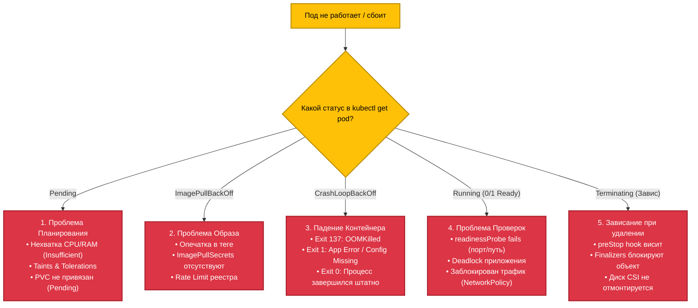

# 🩺 29. Kubernetes Troubleshooting: От CrashLoopBackOff до Инцидентов

> В распределенной среде Kubernetes сбои неизбежны. Данное руководство представляет собой алгоритмический справочник SRE/DevOps инженера для быстрой локализации и устранения аварий любого уровня сложности.

---

## 🧭 Дерево Принятия Решений: Диагностика Pod



---

## 🔢 Коды Завершения Процессов (Exit Codes Reference)

| Exit Code | Название | Причина и Интерпретация |
|---|---|---|
| **0** | Success / Completed | Процесс успешно завершил выполнение (для `Deployment` приводит к CrashLoop, если процесс не daemon). |
| **1** | General Application Error | Ошибка в коде приложения (Runtime exception, не найден файл конфигурации). |
| **137** | **SIGKILL (128 + 9)** | **OOMKilled** (память превысила `limits.memory`) либо принудительный `kill -9` от Kubelet по таймауту Grace Period. |
| **139** | **SIGSEGV (128 + 11)** | Segmentation Fault (ошибка работы с памятью в C/Go бинарниках). |
| **143** | **SIGTERM (128 + 15)** | Штатная остановка контейнера Kubelet'ом при обновлении или удалении. |

---

## 🛠️ Production-Ready Debug Pod (Швейцарский Нож Сетевого Инженера)

```yaml
apiVersion: v1
kind: Pod
metadata:
  name: net-troubleshooter
  namespace: default
spec:
  containers:
  - name: netshoot
    image: nicolaka/netshoot:latest
    command: ["/bin/bash", "-c", "sleep infinity"]
    securityContext:
      capabilities:
        add: ["NET_ADMIN", "NET_RAW"]
```

---

## ⚡ CLI Шпаргалка: Быстрая Диагностика Инцидентов

```bash
# 1. Поиск всех проблемных подов во всем кластере
kubectl get pods -A --field-selector=status.phase!=Running,status.phase!=Succeeded

# 2. Просмотр логов предыдущего (упавшего) экземпляра контейнера
kubectl logs <pod-name> -c <container-name> --previous --tail=100

# 3. Подключение Ephemeral Debug контейнера с общим PID пространством
kubectl debug -it <pod-name> --image=nicolaka/netshoot --target=<container-name>

# 4. Проверка событий ноды при переходе в NotReady
kubectl describe node <node-name> | grep -A 10 "Conditions:"

# 5. Просмотр системных логов Kubelet и containerd на хосте
journalctl -u kubelet -u containerd -xe -f --no-tail -n 100

# 6. Трассировка сетевого трафика внутри сетевого пространства пода (через nsenter)
PID=$(crictl inspect --output go-template --template '{{.info.pid}}' <container-id>)
nsenter -t $PID -n tcpdump -i any -nn port 80 or port 53
```

---

## 🚒 Реальные Разборы Инцидентов (Break-Fix Scenarios)

### Сценарий 1: Зависший под в статусе `Terminating` блокирует удаление Namespace

- **Симптом:** Namespace удален (`Terminating`), но не исчезает сутками. Внутри висит под в `Terminating`.
- **Первопричина:** На объекте пода или PVC установлен **Finalizer** (например `kubernetes.io/pvc-protection`), который ожидает очистки ресурса внешним контроллером.
- **Диагностика:**
  ```bash
  kubectl get pod <pod-name> -o jsonpath='{.metadata.finalizers}'
  ```
- **Решение:**
  Принудительно очистить финализаторы:
  ```bash
  kubectl get pod <pod-name> -o json | jq '.metadata.finalizers = []' | kubectl replace -f -
  # Экстренное удаление
  kubectl delete pod <pod-name> --grace-period=0 --force
  ```

---

### Сценарий 2: Узел переходит в `NotReady: DiskPressure` из-за исчерпания Inodes

- **Симптом:** Диск узла заполнен только на 40%, но Kubelet выселяет поды с ошибкой `NodeHasDiskPressure`.
- **Первопричина:** Исчерпаны **Inodes** (файловые дескрипторы) из-за миллионов мелких лог-файлов или временных сокетов.
- **Диагностика:**
  ```bash
  df -i /var/lib/containerd
  # Показывает 100% IUse!
  ```
- **Решение:**
  1. Очистить мертвые контейнеры и слои образов: `crictl rmi --prune`.
  2. Найти директории с миллионами файлов:
     ```bash
     find /var/log -xdev -printf '%h\n' | sort | uniq -c | sort -k 1 -n
     ```
