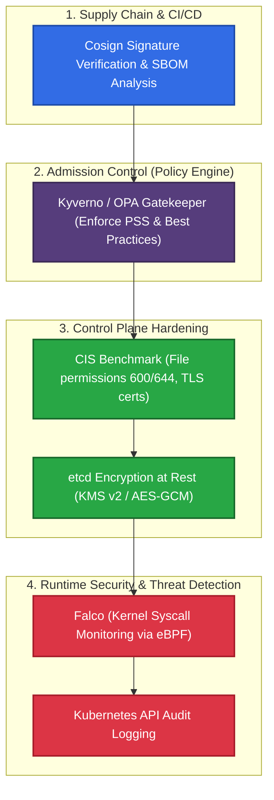

# 🔒 30. Kubernetes Security Hardening: Безопасность Control Plane и Runtime

> Безопасность Kubernetes строится по принципу эшелонированной обороны (Defense-in-Depth): от шифрования секретов в etcd и соответствия CIS Benchmark до политик допуска (Kyverno/OPA) и обнаружения угроз в рантайме на уровне ядра (Falco eBPF).

---

## 🏛️ Эшелонированная Оборона Kubernetes (Defense-in-Depth)



---

## 🔐 Шифрование Секретов в etcd (Encryption at Rest)

По умолчанию секреты хранятся в etcd в виде открытого текста, закодированного в Base64. При получении доступа к диску или snapshot etcd злоумышленник получает все секреты кластера.

### Иерархия провайдеров шифрования:
1. **`kms` (KMS v2, Рекомендуется):** Использование внешнего хранилища ключей (AWS KMS, HashiCorp Vault, Azure Key Vault) с конвертным шифрованием (Envelope Encryption).
2. **`aescbc` / `aesgcm`:** Симметричное аппаратное шифрование ключом из файла конфигурации.
3. **`identity`:** Открытый текст (по умолчанию).

---

## 🛠️ Production-Ready Конфигурации

### 1. Файл Конфигурации Шифрования Секретов (`/etc/kubernetes/encryption-config.yaml`)

```yaml
apiVersion: apiserver.config.k8s.io/v1
kind: EncryptionConfiguration
resources:
  - resources:
      - secrets
      - configmaps
    providers:
      # 1. Основной провайдер AES-CBC (Ключ 32 байта в Base64)
      - aescbc:
          keys:
            - name: key1
              secret: 2bYk2ZzN3R5r6u8x/A?D(G+KbPeShVmY
      # 2. Fallback для чтения не зашифрованных ранее данных при миграции
      - identity: {}
```

> [!IMPORTANT]
> После применения конфигурации к `kube-apiserver` необходимо принудительно перезашифровать существующие секреты:
> ```bash
> kubectl get secrets -A -o json | kubectl replace -f -
> ```

---

### 2. Kyverno ClusterPolicy: Запрет запуска root и блокировка `latest` тегов

```yaml
apiVersion: kyverno.io/v1
kind: ClusterPolicy
metadata:
  name: harden-production-workloads
  annotations:
    policies.kyverno.io/title: Disallow Root and Latest Tags
    policies.kyverno.io/severity: High
spec:
  validationFailureAction: Enforce # Жесткая блокировка создания
  background: true
  rules:
  # 1. Запрет использования тега :latest
  - name: validate-image-tag
    match:
      any:
      - resources:
          kinds: ["Pod"]
    validate:
      message: "Использование тега ':latest' запрещено в production!"
      pattern:
        spec:
          containers:
          - image: "!*:latest"

  # 2. Обязательный запуск от non-root пользователя
  - name: require-run-as-non-root
    match:
      any:
      - resources:
          kinds: ["Pod"]
    validate:
      message: "Контейнеры обязаны запускаться от non-root (runAsNonRoot: true)."
      pattern:
        spec:
          securityContext:
            runAsNonRoot: true
```

---

### 3. Пользовательское Правило Falco: Обнаружение Интерактивного Shell в Pod

```yaml
# /etc/falco/falco_rules.local.yaml
- rule: Terminal Shell Spawned Inside Production Container
  desc: Обнаружение запуска интерактивной оболочки (sh/bash) в проде
  condition: >
    spawned_process and 
    container and 
    container.image.repository not in (troubleshoot_images) and 
    proc.name in (bash, sh, zsh, ksh, csh) and 
    not user.name in (root_whitelisted)
  output: >
    КРИТИЧНО: Запущен терминал внутри пода 
    (user=%user.name pod=%k8s.pod.name ns=%k8s.ns.name image=%container.image.repository cmd=%proc.cmdline)
  priority: WARNING
  tags: [container, shell, mitre_execution]
```

---

## ⚡ CLI Шпаргалка: Аудит Безопасности

```bash
# 1. Запуск автоматизированной проверки соответствия CIS Kubernetes Benchmark
docker run --rm -v /etc:/etc:ro -v /var:/var:ro -t aquasec/kube-bench:latest run --targets master,node

# 2. Проверка зашифрованности секрета напрямую в etcd
ETCDCTL_API=3 etcdctl --cacert=/etc/kubernetes/pki/etcd/ca.crt \
  --cert=/etc/kubernetes/pki/etcd/server.crt \
  --key=/etc/kubernetes/pki/etcd/server.key \
  get /registry/secrets/default/my-secret | hexdump -C
# Первые байты должны начинаться с k8s:enc:aescbc:v1:key1

# 3. Мониторинг алертов безопасности Falco в реальном времени
journalctl -u falco -f -o cat | jq .

# 4. Проверка цифровой подписи образа через Cosign
cosign verify --key cosign.pub registry.example.com/app:v1.0.0
```

---

## 🚒 Troubleshooting: Реальные Инциденты и Решения

### Сценарий 1: API Server не стартует после включения `EncryptionConfiguration`

- **Симптом:** Статический под `kube-apiserver` падает в бесконечный рестарт. В логах `/var/log/pods/...kube-apiserver...`: `error reading encryption provider configuration file: invalid secret length, expected 32 bytes`.
- **Первопричина:** Ключ шифрования AES-CBC в манифесте `encryption-config.yaml` имеет длину, отличную от 32 байт (256 бит).
- **Решение:**
  Сгенерировать корректный 32-байтный ключ:
  ```bash
  head -c 32 /dev/urandom | base64
  ```
  Вставить полученную строку в файл и перезапустить API-сервер.

---

### Сценарий 2: Kyverno или Gatekeeper блокирует деплой собственных компонентов

- **Симптом:** Все поды в кластере, включая системные поды CNI/CSI, блокируются контроллером допуска.
- **Первопричина:** Политика `ClusterPolicy` создана без исключения системных пространств имен (`kube-system`, `kyverno`, `monitoring`).
- **Решение:**
  Всегда добавлять `exclude.resources.namespaces: ["kube-system", "kyverno"]` во все глобальные политики допуска.
