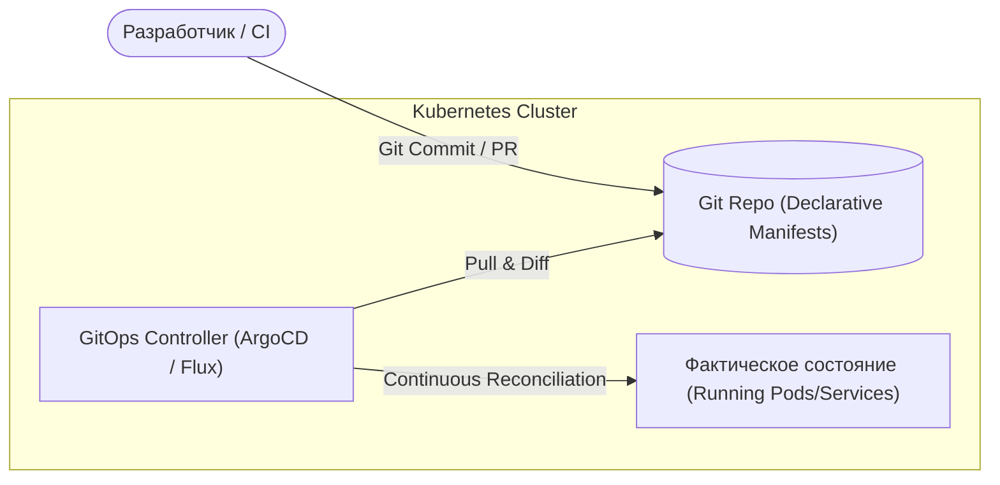
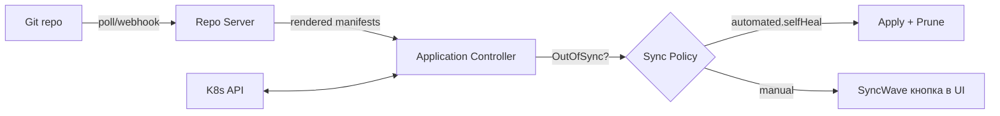

# 🔄 01. Принципы GitOps: ArgoCD и FluxCD

## 🎯 Принципы GitOps (OpenGitOps Standard)

GitOps — это подход к непрерывному развертыванию для cloud-native приложений, где **Git является единственным источником истины (Single Source of Truth)**.



### 4 столпа GitOps:
1. **Декларативность:** Описание всей системы хранится в декларативном виде (манифесты K8s, Helm, Kustomize).
2. **Версионированность и неизменяемость:** Вся история изменений и откатов зафиксирована в коммитах Git.
3. **Автоматический Pull (Стягивание):** Кластер сам забирает изменения из репозитория. В CI **нет** учетных данных от боевого кластера!
4. **Непрерывная сверка (Continuous Reconciliation):** Контроллер автоматически выявляет и исправляет дрейф конфигурации (Drift Detection & Self-Healing).

---

## 🐙 ArgoCD: Архитектура и Манифесты

### 1. Манифест ArgoCD `Application`
```yaml
apiVersion: argoproj.io/v1alpha1
kind: Application
metadata:
  name: payment-service-prod
  namespace: argocd
  finalizers:
    - resources-finalizer.argocd.argoproj.io # Каскадное удаление ресурсов при удалении Application
spec:
  project: default
  source:
    repoURL: https://github.com/company/k8s-infra.git
    targetRevision: main
    path: environments/production/payment-service
    helm:
      valueFiles:
        - values.yaml
        - values-prod.yaml
  destination:
    server: https://kubernetes.default.svc
    namespace: payments
  syncPolicy:
    automated:
      prune: true     # Удалять ресурсы из кластера, если они удалены из Git
      selfHeal: true  # Автоматически возвращать состояние, если кто-то изменил кластер вручную через kubectl
    syncOptions:
      - CreateNamespace=true
    retry:
      limit: 5
      backoff:
        duration: 5s
        factor: 2
        maxDuration: 3m
```

### 2. Мульти-кластерный деплой: ArgoCD `ApplicationSet`
Позволяет одним манифестом автоматически генерировать десятки `Application` по кластерам и окружениям:

```yaml
apiVersion: argoproj.io/v1alpha1
kind: ApplicationSet
metadata:
  name: cluster-addons
  namespace: argocd
spec:
  generators:
    - list:
        elements:
          - cluster: prod-eu-west-1
            url: https://k8s-eu.company.internal
          - cluster: prod-us-east-1
            url: https://k8s-us.company.internal
  template:
    metadata:
      name: '{{cluster}}-ingress-nginx'
    spec:
      project: default
      source:
        repoURL: https://kubernetes.github.io/ingress-nginx
        chart: ingress-nginx
        targetRevision: 4.9.0
      destination:
        server: '{{url}}'
        namespace: ingress-nginx
```

---

## 🚦 Прогрессивная доставка: Argo Rollouts (Canary)

Заменяет стандартный Deployment на интеллектуальную стратегию канареечного развертывания с авто-анализом метрик в Prometheus:

```yaml
apiVersion: argoproj.io/v1alpha1
kind: Rollout
metadata:
  name: core-api-rollout
spec:
  replicas: 10
  strategy:
    canary:
      steps:
        - setWeight: 10  # Направить 10% трафика на новую версию
        - pause: { duration: 10m } # Ждем 10 минут
        - setWeight: 50  # 50% трафика
        - pause: { duration: 15m }
        # Если Prometheus зафиксирует рост 5xx ошибок — мгновенный Rollback!
```

---

## 🔬 Deep Dive: reconciliation loop ArgoCD



### Sync waves и health checks

```yaml
metadata:
  annotations:
    argocd.argoproj.io/sync-wave: "-1"   # namespace/CRD раньше приложений
spec:
  syncPolicy:
    automated:
      prune: true          # удалить то, чего нет в Git (осторожно!)
      selfHeal: true       # вернуть при kubectl-правках мимо Git
    syncOptions:
      - CreateNamespace=true
      - ServerSideApply=true   # большие CRD > 262KB
```

### ApplicationSet: монорепо → 30 кластеров без копипасты

```yaml
apiVersion: argoproj.io/v1alpha1
kind: ApplicationSet
spec:
  generators:
    - git:
        repoURL: https://git.company.com/platform/clusters.git
        revision: main
        files:
          - path: clusters/*/config.json
  template:
    metadata:
      name: '{{path[0]}}-bootstrap'
```

!!! tip «ArgoCD vs Flux»
    ArgoCD — UI-first, удобен платформенным командам; Flux — OCI-native, легче интегрируется с Helm OCI репозиториями и подписью образов (`cosign verify` перед деплоем).

---

<!-- enriched:v1 -->

## 🧨 Типовые грабли Production

| Симптом | Причина | Быстрое решение |
| :--- | :--- | :--- |
| Пайплайн зеленый, прод сломан | Разница окружений / secrets не из Vault | Проверять конфиги через `conftest` + smoke-тесты после деплоя |
| `terraform apply` висит на lock | Умерший CI оставил lock | `force-unlock` после проверки активности |
| Ansible «работает» но ничего не меняет | `changed_when` не настроен | Явные `changed_when`/`failed_when` для команд |
| GitOps откатывает ручной фикс | Drift между Git и кластером | Править только в Git; `selfHeal` оставить включенным |

!!! warning «Идемпотентность — закон»
    Любой скрипт/плейбук/модуль должен быть безопасно перезапускаемым. Если второй прогон меняет состояние — это баг, который однажды уронит прод.

## 🧪 Hands-on Lab

```bash
argocd app list && argocd app get api --refresh | grep -E 'Health|Status|Message' && \
argocd app diff api --server-side-generate || true
```

## ✅ Чек-лист зрелости темы

- [ ] Все изменения проходят через PR с обязательным review

    ??? tip "Как закрыть пункт"
        Branch protection запрещает push в main; изменения инфраструктуры/конфигов — только через MR с review. Проверка: история применений соответствует истории мержей, «горячие правки на сервере» отсутствуют как класс.

- [ ] Секреты никогда не хранятся в коде/стейте (Vault/SOPS/secret manager)

    ??? tip "Как закрыть пункт"
        Vault/ESO как источник; gitleaks в pre-commit и CI. Для стейтов — шифрование бэкенда и ограничение доступа IAM. Аудит: grep по репозиторию находит ссылки на переменные, но не значения.

- [ ] Есть dry-run/plan этап и он виден в MR

    ??? tip "Как закрыть пункт"
        plan/--check --diff выполняется CI на каждый MR и публикуется в комментарий — ревьюер видит изменения инфраструктуры до approve. Артефакт плана переиспользуется при apply.

- [ ] Откат воспроизводим одной командой (< 10 минут)

    ??? tip "Как закрыть пункт"
        git revert + pipeline = откат инфраструктуры; helm rollback/GitOps revert для релизов. Отработано учением с таймером: решение → восстановленный сервис. Если есть ручные шаги — они в runbook.

- [ ] Логи пайплайна содержат версии артефактов (image digest, commit SHA)

    ??? tip "Как закрыть пункт"
        Deploy-джоба печатает: SHA коммита, digest образа, версии инструментов. При инциденте вы точно знаете, какой код где исполнялся. Проверка: по логу можно восстановить состояние прода на любой момент.

---

## 🧭 Что дальше

| Шаг | Материал |
| :--- | :--- |
| 🔬 Закрепить | [Lab 07: GitOps с ArgoCD](../16-guided-labs/07-lab-gitops-argocd.md) |
| 🎤 Проверить себя | [Вопросы: CI/CD, GitOps](../14-interview-prep/04-100-devops-interview-questions-bank-part2.md) |
