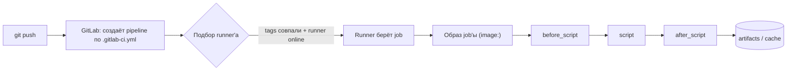

# 🦊 03. GitLab CI Deep Dive: Runners, Rules, Кэш и Production-пайплайны

## ⚙️ Модель выполнения: что происходит при push



Ключевое отличие от GitHub Actions: **джоба = контейнер**, весь пайплайн описывается одним файлом, а переиспользование — через `extends`/`!reference`/`include`, а не через actions-экосистему.

---

## 📝 Структура production `.gitlab-ci.yml`

```yaml
stages: [verify, build, test, deploy]

default:
  image: python:3.12-slim
  interruptible: true              # джоба отменяется, если пришёл новый коммит в MR
  retry:
    max: 2
    when: [runner_system_failure, stuck_or_timeout_failure]

workflow:
  rules:                           # когда вообще собирать пайплайн
    - if: $CI_PIPELINE_SOURCE == "merge_request_event"
    - if: $CI_COMMIT_BRANCH == $CI_DEFAULT_BRANCH
    - if: $CI_COMMIT_TAG
    - when: never                  # остальное не собираем (WIP-ветки без мусорных пайплайнов)

variables:
  PIP_CACHE_DIR: "$CI_PROJECT_DIR/.cache/pip"
  IMAGE: "$CI_REGISTRY_IMAGE:$CI_COMMIT_SHORT_SHA"

.docker-login: &docker-login      # якоря для DRY
  before_script:
    - docker login -u "$CI_REGISTRY_USER" -p "$CI_REGISTRY_PASSWORD" "$CI_REGISTRY"

lint:
  stage: verify
  script: [ruff check .]

test:
  stage: test
  coverage: '/TOTAL.*\s+(\d+%)/'
  script:
    - pip install -e . pytest pytest-cov
    - pytest --cov --cov-report=term
  artifacts:
    reports:
      junit: report.xml            # результаты тестов прямо в UI MR
      coverage_report:
        coverage_format: cobertura
        path: coverage.xml

build:
  stage: build
  <<: *docker-login
  image: docker:27
  services: [docker:27-dind]
  script:
    - docker build --pull -t "$IMAGE" .
    - docker push "$IMAGE"
  rules:
    - if: $CI_COMMIT_BRANCH == $CI_DEFAULT_BRANCH || $CI_COMMIT_TAG

deploy-staging:
  stage: deploy
  environment: staging             # environment → кнопка Stop, история деплоев
  script: ./deploy.sh staging
  rules:
    - if: $CI_COMMIT_BRANCH == $CI_DEFAULT_BRANCH

deploy-prod:
  stage: deploy
  environment: production
  script: ./deploy.sh prod
  when: manual                     # ручной гейт
  rules:
    - if: $CI_COMMIT_TAG           # прод — только из тега
```

---

## 🎯 Rules vs Only/Except: единый язык условий

`only/except` — legacy. Всё новое — на `rules`. Читаются сверху вниз, первый матч побеждает.

```yaml
job:
  rules:
    - if: '$CI_PIPELINE_SOURCE == "schedule"'
      when: always
    - if: '$CI_COMMIT_BRANCH =~ /^release\//'
      when: manual
    - changes:                      # только если менялись эти файлы
        - src/**/*
        - Dockerfile
    - exists:                       # или если есть такой файл в репо
        - .run-always
    - when: never                   # дефолт-заглушка
```

Комбинирование с `needs` (DAG): джобы стартуют не «по стадиям», а по явным зависимостям.

```yaml
integration-tests:
  needs: [build]                    # не ждёт всю стадию build — только конкретную джобу
security-scan:
  needs: []                         # стартует сразу, параллельно всему
```

!!! tip "Паттерн: быстрые проверки сразу, тяжёлое — после"
    `lint` и `unit` ставьте в `stage: verify` с `needs: []` — они начнутся мгновенно при пуше. Тяжёлые integration-тесты — через `needs: [build]`. Это срезает минуты ожидания стадий.

---

## 🗄️ Кэш и Артефакты: разница, которую путают

| | Cache | Artifacts |
| :--- | :--- | :--- |
| Назначение | Ускорение сборки | Передача между джобами + скачивание из UI |
| Гарантия попадания | Нет (может быть холодным) | Да |
| Доступность | Все ветки (по ключу) | Только downstream-джобы по умолчанию |
| Типичное | `~/.cache/pip`, node_modules, `.terraform` | Собранный бинарник, отчёты, `tfplan` |

```yaml
cache:
  key:
    files: [requirements.txt]      # ключ = хэш lockfile, а не ветка!
  paths: [.cache/pip]

artifacts:
  expire_in: 7 days
  paths: [dist/]
  exclude: ["**/*.tmp"]
```

Грабли:

1. **Cache не для передачи данных.** Джоба может получить пустой кэш — это норма, код должен работать.
2. Ключ по имени ветки ломает кэш для форков/MR — ключите по lockfile.
3. Большие артефакты (`node_modules`) тормозят весь пайплайн — исключайте их, передавайте только `dist/`.

---

## 🔐 Переменные и секреты: уровни защиты

Иерархия (от менее к более защищённому): group variables → project variables → protected variables → external secrets (Vault).

```text
Settings → CI/CD → Variables:
  ☑ Protect   — доступна только в protected branches/tags
  ☑ Masked    — скрыта в логах (требования к формату: одна строка, base64-like)
  ☑ Expanded  — раскрытие ссылок на другие переменные
```

Интеграция с Vault (JWT-воркфлоу, без статических токенов):

```yaml
vault-secrets:
  id_tokens:
    VAULT_ID_TOKEN:
      aud: https://vault.company.local
  secrets:
    DB_PASSWORD:
      vault: production/db/password@ops   # путь@mount
      file: false
  script:
    - ./deploy.sh                          # $DB_PASSWORD уже в окружении
```

Правило: **protected+masked** для всего, что живёт дольше одного прогона; постоянные секреты — в Vault, GitLab хранит только короткоживущий OIDC-токен.

---

## 🏃 Runners: executor'ы и выбор

| Executor | Когда использовать |
| :--- | :--- |
| `docker` (дефолт) | Универсальный; образ задаётся в CI |
| `kubernetes` | Автомасштабирование в K8s-кластере, чистые поды на каждую джобу |
| `shell` | Джобы, которым нужен сам хост (деплой на bare-metal, Docker socket) |
| `docker+machine` (autoscale) | Пиковые нагрузки: ephemeral VM в облаке |

```toml
# config.toml Kubernetes-runner: изоляция и лимиты на джобу
[[runners]]
  executor = "kubernetes"
  [runners.kubernetes]
    namespace = "gitlab-runners"
    cpu_request = "500m"          # защита от «соседей»
    memory_request = "512Mi"
    service_account = "ci-job"
```

Безопасность runners:

- Shared runners — для публичных проектов; приватные продовые джобы — на **specific runners** в доверенном кластере.
- Никогда не давать `docker.sock` джобам из чужих fork'ов (эскейп в хост).
- Protected runners выполняют только protected-ветки — туда деплойные секреты.

---

## 🛡️ Security-стадия: встроенные шаблоны

GitLab содержит готовые сканеры, включаются одним include:

```yaml
include:
  - template: Jobs/SAST.gitlab-ci.yml          # статический анализ кода
  - template: Jobs/Dependency-Scanning.gitlab-ci.yml
  - template: Jobs/Container-Scanning.gitlab-ci.yml   # trivy/grype по образу
  - template: Jobs/Secret-Detection.gitlab-ci.yml     # утечки ключей в истории
```

Результаты видны в MR (Security widget) и в Vulnerability Report. Для блокировки merge — Merge Request Approval Policies / `rules` на количество критических находок.

---

## 🔬 Deep Dive: child pipelines и include-архитектура

Когда монорепозит растёт, один `.gitlab-ci.yml` превращается в тыкву. Решение — композиция:

```yaml
# корневой .gitlab-ci.yml
include:
  - local: ci/templates/docker.yml
  - project: 'infra/ci-templates'
    ref: v3.2.0                      # пиновать версию внешних шаблонов!
    file: '/python.yml'
  - trigger:                         # child pipeline для сервиса api
      include: services/api/.gitlab-ci.yml
    rules:
      - changes: [services/api/**/*]
```

- **Parent-child**: родитель генерирует YAML динамически (например, матрицу сервисов), ребёнок исполняется отдельным пайплайном со своим лимитом джоб.
- **Multi-project pipelines**: триггер чужого пайплайна (инфраструктурного) из своего.
- Внешние `include` **обязательно пиновать по ref/tag** — плавающий `main` чужого репозитория однажды сломает все пайплайны компании разом.

---

## 🧨 Типовые грабли Production

| Симптом | Причина | Быстрое решение |
| :--- | :--- | :--- |
| «Джоба зависла» до запуска script | Нет подходящего runner (tags) или offline | Сверить tags джобы и runner'а; статус в Admin → Runners |
| `docker: command not found` в джобе | Образ без docker CLI / нет DinD service | `image: docker:27` + `services: [docker:27-dind]` |
| Кэш «не работает» | Ключ по ветке, а сборка в MR из другой ветки | Ключить по lockfile: `key: { files: [...] }` |
| Секрет виден в логах | Не Masked / попал в trace через echo | Masked+Protected; секреты не выводить; history purge |
| Пайплайн не создаётся вообще | `workflow.rules` отсекли источник | Проверить `CI_PIPELINE_SOURCE`; правило `- when: never` слишком жадное |
| Долгое ожидание стадий | Sequential-модель стадий | `needs:` DAG; быстрые проверки `needs: []` |
| Внешний include сломал все пайплайны | Шаблоны тянулись по плавающему ref | Пиновать версию шаблонного проекта |

## 🧪 Hands-on Lab

```bash
# Локальная проверка синтаксиса CI (без push)
pip install gitlabci-lint-merge-request   # либо API вашего GitLab:
curl -s -X POST "https://gitlab.com/api/v4/projects/<id>/ci/lint" \
  -H "PRIVATE-TOKEN: $TOKEN" -F "content=$(cat .gitlab-ci.yml)" | jq '.errors'

# Отладка переменных в джобе (безопасно)
debug-env:
  script:
    - env | grep -E '^CI_' | sort | sed 's/=.*/=<hidden>/'   # имена, но не значения
```

## ✅ Чек-лист зрелости темы

- [ ] `workflow.rules` отсекают мусорные пайплайны (draft-ветки, docs-only изменения)
- [ ] DAG через `needs`: lint/unit стартуют мгновенно
- [ ] Cache ключуется по lockfile, артефакты минимальны и с `expire_in`
- [ ] Все долгоживущие секреты — Protected+Masked или во Vault (OIDC)
- [ ] Прод-деплой из тега/manual, environment-страницы используются
- [ ] SAST/container-scanning включены, критические уязвимости блокируют merge
- [ ] Внешние ci-шаблоны пинованы по версии

---

## 🧭 Что дальше

| Шаг | Материал |
| :--- | :--- |
| 🔬 Закрепить | [Lab 04: собрать свой пайплайн](../16-guided-labs/04-lab-cicd-pipeline.md) |
| 🛠️ Шаблон | [Каркас .gitlab-ci.yml copy-paste](../18-templates/04-gitlab-ci-and-ansible.md) |

---

## 🎤 Пять вопросов для повторения


**В1. В чём принципиальная разница между cache и artifacts в GitLab CI?**

<details><summary>Ответ</summary>

Cache — оптимизация скорости без гарантий попадания (может быть пустым, делится между ветками по ключу). Artifacts — гарантированная передача результатов между джобами и скачивание из UI. Код должен работать с холодным кэшем; данные между джобами передавать только artifacts.

</details>


**В2. Зачем нужен needs и как добиться мгновенного старта lint/unit при пуше?**

<details><summary>Ответ</summary>

По умолчанию джобы ждут всю предыдущую стадию; needs строит DAG — джоба стартует сразу после конкретных зависимостей. Быстрые проверки объявляют needs: [] — они начинаются параллельно всему пайплайну, что срезает минуты ожидания стадий.

</details>


**В3. Что означают флаги Protected и Masked у переменной CI/CD и где должны жить постоянные секреты?**

<details><summary>Ответ</summary>

Masked скрывает значение в логах (требования к формату), Protected выдаёт переменную только защищённым веткам/тегам. Постоянные секреты — в Vault: джоба получает короткоживущий OIDC id_token и берёт секрет оттуда; GitLab хранит минимум.

</details>


**В4. Чем опасен include внешнего проекта без пина версии и как правильно подключать общие шаблоны?**

<details><summary>Ответ</summary>

Плавающий ref (main чужого репозитория) однажды изменится и сломает пайплайны всей компании одновременно. Правильно: include: project с ref: конкретный тег/коммит, обновление — осознанным PR с проверкой.

</details>


**В5. Джоба «зависла» и даже не начала выполнять script. Вероятные причины?**

<details><summary>Ответ</summary>

Нет подходящего runner: теги джобы не совпадают с тегами runner'а, либо все runners offline/paused, либо protected-ветка требует protected runner. Проверять Admin → Runners и совпадение tags.

</details>
