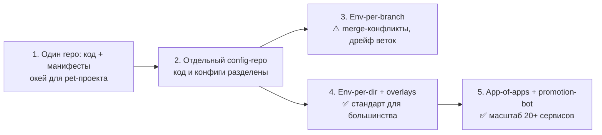

# 🌊 04. GitOps Advanced: Multi-Env, App-of-Apps и Продвижение Релизов

## ⚙️ Эволюция структуры репозитория



Эталонная структура config-repo (вариант 4–5):

```text
gitops-config/
├── apps/                        # app-of-apps: Application на каждый сервис
│   └── shop/
├── base/                        # общие манифесты (kustomize base)
│   └── shop/
├── environments/
│   ├── dev/
│   │   └── shop/kustomization.yaml   # образы dev, replicas=1
│   ├── staging/
│   │   └── shop/kustomization.yaml
│   └── prod/
│       └── shop/kustomization.yaml   # образ с digest, replicas=3, HPA
└── clusters/                    # ApplicationSet по каталогам кластеров
    ├── eu-prod/
    └── us-staging/
```

Правило: **одна структура = одна модель продвижения**. Если окружения — каталоги, то promote = коммит в соседний каталог. Если ветки — promote = merge. Смешивать нельзя.

---

## 📝 App-of-Apps: ArgoCD управляет сам собой

Корневое Application генерирует остальные:

```yaml
# apps/root-app.yaml — единственное Application, ставится руками один раз
apiVersion: argoproj.io/v1alpha1
kind: Application
metadata:
  name: root
  namespace: argocd
spec:
  project: default
  source:
    repoURL: https://git.company.local/gitops-config.git
    targetRevision: main
    path: apps                    # здесь лежат манифесты Application'ов
  destination:
    server: https://kubernetes.default.svc
    namespace: argocd
  syncPolicy:
    automated:
      prune: true
      selfHeal: true
```

```yaml
# apps/shop/app.yaml — порождается из каталога выше
apiVersion: argoproj.io/v1alpha1
kind: Application
metadata:
  name: shop-dev
  namespace: argocd
spec:
  project: default
  source:
    repoURL: https://git.company.local/gitops-config.git
    targetRevision: main
    path: environments/dev/shop
  destination:
    server: https://kubernetes.default.svc
    namespace: shop
  syncPolicy:
    automated { prune: true, selfHeal: true }
```

Зачем это нужно: **бутстрап кластера = одно `argocd app create root`**. Новый кластер поднимается со всем стеком за минуты, а состав сервисов версионируется в Git.

---

## 🚦 Продвижение образов между окружениями (promotion)

### Вариант 1: руками через PR (начало пути)

CI собирает образ → открывает MR в config-repo, меняющий тег в `environments/staging`. Деплой в staging = мерж этого MR; в prod — следующий MR. Полный аудит и ревью, но ручной труд.

### Вариант 2: Image Updater (автопилот для dev/staging)

```yaml
# аннотации на Application — ArgoCD Image Updater следит за registry
metadata:
  annotations:
    argocd-image-updater.argoproj.io/image-list: "shop=registry.local/shop"
    argocd-image-updater.argoproj.io/shop.update-strategy: semver     # или digest
    argocd-image-updater.argoproj.io/shop.allow-tags: "regexp:^v[0-9]+\.[0-9]+\.[0-9]+$"
    argocd-image-updater.argoproj.io/write-back-method: git:secret:argocd/git-creds
```

Updater пишет новый тег обратно в Git (`write-back-method: git`) — сохраняется принцип «истина в Git». Для **prod** updater обычно выключают: продвигает только человек.

### Вариант 3: Promotion pipeline (масштаб)

Отдельный пайплайн «promote»: принимает `{app, from-env, to-env}`, проверяет health в источнике, копирует значение образа (лучше — **digest**, не mutable-тег) в целевой каталог, открывает MR. Инструменты: собственный скрипт, `kargo`, `argocd interlace`.

!!! tip "Тег vs Digest"
    Тег `v1.4.2` можно перезаписать (`docker push` того же тега). Для prod используйте `shop@sha256:abc...` — digest неизменяем, и то, что протестировали, то и задеплоите.

---

## 🗂️ Окружения: kustomize overlays против Helm values

| | Kustomize overlays | Helm per-env values |
| :--- | :--- | :--- |
| Диффы между env | Наглядны (патчи рядом с base) | Спрятаны внутри values.yaml |
| Переиспользование чартов | Плохо дружит с внешними chart'ами | Родная стихия |
| Промоушен | Копирование строки image | Изменение одного value |
| Порог входа | Ниже | Выше (шаблоны) |

Гибрид, который живёт в реальности: внешние компоненты (ingress, cert-manager) — Helm + values per env; свои приложения — kustomize.

```yaml
# environments/prod/shop/kustomization.yaml
resources: [../../../../base/shop]
patches:
  - path: replicas.yaml            # replicas=3 + HPA
images:
  - name: shop
    newTag: v1.4.2                 # эту строку меняет promotion
```

Секреты per-env — никогда в Git открытым текстом: External Secrets Operator (Vault как источник), SOPS+age, Sealed Secrets. См. раздел [10. Security](../10-security-and-cloud/01-devsecops-and-secrets.md).

---

## 🔄 Стратегии синхронизации: где что включать

| Окружение | auto-sync | selfHeal | prune | Кто пишет |
| :--- | :--- | :--- | :--- | :--- |
| dev | ✅ | ✅ | ✅ | Image Updater / CI |
| staging | ✅ | ✅ | ✅ | Promotion-бот после approve |
| prod | ❌ manual или ✅ | ✅ | ⚠️ осторожно | Только человек через MR |

Тонкости:

- **`prune` в prod**: удалённый из Git ресурс удаляется из кластера. Опасно при рефакторинге каталогов — сначала dry-run (`argocd app diff --server-side`).
- **Sync waves** упорядочивают деплой стека: `argocd.argoproj.io/sync-wave: "-1"` у namespace/CRD, `0` у приложения, `1` у ingress.
- **Health checks кастомных CRD** пишутся lua-скриптом в `argocd-cm` — иначе Argo считает CRD Healthy сразу, и волна едет раньше готовности.

---

## 🔬 Deep Dive: drift, outOfSync и почему «всё зелёное», а не работает

Состояния Application, которые путают:

1. **`OutOfSync`** — Git ≠ cluster: либо ручные изменения (selfHeal исправит), либо манифесты применяются другим контроллером (Helm release поверх ArgoCD — конфликт источников, выбрать одну).
2. **`Progressing` навсегда** — health-check не может определиться: чаще всего crashloop у readiness или кастомный CRD без lua-health.
3. **`Synced` + `Degraded`** — манифесты применились, но ресурсы нездоровы. Sync ≠ работает.

Команды диагностики:

```bash
argocd app diff shop-prod --server-side       # точный дифф с сервером (учитывает HPA/mutating)
argocd app get shop-prod --refresh --hard     # форс-рефреш кэша
argocd app history shop-prod                  # какие ревизии уже синкались
kubectl get applications.argoproj.io -A \
  -o custom-columns=NS:.metadata.namespace,NAME:.metadata.name,SYNC:.status.sync.status,HEALTH:.status.health.status
```

Классическая ловушка: HPA меняет `spec.replicas`, Argo видит diff с Git и откатывает. Решение — `ignoreDifferences` для поля:

```yaml
spec:
  ignoreDifferences:
    - group: apps
      kind: Deployment
      jsonPointers: ["/spec/replicas"]
```

---

## 🧨 Типовые грабли Production

| Симптом | Причина | Быстрое решение |
| :--- | :--- | :--- |
| ArgoCD бесконечно откатывает изменение | Кто-то правит kubectl'ом мимо Git | selfHeal оставить; менять только в Git; расследовать кто (audit logs) |
| После мержа в staging ничего не поменялось | Application смотрит на старый tag/ревизию | `targetRevision` и путь проверить; refresh hard |
| Prod получил dev-образ | Общий каталог base без overlays / updater без ограничений | Разнести окружения; allow-tags regexp; updater off для prod |
| Удалили файл — удалился продовый ресурс | prune + переименование каталога | Двигать каталоги через copy-фазу, потом delete; dry-run diff перед prune |
| Helm-релиз и ArgoCD дерутся за ресурсы | Два контроллера владения | Одно место правды: либо helm-релиз, либо ArgoCD (helm-чарт как source) |
| Secret из Git утёк | Plain-текст секреты в config-repo | ESO/SOPS/Sealed Secrets, pre-commit secret-scanner |
| Новый кластер настраивали два дня | Нет бутстрап-автоматики | App-of-Apps root + Terraform для самого кластера |

## 🧪 Hands-on Lab

```bash
# 1. Bootstrap: root-app одной командой
argocd app create root --repo https://github.com/org/gitops-config.git \
  --path apps --dest-server https://kubernetes.default.svc --dest-namespace argocd \
  --sync-policy automated --self-heal --auto-prune

# 2. Посмотреть, что реально изменит sync, до его выполнения
argocd app diff shop-prod --server-side

# 3. Проверить, кто владеет ресурсом (Helm или Argo)
kubectl get deploy shop -n shop -o jsonpath='{.metadata.labels}' | jq '."app.kubernetes.io/managed-by", "meta.helm.sh/release-name"'
```

## ✅ Чек-лист зрелости темы

- [ ] Config-repo отделён от кода, окружения — каталоги (не ветки)
- [ ] Root app-of-apps разворачивает весь кластер из Git
- [ ] Продвижение в staging автоматизировано (updater/promotion-бот), в prod — через MR человека
- [ ] Prod-образы фиксируются digest'ом, а не mutable-тегом
- [ ] Секреты per-env приходят из ESO/Vault, а не из Git
- [ ] Sync waves и health checks покрывают порядок деплоя стека
- [ ] Ночная проверка drift по всем Application с алертом

---

## 🧭 Что дальше

| Шаг | Материал |
| :--- | :--- |
| 🔬 Закрепить | [Lab 07: root-app и promotion](../16-guided-labs/07-lab-gitops-argocd.md) |
| 🎤 Проверить себя | [Вопросы: GitOps](../14-interview-prep/04-100-devops-interview-questions-bank-part2.md) |

---

## 🎤 Пять вопросов для повторения


**В1. Почему окружения-каталоги предпочтительнее окружений-веток в config-repo?**

<details><summary>Ответ</summary>

Каталоги дают видимый diff между env в одном дереве и promotion = коммит в соседний каталог; ветки порождают merge-конфликты, дрейф веток друг от друга и невозможность увидеть разницу dev/prod одним взглядом. Главное — выбрать одну модель продвижения и не смешивать.

</details>


**В2. Что даёт паттерн app-of-apps при бутстрапе нового кластера?**

<details><summary>Ответ</summary>

Единственное Application root смотрит на каталог apps/ и генерирует все остальные Application'ы. Новый кластер поднимается командой создания одного root-app — весь стек (мониторинг, ingress, сервисы) приезжает из Git за минуты и остаётся версионируемым.

</details>


**В3. Тег или digest при продвижении образа в production — и почему?**

<details><summary>Ответ</summary>

Digest (sha256:...) — единственная неизменяемая ссылка. Тег можно перезаписать тем же именем, и в прод уедет непроверенный код. Promotion-бот копирует именно digest из протестированного окружения.

</details>


**В4. Расшифруйте состояния ArgoCD: OutOfSync, Synced+Degraded, Progressing навсегда.**

<details><summary>Ответ</summary>

OutOfSync — Git расходится с кластером (ручные изменения или другой контроллер). Synced+Degraded — манифесты применились, но ресурсы нездоровы: sync ≠ работает. Вечный Progressing — health-check не определён (crashloop readiness или кастомный CRD без lua-health).

</details>


**В5. Зачем настраивают ignoreDifferences для spec.replicas и какую проблему это решает?**

<details><summary>Ответ</summary>

HPA постоянно меняет replicas в живом кластере, ArgoCD видит diff с Git и откатывает значение, ломая автомасштабирование. ignoreDifferences исключает поле из сравнения — владение replicas отдаётся HPA, остальное контролирует Git.

</details>
