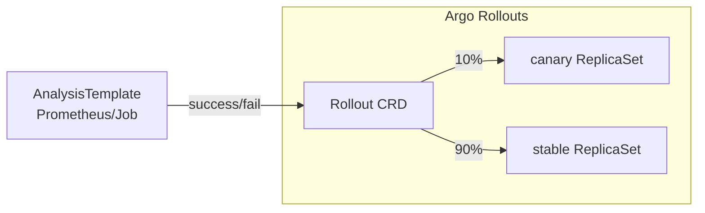

# 🚦 05. Progressive Delivery: Argo Rollouts и Flagger

## 🎯 Задача: деплой без страха

Blue-Green и канарейка руками — боль. Progressive Delivery-инструменты автоматизируют: постепенный сдвиг трафика → анализ метрик (SLO-based) → promote или **автоматический rollback**.



| Возможность | Deployment+Service | Rollouts | Flagger |
|---|---|---|---|
| Постепенный трафик | ❌ | ✅ (steps) | ✅ |
| Метрический анализ | ❌ | ✅ AnalysisTemplate | ✅ built-in |
| Авто-rollback по метрикам | ❌ | ✅ | ✅ |
| Experiment (A/B без релиза) | ❌ | ✅ | частично |
| Интеграция трафика | — | Istio/ALB/Nginx/Traefik | Istio/Linkerd/GatewayAPI |

## ⚙️ Argo Rollouts: канарейка с анализом

```bash
kubectl apply -f https://github.com/argoproj/argo-rollouts/releases/latest/download/install.yaml
kubectl argo rollouts version
kubectl argo rollouts get rollout checkout -n prod --watch   # live-визуализация!
```

```yaml
apiVersion: argoproj.io/v1alpha1
kind: Rollout
metadata: { name: checkout, namespace: prod }
spec:
  replicas: 10
  strategy:
    canary:
      canaryService: checkout-canary       # Service для канарейки
      stableService: checkout-stable
      trafficRouting:
        istio:
          virtualService: { name: checkout-vs, routes: [primary] }
      steps:
        - setWeight: 5                     # 5% трафика на новую версию
        - pause: { duration: 2m }
        - analysis:                        # метрическая проба
            templates: [{ templateName: error-rate }]
        - setWeight: 25
        - pause: { duration: 5m }
        - analysis:
            args: [{ name: service, value: checkout }]
        - setWeight: 50
        - pause: { duration: 5m }
        - setWeight: 100
  selector: { matchLabels: { app: checkout } }
  template:
    metadata: { labels: { app: checkout } }
    spec:
      containers:
        - name: api
          image: registry.local/shop/checkout:2.15.0
          ports: [{ containerPort: 8080 }]
          readinessProbe: { httpGet: { path: /healthz, port: 8080 } }
```

### AnalysisTemplate: решение принимает Prometheus

```yaml
apiVersion: argoproj.io/v1alpha1
kind: AnalysisTemplate
metadata: { name: error-rate }
spec:
  args:
    - { name: service }
  metrics:
    - name: http-error-rate
      interval: 30s
      count: 5                             # 5 замеров × 30 сек
      successCondition: result[0] < 0.02   # ошибок < 2%
      failureLimit: 1                      # 1 провал = abort + rollback
      provider:
        prometheus:
          address: http://prometheus.monitoring:9090
          query: |
            sum(rate(http_requests_total{service="{{args.service}}",
              code=~"5.."}[1m]))
            / sum(rate(http_requests_total{service="{{args.service}}"}[1m]))
```

Провал анализа → `setWeight` останавливается, трафик возвращается на stable, статус `Degraded`. Всё без человека в 3 часа ночи.

## 🚩 Flagger: анализ из коробки

Flagger сам генерирует канарейку из обычного Deployment:

```yaml
apiVersion: flagger.app/v1beta1
kind: Canary
metadata: { name: checkout, namespace: prod }
spec:
  targetRef: { apiVersion: apps/v1, kind: Deployment, name: checkout }
  progressDeadlineSeconds: 300
  service: { port: 8080 }
  analysis:
    interval: 1m
    threshold: 5                    # 5 неудачных проверок = rollback
    maxWeight: 50
    stepWeight: 10                  # 10% → 20% → ... → 50%
    metrics:
      - name: request-success-rate
        thresholdRange: { min: 99 }             # % успешных
        interval: 30s
      - name: request-duration
        thresholdRange: { max: 500 }            # p99 < 500ms
        interval: 30s
    webhooks:
      - name: smoke-test
        type: pre-rollout
        url: http://flagger-loadtester.test/
        timeout: 60s
        metadata: { type: bash, cmd: "curl -sf http://checkout-canary.prod:8080/healthz" }
```

```bash
kubectl logs -f deploy/flagger
# canary checkout weight 10 ... 20 ... success rate 100% ...
# promotion completed! scaling up checkout-primary
kubectl describe canary checkout   # история решений
```

**Отличие подходов:** Rollouts даёт декларативный контроль над каждым шагом (сложные сценарии, эксперименты); Flagger — opinionated «настроил пороги и забыл». Часто начинают с Flagger, растут в Rollouts.

## 🧪 Blue-Green через Rollouts

```yaml
strategy:
  blueGreen:
    activeService: checkout-active        # сюда смотрят пользователи
    previewService: checkout-preview      # предпродовый просмотр новой версии
    autoPromotionEnabled: false           # промоушен кнопкой/CLI после smoke
    scaleDownDelaySeconds: 60             # держать старую версию для мгновенного отката
```

Blue-green проще канарейки (нет дробного трафика), но требует ×2 ресурсов и не ловит проблемы на малом проценте трафика.

## ⚠️ Грабли эксплуатации

| Проблема | Причина | Решение |
|---|---|---|
| Канарейка «зелёная», но ломает прод | мало трафика на 5%, редкие баг-пути не задеты | анализ по business-metricам, не только 5xx |
| Метрики пустые первые минуты | rate() по свежему series = NaN | successCondition с `isNaN(result[0]) || result[0] < x` |
| HPA конфликтует с Rollouts | оба крутят replica count | HPA считает суммарно; использовать stable/canary scaling policies |
| Session state потерян | пользователь попал на новую версию | sticky sessions или stateless дизайн |
| Медленная база миграция | новая версия + старая схема | backward-compatible миграции (expand→migrate→contract) |

## ❓ Пять вопросов для самопроверки

---


## ✅ Проверь себя

> Отвечай вслух до раскрытия ответа. Если «не помню» — вернись к разделу.


**В1. Чем automated canary лучше blue-green деплоя?**
<details><summary>Ответ</summary>
Blue-green переключает 100% трафика разом — проблема видна на всех пользователях, хотя и откатывается быстро. Канарейка сначала даёт 5–10% трафика: взрыв ограничен долей, метрики собираются ДО полного выката, а авто-rollback срабатывает без участия человека.
</details>

**В2. Зачем в AnalysisTemplate count и interval, а не один запрос?**
<details><summary>Ответ</summary>
Один замер шумит: всплеск ошибок за секунду ложно убьёт релиз, а тихая утечка памяти не проявится. Серия из N замеров через интервал даёт устойчивую оценку тренда и позволяет задать failureLimit («два подряд плохих замера») — баланс между скоростью реакции и ложными срабатываниями.
</details>

**В3. Какую роль играет backward-compatible миграция схемы БД при канарейке?**
<details><summary>Ответ</summary>
Во время выката старая и новая версии работают одновременно с одной БД. Расширяющие миграции (add column nullable) безопасны для обеих; drop/rename сломает одну из версий. Паттерн expand→migrate data→contract разворачивается на несколько релизов.
</details>

**В4. Что произойдёт при провале анализа в Argo Rollouts?**
<details><summary>Ответ</summary>
Rollout переходит в Degraded: вес канарейки возвращается к 0 (весь трафик на stable), поды канарейки масштабируются вниз, событие и метрика фиксируют причину провала. Новый образ остаётся в spec — следующий reconcile снова начнёт канарейку, пока его не исправят.
</details>

**В5. Когда выбрать Flagger вместо Argo Rollouts?**
<details><summary>Ответ</summary>
Нужен быстрый старт со стандартным сценарием «step-by-step + метрики Prometheus»: Flagger настраивается одним CR поверх существующего Deployment без переписывания манифестов. Rollouts выбирают для кастомных шагов, A/B по заголовкам/cookie и глубоких интеграций с экосистемой ArgoCD.
</details>

---

*Что дальше:* [04. GitOps Multi-Env и Promotion](04-gitops-multienv-and-promotion.md) · [08. Автоскейлинг](../04-kubernetes/08-k8s-autoscaling.md)
