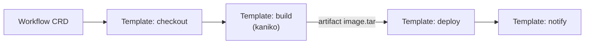

# 🧪 06. Argo Workflows и Tekton: CI/CD внутри Kubernetes

## 🗺️ Зачем pipeline-движок в кластере

GitLab CI/GitHub Actions крутятся вне кластера. Когда джобы должны жить рядом с данными/K8s-API (ML-пайплайны, тяжёлые сборки с кэшем PVC, спавн динамических окружений) — берут нативный K8s-раннер.

| | Argo Workflows | Tekton | GitLab CI (K8s runner) |
|---|---|---|---|
| Модель | DAG + steps (Argo DSL) | Task/Pipeline CRD | .gitlab-ci.yml |
| Артефакты | S3/artifacts встроено | PVC/workspace | cache |
| Экосистема | ML (Kubeflow поверх!), cron | CDEvents, Chains (SLSA) | весь GitLab |
| Порог входа | средний | высокий (CRD-heavy) | низкий |



## ⚙️ Argo Workflows: Workflow как код

```bash
kubectl create namespace argo
kubectl apply -n argo -f https://github.com/argoproj/argo-workflows/releases/latest/download/install.yaml
# CLI:
curl -sLO https://github.com/argoproj/argo-workflows/releases/latest/download/argo-linux-amd64.gz
gunzip argo-linux-amd64.gz && chmod +x argo-linux-amd64 && mv argo-linux-amd64 /usr/local/bin/argo
argo submit --watch hello-world.yaml -n argo
```

DAG-пайплайн с артефактами:

```yaml
apiVersion: argoproj.io/v1alpha1
kind: Workflow
metadata: { generateName: app-pipeline-, namespace: argo }
spec:
  entrypoint: pipeline
  serviceAccountName: argo
  arguments:
    parameters: [{ name: repo, value: "https://gitlab.local/shop/api.git" }]
  templates:
    - name: pipeline
      dag:
        tasks:
          - { name: checkout, template: git-checkout }
          - { name: build, template: kaniko-build, dependencies: [checkout] }
          - name: test
            template: run-tests
            dependencies: [build]
            arguments:
              artifacts: [{ name: source, from: "{{tasks.checkout.outputs.artifacts.source}}" }]
          - { name: deploy, template: deploy, dependencies: [test] }

    - name: kaniko-build
      inputs:
        artifacts:
          - { name: source, path: /src }
      container:
        image: gcr.io/kaniko-project/executor:latest
        args: ["--dockerfile=/src/Dockerfile", "--context=/src",
               "--destination=registry.local/shop/api:{{workflow.uid}}",
               "--cache=true"]                       # layer cache в registry!
      outputs:
        artifacts:
          - { name: image, path: /src/image.tar }   # артефакт между шагами

    - name: run-tests
      inputs: { artifacts: [{ name: source, path: /src }] }
      container:
        image: golang:1.22
        workingDir: /src
        command: [sh, -c]
        args: ["go test -race ./..."]

    - name: deploy
      container:
        image: bitnami/kubectl:latest
        command: [sh, -c]
        args:
          - kubectl set image deploy/api api=registry.local/shop/api:{{workflow.uid}} -n prod

  ttlStrategy: { secondsAfterCompletion: 3600 }   # чистка завершённых workflow!
```

Ключевые фичи:

- **Cron Workflow** — замена CronJob для сложных расписаний.
- **Retry strategy** на шаблон: `retryStrategy: { limit: "3", backoff: { duration: "30s" } }`.
- **Suspend/Resume** — human approval шаг прямо в UI (`suspend: {}`).
- **Artifact Repository** — S3/MinIO вместо PVC: артефакты переживают поды.
- **WorkflowTemplates** — библиотека переиспользуемых шаблонов; `templateRef` между неймспейсами.
- **Event-driven**: Argo Events триггерит workflow из webhook'ов/S3/Kafka.

## 🔩 Tekton: CRD-first подход

```yaml
apiVersion: tekton.dev/v1beta1
kind: Task
metadata: { name: build-push }
spec:
  params:
    - { name: IMAGE }
  workspaces: [{ name: source }]
  steps:
    - name: build
      image: gcr.io/kaniko-project/executor:latest
      args: ["--destination=$(params.IMAGE)", "--context=$(workspaces.source.path)"]

---
apiVersion: tekton.dev/v1beta1
kind: Pipeline
metadata: { name: app-release }
spec:
  workspaces: [{ name: shared-source }]
  tasks:
    - name: fetch
      taskRef: { name: git-clone }
      workspaces: [{ name: output, workspace: shared-source }]
    - name: build
      taskRef: { name: build-push }
      runAfter: [fetch]
      params: [{ name: IMAGE, value: "registry.local/app:$(context.pipelineRun.uid)" }]
      workspaces: [{ name: source, workspace: shared-source }]
```

Запуск через PipelineRun; Triggers слушает webhook'и. Сильные стороны Tekton: каталог Hub готовых Task'ов, Tekton Chains (генерация SLSA provenance для supply chain), строгая типизация workspace'ов.

## 🏗️ Выбор архитектуры пайплайна

```text
Обычные приложения, команда < 50 человек → GitLab CI (+K8s executor) — проще всех
ML/data-пайплайны, динамические fan-out джобы → Argo Workflows (+ Kubeflow для ML)
Enterprise, требование SLSA/provenance → Tekton + Chains
Гибрид → GitLab CI вызывает `argo submit` для тяжёлых стадий
```

Эксплуатационные грабли Argo Workflows:

| Проблема | Решение |
|---|---|
| Тысячи завершённых workflow душат etcd | `ttlStrategy`, архивация в БД, `--managed-namespace` |
| Pod'ы висят в Pending | resource quota для workflow-namespace, priority classes |
| Артефакты больше лимита S3 | split/splitmerge, сжатие tar.gz |
| RBAC: workflow трогает чужие ресурсы | отдельный ServiceAccount на workflow, least privilege |

## ❓ Пять вопросов для самопроверки

---


## ✅ Проверь себя

> Отвечай вслух до раскрытия ответа. Если «не помню» — вернись к разделу.


**В1. Почему Argo Workflows популярен именно в ML-инфраструктуре?**
<details><summary>Ответ</summary>
DAG с динамическим fan-out (обработка N датасетов параллельно), тяжёлые GPU-шаги с очередями, передача больших артефактов между шагами, ретраи отдельных узлов без перезапуска всего графа — всё это родные фичи Workflows. Kubeflow Pipelines построен поверх Argo.
</details>

**В2. Что такое ttlStrategy и что случится без неё?**
<details><summary>Ответ</summary>
Политика автоудаления завершённых workflow (secondsAfterCompletion). Без неё каждый запуск оставляет CR + pod-объекты: тысячи исторических записей раздувают etcd и контроллер, кластер деградирует. Классическая грабля первого месяца эксплуатации.
</details>

**В3. Чем kaniko отличается от docker build в пайплайне?**
<details><summary>Ответ</summary>
Kaniko собирает образы без Docker daemon и root-привилегий: работает как обычный контейнер внутри pod'а (безопасно в multi-tenant K8s), не монтирует /var/run/docker.sock (который = root на хосте). Идеально для in-cluster сборки.
</details>

**В4. Как реализовать «человек должен одобрить деплой» в Argo Workflows?**
<details><summary>Ответ</summary>
Шаблон suspend: воркфлоу встаёт на паузу, в UI появляется кнопка Resume/Retry. Дополнительно можно ограничить право резюма RBAC'ом. Альтернатива — webhook-шаг во внешний approval-сервис (GitLab approvals).
</details>

**В5. Когда GitLab CI остаётся лучшим выбором против in-cluster движков?**
<details><summary>Ответ</summary>
Стандартные приложения с обычными сборками: декларативный YAML проще CRD, интеграция с MR/permissions/secret'ами уже есть, раннеры масштабируются autoscaler'ом. In-cluster движок оправдан, когда нужны DAG/fan-out, большие артефакты, ML или глубокая связь с ресурсами кластера.
</details>

---

*Что дальше:* [07. Kubeflow Pipelines](../23-mlops/07-kubeflow-pipelines.md) · [03. GitLab CI Deep Dive](03-gitlab-ci-deep-dive.md)
