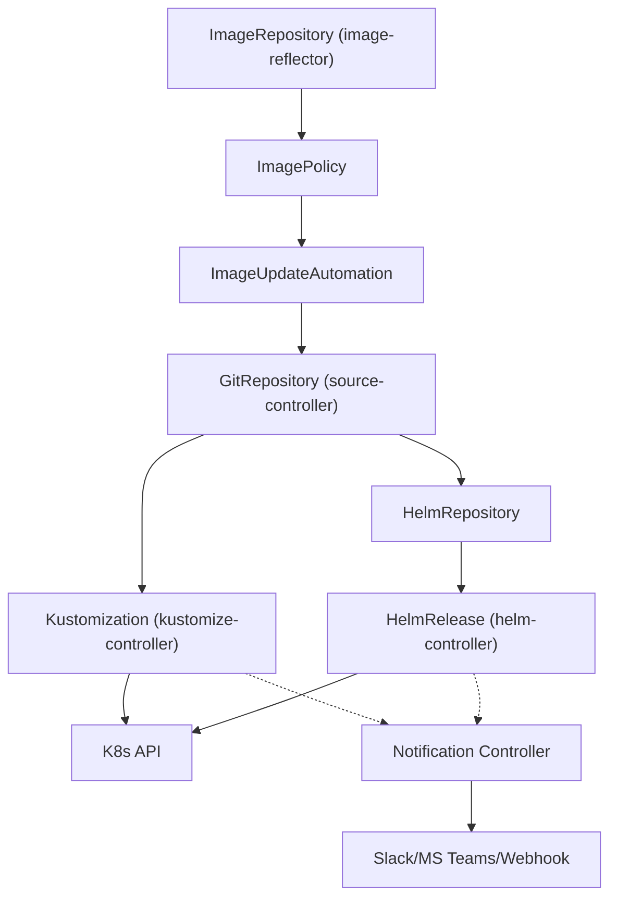
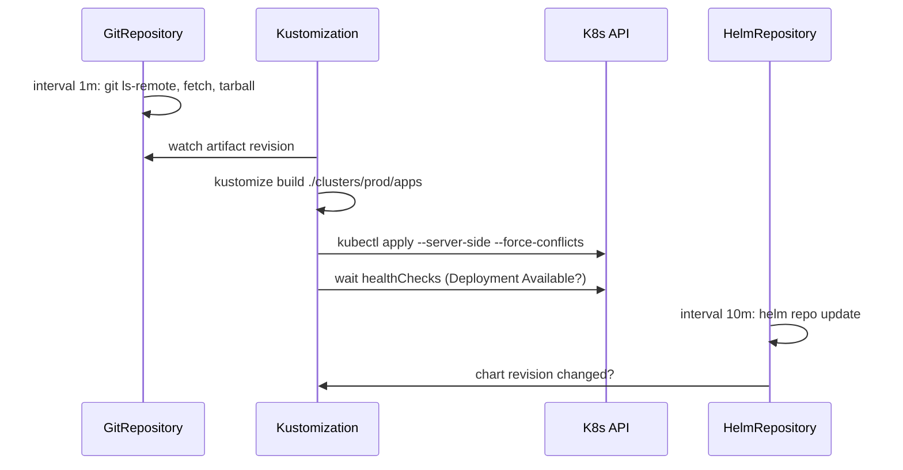

# 🔄 07. FluxCD Deep Dive: GitOps Toolkit

> ArgoCD — UI-first. Flux — контроллеры-first. Обе — CNCF Graduated. Flux управляет кластером через 4 примитива и 6 контроллеров без единого клика.

## 🎯 Flux vs ArgoCD: честное сравнение

| Критерий | **ArgoCD** | **Flux** |
|---|---|---|
| **Архитектура** | Моно-приложение (repo-server + app-controller + Redis + UI) | 6 лёгких контроллеров: `source`, `kustomize`, `helm`, `image-reflector`, `image-automation`, `notification` |
| **Хранение состояния** | `Application` CRD в etcd + Redis кеш | Только CRD (`GitRepository`/`Kustomization`/…), без БД |
| **UI** | Rich web UI + CLI `argocd` | Нет UI (CLI `flux` + Grafana + Weave GitOps EE) |
| **Sync модель** | Poll 3м / webhook, diff в UI | Pull `interval`, `reconcile` на каждом контроллере |
| **Helm** | Через `source.helm` в Application | Нативный `HelmRelease` + `HelmRepository` (OCI поддерживается) |
| **Kustomize** | Inline в Application | Нативный `Kustomization` + `dependsOn` DAG |
| **Image automation** | Image Updater (отдельный) | Встроено: `ImageRepository`+`ImagePolicy`+`ImageUpdateAutomation` |
| **Multi-tenancy** | Projects + RBAC | `Kustomization.spec.serviceAccountName` per-tenant |
| **Secrets** | External via plugin | `SOPS` + `age`/`GPG` нативно в `kustomize-controller` |
| **DR / bootstrap** | `argocd app create` + `app-of-apps` | `flux bootstrap github/gitlab` (генерирует GitRepository+Kustomization) |
| **Подпись/verify** | Kyverno/cosign вне | `HelmRelease.spec.chart.spec.verify` + `Kustomization.spec.decryption` |

**Правило выбора:** UI для платформенной команды с 30 кластерами → ArgoCD. Headless GitOps для `kind`/edge/OCI-registry → Flux. В книге — оба; в лабах — ArgoCD в `16-07`, Flux здесь.

---

## 🧩 Архитектура: 6 контроллеров



| Контроллер | CRD | Назначение |
|---|---|---|
| **source-controller** | `GitRepository`, `HelmRepository`, `OCIRepository`, `Bucket` | Клонирует git, кеширует tarball в `source-controller` PVC, exposed как `http://source-controller.flux-system.svc/artifacts` |
| **kustomize-controller** | `Kustomization` | `kustomize build` + `kubectl apply --server-side` + `healthChecks` + `prune` |
| **helm-controller** | `HelmRelease` | `helm upgrade --install` с `test`+`rollback` + `dependsOn` |
| **image-reflector-controller** | `ImageRepository`, `ImagePolicy` | Сканирует registry (`ghcr.io/app`), выбирает тег по `semver`/`regex` |
| **image-automation-controller** | `ImageUpdateAutomation` | Пишет новый тег в Git (`update.path` + `commit.message`) → триггерит `GitRepository` sync |
| **notification-controller** | `Provider`, `Alert` | Slack/Jira/Webhook на `Succeeded/Failed` |

---

## 📦 Примитивы: GitRepository → Kustomization → HelmRelease

### 1. GitRepository — источник истины

```yaml
apiVersion: source.toolkit.fluxcd.io/v1
kind: GitRepository
metadata:
  name: platform-config
  namespace: flux-system
spec:
  interval: 1m
  url: https://github.com/org/platform-config
  ref:
    branch: main
  # для приватного:
  # secretRef:
  #   name: git-credentials  # type: Opaque, .data: username/password или known_hosts
  ignore: |
    # .sourceignore
    /.git/
    /clusters/**/flux-system/
```

**Проверка:**
```bash
flux get sources git
kubectl -n flux-system get gitrepository platform-config -o yaml
flux reconcile source git platform-config
```

### 2. Kustomization — что и куда применить

```yaml
apiVersion: kustomize.toolkit.fluxcd.io/v1
kind: Kustomization
metadata:
  name: apps
  namespace: flux-system
spec:
  interval: 5m
  retryInterval: 2m
  timeout: 5m
  sourceRef:
    kind: GitRepository
    name: platform-config
  path: ./clusters/prod/apps   # kustomize build path
  prune: true                  # удалить из кластера то, чего нет в Git
  wait: true                   # ждать healthChecks
  healthChecks:
    - apiVersion: apps/v1
      kind: Deployment
      name: shop-api
      namespace: shop
  dependsOn:                   # DAG: сначала infra, потом apps
    - name: infra
  decryption:
    provider: sops
    secretRef:
      name: sops-age  # age key для SOPS
  patches:
    - patch: |
        - op: add
          path: /metadata/annotations/flux.weave.works~1reconciledAt
          value: "{{ now | date '2006-01-02T15:04:05Z07:00' }}"
      target:
        kind: Deployment
```

**Ключевые поля:**

| Поле | Что делает |
|---|---|
| `prune` | `kubectl delete` для удалённых из Git ресурсов |
| `wait` + `healthChecks` | не считать `Applied Succeeded` пока `Deployment Available` |
| `dependsOn` | порядок: `infra → apps → monitoring` |
| `suspend: true` | пауза реконсиляции (аналог `kubectl scale`) |
| `interval`/`retryInterval`/`timeout` | частота опроса и ретраев |

### 3. HelmRepository + HelmRelease

```yaml
apiVersion: source.toolkit.fluxcd.io/v1
kind: HelmRepository
metadata:
  name: bitnami
  namespace: flux-system
spec:
  interval: 10m
  url: https://charts.bitnami.com/bitnami
---
apiVersion: source.toolkit.fluxcd.io/v1
kind: OCIRepository
metadata:
  name: podinfo-oci
  namespace: flux-system
spec:
  interval: 5m
  url: oci://ghcr.io/stefanprodan/charts/podinfo
  ref:
    tag: 6.5.0
---
apiVersion: helm.toolkit.fluxcd.io/v2
kind: HelmRelease
metadata:
  name: redis
  namespace: redis-system
spec:
  interval: 5m
  chart:
    spec:
      chart: redis
      version: "18.x"
      sourceRef:
        kind: HelmRepository
        name: bitnami
      # OCI вариант:
      # chart: podinfo
      # sourceRef: { kind: OCIRepository, name: podinfo-oci }
      interval: 5m
  values:
    auth:
      enabled: false
    replica:
      replicaCount: 2
  install:
    remediation:
      retries: 3
  upgrade:
    remediation:
      remediateLastFailure: true
      strategy: rollback
  test:
    enable: true
  dependsOn:
    - name: redis-namespace  # Kustomization создающий ns
  driftDetection:
    mode: enabled
```

**OCI + cosign verify:**
```yaml
spec:
  chart:
    spec:
      verify:
        provider: cosign
        secretRef:
          name: cosign-pub
```

---

## 🔄 Reconciliation: что происходит каждые 5м



```bash
flux get kustomizations -A
flux get helmreleases -A
flux events --for Kustomization/apps --tail
kubectl -n flux-system describe kustomization apps | grep -A10 Conditions
kubectl -n flux-system get events --field-selector reason=ReconciliationSucceeded
```

**Drift detection:** `HelmRelease.spec.driftDetection.mode: enabled` → контроллер сравнивает `helm get manifest` с live и `helm upgrade` если отличается. `Kustomization` всегда `apply` — drift фиксится на следующий `interval`.

**Suspend/resume для отладки:**

```bash
flux suspend kustomization apps
# ... ручные правки kubectl ...
flux resume kustomization apps
flux reconcile kustomization apps --with-source
```

---

## 🔐 Secrets: SOPS + age

```bash
# Генерация age ключа
age-keygen -o age.agekey
cat age.agekey
# # public key: age1ql3z7hj432v2...  → в Git
# AGE-SECRET-KEY-...                → в кластер

kubectl create secret generic sops-age \
  --from-file=age.agekey=age.agekey -n flux-system

# Шифрование секрета
sops --encrypt --age age1ql3z7hj432v2... --encrypted-regex '^(data|stringData)$' secret.yaml > secret.enc.yaml
# secret.enc.yaml коммитим, flux расшифрует в kustomize-controller
```

```yaml
# clusters/prod/apps/shop/secret.enc.yaml
apiVersion: v1
kind: Secret
metadata: { name: shop-secrets, namespace: shop }
stringData:
  DB_PASSWORD: ENC[AES256_GCM,data:...,tag:...]
  # sops: age1...
```

---

## 🌿 Multi-environment и promotion

**Структура монорепо (для Flux):**
```
clusters/
  prod/
    flux-system/           # bootstrap генерирует
      gotk-components.yaml
      gotk-sync.yaml
    apps/
      kustomization.yaml   # resources: ../../apps/base
      patch-replicas.yaml  # replicas: 10
  staging/
    apps/kustomization.yaml
apps/
  base/
    shop-api/
      deployment.yaml
      kustomization.yaml
  prod/kustomization.yaml
```

**Promotion:** `ImageRepository` → `ImagePolicy` → `ImageUpdateAutomation` пишет в Git → `GitRepository` sync → `Kustomization` apply.

```yaml
apiVersion: image.toolkit.fluxcd.io/v1beta2
kind: ImageRepository
metadata: { name: shop-api, namespace: flux-system }
spec:
  image: ghcr.io/org/shop-api
  interval: 1m
---
apiVersion: image.toolkit.fluxcd.io/v1beta2
kind: ImagePolicy
metadata: { name: shop-api, namespace: flux-system }
spec:
  imageRepositoryRef: { name: shop-api }
  policy:
    semver: { range: 1.x }  # только 1.x, 2.0 не возьмёт
---
apiVersion: image.toolkit.fluxcd.io/v1beta2
kind: ImageUpdateAutomation
metadata: { name: shop-api, namespace: flux-system }
spec:
  interval: 5m
  sourceRef: { kind: GitRepository, name: platform-config }
  git:
    checkout:
      ref: { branch: main }
    commit:
      author: { email: flux@example.com, name: fluxcdbot }
      messageTemplate: "{{range .Updated.Images}}{{println .}}{{end}}"
    push:
      branch: main
  update:
    path: ./clusters/prod/apps
    strategy: Setters  # или: yq('.images[0].newTag = "v1.4.1"')
```

---

## 🔙 Rollback и health

```bash
# Откат — git revert + push → Flux reconcile
git revert HEAD && git push

# Или suspend + ручной откат релиза
flux suspend helmrelease redis -n redis-system
helm rollback redis 2 -n redis-system
flux resume helmrelease redis

# Health
flux get kustomizations --status-selector ready=false
kubectl -n flux-system get kustomization apps -o jsonpath='{.status.conditions[?(@.type=="Ready")].message}'
```

---

## 🧪 Guided Lab: Flux на kind за 25 мин (без облака)

**Prereqs:** `kind`, `kubectl`, `flux` CLI (https://fluxcd.io/flux/installation/#install-the-flux-cli), `git`.

### Шаг 0. Кластер

```bash
kind create cluster --name flux-lab --config - <<'EOF'
kind: Cluster
apiVersion: kind.x-k8s.io/v1alpha4
nodes:
  - role: control-plane
    extraPortMappings:
      - containerPort: 30080
        hostPort: 30080
EOF
kubectl cluster-info
```

### Шаг 1. Bootstrap Flux (без GitHub — локальный режим)

```bash
flux install  # ставит source/kustomize/helm/notification/image controllers в flux-system
kubectl -n flux-system get pods
flux check    # все контроллеры Ready?
```

> **Cloud вариант (GitHub):** `flux bootstrap github --owner=$GITHUB_USER --repository=platform-config --branch=main --path=clusters/prod --personal` — генерирует `GitRepository` + `Kustomization` и коммитит в репо.

### Шаг 2. Локальный GitRepository через `Bucket` или `Git` локально

Для pure-local без GitHub используем `source-controller` с `GitRepository` на `https://github.com/fluxcd/flux2-kustomize-controllers` как внешний + собственный `Kustomization` из локальной папки через `Bucket` с `local` или просто `Kustomization` с `path: ./apps`.

Упрощённый вариант — **Flux работает с локальным Git через `flux create source git`**:

```bash
mkdir -p /tmp/flux-lab/apps/shop
cat > /tmp/flux-lab/apps/shop/deployment.yaml <<'YAML'
apiVersion: apps/v1
kind: Deployment
metadata: { name: shop-api, namespace: shop }
spec:
  replicas: 2
  selector: { matchLabels: { app: shop-api } }
  template:
    metadata: { labels: { app: shop-api } }
    spec:
      containers:
        - name: api
          image: ghcr.io/stefanprodan/podinfo:6.5.0
          ports: [{ containerPort: 9898 }]
YAML
cat > /tmp/flux-lab/apps/shop/service.yaml <<'YAML'
apiVersion: v1
kind: Service
metadata: { name: shop-api, namespace: shop }
spec:
  selector: { app: shop-api }
  ports: [{ port: 80, targetPort: 9898 }]
YAML
cat > /tmp/flux-lab/apps/shop/kustomization.yaml <<'YAML'
apiVersion: kustomize.config.k8s.io/v1beta1
kind: Kustomization
resources: [deployment.yaml, service.yaml]
YAML

# Инициализируем git для source-controller
cd /tmp/flux-lab && git init && git add . && git commit -m "initial"
# Для локального тестирования используем GitRepository с url file:// (flux поддерживает через local git server)
# Запустим простой git server:
git daemon --base-path=/tmp/flux-lab --export-all --enable=receive-pack --reuseaddr --informative-errors --verbose &
GIT_URL=git://127.0.0.1/flux-lab

# Или проще: используйте публичный demo-репо и сразу Kustomization:
kubectl create ns shop
flux create source git shop --url=https://github.com/fluxcd/flux2-kustomize-controllers --branch=main --interval=1m
# Но для своего изменения — fork и свой URL
```

**Рекомендуемый local-lab путь (работает без daemon):**

```bash
# Создаём GitRepository на GitHub-даный репо fluxcd/flux2-kustomize-controllers, а для своих изменений — Kustomization path на локальные манифесты через flux-system Bucket
flux create source git platform-config \
  --url=https://github.com/fluxcd/flux2-kustomize-controllers \
  --branch=main --interval=1m

flux create kustomization shop --source=GitRepository/platform-config \
  --path="./config/samples" --prune=true --interval=5m --target-namespace=shop \
  --health-check="Deployment/shop-api.shop" --wait=true

# Для вашей /tmp/flux-lab — запустите в kind дополнительный pod с git и expose, либо используйте flux bootstrap github (предпочтительно для prod-подобного опыта)
# Проверка:
flux get sources git
flux get kustomizations
kubectl -n shop get deploy,svc
```

### Шаг 3. Изменение в Git → reconciliation

```bash
# Измените replicas локально и push (для bootstrap варианта) или patch Kustomization
# Эмулируем Git change:
cat > /tmp/flux-lab/apps/shop/deployment.yaml <<'YAML'
# replicas: 3 → меняем с 2 на 3
spec: { replicas: 3, ... }
YAML
cd /tmp/flux-lab && git commit -am "scale to 3" && git push  # если git daemon + push, иначе просто flux reconcile

flux reconcile source git platform-config
flux reconcile kustomization shop --with-source
kubectl -n shop get deploy shop-api -o jsonpath='{.spec.replicas}'  # 3
```

### Шаг 4. HelmRelease через Flux

```bash
flux create source helm bitnami --url=https://charts.bitnami.com/bitnami --interval=10m
flux create helmrelease redis --source=HelmRepository/bitnami --chart=redis --chart-version="18.x" --target-namespace=redis-system --create-target-namespace=true --interval=5m \
  --values='auth: {enabled: false}'

flux get helmreleases -A
helm -n redis-system list
kubectl -n redis-system get pods
```

### Шаг 5. Cleanup

```bash
flux delete kustomization shop --silent
flux delete source git platform-config --silent
kind delete cluster --name flux-lab
pkill -f "git daemon" || true
```

**Expected output:** `flux get kustomizations` → `Ready True, Applied revision main@sha1:abc123`, `kubectl -n shop get deploy shop-api` → `2/2 Available`, после `reconcile --with-source` → `3/3`.

---

## 🚑 Break-Fix Flux (5 инцидентов)

| # | Симптом | Причина | Диагностика | Фикс |
|---|---|---|---|---|
| 1 | `Kustomization/shop NotReady: path ./clusters/prod/appps not found` | опечатка `path` | `flux get kustomizations -A` + `kubectl -n flux-system describe kustomization shop | grep Message` | `flux patch kustomization shop --patch '{"spec":{"path":"./clusters/prod/apps"}}'` |
| 2 | `GitRepository not ready: authentication required` | нет `secretRef` для приватного репо | `kubectl -n flux-system get gitrepository platform-config -o yaml | grep -A2 secretRef` + `flux events --for GitRepository/platform-config` | `kubectl create secret generic git-creds --from-literal=username=... --from-literal=password=$PAT -n flux-system` + `spec.secretRef.name: git-creds` |
| 3 | `HelmRelease redis Failed: chart not found` | неверная `chartVersion` | `flux get helmreleases -A` + `kubectl -n redis-system describe helmrelease redis` | `flux create helmrelease redis --chart-version="18.1.5"` точная |
| 4 | `ImageUpdateAutomation Failed: no such path ./clusters/prod/apps` | `spec.update.path` не совпадает с `GitRepository` | `kubectl -n flux-system logs deploy/image-automation-controller | grep -i path` | исправить `spec.update.path: ./clusters/prod/apps` |
| 5 | `Kustomization shop Failed: dependency infra not ready` | `dependsOn: infra` не в `Ready` | `flux get kustomizations -A` → `infra False` → `kubectl describe kustomization infra` | `flux reconcile kustomization infra --with-source` или ослабить `dependsOn` |

**Команды дежурного Flux:**

```bash
flux get all -A
flux events --for Kustomization/apps --tail
kubectl -n flux-system get gitrepository,kustomization,helmrelease -o wide
kubectl -n flux-system describe kustomization apps | grep -E 'Ready|Message|Revision'
flux reconcile source git platform-config
flux reconcile kustomization apps --with-source
flux suspend/resume kustomization apps
flux diff kustomization apps  # preview что применит
```

---

## ✅ Чек-лист зрелости Flux

- [ ] `flux bootstrap` версионирован, `flux-system` в Git, `flux check` в CI
- [ ] Каждый `Kustomization` с `prune:true`, `wait:true`, `healthChecks`, `dependsOn` где нужен порядок
- [ ] `interval` осознан (1м для git, 5м для apps, 10м для helm repo), `timeout`/`retryInterval` настроены
- [ ] Secrets через `SOPS`+`age`, не `secretRef` с PAT в открытом виде
- [ ] `Alert`+`Provider` на `Failed` в Slack, `flux events --for` мониторится
- [ ] Image automation на semver, `HelmRelease` с `driftDetection`+`rollback`

---

## 🎤 Пять вопросов для повторения

**В1. Чем `GitRepository` отличается от `Kustomization`?**

<details><summary>Ответ</summary>

`GitRepository` (source-controller) клонирует Git и отдаёт tarball как artifact. `Kustomization` (kustomize-controller) берёт artifact, делает `kustomize build path` и `kubectl apply` + `healthChecks` + `prune`. Разделение позволяет 1 git → N kustomizations с разными path/namespace.

</details>

**В2. Что делает `prune: true` и когда опасно?**

<details><summary>Ответ</summary>

Удаляет из кластера ресурсы, удалённые из Git. Опасно если `path` указывает на неполный набор — убьёт лишнее. Mitigation: `prune` только на `Kustomization` с полным набором, `dependsOn` для порядка, `suspend` перед массовым рефактором.

</details>

**В3. Как Flux обновляет образ автоматически?**

<details><summary>Ответ</summary>

`ImageRepository` сканирует registry, `ImagePolicy` выбирает тег по semver/regex, `ImageUpdateAutomation` пишет новый `newTag` в Git (`spec.update.path`) и коммитит + пушит → `GitRepository` sync → `Kustomization` apply.

</details>

**В4. Зачем `dependsOn` и `healthChecks`?**

<details><summary>Ответ</summary>

`dependsOn` строит DAG: `infra` (NS/CRD) → `apps`. `healthChecks` заставляет `Kustomization` ждать `Deployment Available` перед `Applied Succeeded`. Без них Flux параллельно применит всё и отметит success несмотря на `CrashLoop`.

</details>

**В5. Как развести ArgoCD и Flux в одном кластере?**

<details><summary>Ответ</summary>

Через namespace+label селектор: ArgoCD на `app-of-apps` в `argocd`, Flux на `flux-system` с `spec.path` непересекающимся. Оба watch разные `GitRepository`/`Application`. Антиповарно: не давать обоим `prune` на один namespace.

</details>

---

## 🧭 Что дальше

| Шаг | Материал |
|---|---|
| 🔬 Закрепить | [Lab 07: GitOps ArgoCD](../16-guided-labs/07-lab-gitops-argocd.md) + Lab Flux выше |
| 💪 Практика | [Задачи GitOps](../15-hands-on-practice/02-100-devops-practical-tasks-part2.md) Tasks 60-80 |
| 🎤 Проверить | [Kustomize/Helm](../04-kubernetes/03-helm-and-kustomize.md) — рендер vs Flux `driftDetection` |

<!-- enriched:v1 -->
