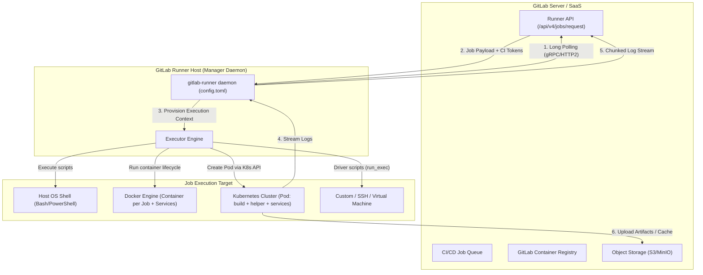

# 🏃 08. GitLab Runner Executors: Shell, Docker, Kubernetes и Custom

## 🏗️ Архитектура и жизненный цикл GitLab Runner

GitLab Runner — это агент с открытым исходным кодом, написанный на Go, который опрашивает (pull) инстанс GitLab через HTTP(S) API на наличие новых задач (jobs) в очереди, выполняет их в изолированной среде и отправляет логи/артефакты обратно.



### Этапы жизненного цикла джобы внутри Runner

1. **`prepare_executor`**: Инициализация окружения (запуск Docker-контейнера, создание K8s Pod, запуск SSH-сессии).
2. **`prepare_script`**: Создание директорий сборки, клонирование git submodules, настройка переменных.
3. **`get_sources`**: Выполняется вспомогательным контейнером (`gitlab-runner-helper`). Клонирование Git-репозитория или `git fetch` с checkout нужного коммита.
4. **`restore_cache`**: Скачивание и распаковка архива кэша с S3/GCS/MinIO.
5. **`download_artifacts`**: Скачивание артефактов из зависимых предыдущих этапов (`needs` / `dependencies`).
6. **`user_script` (`before_script` + `script`)**: Выполнение пользовательских команд внутри основного контейнера (`build`).
7. **`after_script`**: Выполнение команд очистки (даже при падении `script`, если джоба не была отменена по таймауту системы).
8. **`archive_cache`**: Запаковка и выгрузка обновленного кэша в Object Storage.
9. **`upload_artifacts`**: Запаковка файлов по путям `artifacts:paths` и отправка в хранилище GitLab.
10. **`cleanup_file_variables` / `cleanup_executor`**: Удаление временных файлов, контейнеров, подов и освобождение ресурсов.

---

## ⚖️ Сравнительный анализ Executors

| Executor | Изоляция | Скорость старта | Сложность поддержки | Поддержка Docker-in-Docker | Основные сценарии применения |
| :--- | :--- | :--- | :--- | :--- | :--- |
| **Shell** | ❌ Нет (хост-система) | ⚡ Мгновенно (<100ms) | Низкая (требует ручной установки всех CLI) | ⚠️ Опасно (доступ к host docker daemon) | Legacy монолиты, сборка на bare-metal (macOS/iOS, Windows C++) |
| **Docker** | 🟡 Контейнерная (Docker) | 🟢 Быстро (1-3s при наличии cached image) | Средняя (демон Docker на виртуалке) | ✅ Да (`dind` или сокет `/var/run/docker.sock`) | Стандарт для CI микросервисов на выделенных VM |
| **Kubernetes** | 🟢 Высокая (K8s Pod per Job) | 🟡 Средняя (2-10s на шедулинг и pull helper) | Высокая (требует управления K8s кластером) | ✅ Да (через `kaniko`, `buildah` или rootless DinD) | Cloud-Native, автоскейлинг на сотни параллельных джоб |
| **Custom / SSH** | 🟢 Полная (VM per Job / SSH) | 🔴 Медленно (30s-2min при создании VM) | Очень высокая (написание собственных драйверов) | ✅ Да (внутри созданной виртуалки) | Изоляция уровня гипервизора (Firecracker, Vagrant, OpenStack) |
| **VirtualBox / Parallels** | 🟢 Полная (snapshot revert) | 🔴 Медленно | Высокая | ✅ Да | Изолированное тестирование OS-драйверов, системного ПО |

---

## ⚙️ Глубокая настройка: `config.toml`

Главный файл конфигурации GitLab Runner daemon — `/etc/gitlab-runner/config.toml`. Изменения перечитываются демоном без перезапуска каждые `check_interval` секунд.

### 1. Production Docker Executor с Distributed S3 Cache

```toml
concurrent = 16                      # Общий лимит параллельных джоб на раннере
check_interval = 3                   # Интервал опроса GitLab в секундах
shutdown_timeout = 1800              # Время ожидания завершения джоб при SIGTERM

[session_server]
  session_timeout = 1800
  listen_address = "0.0.0.0:8093"
  advertise_address = "runner-mgr-01.infra.company.internal:8093"

[[runners]]
  name = "docker-runner-ci-01"
  url = "https://gitlab.company.com"
  id = 42
  token = "glrt-xxxxxxxxxxxxxxxxxxxx"
  token_obtained_at = 2026-01-10T12:00:00Z
  token_expires_at = 0001-01-01T00:00:00Z
  executor = "docker"
  limit = 8                          # Лимит параллельных джоб для этой конкретной секции
  request_concurrency = 2
  output_limit = 5242880             # 5 MB максимальный размер лога джобы

  [runners.custom_build_dir]
    enabled = false

  [runners.docker]
    tls_verify = false
    image = "docker.io/library/alpine:3.20"
    privileged = false               # true только если критически нужен DinD
    disable_entrypoint_overwrite = false
    oom_kill_disable = false
    disable_cache = false
    volumes = [
      "/cache",
      "/var/run/docker.sock:/var/run/docker.sock:ro" # Монтирование сокета (только для чтения для безопастности)
    ]
    shm_size = 2147483648            # 2GB /dev/shm для headless браузеров и тестов
    pull_policy = ["if-not-present", "always"]
    network_mode = "bridge"
    wait_for_services_timeout = 60

  [runners.cache]
    Type = "s3"
    Shared = true                    # Кэш доступен между всеми раннерами группы
    MaxUploadedArchiveSize = 1073741824 # 1 GB
    [runners.cache.s3]
      ServerAddress = "s3.eu-central-1.amazonaws.com"
      BucketName = "company-gitlab-ci-cache"
      BucketLocation = "eu-central-1"
      Insecure = false
      AuthenticationType = "iam"     # Использует AWS IAM Instance Profile хоста
```

### 2. Production Kubernetes Executor с ограничениями ресурсов

```toml
[[runners]]
  name = "k8s-runner-prod-01"
  url = "https://gitlab.company.com"
  token = "glrt-yyyyyyyyyyyyyyyyyyyy"
  executor = "kubernetes"
  limit = 50

  [runners.kubernetes]
    host = ""                        # Пусто = использовать in-cluster K8s API client
    bearer_token_overwrite_allowed = false
    namespace = "gitlab-runners"
    namespace_overwrite_allowed = "" # Запретить переопределение неймспейса из CI файла
    privileged = false
    cpu_limit = "4"
    cpu_limit_overwrite_max_allowed = "8"
    cpu_request = "500m"
    cpu_request_overwrite_max_allowed = "2"
    memory_limit = "8Gi"
    memory_limit_overwrite_max_allowed = "16Gi"
    memory_request = "1Gi"
    memory_request_overwrite_max_allowed = "4Gi"
    service_cpu_limit = "2"
    service_memory_limit = "4Gi"
    service_cpu_request = "200m"
    service_memory_request = "512Mi"
    helper_cpu_limit = "1"
    helper_memory_limit = "1Gi"
    helper_cpu_request = "100m"
    helper_memory_request = "256Mi"
    helper_image = "registry.gitlab.com/gitlab-org/gitlab-runner/gitlab-runner-helper:x86_64-v17.3.0"
    image_pull_secrets = ["gitlab-registry-secret"]
    poll_interval = 3
    poll_timeout = 300
    pod_termination_grace_period_seconds = 30
    node_selector = { "node.kubernetes.io/instance-type" = "c6i.2xlarge", "ci-workload" = "true" }
    tolerations = [
      { key = "ci-workload", operator = "Exists", effect = "NoSchedule" }
    ]

    [[runners.kubernetes.volumes.empty_dir]]
      name = "tmp-dir"
      mount_path = "/tmp"
      medium = "Memory"              # Быстрый /tmp в RAM

    [[runners.kubernetes.volumes.secret]]
      name = "corporate-ca-certs"
      mount_path = "/etc/ssl/certs/company-root.crt"
      sub_path = "ca.crt"
      read_only = true
```

---

## 🛠️ CLI шпаргалка администратора GitLab Runner

```bash
# 1. Регистрация раннера в неинтерактивном режиме (New Authentication Token pattern)
gitlab-runner register \
  --non-interactive \
  --url "https://gitlab.company.com" \
  --token "glrt-t1_xxxxxxxxxxxxxxxxxxxx" \
  --executor "docker" \
  --docker-image "docker.io/library/ubuntu:24.04" \
  --docker-privileged="false" \
  --docker-shm-size 2147483648 \
  --description "docker-worker-node-04" \
  --tag-list "docker,linux,x86_64,production" \
  --run-untagged="false" \
  --locked="true" \
  --access-level="ref_protected"

# 2. Управление системным демоном
gitlab-runner status
sudo gitlab-runner restart
sudo gitlab-runner verify --delete   # Проверить связь со всеми раннерами и удалить недоступные

# 3. Локальная отладка конкретной джобы на машине разработчика
# Запуск джобы 'test' из локального репозитория без отправки коммита в GitLab
gitlab-runner exec docker test \
  --docker-privileged \
  --docker-volumes "/tmp/cache:/cache" \
  --env CI_ENVIRONMENT_NAME=staging

# 4. Просмотр текущих активных воркеров и метрик раннера (Prometheus)
curl -s http://127.0.0.1:9252/metrics | grep "gitlab_runner_jobs"
# gitlab_runner_jobs{state="running"} 4
# gitlab_runner_failed_jobs_total 12
```

---

## 🔬 Решение проблем и Break-Fix сценарии

### Сценарий 1: Docker-in-Docker падает с ошибкой `Cannot connect to the Docker daemon at unix:///var/run/docker.sock`

**Симптом:**
```text
$ docker build -t myapp .
Cannot connect to the Docker daemon at tcp://docker:2375. Is the docker daemon running?
```

**Причина:**
При использовании сервиса `docker:dind` в K8s или Docker executor переменная `DOCKER_HOST` указывает на TCP, но TLS не сконфигурирован, либо не смонтирован общий каталог сертификатов `DOCKER_TLS_CERTDIR`.

**Диагностика и решение:**
В `.gitlab-ci.yml` необходимо явно сконфигурировать TLS драйвер:

```yaml
build_image:
  image: docker:27-cli
  services:
    - name: docker:27-dind
      command: ["--tls=false"]      # Если TLS отключен внутри защищенной сети Pod
  variables:
    DOCKER_HOST: tcp://docker:2375
    DOCKER_TLS_CERTDIR: ""
    DOCKER_DRIVER: overlay2
  script:
    - docker info
    - docker build -t my-image:$CI_COMMIT_SHA .
```

---

### Сценарий 2: Pod в Kubernetes Executor зависает в `Pending` и завершается по таймауту

**Симптом:**
```text
ERROR: Job failed (system failure): prepare environment: waiting for pod running: timed out waiting for pod to start. Check https://docs.gitlab.com/runner/executors/kubernetes/#troubleshooting
```

**Диагностика:**
```bash
# Проверить события в неймспейсе раннера
kubectl get events -n gitlab-runners --sort-by='.metadata.creationTimestamp' | tail -n 20

# Проверить поды с ошибками
kubectl get pods -n gitlab-runners -l app=gitlab-runner
```

**Причина:**
1. Нехватка ресурсов CPU/RAM на нодах пула `ci-workload` (Pods не помещаются по Requests).
2. Зависший образ `helper_image` из-за `ImagePullBackOff` (закрыт сетевой доступ до `registry.gitlab.com`).

**Решение:**
1. Настроить Cluster Autoscaler / Karpenter для автоматического создания нод.
2. Зеркалировать `gitlab-runner-helper` во внутренний Harbor/Nexus и прописать в `config.toml`:
```toml
helper_image = "harbor.company.internal/ci-helpers/gitlab-runner-helper:x86_64-v17.3.0"
helper_image_flavor = "alpine"
```
