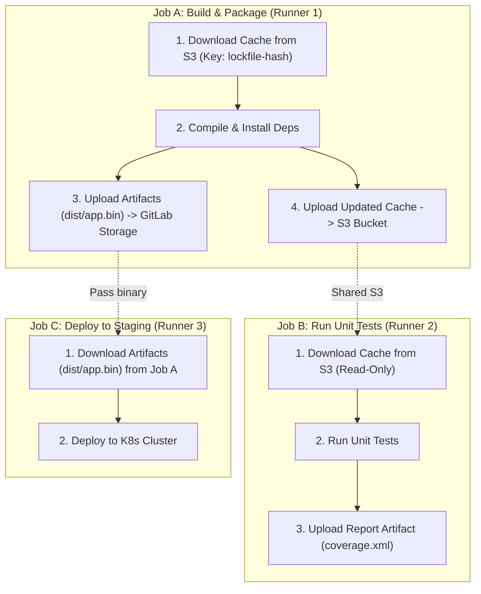

# 📦 09. Управление артефактами и кэшем в CI/CD (GitLab CI & GitHub Actions)

## 🧠 Фундаментальная разница: Cache vs Artifacts

В CI/CD пайплайнах разработчики часто путают кэш (`cache`) и артефакты (`artifacts`). Понимание их различий на уровне архитектуры предотвращает утечки памяти, нестабильность сборок и снижает время прогона пайплайна на порядок.

| Критерий | Кэш (`Cache`) | Артефакты (`Artifacts`) |
| :--- | :--- | :--- |
| **Основная цель** | Ускорение сборки за счет переиспользования неизменяемых зависимостей (vendor, `.npm`, `.m2`, pip). | Передача результатов сборки (бинарники, reports, bundles) в следующие джобы или сохранение для релиза. |
| **Гарантия наличия** | **Best effort** (не гарантируется). Джоба обязана корректно собраться даже при пустом кэше. | **Строгая гарантия**. Если джоба зависит от артефакта (`needs` / `dependencies`), отсутствие артефакта — это Fatal Error. |
| **Область действия** | Между разными запусками пайплайнов в одной ветке или всем репозитории. | В рамках одного конкретного выполнения пайплайна (Pipeline Instance). |
| **Хранилище** | S3-совместимый Object Storage или локальный volume на раннере. Затирается по LRU. | Хранилище артефактов GitLab/GitHub с жестким TTL (`expire_in`). |
| **Инвалидация** | По хэшу lock-файлов (`package-lock.json`, `go.sum`, `Cargo.lock`). | При каждом новом запуске коммита создается уникальный набор артефактов. |

---

## 🔄 Архитектура и поток данных: Cache vs Artifacts



---

## 🛠️ Production-конфигурации: GitLab CI

### 1. Оптимальная модель распределенного кэширования (Pull-Push / Pull-Only)

Чтобы избежать перезаписи кэша всеми параллельными джобами (Race Condition) и ускорить шаги тестирования/линта, используется паттерн **Build writes, Test reads**.

```yaml
stages:
  - prepare
  - build
  - test
  - deploy

default:
  image: node:20-alpine
  interruptible: true

variables:
  npm_config_cache: "$CI_PROJECT_DIR/.npm"
  FF_USE_FASTZIP: "true"             # Ускоряет архивацию кэша через быстрый алгоритм zip
  ARTIFACT_COMPRESSION_LEVEL: "fast" # Баланс между нагрузкой на CPU и размером архива

# Глобальный шаблон кэша с fallback ключами
.node_cache_template: &node_cache
  cache:
    key:
      files:
        - package-lock.json
      prefix: "$CI_COMMIT_REF_SLUG"   # Кэш изолирован по веткам
    fallback_keys:
      - "$CI_COMMIT_REF_SLUG-default"
      - "main-default"                # Если ветка новая — берем кэш из ветки main
    paths:
      - .npm/
      - node_modules/
    policy: pull                      # По умолчанию только скачиваем кэш

install_dependencies:
  stage: prepare
  <<: *node_cache
  cache:
    policy: pull-push                 # Только эта джоба обновляет кэш в S3
  script:
    - npm ci --prefer-offline
  rules:
    - changes:
        - package.json
        - package-lock.json

compile_frontend:
  stage: build
  <<: *node_cache
  script:
    - npm run build
  artifacts:
    name: "frontend-build-$CI_COMMIT_REF_SLUG-$CI_COMMIT_SHORT_SHA"
    expose_as: "Production Frontend Bundle"
    paths:
      - dist/
    expire_in: 7 days
    exclude:
      - "dist/**/*.map"               # Исключаем тяжелые source maps из артефактов
    reports:
      metrics: metrics.txt

unit_tests:
  stage: test
  <<: *node_cache
  dependencies: []                    # Не скачивать артефакты предыдущих джоб (ускоряет старт)
  script:
    - npm run test:ci
  artifacts:
    when: always                      # Загружать отчеты даже при падении тестов
    expire_in: 30 days
    reports:
      junit: junit-report.xml
      coverage_report:
        coverage_format: cobertura
        path: coverage/cobertura-coverage.xml
```

---

## 🐙 Production-конфигурация: GitHub Actions

GitHub Actions предоставляет `actions/cache` и `actions/upload-artifact` со встроенным управлением fallback keys.

```yaml
name: CI Pipeline with Advanced Caching

on:
  push:
    branches: [main, staging]
  pull_request:
    branches: [main]

jobs:
  build-and-test:
    runs-on: ubuntu-latest
    steps:
      - name: Checkout Code
        uses: actions/checkout@v4

      - name: Setup Go with Automatic Module Caching
        uses: actions/setup-go@v5
        with:
          go-version: '1.23'
          cache: false                # Отключаем авто-кэш для демонстрации точечного контроля

      - name: Go Dependency Cache
        uses: actions/cache@v4
        id: go-cache
        with:
          path: |
            ~/.cache/go-build
            ~/go/pkg/mod
          key: ${{ runner.os }}-go-${{ hashFiles('**/go.sum') }}
          restore-keys: |
            ${{ runner.os }}-go-

      - name: Build Executable
        run: |
          mkdir -p bin
          CGO_ENABLED=0 go build -ldflags="-s -w" -o bin/server ./cmd/server

      - name: Save Release Artifact
        uses: actions/upload-artifact@v4
        with:
          name: compiled-binary-${{ github.sha }}
          path: bin/server
          retention-days: 14
          if-no-files-found: error
          compression-level: 9
```

---

## 🔍 CLI-инструменты для аудита и очистки

```bash
# 1. Проверка размера и содержимого артефактов через GitLab API
curl --header "PRIVATE-TOKEN: $GITLAB_TOKEN" \
  "https://gitlab.company.com/api/v4/projects/123/jobs/98765/artifacts" -o artifacts.zip
unzip -l artifacts.zip

# 2. Очистка устаревших артефактов в GitLab через REST API
curl --request DELETE --header "PRIVATE-TOKEN: $GITLAB_TOKEN" \
  "https://gitlab.company.com/api/v4/projects/123/artifacts"

# 3. Инспекция S3 бакета кэша GitLab Runner (AWS CLI / MinIO Client)
mc alias set minio https://minio.infra.company.internal $ACCESS_KEY $SECRET_KEY
mc du minio/gitlab-runner-cache/
mc ls --recursive minio/gitlab-runner-cache/project/123/

# 4. Принудительное удаление испорченного кэша конкретной ветки
mc rm --recursive --force minio/gitlab-runner-cache/project/123/feature-new-auth/
```

---

## 🚨 Break-Fix: Разбор аварийных ситуаций

### Сценарий 1: Отравление кэша (Cache Poisoning) приводит к падению всех MR

**Симптом:**
Ветки падают на этапе линтинга или сборки с ошибкой `Module not found` или `Segmentation fault in native addon`, хотя локально код собирается штатно.

**Первопричина:**
Один из раннеров с архитектурой `arm64` залил скомпилированные node бинарники в кэш с ключом `package-lock.json`, после чего раннеры `x86_64` скачали несовместимый бинарник.

**Решение:**
Включить архитектуру и ОС в ключ кэша (`cache:key`):
```yaml
cache:
  key: "${CI_RUNNER_EXECUTABLE_ARCH}-${CI_JOB_STAGE}-${CI_COMMIT_REF_SLUG}"
```

---

### Сценарий 2: Переполнение хранилища артефактов (`413 Request Entity Too Large`)

**Симптом:**
```text
Uploading artifacts...
dist/: found 1520 matching files and directories
FATAL: invalid argument: uploading artifacts as "archive" to coordinator... 413 Request Entity Too Large
```

**Диагностика:**
1. Проверить лимит в GitLab Admin Area: `Settings -> CI/CD -> Continuous Integration and Deployment -> Maximum artifacts size (MB)`.
2. Проверить `client_max_body_size` в Nginx Ingress / Reverse Proxy перед GitLab.

**Решение:**
1. Исключить временные и тестовые файлы через директиву `exclude`:
```yaml
artifacts:
  paths:
    - build/
  exclude:
    - build/**/*.tmp
    - build/test-results/**
```
2. Увеличить лимит в `nginx.conf`:
```nginx
client_max_body_size 500M;
```
