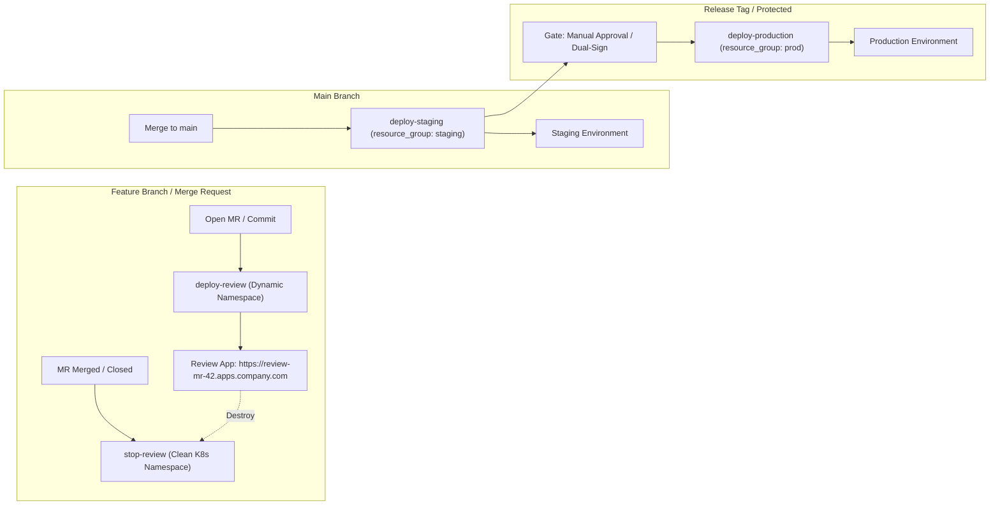

# 🌐 10. Управление окружениями в CI/CD: Review Apps, Staging, Production и Resource Groups

## 🏛️ Архитектура окружений в современном CI/CD

Окружение в CI/CD — это абстракция над физической или виртуальной инфраструктурой (Kubernetes Namespace, Cloud VM, Serverless Stack), имеющая собственный жизненный цикл, правила доступа, переменные конфигурации и историю развертываний.



---

## 🎯 Типы окружений и стратегии управления

| Тип окружения | Назначение | Жизненный цикл | Модель доступа | Управление конкурентностью |
| :--- | :--- | :--- | :--- | :--- |
| **Review Apps (Ephemeral)** | Быстрое тестирование функционала в изолированном namespace на каждый MR. | Динамический (часы/дни). Удаляется по событию `on_stop` или `auto_stop_in`. | Разработчики, QA, Product Managers. | Изолированы по MR (конкуренции нет). |
| **Staging / Pre-production** | Интеграционное тестирование, нагрузочные тесты, проверка миграций БД. | Постоянный. | Автоматический деплой при мердже в `main`. | `resource_group` со значением `process_limit: 1`. |
| **Production** | Обслуживание реального пользовательского трафика. | Постоянный с высокой доступностью (HA). | Защищенные роли (Lead/DevOps), обязательный ручной аппрув (`when: manual`). | Строгая очередь деплоев, исключение race conditions. |

---

## 🔒 Конкурентность и порядок деплоев: `resource_group`

Когда разработчики отправляют несколько коммитов подряд в ветку `main`, запускаются параллельные пайплайны. Без контроля конкурентности быстрый пайплайн (коммит 2) может выполниться раньше медленного (коммит 1), что приведет к **рассинхронизации состояния (Rollback Race Condition)**.

В GitLab CI это решается через `resource_group`:
- **`process_mode: unordered`** — запускает последнюю готовую джобу.
- **`process_mode: oldest_first`** — строгая очередь FIFO (деплоит в порядке создания коммитов).
- **`process_mode: newest_first`** — отменяет промежуточные очереди и сразу деплоит самый свежий коммит.

---

## 📄 Production-конфигурация `.gitlab-ci.yml`

```yaml
stages:
  - build
  - review
  - staging
  - production
  - cleanup

variables:
  KUBE_NAMESPACE_PREFIX: "review-app"

# ==========================================
# 1. Ephemeral Review Apps
# ==========================================
deploy_review:
  stage: review
  image: alpine/helm:3.15.2
  variables:
    REVIEW_NS: "${KUBE_NAMESPACE_PREFIX}-${CI_MERGE_REQUEST_IID}"
    REVIEW_DOMAIN: "${CI_ENVIRONMENT_SLUG}.review.company.internal"
  environment:
    name: review/$CI_MERGE_REQUEST_IID
    url: https://${REVIEW_DOMAIN}
    on_stop: stop_review
    auto_stop_in: 3 days             # Автоматическое удаление неактивного окружения
  rules:
    - if: $CI_PIPELINE_SOURCE == "merge_request_event"
  script:
    - kubectl create namespace ${REVIEW_NS} --dry-run=client -o yaml | kubectl apply -f -
    - helm upgrade --install myapp-review ./helm/app
        --namespace ${REVIEW_NS}
        --set image.tag=${CI_COMMIT_SHORT_SHA}
        --set ingress.host=${REVIEW_DOMAIN}
        --set postgresql.enabled=true # Запуск изолированной ephemeral БД

stop_review:
  stage: cleanup
  image: alpine/helm:3.15.2
  variables:
    REVIEW_NS: "${KUBE_NAMESPACE_PREFIX}-${CI_MERGE_REQUEST_IID}"
    GIT_STRATEGY: none
  environment:
    name: review/$CI_MERGE_REQUEST_IID
    action: stop
  rules:
    - if: $CI_PIPELINE_SOURCE == "merge_request_event"
      when: manual
  script:
    - helm uninstall myapp-review --namespace ${REVIEW_NS} || true
    - kubectl delete namespace ${REVIEW_NS} --ignore-not-found=true

# ==========================================
# 2. Staging Environment
# ==========================================
deploy_staging:
  stage: staging
  image: alpine/helm:3.15.2
  resource_group: staging_deployment  # Исключение гонок деплоя
  environment:
    name: staging
    url: https://staging.company.com
    deployment_tier: staging
  rules:
    - if: $CI_COMMIT_BRANCH == $CI_DEFAULT_BRANCH
  script:
    - helm upgrade --install myapp-staging ./helm/app
        --namespace staging
        --set image.tag=${CI_COMMIT_SHORT_SHA}
        --values ./helm/app/values-staging.yaml

# ==========================================
# 3. Production Environment with Approvals
# ==========================================
deploy_production:
  stage: production
  image: alpine/helm:3.15.2
  resource_group: prod_deployment
  environment:
    name: production
    url: https://company.com
    deployment_tier: production
  rules:
    - if: $CI_COMMIT_TAG =~ /^v[0-9]+\.[0-9]+\.[0-9]+/
      when: manual                    # Требуется подтверждение оператора
  script:
    - helm upgrade --install myapp-prod ./helm/app
        --namespace production
        --set image.tag=${CI_COMMIT_TAG}
        --values ./helm/app/values-prod.yaml
```

---

## 🛠️ CLI шпаргалка: Мониторинг и управление окружениями

```bash
# 1. Получить список всех активных окружений в проекте через GitLab CLI (glab)
glab ci status
glab api projects/:id/environments | jq '.[] | {id: .id, name: .name, state: .state, url: .external_url}'

# 2. Ручная остановка зависшего окружения через GitLab API
curl --request POST --header "PRIVATE-TOKEN: $GITLAB_TOKEN" \
  "https://gitlab.company.com/api/v4/projects/123/environments/456/stop"

# 3. Поиск осиротевших (orphaned) review-неймспейсов в Kubernetes
kubectl get ns -l environment=review --no-headers | awk '{print $1}'

# 4. Скрипт автоматической зачистки stale review namespaces старше 5 дней
for ns in $(kubectl get ns -o json | jq -r '.items[] | select(.metadata.name | startswith("review-app-")) | .metadata.name'); do
  creation_time=$(kubectl get ns $ns -o jsonpath='{.metadata.creationTimestamp}')
  age_days=$(( ($(date +%s) - $(date -d "$creation_time" +%s)) / 86400 ))
  if [ $age_days -ge 5 ]; then
    echo "Deleting orphaned namespace: $ns (age: $age_days days)"
    kubectl delete ns $ns --wait=false
  fi
done
```

---

## 🚨 Break-Fix: Разбор инцидентов

### Инцидент: Пайплайн зависает на этапе деплоя в состоянии `Waiting for resource`

**Симптом:**
Джоба `deploy_staging` висит часами со статусом `Waiting for resource: staging_deployment`.

**Первопричина:**
Предыдущая джоба в этой же `resource_group` завершилась аварийно (например, раннер был перезагружен по OOMKilled), и лок ресурса не был автоматически снят в базе GitLab.

**Диагностика и решение:**
1. Найти заблокированный ресурс в UI: `CI/CD -> Deployments -> Environments -> Resource Groups`.
2. Через API принудительно разблокировать джобу:
```bash
curl --header "PRIVATE-TOKEN: $GITLAB_TOKEN" \
  "https://gitlab.company.com/api/v4/projects/123/resource_groups/staging_deployment/upcoming_jobs"

# Сброс зависшей джобы
curl --request POST --header "PRIVATE-TOKEN: $GITLAB_TOKEN" \
  "https://gitlab.company.com/api/v4/projects/123/jobs/<JOB_ID>/cancel"
```
3. Изменить политику в `.gitlab-ci.yml` на `process_mode: newest_first`.
