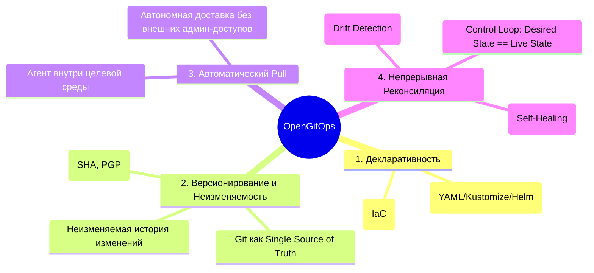
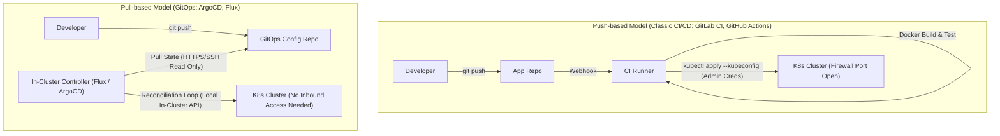

# 📜 11. Фундаментальные принципы GitOps (OpenGitOps) и модели Push vs Pull

## 🌟 4 Принципа OpenGitOps (CNCF Standard)

Рабочая группа **OpenGitOps** (в рамках CNCF) сформулировала четыре фундаментальных принципа, определяющих истинную GitOps-систему:



### Детальный разбор принципов:

1. **Декларативное описание (Declarative):** Все желаемое состояние системы (инфраструктура, приложения, RBAC, политики сети) описывается в виде декларативных спецификаций (Kubernetes Manifests, Kustomize Overlays, Helm Releases). Система описывает *ЧТО* должно работать, а не *КАК* этого достичь.
2. **Версионируемое и Неизменяемое состояние (Versioned and Immutable):** Каждое изменение фиксируется в Git. Коммиты неизменяемы, подписаны PGP/GPG ключами, содержат автора, время и причину. Откат к предыдущему состоянию — это `git revert`.
3. **Автоматическое извлечение (Pulled Automatically):** Программные агенты внутри кластера самостоятельно опрашивают репозиторий. Кластер не требует открытия входящих портов наружу или передачи `kubeconfig` в сторонние CI-серверы.
4. **Непрерывная реконсиляция (Continuously Reconciled):** Вектор состояния $S_{desired} - S_{live} = \Delta$. Если возникает расхождение (дрифт) из-за ручного вмешательства (`kubectl edit`) или аварии, агент автоматически возвращает систему в состояние $S_{desired}$.

---

## ⚔️ Архитектурное сравнение: Push-based vs Pull-based



### Таблица сравнения

| Характеристика | Push-based CI/CD (`kubectl apply` в джобе) | Pull-based GitOps (ArgoCD / Flux) |
| :--- | :--- | :--- |
| **Управление секретами доступа к K8s** | `kubeconfig` с правами `cluster-admin` хранится в CI переменных (высокий риск утечки). | Секреты кластера никогда не покидают периметр безопасности K8s. |
| **Сетевая безопасность** | Требуется белый IP/VPN для доступа CI раннера к K8s Control Plane API. | Кластер находится за NAT/Firewall. Доступ только исходящий (Egress) в Git. |
| **Обнаружение дрифта (Drift Detection)** | ❌ Отсутствует. CI запускается только при коммите. Ручные правки остаются незамеченными. | ✅ Непрерывное (каждые N секунд). Мгновенное оповещение и самоисцеление. |
| **Blast Radius при компрометации** | Взлом CI-сервера дает атакующему доступ ко всем целевым кластерам. | Взлом CI компрометирует только сборку образов, но не доступ к кластеру. |
| **Масштабирование на сотни кластеров** | Сложное управление тысячами пайплайнов и учетных записей. | Единый репозиторий конфигураций с мультикластерными генераторами. |

---

## 📂 Структура репозиториев: Single vs Multi-Repo

В GitOps стандартом является разделение исходного кода приложения и конфигураций инфраструктуры:

```
├── application-source-repo/          # Репозиторий разработчиков
│   ├── src/
│   ├── Dockerfile
│   └── .gitlab-ci.yml               # Собирает образ и пушит коммит в config-repo
│
└── gitops-fleet-infrastructure/     # Single Source of Truth для кластеров
    ├── apps/
    │   ├── base/
    │   │   ├── deployment.yaml
    │   │   ├── service.yaml
    │   │   └── kustomization.yaml
    │   └── overlays/
    │       ├── staging/
    │       │   ├── kustomization.yaml
    │       │   └── replicas-patch.yaml
    │       └── production/
    │           ├── kustomization.yaml
    │           └── resource-patch.yaml
    └── infrastructure/
        ├── ingress-nginx/
        └── cert-manager/
```

---

## 🛠️ CLI шпаргалка: Проверка дрифта и состояния GitOps

```bash
# 1. Проверка разницы между Git и реальным кластером через kubectl diff
kubectl diff -k gitops-fleet-infrastructure/apps/overlays/production/

# 2. Выявление ресурсов, измененных вручную (без аннотаций менеджера)
kubectl get deployments -A -o json | jq -r '
  .items[] |
  select(.metadata.annotations["app.kubernetes.io/managed-by"] == null) |
  "\(.metadata.namespace)/\(.metadata.name)"'

# 3. Аудит последних коммитов и проверка подписи GPG
git log --show-signature -n 5

# 4. Проверка статуса синхронизации через ArgoCD CLI
argocd app diff my-microservice
argocd app get my-microservice --refresh
```

---

## 🚨 Break-Fix: Разбор сценариев рассинхронизации

### Сценарий: "Конфликт мутаций" (Mutation Admission Webhook vs GitOps Controller)

**Симптом:**
ArgoCD или Flux бесконечно показывают статус `OutOfSync` или генерируют тысячи запросов `kubectl apply` в секунду, перегружая K8s API Server.

**Первопричина:**
В кластере работает Mutating Webhook (например, Istio Sidecar Injector или Linkerd), который добавляет sidecar контейнеры или аннотации в спецификацию `Pod`. GitOps контроллер видит расхождение с Git и пытается затереть добавленные поля, после чего Webhook снова их модифицирует.

**Решение:**
Настроить `ignoreDifferences` в спецификации ArgoCD Application:
```yaml
spec:
  ignoreDifferences:
    - group: apps
      kind: Deployment
      jsonPointers:
        - /spec/template/spec/containers/1 # Игнорировать инжектированный Istio proxy
        - /metadata/annotations/linkerd.io~1proxy-version
```
