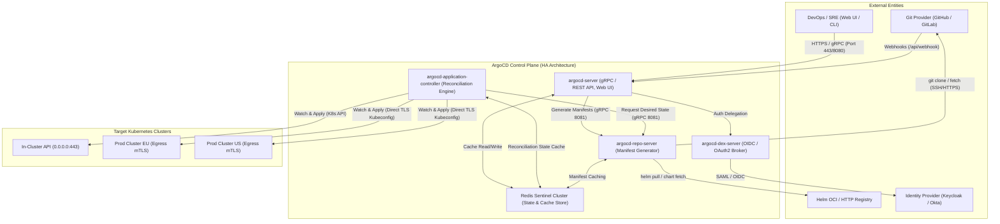

# 🐙 12. Внутренняя архитектура ArgoCD: Компоненты, Кэширование и High Availability

## 🏛️ Архитектура ядра ArgoCD

ArgoCD спроектирован как модульная система распределенных микросервисов внутри Kubernetes. Каждый компонент выполняет строго изолированную функцию: генерация манифестов, поддержание контроллера состояния, аутентификация и обслуживание UI/API.



---

## 🧩 Детальный разбор компонентов

### 1. `argocd-server`
- **Функции**: Выступает в роли API Gateway (gRPC + REST с использованием gRPC-Gateway) и веб-интерфейса.
- **Обязанности**: Проверка RBAC, аутентификация через токены JWT, прием Git Webhook'ов для мгновенной инвалидации кэша, передача операций синхронизации в контроллер.
- **Масштабирование**: Stateless. Масштабируется горизонтально (HPA) за Nginx / Ingress Controller.

### 2. `argocd-repo-server`
- **Функции**: Клонирование Git-репозиториев и рендеринг "чистого" YAML манифеста.
- **Выполняет**: `helm template`, `kustomize build`, запуск Config Management Plugins (CMP).
- **Кэширование**: Хранит Git-репозитории в локальной файловой системе (`/tmp`), кэширует сгенерированные деревья манифестов в Redis по хэшу коммита.

### 3. `argocd-application-controller`
- **Функции**: Постоянный цикл реконсиляции (Kubernetes Operator Pattern).
- **Обязанности**: 
  1. Вызывает `argocd-repo-server` для получения **Desired State**.
  2. Запрашивает через Kubernetes API реальное состояние ресурсов (**Live State**).
  3. Вычисляет $\Delta$ (Drift) и переводит приложение в статус `Synced` или `OutOfSync`.
  4. При включенном `selfHeal` выполняет `kubectl apply`/`kubectl delete`.
- **Шардинг**: Поддерживает динамический шардинг по кластерам при наличии сотен целевых K8s кластеров.

### 4. `Redis` / `Redis-HA`
- Хранит кэш сессий пользователей, метаданные состояния Git репозиториев и сгенерированные манифесты. Позволяет не опрашивать Git API при каждом цикле сверки.

---

## ⚙️ Production High Availability (HA) Configuration

Конфигурация ArgoCD HA через официальные Helm values (`values-ha.yaml`):

```yaml
global:
  domain: argocd.infra.company.internal
  logging:
    format: json
    level: info

controller:
  replicas: 2
  enableStateCache: true
  resources:
    limits:
      cpu: "4"
      memory: "4Gi"
    requests:
      cpu: "1"
      memory: "1Gi"
  env:
    - name: ARGOCD_CONTROLLER_REPLICAS
      value: "2"
    - name: ARGOCD_CLUSTER_CACHE_LIST_PAGE_SIZE
      value: "1000"

repoServer:
  autoscaling:
    enabled: true
    minReplicas: 3
    maxReplicas: 10
    targetCPUUtilizationPercentage: 70
  resources:
    limits:
      cpu: "2"
      memory: "2Gi"
    requests:
      cpu: "500m"
      memory: "512Mi"
  volumes:
    - name: custom-tools
      emptyDir: {}
  initContainers:
    - name: install-helm-plugins
      image: alpine/helm:3.15.2
      command: ["/bin/sh", "-c"]
      args:
        - helm plugin install https://github.com/databus23/helm-diff --version v3.9.0

server:
  autoscaling:
    enabled: true
    minReplicas: 3
    maxReplicas: 6
  ingress:
    enabled: true
    ingressClassName: nginx
    annotations:
      cert-manager.io/cluster-issuer: letsencrypt-prod
      nginx.ingress.kubernetes.io/backend-protocol: "GRPC"
      nginx.ingress.kubernetes.io/ssl-redirect: "true"
    hosts:
      - argocd.infra.company.internal

redis-ha:
  enabled: true
  redis:
    master:
      resources:
        requests:
          cpu: 200m
          memory: 512Mi
        limits:
          cpu: 1
          memory: 2Gi
```

---

## ⚡ Оптимизация Git Polling vs Webhooks

По умолчанию ArgoCD опрашивает Git-репозитории каждые 3 минуты (`timeout.reconciliation: 180s`). При сотнях приложений это приводит к задержкам выкатки и превышению Rate Limit у GitHub/GitLab.

### Настройка Webhook в GitLab / GitHub:
1. В GitLab: `Settings -> Webhooks -> URL`: `https://argocd.infra.company.internal/api/webhook`.
2. Secret Token прописывается в Secret `argocd-secret`:

```bash
kubectl patch secret argocd-secret -n argocd \
  -p '{"stringData": {"webhook.gitlab.secret": "VerySecureToken123456"}}'
```

---

## 🛠️ CLI шпаргалка администратора ArgoCD

```bash
# 1. Авторизация и переключение контекста
argocd login argocd.infra.company.internal --sso

# 2. Принудительный сброс кэша приложения (Hard Refresh)
argocd app get payment-service --hard-refresh

# 3. Инспекция распределения шардов контроллера по кластерам
kubectl logs -n argocd -l app.kubernetes.io/name=argocd-application-controller | grep "Sharding: "

# 4. Проверка задержки и состояния очереди repo-server
kubectl exec -it -n argocd deploy/argocd-repo-server -- argocd-repo-server --metrics-port 8084 &
kubectl exec -it -n argocd deploy/argocd-repo-server -- curl -s http://localhost:8084/metrics | grep "argocd_git_request_duration"

# 5. Экспорт всей конфигурации ArgoCD в аварийный бэкап
argocd-util export -n argocd > argocd-backup-$(date +%F).yaml
```

---

## 🚨 Break-Fix: Типичные инциденты архитектуры

### Инцидент 1: `argocd-repo-server` падает по OOMKilled (`Exit Code 137`)

**Симптом:**
Приложения перестают синхронизироваться, в UI статус `ComparisonError: rpc error: code = Unavailable desc = connection error: desc = "transport: Error while dialing dial tcp...`

**Первопричина:**
Тяжелый Helm-чарт с сотнями зависимостей или неоптимальный Kustomize плагин использует более 1GB памяти во время `helm template`. Kubernetes cgroups немедленно убивает под.

**Диагностика и решение:**
```bash
# Проверка OOMKilled в событиях
kubectl describe pod -n argocd -l app.kubernetes.io/name=argocd-repo-server | grep -i oomkilled

# Решение: Поднять memory limit и включить параллельный лимит генерации
kubectl set resources deployment -n argocd argocd-repo-server \
  --limits=memory=4Gi,cpu=2 \
  --requests=memory=1Gi,cpu=500m
```
В `argocd-cmd-params-cm` добавить:
```yaml
data:
  reposerver.parallelism.limit: "10"  # Ограничение параллельных рендеров на один pod
```

---

### Инцидент 2: Redis переполнен (`OOM command not allowed when used memory > 'maxmemory'`)

**Симптом:**
UI выдает ошибку 500 Internal Server Error, логи `argocd-server` забиты ошибками записи в Redis.

**Решение:**
1. Проверить политику вытеснения ключей Redis (`maxmemory-policy` должна быть `allkeys-lru` или `volatile-lru`).
2. Очистить устаревшие ревизии кэша:
```bash
kubectl exec -it -n argocd statefulset/argocd-redis-ha-server-0 -- redis-cli flushdb
```
