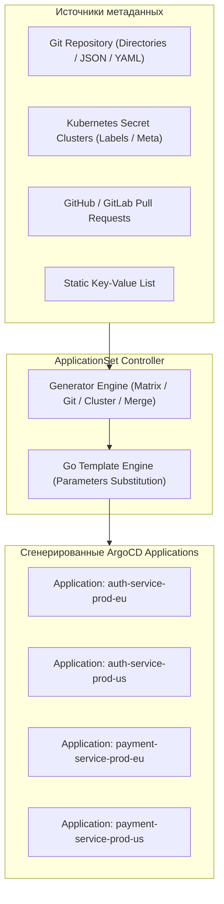

# ⚙️ 13. ArgoCD ApplicationSet: Генераторы, Мультикластерность и Автоматизация флота

## 🏭 Концепция ApplicationSet: Фабрика приложений

`ApplicationSet` — это контроллер ArgoCD, реализующий паттерн **"Фабрика приложений" (Application Factory)**. Вместо ручного описания сотен манифестов `Application` для каждого микросервиса и кластера, ApplicationSet использует **генераторы (Generators)** для динамического создания и обновления дочерних ресурсов `Application` на основе шаблона.



---

## 🎛️ Обзор ключевых генераторов

| Генератор | Источник данных | Применение в Production |
| :--- | :--- | :--- |
| **List Generator** | Статический список словарей в YAML. | Фиксированный набор сред (dev, stage, prod) с ручным переопределением параметров. |
| **Cluster Generator** | Секреты кластеров в ArgoCD (`argocd.argoproj.io/secret-type: cluster`). | Автоматический деплой базового стека (Ingress, Monitoring) на все подключенные кластеры по лейблам. |
| **Git Directory / Files** | Файловая структура или JSON/YAML файлы в Git репозитории. | Monorepo со множеством сервисов; генерация приложений на основе конфигов `config.json`. |
| **Pull Request** | API GitHub/GitLab/Bitbucket. | Создание эфемерных Preview-окружений на каждый открытый Pull Request. |
| **Matrix Generator** | Декартово произведение (Комбинация) двух генераторов. | Деплой $N$ сервисов на $M$ кластеров ($N \times M$ приложений). |
| **Merge Generator** | Слияние параметров с переопределением по ключу. | Базовая конфигурация для всех сервисов + специфичные оверрайды для конкретных сред. |

---

## 📄 Production-примеры конфигураций

### 1. Matrix Generator: Мультикластерный деплой микросервисов

Комбинирует список кластеров с директориями сервисов в Git:

```yaml
apiVersion: argoproj.io/v1alpha1
kind: ApplicationSet
metadata:
  name: cluster-workloads-matrix
  namespace: argocd
spec:
  goTemplate: true                    # Использовать современный Go Template синтаксис
  goTemplateOptions: ["missingkey=error"]
  generators:
    - matrix:
        generators:
          # Генератор 1: Все кластеры с лейблом environment=production
          - clusters:
              selector:
                matchLabels:
                  environment: production
                  tier: compute
          # Генератор 2: Все подкаталоги сервисов в папке apps/
          - git:
              repoURL: https://github.com/company/gitops-fleet.git
              revision: HEAD
              directories:
                - path: apps/*
  template:
    metadata:
      name: '{{ .path.basename }}-{{ .name }}'
      labels:
        environment: '{{ .metadata.labels.environment }}'
        region: '{{ .metadata.labels.region }}'
        app: '{{ .path.basename }}'
    spec:
      project: default
      source:
        repoURL: https://github.com/company/gitops-fleet.git
        targetRevision: HEAD
        path: '{{ .path.path }}/overlays/{{ .metadata.labels.environment }}'
      destination:
        server: '{{ .server }}'
        namespace: '{{ .path.basename }}'
      syncPolicy:
        automated:
          prune: true
          selfHeal: true
        syncOptions:
          - CreateNamespace=true
```

---

### 2. Git Files Generator (Service Catalog Pattern)

Каждый сервис хранит `service.yaml` с метаданными. ApplicationSet читает эти файлы и генерирует конфигурацию:

```yaml
apiVersion: argoproj.io/v1alpha1
kind: ApplicationSet
metadata:
  name: services-catalog
  namespace: argocd
spec:
  generators:
    - git:
        repoURL: https://github.com/company/service-catalog.git
        revision: HEAD
        files:
          - path: "services/**/config.json"
  template:
    metadata:
      name: '{{appName}}'
    spec:
      project: '{{teamProject}}'
      source:
        repoURL: '{{sourceRepo}}'
        targetRevision: '{{targetBranch}}'
        path: '{{chartPath}}'
        helm:
          values: |
            replicaCount: {{replicas}}
            resources:
              limits:
                memory: {{memoryLimit}}
      destination:
        name: '{{targetCluster}}'
        namespace: '{{teamNamespace}}'
```

---

### 3. Progressive Rollout: Поэтапная раскатка по кластерам

ApplicationSet позволяет обновлять приложения по фазам (например, сначала Canary кластер, затем EU, затем US) с контролем ошибок:

```yaml
apiVersion: argoproj.io/v1alpha1
kind: ApplicationSet
metadata:
  name: progressive-fleet-rollout
  namespace: argocd
spec:
  strategy:
    type: RollingSync
    rollingSync:
      steps:
        - matchExpressions:
            - key: stage
              operator: In
              values: [canary]
          maxUpdate: 100%             # Сначала обновляем все canary кластеры
        - matchExpressions:
            - key: stage
              operator: In
              values: [production]
          maxUpdate: 20%              # Затем продакшн по 20% кластеров за раз
  generators:
    - clusters:
        selector:
          matchExpressions:
            - key: stage
              operator: In
              values: [canary, production]
  template:
    metadata:
      name: 'core-infra-{{name}}'
    spec:
      project: infrastructure
      source:
        repoURL: https://github.com/company/infra-base.git
        targetRevision: main
        path: manifests/
      destination:
        server: '{{server}}'
        namespace: core-infra
```

---

## 🛠️ CLI шпаргалка: Отладка ApplicationSet

```bash
# 1. Просмотр статуса контроллера ApplicationSet и сгенерированных приложений
kubectl get applicationset -n argocd
kubectl get applicationset cluster-workloads-matrix -n argocd -o yaml

# 2. Проверка условий (Conditions) на наличие синтаксических ошибок шаблона
kubectl get applicationset -n argocd -o jsonpath='{range .items[*]}{.metadata.name}{"\n"}{range .status.conditions[*]}{"  - "}{.type}{": "}{.message}{"\n"}{end}{end}'

# 3. Просмотр всех Applications, порожденных конкретным ApplicationSet
kubectl get applications -n argocd -l app.kubernetes.io/part-of=cluster-workloads-matrix

# 4. Просмотр логов контроллера для поиска ошибок парсинга JSON/Git
kubectl logs -n argocd -l app.kubernetes.io/name=argocd-applicationset-controller -f
```

---

## 🚨 Break-Fix: Типичные аварии ApplicationSet

### Сценарий 1: Каскадное удаление всех приложений при недоступности Git / ошибки ветки

**Симптом:**
При переименовании ветки в Git или временной недоступности Git-сервера ApplicationSet решает, что директорий больше нет, и немедленно **удаляет все дочерние `Application` вместе с боевыми ресурсами в кластерах**.

**Первопричина:**
По умолчанию политика `preservedFields` и финализаторы настроены на каскадное удаление.

**Решение:**
1. Использовать `syncPolicy.preserveResourcesOnDeletion: true` в шаблоне:
```yaml
spec:
  syncPolicy:
    preserveResourcesOnDeletion: true # Не удалять физические поды/сервисы при удалении Application
```
2. Заблокировать удаление приложений в ApplicationSet:
```yaml
spec:
  templatePatch: |
    spec:
      syncPolicy:
        applications:
          prune: false
```

---

### Сценарий 2: Ошибка интерполяции переменных (`missing key error`)

**Симптом:**
```text
Failed to generate Applications: template: :3:14: executing "" at <.metadata.labels.region>: map has no entry for key "region"
```

**Решение:**
При использовании `goTemplate: true` обращение к отсутствующим ключам вызывает панику. Следует использовать встроенную функцию `default`:
```yaml
region: '{{ index .metadata.labels "region" | default "global" }}'
```
