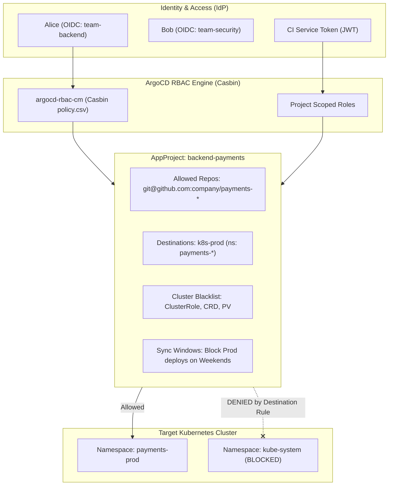

# 🔐 14. ArgoCD Projects (AppProject) и гранулярный RBAC

## 🛡️ Концепция мультиарендности (Multi-Tenancy) и AppProject

В крупных enterprise-инсталляциях ArgoCD управляет ресурсами сотен команд. Предоставление разработчикам неограниченного доступа к `default` проекту создает критические риски: возможность перезаписать чужой namespace, захватить права `cluster-admin` или подключить недоверенный Git-репозиторий.

`AppProject` (`argoproj.io/v1alpha1`) выступает в роли **логического периметра изоляции (Security Boundary)**, который жестко ограничивает:
1. **Source Repositories**: Из каких конкретно Git/Helm репозиториев разрешено загружать манифесты.
2. **Destinations**: На какие целевые K8s кластеры и в какие неймспейсы разрешено деплоить.
3. **Cluster Resource Whitelist/Blacklist**: Разрешено ли создавать кластерные ресурсы (`ClusterRole`, `CustomResourceDefinition`, `Namespace`, `StorageClass`).
4. **Namespace Resource Whitelist/Blacklist**: Запрет опасных ресурсов внутри неймспейса (например, запрет `Secret` или `Ingress`).
5. **Project Scoped Roles & JWT Tokens**: Проектные сервисные аккаунты для CI/CD автоматизаций.



---

## 📄 Манифест Production AppProject

```yaml
apiVersion: argoproj.io/v1alpha1
kind: AppProject
metadata:
  name: payments-production
  namespace: argocd
  finalizers:
    - resources-finalizer.argocd.argoproj.io
spec:
  description: "Production perimeter for Payments Processing Domain"

  # 1. Разрешенные репозитории с кодом
  sourceRepos:
    - "https://github.com/company/payments-*.git"
    - "https://charts.company.com/helm/payments"

  # 2. Разрешенные кластеры и неймспейсы
  destinations:
    - name: prod-eu-central
      namespace: "payments-*"
    - server: "https://10.0.100.1:6443"
      namespace: "payments-*"

  # 3. Полный запрет на управление кластерными ресурсами
  clusterResourceWhitelist: []
  clusterResourceBlacklist:
    - group: "*"
      kind: "*"

  # 4. Разрешенные ресурсы внутри неймспейса
  namespaceResourceWhitelist:
    - group: "apps"
      kind: "Deployment"
    - group: "apps"
      kind: "StatefulSet"
    - group: ""
      kind: "Service"
    - group: ""
      kind: "ConfigMap"
    - group: ""
      kind: "Secret"
    - group: "networking.k8s.io"
      kind: "Ingress"
    - group: "monitoring.coreos.com"
      kind: "ServiceMonitor"

  # 5. Окна синхронизации (Sync Windows): Запрет деплоев по пятницам и выходным
  syncWindows:
    - kind: deny
      schedule: "0 18 * * 5"         # Каждая пятница с 18:00
      duration: 60h                  # Блокировка на 60 часов (все выходные)
      applications:
        - "*"
      timeZone: "UTC"

  # 6. Проектные роли с Casbin-политиками
  roles:
    - name: payment-deployer
      description: "Service account for GitLab CI deployment pipeline"
      policies:
        - "p, proj:payments-production:payment-deployer, applications, get, payments-production/*, allow"
        - "p, proj:payments-production:payment-deployer, applications, sync, payments-production/*, allow"
        - "p, proj:payments-production:payment-deployer, applications, update, payments-production/*, allow"
      jwtTokens:
        - id: "gitlab-ci-token-2026"
          issuedAt: 1767225600
```

---

## 🔑 Глобальный RBAC: `argocd-rbac-cm` (Casbin Engine)

Связывание групп корпоративного IdP (Keycloak, Okta, Azure AD) с ролями ArgoCD настраивается в `ConfigMap/argocd-rbac-cm`.

```yaml
apiVersion: v1
kind: ConfigMap
metadata:
  name: argocd-rbac-cm
  namespace: argocd
data:
  # Роль по умолчанию для всех прошедших аутентификацию (read-only)
  policy.default: role:readonly

  # Определение прав в формате Casbin CSV:
  # p, <role/subject>, <resource>, <action>, <object>, <effect>
  # g, <user/idp_group>, <role>
  policy.csv: |
    # 1. Администраторы платформы
    p, role:platform-admin, *, *, *, allow

    # 2. Роль разработчиков Backend
    p, role:backend-dev, applications, get, payments-*/*, allow
    p, role:backend-dev, applications, sync, payments-*/*, allow
    p, role:backend-dev, logs, get, payments-*/*, allow
    p, role:backend-dev, exec, create, payments-*/*, allow
    p, role:backend-dev, repositories, get, *, allow

    # 3. Привязка групп из OIDC токена к ролям
    g, "DevOps-Core-Team", role:platform-admin
    g, "Payments-Squad-Devs", role:backend-dev
    g, "Security-Auditors", role:readonly

  # Включение проверки области действия токена
  scopes: '[groups, email]'
```

---

## 🛠️ CLI шпаргалка: Управление RBAC и Project

```bash
# 1. Проверка прав пользователя через CLI утилиту тестирования RBAC
argocd-util rbac can "Payments-Squad-Devs" sync 'applications' 'payments-production/payment-api' --namespace argocd

# 2. Генерация JWT токена для проектной роли
argocd proj role create-token payments-production payment-deployer --expires-in 8760h

# 3. Список всех проектов и инспекция ограничений
argocd proj list
argocd proj get payments-production

# 4. Проверка заблокированных sync windows
argocd proj windows list payments-production
```

---

## 🚨 Break-Fix: Разбор ошибок авторизации

### Ошибка 1: `application destination server and namespace is not permitted in project`

**Симптом:**
```text
rpc error: code = InvalidArgument desc = application destination {https://10.0.100.1:6443 payments-qa} is not permitted in project 'payments-production'
```

**Первопричина:**
Приложение пытается задеплоиться в кластер или неймспейс, который отсутствует в секции `spec.destinations` манифеста `AppProject`.

**Решение:**
Добавить целевой namespace/сервер в `AppProject`:
```bash
kubectl patch appproject payments-production -n argocd --type='json' \
  -p='[{"op": "add", "path": "/spec/destinations/-", "value": {"name": "prod-eu-central", "namespace": "payments-qa"}}]'
```

---

### Ошибка 2: Пользователь с группой IdP видит пустой экран (Нет приложений)

**Симптом:**
Пользователь успешно входит через OIDC SSO, но список приложений пуст.

**Диагностика:**
1. Проверить полученные OIDC claims пользователя:
```bash
kubectl logs -n argocd -l app.kubernetes.io/name=argocd-server | grep -i "claims"
```
2. Если группа в OIDC токене приходит как `["/Payments-Squad-Devs"]` (со слешем), а в Casbin прописано `"Payments-Squad-Devs"`, сопоставление не сработает.

**Решение:**
Указать точное имя группы в `argocd-rbac-cm` с учетом регистра и слешей:
```yaml
g, "/Payments-Squad-Devs", role:backend-dev
```
