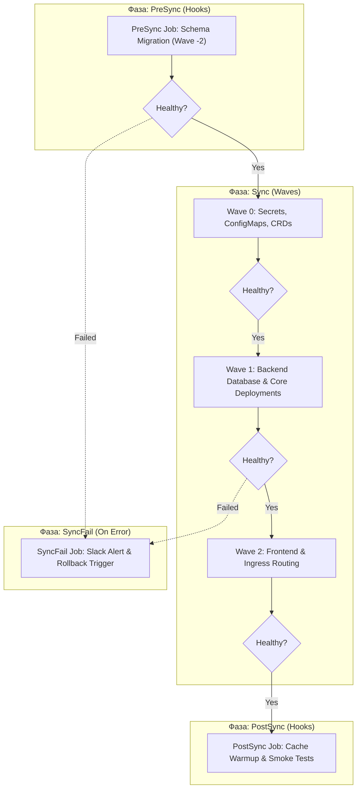

# 🔄 15. ArgoCD: Политики синхронизации, Sync Waves, Hooks и кастомные Health Checks

## 🌊 Механика фаз (Phases) и волн (Sync Waves)

ArgoCD применяет манифесты в кластер не хаотично, а через строгий многоуровневый конвейер: **Sync Phases** (фазы жизненного цикла) и **Sync Waves** (числовой порядок внутри фазы).

Контроллер гарантирует: **ресурсы следующей волны ($N+1$) не начнут применяться, пока все ресурсы текущей волны ($N$) не перейдут в состояние `Healthy`**.



---

## 📑 Аннотации Sync Waves и Sync Hooks

| Аннотация | Значение / Пример | Назначение |
| :--- | :--- | :--- |
| `argocd.argoproj.io/sync-wave` | `"-5"`, `"0"`, `"10"` | Определяет порядок применения. Меньшие числа выполняются раньше. |
| `argocd.argoproj.io/hook` | `PreSync`, `Sync`, `PostSync`, `SyncFail` | Привязывает ресурс к определенной фазе жизненного цикла. |
| `argocd.argoproj.io/hook-delete-policy` | `HookSucceeded`, `BeforeHookCreation` | Автоматическая очистка Job (например, удаление старого Job перед созданием нового). |
| `argocd.argoproj.io/sync-options` | `Prune=false`, `Force=true`, `Replace=true` | Специфичные флаги синхронизации для отдельных ресурсов. |

---

## 📄 Production-пример: Миграция БД + Деплой приложения

### 1. Job миграции базы данных (PreSync Hook)

```yaml
apiVersion: batch/v1
kind: Job
metadata:
  name: payment-db-migrate
  namespace: payments
  annotations:
    argocd.argoproj.io/hook: PreSync
    argocd.argoproj.io/hook-delete-policy: BeforeHookCreation,HookSucceeded
    argocd.argoproj.io/sync-wave: "-1"
spec:
  backoffLimit: 2
  template:
    spec:
      restartPolicy: Never
      containers:
        - name: migrate
          image: registry.company.com/payments/db-migrator:v2.4.0
          envFrom:
            - secretRef:
                name: payment-db-credentials
```

### 2. Основной Deployment (Wave 0)

```yaml
apiVersion: apps/v1
kind: Deployment
metadata:
  name: payment-api
  namespace: payments
  annotations:
    argocd.argoproj.io/sync-wave: "0"
spec:
  replicas: 3
  selector:
    matchLabels:
      app: payment-api
  template:
    metadata:
      labels:
        app: payment-api
    spec:
      containers:
        - name: api
          image: registry.company.com/payments/api:v2.4.0
          readinessProbe:
            httpGet:
              path: /ready
              port: 8080
            initialDelaySeconds: 5
            periodSeconds: 5
```

---

## 🩺 Кастомные Health Checks на языке Lua

ArgoCD имеет встроенные алгоритмы проверки здоровья для стандартных K8s ресурсов (`Deployment`, `StatefulSet`, `Service`). Однако для сторонних CRD (например, Cert-Manager `Certificate`, Argo Rollouts `Rollout`, Bitnami `SealedSecret`) требуется описывать логику в `ConfigMap/argocd-cm`.

### Добавление Health Check для `cert-manager.io/Certificate` в `argocd-cm`:

```yaml
apiVersion: v1
kind: ConfigMap
metadata:
  name: argocd-cm
  namespace: argocd
data:
  resource.customizations.health.cert-manager.io_Certificate: |
    hs = {}
    if obj.status ~= nil then
      if obj.status.conditions ~= nil then
        for i, condition in ipairs(obj.status.conditions) do
          if condition.type == "Ready" and condition.status == "True" then
            hs.status = "Healthy"
            hs.message = condition.message
            return hs
          end
          if condition.type == "Ready" and condition.status == "False" then
            hs.status = "Degraded"
            hs.message = condition.message
            return hs
          end
        end
      end
    end
    hs.status = "Progressing"
    hs.message = "Waiting for Certificate issuance..."
    return hs
```

---

## 🛠️ CLI шпаргалка: Управление синхронизацией

```bash
# 1. Ручная синхронизация конкретного ресурса с удалением устаревших
argocd app sync payment-system \
  --resource apps:Deployment:payments/payment-api \
  --prune

# 2. Синхронизация с принудительным выполнением Hooks и отслеживанием статуса
argocd app sync payment-system \
  --strategy Hook \
  --retry-limit 3 \
  --timeout 300

# 3. Откат зависшей синхронизации (Terminate sync operation)
argocd app terminate-op payment-system

# 4. Просмотр дерева ресурсов и статуса здоровья
argocd app get payment-system --show-operation
```

---

## 🚨 Break-Fix: Разбор сложных инцидентов синхронизации

### Инцидент 1: Бесконечный `Progressing` из-за отсутствия статуса CRD

**Симптом:**
Приложение задеплоило кастомный ресурс (например, `VirtualService` или `KafkaTopic`), и ArgoCD зависает в статусе `Progressing`, блокируя выполнение следующих волн (Sync Waves).

**Первопричина:**
Контроллер CRD не выставляет стандартные поля `status.conditions`, а ArgoCD не имеет встроенного Lua скрипта для этого `apiVersion/Kind`. По умолчанию ресурсы без скрипта считаются `Healthy`, но если статус содержит нераспознанные поля, они зависают в `Progressing`.

**Решение:**
1. Прописать правило `Healthy` по умолчанию в `argocd-cm`:
```yaml
resource.customizations.health.networking.istio.io_VirtualService: |
  hs = {}
  hs.status = "Healthy"
  hs.message = "VirtualService applied successfully"
  return hs
```
2. Либо добавить аннотацию на ресурс:
```yaml
annotations:
  argocd.argoproj.io/sync-options: SkipDryRunOnMissingResource=true
```

---

### Инцидент 2: `PostSync` хук падает, и статус приложения остается `Degraded`

**Симптом:**
Манифесты приложения успешно применились, поды поднялись, но статус приложения в ArgoCD горит красным (`Degraded`) из-за ошибки в smoke-тестах `PostSync`.

**Решение:**
1. Если PostSync хук не должен ломать статус выкатки, настроить политику игнорирования сбоев или удаление упавшего пода:
```yaml
annotations:
  argocd.argoproj.io/hook: PostSync
  argocd.argoproj.io/hook-delete-policy: HookFailed
```
2. Для экстренного снятия ошибки:
```bash
kubectl delete job -n payments -l argocd.argoproj.io/hook=PostSync
argocd app refresh payment-system
```
