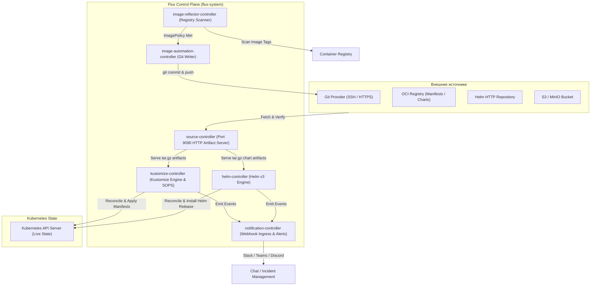

# ⚡ 17. Архитектура FluxCD v2: GitOps Toolkit (GOTK) и Модульные Контроллеры

## 🧩 Философия GitOps Toolkit (GOTK)

В отличие от монолитной архитектуры ArgoCD, **Flux v2** спроектирован в соответствии с философией Unix: набор специализированных, независимых, взаимодействующих Kubernetes-контроллеров (**GitOps Toolkit**).

Каждый контроллер Flux отвечает за строго определенный уровень абстракции: получение артефактов, рендеринг Kustomize, управление Helm-релизами, нотификации или автоматизацию сборки Docker-образов.



---

## 🔬 Детальный обзор контроллеров GOTK

| Контроллер | Основные CRD | Роль в системе |
| :--- | :--- | :--- |
| **`source-controller`** | `GitRepository`, `OCIRepository`, `HelmRepository`, `Bucket` | Скачивает исходники, проверяет PGP/Cosign подписи, упаковывает в `tar.gz` и раздает локально по HTTP через встроенный артефакт-сервер. |
| **`kustomize-controller`** | `Kustomization` | Запрашивает артефакт у `source-controller`, расшифровывает секреты (Mozilla SOPS), генерирует манифесты (`kustomize build`), валидирует схему и применяет в кластер. |
| **`helm-controller`** | `HelmRelease`, `HelmChart` | Управляет жизненным циклом Helm-релизов (install, upgrade, test, rollback), автоматически вычисляет diff значений и объединяет ConfigMaps/Secrets. |
| **`notification-controller`** | `Provider`, `Alert`, `Receiver` | Принимает внешние входящие вебхуки (например, от GitHub при пуше) для мгновенной реконсиляции и отправляет исходящие алерты. |
| **`image-reflector-controller`** | `ImageRepository`, `ImagePolicy` | Сканирует реестры контейнеров, вычисляет новые теги по SemVer или Regex. |
| **`image-automation-controller`** | `ImageUpdateAutomation` | Автоматически делает Git-коммит с новым тегом образа прямо в репозиторий GitOps. |

---

## 📄 Production-манифесты Flux v2

### 1. `GitRepository` (Источник манифестов с проверкой PGP)

```yaml
apiVersion: source.toolkit.fluxcd.io/v1
kind: GitRepository
metadata:
  name: fleet-infra
  namespace: flux-system
spec:
  interval: 1m
  url: https://github.com/company/fleet-infrastructure.git
  ref:
    branch: main
  secretRef:
    name: github-deploy-key
  verification:
    mode: head
    secretRef:
      name: gpg-signing-keys          # Проверка криптографической подписи коммитов
```

### 2. `Kustomization` с зависимостями (`dependsOn`) и дешифрацией SOPS

```yaml
apiVersion: kustomize.toolkit.fluxcd.io/v1
kind: Kustomization
metadata:
  name: apps-backend
  namespace: flux-system
spec:
  interval: 10m
  retryInterval: 1m
  timeout: 5m
  prune: true                         # Удалять удаленные из Git ресурсы
  wait: true                          # Ждать перехода подов в Healthy состояние
  sourceRef:
    kind: GitRepository
    name: fleet-infra
  path: ./clusters/production/apps
  dependsOn:
    - name: crds-infrastructure       # Выполнять только после успешной установки CRD
    - name: ingress-controllers
  decryption:
    provider: sops
    secretRef:
      name: sops-age-key              # Ключ для автоматической расшифровки SOPS
  healthChecks:
    - apiVersion: apps/v1
      kind: Deployment
      name: payment-service
      namespace: default
```

---

## 🛠️ CLI шпаргалка: Администрирование Flux v2

```bash
# 1. Проверка работоспособности и совместимости кластера
flux check --pre
flux check

# 2. Мгновенная принудительная синхронизация источника и кастомизации
flux reconcile source git fleet-infra
flux reconcile kustomization apps-backend --with-source

# 3. Инспекция состояния всех ресурсов Flux
flux get all -A

# 4. Просмотр логов в реальном времени с фильтрацией по контроллерам
flux logs --level=error --all-namespaces
flux logs --kind=Kustomization --name=apps-backend -f

# 5. Приостановка авто-синхронизации (для отладки/аварийных работ)
flux suspend kustomization apps-backend
# Возобновление работы
flux resume kustomization apps-backend
```

---

## 🚨 Break-Fix: Разбор сложных инцидентов Flux v2

### Инцидент 1: Циклическая зависимость (`Circular dependency detected`)

**Симптом:**
`Kustomization/apps-backend` зависает в состоянии `DependencyNotReady`, реконсиляция всех зависимых компонентов останавливается.

**Диагностика:**
```bash
flux get kustomizations
# apps-backend: DependencyNotReady: kustomization 'flux-system/ingress' depends on 'flux-system/apps-backend'
```

**Решение:**
1. Проверить граф зависимостей в секциях `spec.dependsOn`.
2. Временно убрать `dependsOn` через `kubectl patch`:
```bash
kubectl patch kustomization apps-backend -n flux-system --type=merge \
  -p '{"spec":{"dependsOn":[]}}'
```

---

### Инцидент 2: Переполнение внутреннего хранилища артефактов `source-controller`

**Симптом:**
`source-controller` падает с ошибкой `no space left on device`, артефакты `tar.gz` не генерируются.

**Первопричина:**
`source-controller` использует ephemeral storage / emptyDir для кэша артефактов. При частых коммитах в тяжелый Git-репозиторий диск переполняется.

**Решение:**
1. Очистить локальный кэш:
```bash
kubectl rollout restart deployment/source-controller -n flux-system
```
2. Настроить лимиты хранения и Garbage Collection в `source-controller` аргументах:
```yaml
spec:
  template:
    spec:
      containers:
        - name: manager
          args:
            - --storage-path=/data
            - --storage-adv-addr=source-controller.flux-system.svc.cluster.local.
            - --storage-gc-interval=15m
```
