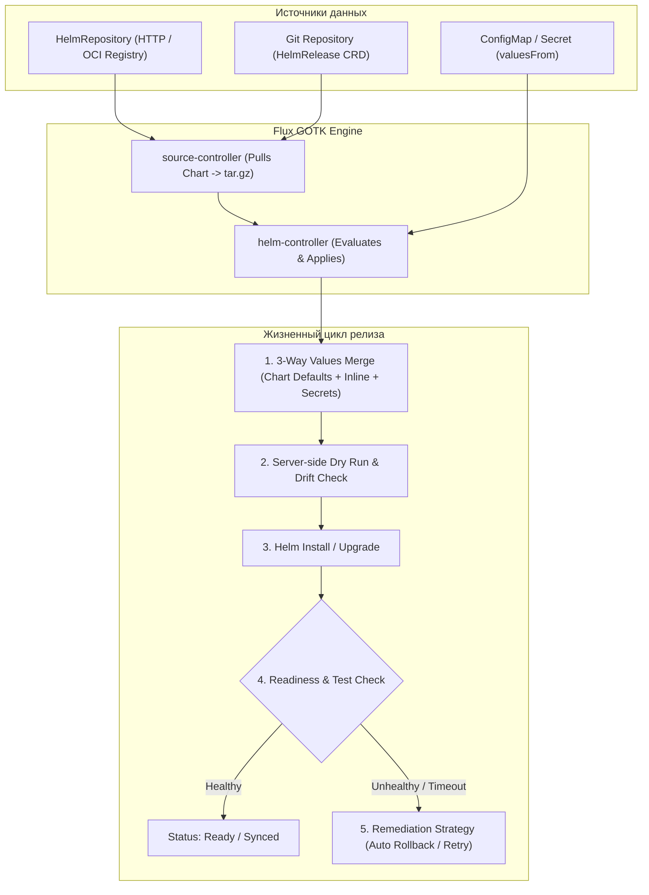

# ⛵ 18. Декларативное управление Helm в Flux: HelmRelease, OCI и Remediation

## 🏗️ Архитектура декларативного Helm в GitOps

Традиционный запуск `helm upgrade --install` из CI пайплайна не обладает механизмом непрерывного устранения дрифта и требует хранения секретов кластера в CI. 

**Flux `helm-controller`** превращает Helm в полноценный декларативный ресурс:
1. `HelmRepository` / `OCIRepository` — декларативный источник чартов.
2. `HelmChart` — артефакт скомпилированного чарта конкретной версии.
3. `HelmRelease` — состояние инсталляции, объединяющее чарт, кастомные `values`, секреты и политики автоматического восстановления (**Remediation**).



---

## 📄 Production-манифесты HelmRelease

### 1. Подключение OCI Registry и HTTP Репозитория

```yaml
# 1. Реестр OCI (например, Harbor / GitHub Container Registry)
apiVersion: source.toolkit.fluxcd.io/v1beta2
kind: HelmRepository
metadata:
  name: bitnami-oci
  namespace: flux-system
spec:
  type: oci
  interval: 6h
  url: oci://registry-1.docker.io/bitnamicharts
  secretRef:
    name: registry-credentials
---
# 2. Традиционный HTTP Helm Repository
apiVersion: source.toolkit.fluxcd.io/v1
kind: HelmRepository
metadata:
  name: ingress-nginx
  namespace: flux-system
spec:
  interval: 2h
  url: https://kubernetes.github.io/ingress-nginx
```

---

### 2. Production `HelmRelease` с Values Overrides и Remediation

```yaml
apiVersion: helm.toolkit.fluxcd.io/v2
kind: HelmRelease
metadata:
  name: ingress-nginx
  namespace: ingress-nginx
spec:
  interval: 15m
  chart:
    spec:
      chart: ingress-nginx
      version: "4.11.x"               # Поддержка SemVer плавающих версий
      sourceRef:
        kind: HelmRepository
        name: ingress-nginx
        namespace: flux-system
      interval: 1h

  # Стратегия исцеления и автоматического отката
  install:
    remediation:
      retries: 3
    timeout: 10m
  upgrade:
    remediation:
      retries: 3
      strategy: rollback             # Авто-откат на предыдущую стабильную версию
    cleanupOnFail: true
  rollback:
    timeout: 5m
    recreate: true

  # Проверка работоспособности после релиза
  test:
    enable: true
    ignoreFailures: false

  # Значения по умолчанию + Переопределения из ConfigMap/Secret
  values:
    controller:
      replicaCount: 3
      metrics:
        enabled: true
        serviceMonitor:
          enabled: true
      resources:
        requests:
          cpu: 200m
          memory: 256Mi

  valuesFrom:
    - kind: ConfigMap
      name: global-cluster-domain-config
      valuesKey: domain-settings.yaml
    - kind: Secret
      name: ingress-tls-custom-tokens
      valuesKey: tokens.yaml
      optional: false
```

---

## 🛠️ CLI шпаргалка: Администрирование Helm-релизов в Flux

```bash
# 1. Просмотр статуса всех Helm-релизов
flux get helmreleases -A

# 2. Принудительная пересборка и синхронизация релиза
flux reconcile helmrelease ingress-nginx -n ingress-nginx --with-source

# 3. Инспекция сгенерированных манифестов релиза (Dry-run инспекция)
flux-operator-tools helm-debug -n ingress-nginx ingress-nginx

# 4. Временная приостановка реконсиляции HelmRelease
flux suspend helmrelease ingress-nginx -n ingress-nginx

# 5. Просмотр детальных событий жизненного цикла релиза
kubectl describe helmrelease ingress-nginx -n ingress-nginx
```

---

## 🚨 Break-Fix: Разбор аварий Helm-релизов

### Инцидент 1: Релиз завис в состоянии `pending-upgrade` или `another operation is in progress`

**Симптом:**
`HelmRelease` выдает ошибку: `Helm upgrade failed: another operation (install/upgrade/rollback) is in progress`.

**Первопричина:**
Предыдущая операция была прервана (например, перезагрузка ноды с `helm-controller`), и секрет состояния релиза в Helm остался заблокированным.

**Решение:**
1. Найти секреты состояния релиза в неймспейсе:
```bash
kubectl get secrets -n ingress-nginx -l owner=helm,name=ingress-nginx
```
2. Удалить зависший секрет со статусом `pending-upgrade`:
```bash
# Посмотреть статус последней ревизии
helm history ingress-nginx -n ingress-nginx
# Удалить поврежденный секрет последней ревизии
kubectl delete secret -n ingress-nginx sh.helm.release.v1.ingress-nginx.v12
# Запустить повторную синхронизацию
flux reconcile helmrelease ingress-nginx -n ingress-nginx
```

---

### Инцидент 2: Helm values merge конфликт типов данных (Scalar vs Map)

**Симптом:**
```text
Helm upgrade failed: cannot unmarshal string into Go struct field ... of type map[string]interface{}
```

**Решение:**
Если в `values` чарта поле было определено как словарь, а в `valuesFrom` переопределено как строка, Helm парсер выдает ошибку. Проверить структуру данных и использовать `targetPath`:
```yaml
valuesFrom:
  - kind: ConfigMap
    name: app-config
    targetPath: customConfig.rawYamlBlock
```
