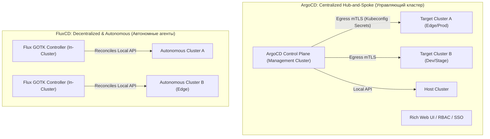

# ⚖️ 20. Сравнительный анализ GitOps-движков: FluxCD v2 vs ArgoCD

## 🏛️ Архитектурные парадигмы: Headless vs Centralized Control Plane

Выбор между **FluxCD v2** и **ArgoCD** — одно из ключевых архитектурных решений при построении Cloud-Native платформы. Оба инструмента реализуют принципы OpenGitOps, но опираются на фундаментально разные проектные философии.



---

## 📊 Матрица детального технического сравнения

| Критерий | ArgoCD | FluxCD v2 |
| :--- | :--- | :--- |
| **Философия архитектуры** | Централизованный монолитный UI/API сервер + набор контроллеров. | Модульный набор микро-контроллеров (GitOps Toolkit - GOTK). |
| **Пользовательский интерфейс (UI)** | 🌟 **Богатый встроенный Web UI**: визуализация графа ресурсов, логи подов в реальном времени, sync-кнопки, SSO. | ❌ Нет официального UI (Headless). Сторонние решения (Weave GitOps UI, Flamingo) или только CLI/K9s. |
| **Мультикластерность** | 🌟 Централизованное управление сотнями кластеров из одного хаба через `ApplicationSet`. | Децентрализованная установка в каждый кластер или связка с Cluster API. |
| **Работа с Helm** | Выполняет `helm template`, применяет ресурсы через свой контроллер (теряется нативный Helm release state). | 🌟 **Полноценный Helm Engine**: создает настоящие Helm Releases, поддерживает Helm rollback/test/remediation. |
| **Автоматизация обновления образов** | Требует стороннего ArgoCD Image Updater (отдельный проект). | 🌟 **Встроено в ядро**: `image-reflector` + `image-automation-controller` с записью в Git. |
| **Управление секретами** | Плагины CMP (Config Management Plugins), SOPS плагины, External Secrets. | 🌟 **Встроенная поддержка Mozilla SOPS** (age, PGP, AWS KMS, GCP KMS) на уровне `Kustomization`. |
| **RBAC и Multi-tenancy** | Встроенный Casbin RBAC, OIDC/SAML интеграции с Keycloak/Okta. | Опирается исключительно на нативный Kubernetes RBAC и Service Accounts. |
| **Потребление ресурсов** | Выше (Redis, Web-сервер, Dex, Repo-сервер, Controller). | ⚡ Минимальное (микро-контроллеры на Go, потребление RAM от 50MB). |
| **Edge / Ограниченные сети (Air-gapped)** | Требует постоянного Egress доступа от Hub к Edge кластерам. | 🌟 Идеально подходит: агент работает полностью локально внутри изолированного кластера. |

---

## 🌳 Дерево принятия решений (Decision Tree)

```mermaid
flowchart TD
    Start["Выбор GitOps инструмента"] --> Q1{"Нужен ли разработчикам Web UI для просмотра логов и деплоев?"}
    Q1 -->|Да, критично для команд| Argo1["Выбираем ArgoCD"]
    Q1 -->|Нет, работаем только через Git/CLI/K9s| Q2{"Какая топология кластеров?"}

    Q2 -->|Сотни Edge/IoT кластеров с нестабильной сетью| Flux1["Выбираем FluxCD (Автономный агент)"]
    Q2 -->|Централизованный флот в облаке (EKS/GKE)| Q3{"Критична ли нативная интеграция с Helm (Rollbacks/Tests)?"}

    Q3 -->|Да, бизнес завязан на сложную логику Helm чартов| Flux2["Выбираем FluxCD"]
    Q3 -->|Нет, манифесты на Kustomize / Базовый Helm| Q4{"Нужен ли авто-коммит новых образов прямо из коробки?"}

    Q4 -->|Да, без сторонних костылей| Flux3["Выбираем FluxCD"]
    Q4 -->|Нет, централизованный мониторинг важнее| Argo2["Выбираем ArgoCD"]
```

---

## 🏗️ Архитектурный шаблон решения (ADR): Выбор GitOps платформы

```markdown
# ADR 042: Выбор GitOps платформы для Enterprise Fleet

## Статус: Принято
## Контекст:
Компания эксплуатирует 40+ Kubernetes кластеров (5 Production, 15 Staging, 20 Edge-локаций в дата-центрах).
Команда состоит из 150 backend-разработчиков и 12 SRE-инженеров.

## Решение:
1. Для централизованных Production и Staging кластеров утвердить **ArgoCD Hub-and-Spoke**:
   - Обеспечивает разработчикам Web UI для быстрого траблшутинга (просмотр логов, состояния подов, рестарты).
   - Единая точка входа для OIDC SSO и аудита изменений.
   - Масштабирование через `ApplicationSet Matrix Generators`.

2. Для изолированных Edge-кластеров утвердить **FluxCD v2**:
   - Автономная реконсиляция при разрывах сетевой связности с центральным ЦОД.
   - Минимальный оверхед по памяти (запуск на edge-нодах с 4GB RAM).
   - Встроенная дешифрация секретов через SOPS + AWS KMS.
```

---

## 🛠️ Сравнительная шпаргалка CLI

| Задача | Команда ArgoCD | Команда FluxCD |
| :--- | :--- | :--- |
| **Список всех приложений** | `argocd app list` | `flux get kustomizations -A` / `flux get helmreleases -A` |
| **Принудительная реконсиляция** | `argocd app sync <app-name>` | `flux reconcile kustomization <name> --with-source` |
| **Просмотр разницы (Diff)** | `argocd app diff <app-name>` | `flux diff kustomization <name>` |
| **Приостановка синхронизации** | `argocd app set <app-name> --sync-policy manual` | `flux suspend kustomization <name>` |
| **Проверка здоровья контроллеров** | `kubectl get pods -n argocd` | `flux check` |
