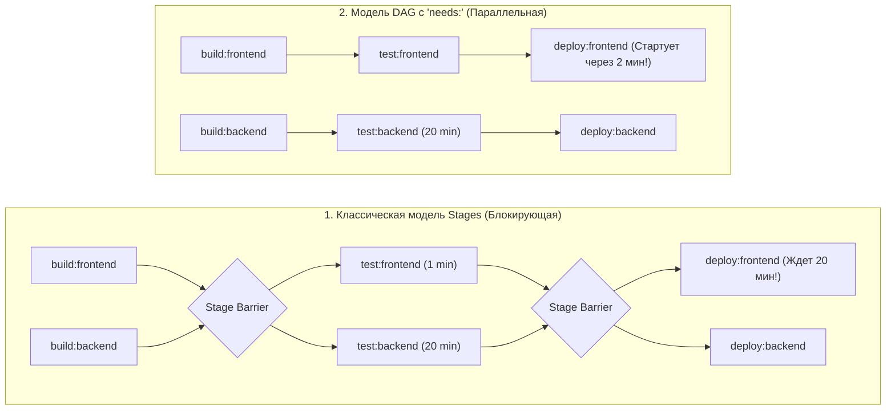

# 🦊 22. Продвинутый синтаксис GitLab CI: DAG (needs), Dynamic Child Pipelines и Rules

## ⚡ Эволюция графа выполнения: Stages vs DAG (Directed Acyclic Graph)

В традиционной модели GitLab CI джобы выполняются строго последовательно по стадиям (`stages`). Если одна долгая джоба стадии `test` выполняется 20 минут, все джобы следующей стадии `deploy` простаивают, даже если их зависимости уже готовы.

**DAG (Directed Acyclic Graph)** на базе ключевого слова `needs:` ломает барьеры стадий: джоба стартует **немедленно**, как только завершились указанные в `needs:` задачи.



---

## 📑 Продвинутые паттерны синтаксиса

### 1. Переиспользование кода: `!reference`, `extends` и `include`

```yaml
# Подключение модулей из центрального репозитория шаблонов платформы
include:
  - project: 'infrastructure/ci-templates'
    ref: v3.2.0
    file:
      - '/templates/security-scanners.yml'
      - '/templates/docker-build.yml'

# Определение общих блоков конфигурации
.logging-config:
  before_script:
    - export START_TIME=$(date +%s)
    - echo "Job $CI_JOB_NAME started by $GITLAB_USER_NAME"
  after_script:
    - export DURATION=$(( $(date +%s) - START_TIME ))
    - echo "Job finished in ${DURATION}s"

.security-policy:
  variables:
    SCAN_SEVERITY_THRESHOLD: "HIGH,CRITICAL"

# Использование !reference для точечного импорта скриптов
deploy:service:
  stage: deploy
  extends: .logging-config
  variables:
    !reference [.security-policy, variables]
  before_script:
    - !reference [.logging-config, before_script]
    - echo "Additional deployment prep..."
  script:
    - ./deploy.sh
```

---

### 2. Матричные сборки (`parallel:matrix`) с фильтрацией

```yaml
cross-compile:
  stage: build
  image: golang:1.23
  parallel:
    matrix:
      - GOOS: [linux, darwin]
        GOARCH: [amd64, arm64]
      - GOOS: [windows]
        GOARCH: [amd64]
  script:
    - echo "Compiling binary for ${GOOS}/${GOARCH}..."
    - GOOS=$GOOS GOARCH=$GOARCH go build -o bin/app-${GOOS}-${GOARCH} ./cmd/app
  artifacts:
    paths:
      - bin/
```

---

### 3. Динамические дочерние пайплайны (Dynamic Child Pipelines)

Для Monorepo с десятками микросервисов статический `.gitlab-ci.yml` становится неуправляемым. Динамическая генерация позволяет запускать пайплайны **только для измененных компонентов**.

```yaml
# Родительский .gitlab-ci.yml
stages:
  - generate
  - trigger

generate-child-pipeline:
  stage: generate
  image: python:3.12-slim
  script:
    # Запуск python скрипта, который проверяет git diff и генерирует yaml для затронутых сервисов
    - python ./ci/generate_pipeline.py > generated-child-ci.yml
  artifacts:
    paths:
      - generated-child-ci.yml

run-dynamic-workloads:
  stage: trigger
  needs: [generate-child-pipeline]
  trigger:
    include:
      - artifact: generated-child-ci.yml
        job: generate-child-pipeline
    strategy: depend                  # Статус родительского пайплайна зависит от дочернего
```

---

### 4. Сложные условия выполнения (`rules`)

```yaml
deploy:production:
  stage: deploy
  needs:
    - job: unit-tests
      artifacts: false                # Джоба не тратит время на скачивание тяжелых артефактов тестов
    - job: build:production
      artifacts: true
  rules:
    # Правило 1: Никогда не собирать для черновиков (Draft MR)
    - if: $CI_MERGE_REQUEST_TITLE =~ /^(\[Draft\]|\(Draft\)|Draft:)/
      when: never
    # Правило 2: Запуск при изменении кода в папке backend или Dockerfile
    - if: $CI_COMMIT_BRANCH == $CI_DEFAULT_BRANCH
      changes:
        compare_to: 'refs/heads/main'
        paths:
          - 'backend/**/*'
          - 'Dockerfile'
      when: on_success
    # Правило 3: Принудительный ручной запуск по требованию
    - when: manual
      allow_failure: true
```

---

## 🛠️ CLI шпаргалка: Валидация и локальный аудит

```bash
# 1. Валидация синтаксиса .gitlab-ci.yml через GitLab API
curl --silent --header "Content-Type: application/json" \
  --data "{\"content\": \"$(cat .gitlab-ci.yml | sed 's/"/\\"/g' | tr '\n' ' ')\"}" \
  "https://gitlab.company.com/api/v4/ci/lint" | jq .

# 2. Локальная валидация схемы через утилиту gitlab-ci-lint (Go)
gitlab-ci-lint .gitlab-ci.yml

# 3. Симуляция триггера пайплайна через API с кастомными переменными
curl --request POST \
  --form token=$CI_JOB_TOKEN \
  --form ref=main \
  --form "variables[DEPLOY_ENV]=canary" \
  "https://gitlab.company.com/api/v4/projects/123/trigger/pipeline"
```

---

## 🚨 Break-Fix: Разбор частых ошибок синтаксиса

### Ошибка 1: `job needs 'build:app' which is not defined in current pipeline`

**Симптом:**
Пайплайн падает на этапе создания (Pipeline Creation Failed).

**Первопричина:**
Джоба `deploy` имеет `needs: [build:app]`, однако для джобы `build:app` сработало условие `rules: when: never`, поэтому она была исключена из графа пайплайна.

**Решение:**
Использовать флаг `optional: true` в определении `needs`:
```yaml
deploy:
  needs:
    - job: build:app
      optional: true
```

---

### Ошибка 2: `rules:changes` не срабатывает в Merge Request

**Симптом:**
Разработчик меняет файлы в `src/`, но джобы с `rules:changes` пропускаются.

**Первопричина:**
В GitLab Runner настроен мелкий Git Clone (`GIT_DEPTH: 1`), и Git не имеет информации о коммитах в целевой ветке для вычисления `git diff`.

**Решение:**
Включить полный Git fetch или увеличить глубину клонирования:
```yaml
variables:
  GIT_DEPTH: 50
```
