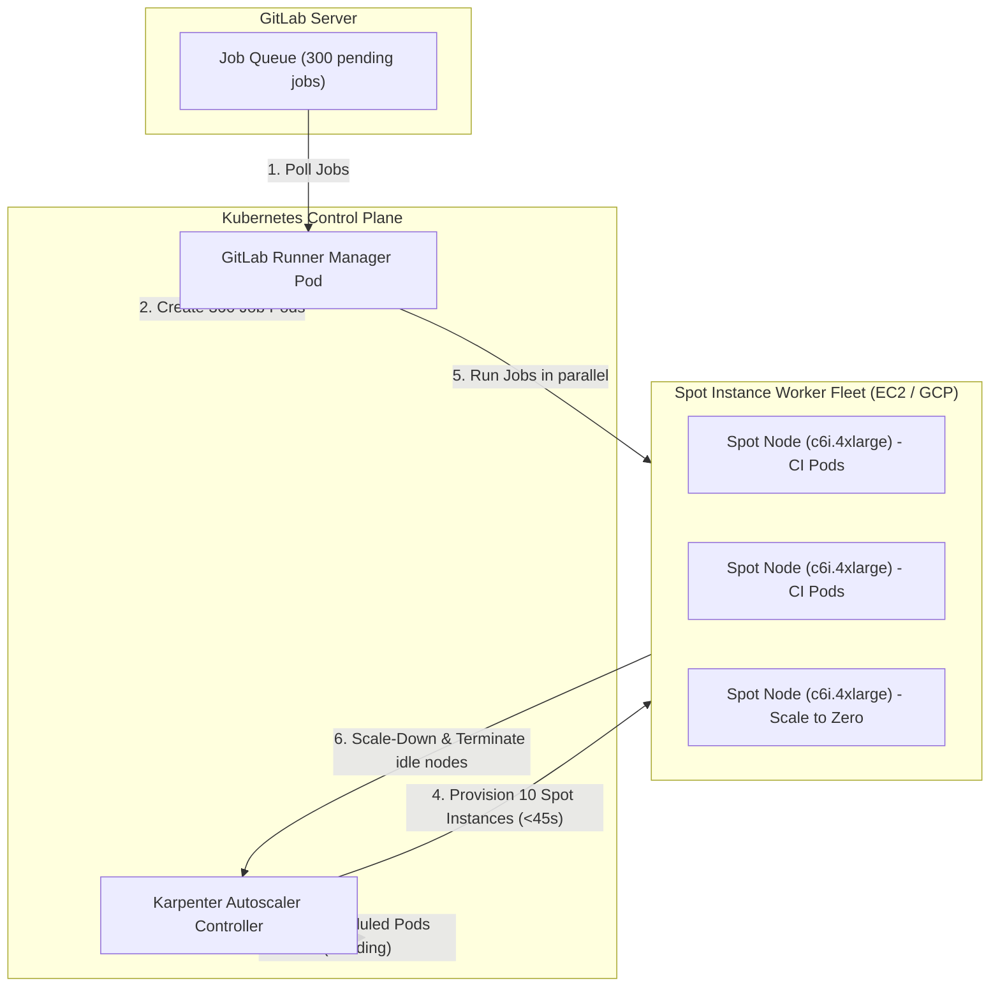

# 🚀 23. Автоскейлинг раннеров: Kubernetes Runner Operator, Fleeting и Karpenter

## 📈 Эволюция автоскейлинга CI/CD раннеров

Поддержание сотен постоянно включенных виртуальных машин для CI генерирует огромные затраты при нулевой нагрузке ночью и образует "бутылочное горлышко" в пиковые часы.



---

## 🏗️ Сравнение подходов к автоскейлингу

| Механизм | Архитектура | Скорость масштабирования | Экономия затрат | Надежность |
| :--- | :--- | :--- | :--- | :--- |
| **Docker Machine (Legacy)** | Менеджер создает VM в облаке через устаревший Docker Machine драйвер. | 🔴 Медленно (2-5 мин на VM). | Средняя (много зависших VM при сбоях). | ⚠️ Проект deprecated. |
| **GitLab Fleeting (Next-Gen)** | Интеграция с AWS ASG / GCP Instance Groups / Azure VMSS. | 🟡 Средняя (1-2 мин). | Высокая (scale-to-zero, spot instances). | ✅ Официальный стандарт для VM. |
| **K8s Pod per Job + Karpenter** | Менеджер создает Pod на каждую джобу. Karpenter подбирает Spot ноды с точностью до миллисекунд. | ⚡ **Экстремально быстро (20-40 сек на ноду)**. | 🌟 **Максимальная (до 85% экономии за счет Spot)**. | ✅ Cloud-Native стандарт. |

---

## 📑 Production-манифесты: GitLab Runner + Karpenter

### 1. Конфигурация Karpenter NodePool для CI-нагрузок (Spot Instances)

```yaml
apiVersion: karpenter.sh/v1beta1
kind: NodePool
metadata:
  name: ci-runners-spot
spec:
  template:
    metadata:
      labels:
        workload: ci-jobs
    spec:
      taints:
        - key: ci-workload
          value: "true"
          effect: NoSchedule
      requirements:
        - key: "karpenter.sh/capacity-type"
          operator: In
          values: ["spot"]             # Использовать дешевые Spot-инстанции
        - key: "kubernetes.io/arch"
          operator: In
          values: ["amd64"]
        - key: "karpenter.k8s.aws/instance-category"
          operator: In
          values: ["c", "m", "r"]
        - key: "karpenter.k8s.aws/instance-generation"
          operator: Gt
          values: ["4"]
      nodeClassRef:
        name: ci-node-class
  limits:
    cpu: "1000"                       # Максимальный лимит для пула раннеров
    memory: 2000Gi
  disruption:
    consolidationPolicy: WhenUnderutilized
    expireAfter: 720h
    consolidateAfter: 30s             # Быстрое удаление простаивающих нод
---
apiVersion: karpenter.k8s.aws/v1beta1
kind: EC2NodeClass
metadata:
  name: ci-node-class
spec:
  amiFamily: AL2023
  role: "KarpenterNodeRole-Cluster"
  subnetSelectorTerms:
    - tags:
        karpenter.sh/discovery: "production-eks"
  securityGroupSelectorTerms:
    - tags:
        karpenter.sh/discovery: "production-eks"
  blockDeviceMappings:
    - deviceName: /dev/xvda
      ebs:
        volumeSize: 100Gi             # Быстрый NVMe/EBS для кэша и Docker слоев
        volumeType: gp3
        iops: 3000
        throughput: 125
        deleteOnTermination: true
```

---

### 2. Манифест GitLab Runner Operator (`Runner` CRD)

```yaml
apiVersion: apps.gitlab.com/v1beta2
kind: Runner
metadata:
  name: gitlab-runner-autoscaled
  namespace: gitlab-runners
spec:
  gitlabUrl: https://gitlab.company.com
  token: gitlab-runner-secret
  concurrent: 150                     # Параллельный запуск до 150 задач
  interval: 2
  config: |
    [[runners]]
      executor = "kubernetes"
      [runners.kubernetes]
        namespace = "gitlab-runners"
        privileged = false
        cpu_request = "1"
        cpu_limit = "4"
        memory_request = "2Gi"
        memory_limit = "8Gi"
        node_tolerations = [
          "ci-workload=true:NoSchedule"
        ]
        node_selector = { "workload" = "ci-jobs" }
        [runners.kubernetes.node_selector]
          "workload" = "ci-jobs"
```

---

## 🛠️ CLI шпаргалка: Мониторинг Karpenter и раннеров

```bash
# 1. Просмотр текущего пула и провижининга нод Karpenter
kubectl get nodepools
kubectl get nodeclaims

# 2. Логи Karpenter в реальном времени при наплыве задач
kubectl logs -n karpenter -l app.kubernetes.io/name=karpenter -f | grep -E "discovered capacity|provisioned nodeclaim"

# 3. Метрики автоскейлинга Runner Manager в Prometheus
kubectl exec -it -n gitlab-runners deploy/gitlab-runner-autoscaled -- curl -s http://localhost:9252/metrics | grep gitlab_runner_concurrent

# 4. Симуляция прерывания Spot-инстанции (Spot Interruption Test)
aws ec2-instance-connect send-spot-instance-interruption-notice --instance-id i-0123456789abcdef0
```

---

## 🚨 Break-Fix: Разбор сложных инцидентов автоскейлинга

### Инцидент 1: Утечка Pods в состоянии `Unknown` при отстреле Spot-нод

**Симптом:**
AWS забирает Spot-ноду (2-minute warning), джоба в GitLab падает с ошибкой `runner system failure`, а pod остается висеть в кластере со статусом `Terminating` или `Unknown`.

**Решение:**
1. Установить AWS Node Termination Handler (NTH) или активировать встроенный в Karpenter перехватчик событий `interruptionQueueName` (SQS).
2. Настроить в `.gitlab-ci.yml` автоматический перезапуск при отстреле инфраструктуры:
```yaml
default:
  retry:
    max: 2
    when:
      - runner_system_failure
      - stuck_or_timeout_failure
```

---

### Инцидент 2: Rate Limit к AWS EC2 API (`RequestLimitExceeded`)

**Симптом:**
При резком создании 200 джоб Karpenter не может поднять ноды, в логах `RequestLimitExceeded: Client.RequestLimitExceeded`.

**Решение:**
1. Настроить батчинг запросов и экспоненциальный бэкофф в параметрах Karpenter.
2. Использовать диверсификацию семейств инстанций (указать в `NodePool` не только `c6i`, но и `c6a`, `m6i`, `m6a`, `c5`, `m5`), чтобы Karpenter запрашивал разные пулы емкости EC2.
