# 🔒 24. Управление секретами в GitOps: SOPS, Sealed Secrets и External Secrets Operator (ESO)

## 🔑 Парадокс секретов в GitOps

GitOps требует, чтобы **все** конфигурации хранились в версионируемом Git-репозитории. Однако размещение секретов (пароли, API-ключи, TLS-сертификаты) в открытом виде в Git является критической уязвимостью.

Для безопасного решения этой задачи индустрия выработала два основных архитектурных подхода:
1. **Шифрование файла секрета в Git (In-Git Encryption)**: Секрет зашифрован до коммита и безопасно хранится в Git (Mozilla SOPS, Bitnami Sealed Secrets).
2. **Внешнее хранилище секретов (External Secret Reference)**: В Git хранится только ссылка/манифест, а специальный оператор вытягивает секрет из внешнего защищенного хранилища (External Secrets Operator + HashiCorp Vault / AWS Secrets Manager).

```mermaid
flowchart TD
    subgraph Pattern1["Паттерн 1: In-Git Encryption (Mozilla SOPS)"]
        Dev1["Developer"] -->|"1. sops -e secret.yaml (age/KMS)"| Git1[("Git Repo (Encrypted YAML)")]
        Git1 -->|"2. Pull Encrypted File"| Flux1["Flux / ArgoCD (SOPS Plugin)"]
        Flux1 -->|"3. In-Cluster Decrypt"| K8sSecret1["K8s Secret (Plaintext in RAM)"]
    end

    subgraph Pattern2["Паттерн 2: In-Cluster Sealed Secrets (Bitnami)"]
        Dev2["Developer"] -->|"1. kubeseal (Public Key)"| Git2[("Git Repo (SealedSecret CRD)")]
        Git2 -->|"2. GitOps Sync"| SealedCtrl["Sealed Secrets Controller"]
        SealedCtrl -->|"3. Decrypt with Private Key"| K8sSecret2["K8s Secret (Plaintext in RAM)"]
    end

    subgraph Pattern3["Паттерн 3: External Secrets Operator (ESO + Vault)"]
        Vault[("HashiCorp Vault / AWS Secrets Manager")]
        Git3[("Git Repo (ExternalSecret CRD)")] -->|"1. GitOps Sync"| ESO["External Secrets Controller"]
        ESO -->|"2. Authenticate & Pull"| Vault
        ESO -->|"3. Generate & Rotate"| K8sSecret3["K8s Secret (Plaintext in RAM)"]
    end
```



---

## ⚖️ Сравнительный анализ технологий

| Инструмент | Место хранения секрета | Механизм шифрования | Ротация секретов | Зависимость от внешней инфраструктуры |
| :--- | :--- | :--- | :--- | :--- |
| **Mozilla SOPS** | Внутри Git (зашифрованы только значения полей `data`). | Симметричный ключ + AWS KMS / GCP KMS / Azure KeyVault / `age`. | Ручная перешифровка при коммите. | Минимальная (только Cloud KMS или статический age key). |
| **Bitnami Sealed Secrets** | Внутри Git (целиком зашифрованный payload). | Асимметричный RSA-ключ контроллера (Public Key шифрует, Private расшифровывает). | Автоматическая ротация RSA ключей в кластере. | Нулевая (работает полностью внутри K8s). |
| **External Secrets Operator (ESO)** | Во внешнем хранилище (Vault / AWS / GCP). В Git только ссылки. | Хранилище управляет шифрованием и ACL. | 🌟 **Автоматическая непрерывная ротация по таймеру**. | Требует отдельного развернутого инстанса Vault / Cloud Secret Manager. |

---

## 📄 Production-конфигурации

### 1. Mozilla SOPS с ключом `age` и AWS KMS

Конфигурационный файл `.sops.yaml` в корне Git-репозитория:

```yaml
creation_rules:
  # Правило для продакшн неймспейсов (использует AWS KMS + резервный age ключ)
  - path_regex: clusters/production/.*\.enc\.yaml$
    kms: "arn:aws:kms:eu-central-1:123456789012:key/bc4454b8-prod-key"
    age: "age1ql3z7hjy54pw3hyww5ayyfg7zqgvc7w3j2elw8zmrj2kg5sfn9aqmcac8p"
    encrypted_regex: "^(data|stringData)$" # Метаданные остаются читаемыми для Kustomize!
```

Пример зашифрованного манифеста `database-credentials.enc.yaml`:

```yaml
apiVersion: v1
kind: Secret
metadata:
  name: database-credentials
  namespace: production
type: Opaque
stringData:
  DB_PASSWORD: ENC[AES256_GCM,data:4g0hXy8=,iv:...,tag:...]
sops:
  kms:
    - arn: arn:aws:kms:eu-central-1:123456789012:key/bc4454b8-prod-key
      created_at: "2026-01-15T10:00:00Z"
      enc: ...
  version: 3.9.0
```

---

### 2. External Secrets Operator (ESO) + HashiCorp Vault

#### Шаг A: Настройка подключения `ClusterSecretStore`

```yaml
apiVersion: external-secrets.io/v1beta1
kind: ClusterSecretStore
metadata:
  name: vault-backend
spec:
  provider:
    vault:
      server: "https://vault.infra.company.internal:8200"
      path: "secret"
      version: "v2"
      auth:
        kubernetes:
          mountPath: "kubernetes"
          role: "gitops-reader-role"
          serviceAccountRef:
            name: eso-vault-auth-sa
            namespace: external-secrets
```

#### Шаг B: Декларация секрета `ExternalSecret`

```yaml
apiVersion: external-secrets.io/v1beta1
kind: ExternalSecret
metadata:
  name: payment-service-secrets
  namespace: payments
spec:
  refreshInterval: "1h"               # Автоматическая синхронизация и ротация каждый час
  secretStoreRef:
    name: vault-backend
    kind: ClusterSecretStore
  target:
    name: payment-runtime-secret      # Имя создаваемого native K8s Secret
    creationPolicy: Owner
  data:
    - secretKey: STRIPE_API_KEY
      remoteRef:
        key: production/payments/stripe
        property: api_key
    - secretKey: DB_PASS
      remoteRef:
        key: production/payments/database
        property: password
```

---

## 🛠️ CLI шпаргалка: Работа с секретами

```bash
# 1. Генерация ключа age и шифрование через SOPS
age-keygen -o key.txt
export SOPS_AGE_KEY_FILE=$(pwd)/key.txt

# Шифрование файла на месте (in-place)
sops --encrypt --in-place secret.yaml
# Редактирование зашифрованного файла в реальном времени
sops secret.enc.yaml

# 2. Шифрование секрета через kubeseal (Bitnami)
kubectl create secret generic db-pass --dry-run=client --from-literal=password=SuperSecret123 -o yaml | \
  kubeseal --controller-name=sealed-secrets-controller --controller-namespace=kube-system --format yaml > sealed-secret.yaml

# 3. Инспекция состояния External Secrets Operator
kubectl get externalsecrets -A
kubectl describe externalsecret payment-service-secrets -n payments
```

---

## 🚨 Break-Fix: Разбор аварий управления секретами

### Инцидент 1: Потеря приватного ключа Sealed Secrets при пересоздании кластера

**Симптом:**
При миграции на новый кластер все `SealedSecret` падают с ошибкой `cannot decrypt secret: crypto/rsa: decryption error`.

**Первопричина:**
`SealedSecrets` шифруются уникальным ключом кластера. Если перед уничтожением старого кластера приватный ключ не был забэкаплен, расшифровать манифесты математически невозможно.

**Решение (Предотвращение):**
Всегда бэкапить мастер-ключ Sealed Secrets в безопасное офлайн-хранилище:
```bash
kubectl get secret -n kube-system -l sealedsecrets.bitnami.com/sealed-secrets-key -o yaml > sealed-secrets-master-key.yaml
```

---

### Инцидент 2: ESO выдает `Vault Permission Denied (403)`

**Симптом:**
`ExternalSecret` зависает со статусом `SecretSyncedError: permission denied`.

**Диагностика:**
```bash
kubectl describe externalsecret -n payments payment-service-secrets
```

**Решение:**
1. Проверить Vault Policy, привязанную к Kubernetes Role `gitops-reader-role`.
2. Убедиться, что ServiceAccount токен имеет права `read` по пути `secret/data/production/payments/*`.
