# 🏎️ 25. Оптимизация CI/CD пайплайнов: Скорость, Кэширование и Эффективность

## ⏱️ Инженерия производительности CI/CD

Медленный CI/CD пайплайн (15-40 минут) разрушает цикл обратной связи разработчиков (Feedback Loop), провоцирует образование длинных очередей на раннерах и увеличивает затраты на облачную инфраструктуру.

Цель оптимизации — сократить время прогона пайплайна **до <5 минут** при сохранении 100% надежности проверок.

```mermaid
flowchart TD
    subgraph Bottlenecks["Антипаттерны (25 минут)"]
        SeqBuild["Последовательные джобы"] --> MonolithTest["Монолитный запуск 10,000 тестов"]
        MonolithTest --> NoCacheDocker["Docker build без кэша (скачивание всех слоев)"]
        NoCacheDocker --> StalePipes["Выполнение устаревших коммитов в MR"]
    end

    subgraph Optimized["Оптимизированный пайплайн (3 минуты)"]
        Interrupt["1. Auto-cancel redundant pipelines (interruptible)"] --> DAGExec["2. DAG execution (needs)"]
        DAGExec --> ShardedTests["3. Test Sharding (4 параллельных воркера)"]
        ShardedTests --> BuildKitCache["4. BuildKit Remote Cache (Inline/Registry)"]
        BuildKitCache --> DistArtifacts["5. Fastzip & S3 Dependency Cache"]
    end
```



---

## 🎯 5 Столпов оптимизации пайплайнов

### 1. Автоотмена устаревших сборок (`interruptible`)
Если разработчик отправляет новый коммит в ветку, предыдущий запущенный пайплайн должен немедленно прерываться, освобождая раннеры.

```yaml
# GitLab CI
default:
  interruptible: true

# GitHub Actions
concurrency:
  group: ${{ github.workflow }}-${{ github.ref }}
  cancel-in-progress: true
```

---

### 2. Шардинг и параллелизация тестов (`knapsack pattern`)
Разделение тяжелого набора тестов на несколько параллельных воркеров сокращает время тестирования прямо пропорционально количеству нод.

```yaml
unit-tests-sharded:
  stage: test
  image: node:20-alpine
  parallel: 4                         # Создает 4 параллельные джобы (1/4, 2/4, 3/4, 4/4)
  script:
    - npx jest --shard=${CI_NODE_INDEX}/${CI_NODE_TOTAL} --coverage
```

---

### 3. Оптимизация Docker сборок с BuildKit Remote Cache

Использование BuildKit с экспортом кэша в Container Registry позволяет переиспользовать слои сборки между абсолютно независимыми раннерами.

```bash
docker buildx build \
  --cache-from type=registry,ref=registry.company.com/app:cache \
  --cache-to type=registry,ref=registry.company.com/app:cache,mode=max \
  --tag registry.company.com/app:$CI_COMMIT_SHORT_SHA \
  --push .
```

---

## 📄 Пример оптимизированного `.gitlab-ci.yml` (Ускорение с 22 мин до 2.5 мин)

```yaml
stages:
  - init
  - check
  - build
  - test

default:
  interruptible: true
  retry:
    max: 1
    when: [runner_system_failure]

variables:
  FF_USE_FASTZIP: "true"
  ARTIFACT_COMPRESSION_LEVEL: "fast"
  DOCKER_BUILDKIT: "1"

# Базовый шаблон легковесного кэша
.cache-base: &cache-base
  cache:
    key:
      files: [package-lock.json]
    paths: [.npm/]
    policy: pull

# 1. Быстрая проверка изменений (Lint)
lint:
  stage: check
  image: node:20-alpine
  <<: *cache-base
  script:
    - npm ci --prefer-offline --cache .npm
    - npm run lint

# 2. Параллельная сборка Docker-образа через Kaniko с кэшированием слоев
build:image:
  stage: build
  image:
    name: gcr.io/kaniko-project/executor:v1.23.0-debug
    entrypoint: [""]
  script:
    - /kaniko/executor
        --context "${CI_PROJECT_DIR}"
        --dockerfile "${CI_PROJECT_DIR}/Dockerfile"
        --destination "${CI_REGISTRY_IMAGE}:${CI_COMMIT_SHORT_SHA}"
        --cache=true
        --cache-ttl=168h
        --cache-dir="${CI_PROJECT_DIR}/.kaniko-cache"

# 3. Шардированные тесты, стартующие не дожидаясь сборки докера
tests:
  stage: test
  needs: [lint]                       # DAG зависимость: не ждет stage build!
  image: node:20-alpine
  <<: *cache-base
  parallel: 3
  script:
    - npm ci --prefer-offline --cache .npm
    - npm test -- --shard=${CI_NODE_INDEX}/${CI_NODE_TOTAL}
```

---

## 🛠️ CLI шпаргалка: Аудит длительности и кэша

```bash
# 1. Анализ времени выполнения джоб последнего пайплайна через GitLab API
curl --header "PRIVATE-TOKEN: $GITLAB_TOKEN" \
  "https://gitlab.company.com/api/v4/projects/123/pipelines/5544/jobs" | \
  jq '.[] | {name: .name, duration: .duration, stage: .stage, status: .status}' | \
  sort -k2 -n

# 2. Инспекция размера Docker-образа и слоев через dive
dive registry.company.com/app:v1.2.0

# 3. Очистка кэша сборщика Buildx на раннере
docker buildx prune --all --force
```

---

## 🚨 Break-Fix: Разбор падения эффективности

### Инцидент 1: Сброс Docker кэша на каждом коммите (Cache Busting)

**Симптом:**
`docker build` выполняется с нуля 10 минут, хотя исходный код почти не менялся.

**Первопричина:**
В `Dockerfile` строка `COPY . .` или динамический аргумент (например `ARG BUILD_DATE=$(date)`) находится **перед** `RUN npm install` или `RUN go mod download`. Изменение любого файла сбрасывает кэш для всех последующих директив.

**Решение:**
Перенести копирование lock-файлов и установку зависимостей наверх:
```dockerfile
# ПРАВИЛЬНО:
COPY package.json package-lock.json ./
RUN npm ci
COPY . .
RUN npm run build
```
