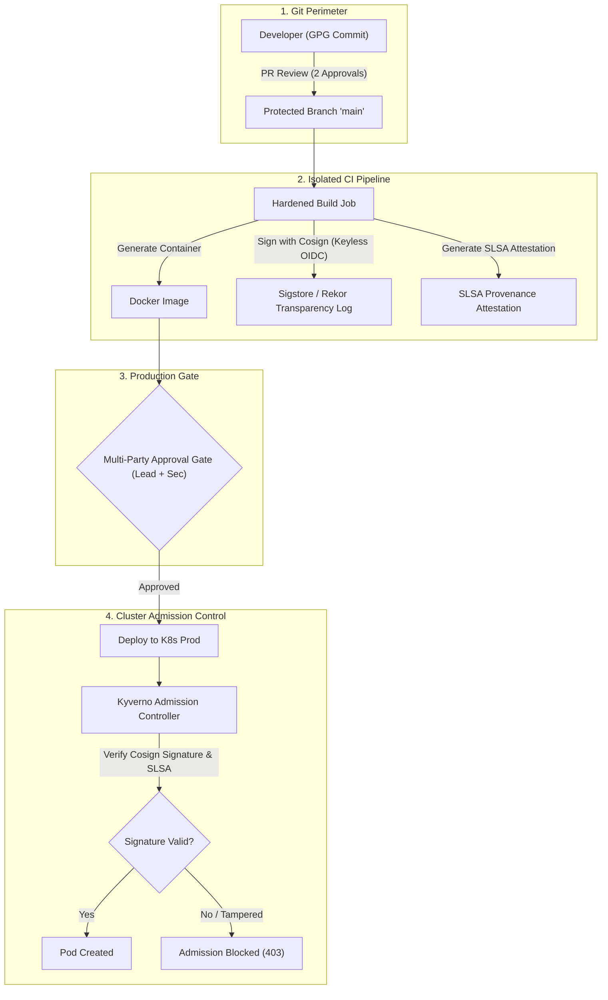

# 🛡️ 26. Защита окружений, Separation of Duties и верификация цепочки поставок (SLSA / Cosign)

## 🔐 Концепция Supply Chain Security и Separation of Duties

В зрелой корпоративной инфраструктуре прямой деплой непроверенного кода в Production категорически недопустим. Требуется непрерывная цепочка доверия (**Chain of Trust**), соответствующая стандарту **SLSA (Supply-chain Levels for Software Artifacts)**:

1. **Защита исходного кода**: Подписанные коммиты (GPG/SSH), Protected Branches, обязательный Code Review (правило 4 глаз).
2. **Изоляция окружений**: Разделение прав доступа (Separation of Duties). Разработчик не может самостоятельно заапрувить собственный релиз в прод.
3. **Криптографическая подпись артефактов**: Подпись собранных Docker-образов через **Sigstore Cosign** с использованием OIDC токенов CI.
4. **Admission Control в кластере**: Запрет запуска неподписанных образов на уровне K8s контроллера (Kyverno / OPA Gatekeeper).



---

## 📑 Production-конфигурация: Подпись образов через Cosign в CI

```yaml
sign_and_attest:
  stage: release
  image:
    name: bitnami/cosign:2.4.0
    entrypoint: [""]
  variables:
    COSIGN_YES: "true"                # Неинтерактивный режим
  id_tokens:
    SIGSTORE_ID_TOKEN:                # OIDC токен GitLab для Keyless подписи
      aud: sigstore
  script:
    - echo "Signing container image with Sigstore Keyless..."
    - cosign sign ${CI_REGISTRY_IMAGE}:${CI_COMMIT_SHORT_SHA}

    - echo "Attesting SLSA Provenance..."
    - cosign attest --type slsaprovenance \
        --predicate ./provenance.json \
        ${CI_REGISTRY_IMAGE}:${CI_COMMIT_SHORT_SHA}
```

---

## 🛡️ Политика допуска Kyverno: Запрет неподписанных образов

```yaml
apiVersion: kyverno.io/v1
kind: ClusterPolicy
metadata:
  name: enforce-image-signatures
spec:
  validationFailureAction: Enforce   # Блокировать деплой при нарушении
  background: false
  rules:
    - name: verify-signature-company-registry
      match:
        any:
          - resources:
              namespaces:
                - production
                - staging
              kinds:
                - Pod
      verifyImages:
        - imageReferences:
            - "registry.company.com/*"
          attestors:
            - entries:
                - keyless:
                    issuer: "https://gitlab.company.com"
                    subject: "https://gitlab.company.com/infrastructure/*"
```

---

## 🔒 Конфигурация Protected Environments в GitLab

В `Settings -> CI/CD -> Protected Environments`:

```yaml
# Декларативное описание политик доступа окружений
environment_protections:
  name: production
  required_approval_count: 2         # Минимум 2 аппрува
  allowed_to_deploy:
    - role: Maintainer
    - group: "infrastructure-leads"
  allowed_to_approve:
    - group: "security-auditors"
    - group: "qa-release-engineers"
  prevent_self_approval: true        # Автор коммита не имеет права аппрувить свой деплой
```

---

## 🛠️ CLI шпаргалка: Аудит и проверка Cosign

```bash
# 1. Ручная проверка подписи образа через Cosign
cosign verify \
  --certificate-identity-regexp "https://gitlab.company.com/.*" \
  --certificate-oidc-issuer "https://gitlab.company.com" \
  registry.company.com/payments/api:v2.4.0

# 2. Инспекция аттестации SLSA Provenance
cosign verify-attestation \
  --type slsaprovenance \
  --certificate-oidc-issuer "https://gitlab.company.com" \
  registry.company.com/payments/api:v2.4.0 | jq -r .payload | base64 -d | jq .

# 3. Аудит заблокированных попыток деплоя в логах Kyverno
kubectl logs -n kyverno -l app.kubernetes.io/name=kyverno | grep -i "signature verification failed"
```

---

## 🚨 Break-Fix: Разбор инцидентов безопасности

### Инцидент 1: Kyverno блокирует деплой с ошибкой `no valid signatures found`

**Симптом:**
```text
Error from server: admission webhook "validate.kyverno.svc" denied the request: image registry.company.com/app:v1.2.0 failed signature verification
```

**Первопричина:**
1. Истек срок действия OIDC Fulcio сертификата (в Keyless режиме сертификат действителен 10 минут во время сборки).
2. Задержка синхронизации в Rekor Transparency Log.

**Решение:**
1. Проверить Rekor entry по хэшу SHA256:
```bash
rekor-cli search --sha $(crane digest registry.company.com/app:v1.2.0)
```
2. Убедиться, что время на нодах кластера синхронизировано через NTP (рассинхронизация часов нод ломает валидацию x509 сертификатов).
