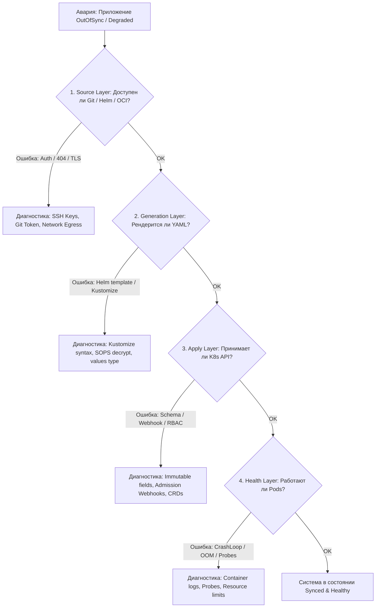

# 🩺 27. Диагностика и устранение аварий в GitOps (ArgoCD & FluxCD)

## 🧭 Методология локализации сбоев в GitOps

Сбой в GitOps-системе может произойти на одном из четырех изолированных слоев абстракции:



---

## 🔬 Топ-5 инцидентов в GitOps и их решения

### 1. Попытка изменения неизменяемого поля (Immutable Field Error)

**Симптом:**
ArgoCD выдает ошибку: `The Deployment/Job "migrate" is invalid: spec.template: Invalid value: field is immutable`.

**Первопричина:**
Объекты Kubernetes типа `Job`, `StatefulSet` (некоторые поля `volumeClaimTemplates`) или `Service` (поле `clusterIP`) запрещают модификацию определенных параметров после создания.

**Решение:**
Включить политику пересоздания ресурса (`Replace=true` или `Force=true`):
```yaml
# В ArgoCD
metadata:
  annotations:
    argocd.argoproj.io/sync-options: Replace=true,Force=true
```
```yaml
# В Flux Kustomization
spec:
  force: true                         # flux пересоздаст ресурс при изменении immutable полей
```

---

### 2. Бесконечная петля рассинхронизации (OutOfSync Loop)

**Симптом:**
Приложение бесконечно переходит из `Synced` в `OutOfSync` каждые 3 секунды.

**Первопричина:**
Кластерный оператор (например, HPA, Vertically Scaled Pods, или Default StorageClass Mutator) перезаписывает поля (`spec.replicas` или дефолтные аннотации), которые описаны в Git с другими значениями.

**Решение:**
Удалить управляемое поле из Git и добавить в `ignoreDifferences`:
```yaml
spec:
  ignoreDifferences:
    - group: apps
      kind: Deployment
      jsonPointers:
        - /spec/replicas              # Позволяет HPA свободно управлять числом реплик
```

---

### 3. Ошибка валидации схемы Kustomize (Missing CRD / OpenAPISchema)

**Симптом:**
```text
kustomize build failed: no matches for kind "MonitoringConfig" in version "monitoring.coreos.com/v1"
```

**Первопричина:**
`kustomize-controller` или `argocd-repo-server` пытается валидировать манифесты против схемы K8s API до того, как CustomResourceDefinition были установлены в кластер.

**Решение:**
1. Разделить установку CRD и самих CR через `dependsOn` (Flux) или `Sync Waves` (ArgoCD Wave `-1` для CRD).
2. В ArgoCD включить `SkipDryRunOnMissingResource`:
```yaml
metadata:
  annotations:
    argocd.argoproj.io/sync-options: SkipDryRunOnMissingResource=true
```

---

### 4. Ошибка авторизации Git (SSH Key / HTTPS Token Expired)

**Симптом:**
```text
fatal: Authentication failed for 'https://github.com/company/infra.git'
```

**Диагностика:**
```bash
# ArgoCD: проверка подключенных репозиториев
argocd repo list

# Flux: проверка статуса GitRepository
flux get sources git
kubectl describe gitrepository fleet-infra -n flux-system
```

**Решение:**
Обновить Secret с Deploy Key или Personal Access Token (PAT):
```bash
kubectl create secret generic git-credentials -n flux-system \
  --from-literal=username=git \
  --from-literal=password=$NEW_GITHUB_TOKEN \
  --dry-run=client -o yaml | kubectl apply -f -
```

---

### 5. Превышение таймаута генерации манифестов (Repo Server Timeout)

**Симптом:**
```text
rpc error: code = DeadlineExceeded desc = context deadline exceeded (Client.Timeout exceeded while awaiting headers)
```

**Решение:**
Увеличить глобальный таймаут рендеринга в `argocd-cm`:
```yaml
data:
  exec.timeout: "180s"                # Увеличение таймаута до 3 минут
```

---

## 🛠️ Сводная диагностическая таблица команд

| Сценарий | Команда ArgoCD | Команда FluxCD |
| :--- | :--- | :--- |
| **Просмотр детального лога ошибки** | `argocd app get <app> --show-operation` | `flux logs --kind=Kustomization --name=<name>` |
| **Проверка различий (Diff)** | `argocd app diff <app>` | `flux diff kustomization <name>` |
| **Сброс зависшей операции** | `argocd app terminate-op <app>` | `kubectl rollout restart deploy/kustomize-controller -n flux-system` |
| **Принудительный опрос Git** | `argocd app get <app> --hard-refresh` | `flux reconcile source git <name>` |
| **Экспорт дерева манифестов** | `argocd app manifests <app>` | `flux build kustomization <name> --path ./` |
