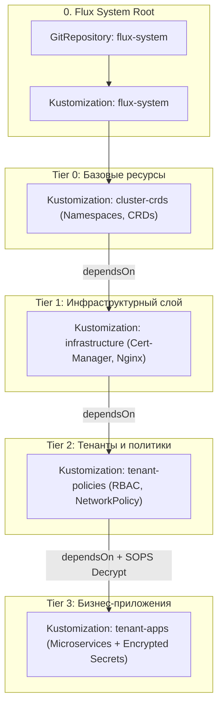

# 🧪 28. Лабораторная работа: Бутстрап Multi-Tenant кластера с FluxCD, Kustomization DAG и SOPS

## 🎯 Цель лабораторной работы

Развернуть с нуля полностью автоматизированный multi-tenant кластер Kubernetes под управлением **FluxCD v2** со следующей архитектурой:
1. **Иерархический DAG зависимостей (Kustomization DAG)**: CRD $\rightarrow$ Инфраструктура $\rightarrow$ Тенанты $\rightarrow$ Приложения.
2. **Сквозное шифрование секретов**: Использование **Mozilla SOPS** с алгоритмом **age**.
3. **Изоляция арендаторов (Multi-Tenancy)**: Автоматическое выделение неймспейсов и ServiceAccount с ограниченным RBAC.



---

## 🛠️ Пошаговое руководство выполнения

### Шаг 1: Генерация ключей шифрования `age` и секретов в кластере

```bash
# 1. Генерация пары ключей age
age-keygen -o age.agekey

# 2. Извлечение публичного ключа
export SOPS_AGE_PUBKEY=$(grep 'public key:' age.agekey | awk '{print $NF}')
echo "Public Key: $SOPS_AGE_PUBKEY"

# 3. Создание неймспейса flux-system и загрузка приватного ключа в секрет
kubectl create namespace flux-system --dry-run=client -o yaml | kubectl apply -f -

kubectl create secret generic sops-age \
  --namespace=flux-system \
  --from-file=age.agekey=age.agekey
```

---

### Шаг 2: Бутстрап FluxCD в репозиторий GitHub / GitLab

```bash
# Экспорт персонального токена с правами repo/write
export GITHUB_TOKEN="ghp_xxxxxxxxxxxxxxxxxxxx"
export GITHUB_USER="company-admin"

# Запуск бутстрапа Flux
flux bootstrap github \
  --owner=$GITHUB_USER \
  --repository=gitops-fleet-production \
  --branch=main \
  --path=./clusters/production \
  --personal
```

---

### Шаг 3: Создание структуры репозитория и `.sops.yaml`

Клонируйте репозиторий и создайте дерево каталогов:

```bash
git clone https://github.com/$GITHUB_USER/gitops-fleet-production.git
cd gitops-fleet-production

mkdir -p clusters/production/base-crds
mkdir -p clusters/production/infrastructure
mkdir -p clusters/production/tenants
mkdir -p clusters/production/apps/payments
```

Создайте файл `.sops.yaml` в корне репозитория:

```yaml
creation_rules:
  - path_regex: .*/apps/.*\.enc\.yaml$
    age: "age1ql3z7hjy54pw3hyww5ayyfg7zqgvc7w3j2elw8zmrj2kg5sfn9aqmcac8p"
    encrypted_regex: "^(data|stringData)$"
```

---

### Шаг 4: Декларация Kustomization DAG

Создайте файл `clusters/production/flux-dag.yaml`:

```yaml
apiVersion: kustomize.toolkit.fluxcd.io/v1
kind: Kustomization
metadata:
  name: tier0-crds
  namespace: flux-system
spec:
  interval: 10m
  prune: true
  sourceRef:
    kind: GitRepository
    name: flux-system
  path: ./clusters/production/base-crds
---
apiVersion: kustomize.toolkit.fluxcd.io/v1
kind: Kustomization
metadata:
  name: tier1-infrastructure
  namespace: flux-system
spec:
  interval: 10m
  prune: true
  sourceRef:
    kind: GitRepository
    name: flux-system
  path: ./clusters/production/infrastructure
  dependsOn:
    - name: tier0-crds
---
apiVersion: kustomize.toolkit.fluxcd.io/v1
kind: Kustomization
metadata:
  name: tier2-tenants
  namespace: flux-system
spec:
  interval: 10m
  prune: true
  sourceRef:
    kind: GitRepository
    name: flux-system
  path: ./clusters/production/tenants
  dependsOn:
    - name: tier1-infrastructure
---
apiVersion: kustomize.toolkit.fluxcd.io/v1
kind: Kustomization
metadata:
  name: tier3-apps
  namespace: flux-system
spec:
  interval: 5m
  prune: true
  wait: true
  sourceRef:
    kind: GitRepository
    name: flux-system
  path: ./clusters/production/apps
  dependsOn:
    - name: tier2-tenants
  decryption:
    provider: sops
    secretRef:
      name: sops-age
```

---

### Шаг 5: Создание зашифрованного секрета приложения через SOPS

Создайте открытый манифест `clusters/production/apps/payments/secret.yaml`:

```yaml
apiVersion: v1
kind: Secret
metadata:
  name: payment-credentials
  namespace: payments
type: Opaque
stringData:
  DB_PASSWORD: "SuperSecureProductionPassword2026!"
  API_KEY: "live_pk_998877665544332211"
```

Зашифруйте файл:

```bash
sops --encrypt --in-place clusters/production/apps/payments/secret.yaml
mv clusters/production/apps/payments/secret.yaml clusters/production/apps/payments/secret.enc.yaml
```

Отправьте изменения в Git:

```bash
git add .
git commit -m "feat: complete multi-tenant flux DAG setup with encrypted secrets"
git push origin main
```

---

## 🔍 Валидация и проверка результатов

```bash
# 1. Принудительный опрос и просмотр статуса графа DAG
flux reconcile source git flux-system
flux get kustomizations

# 2. Проверка успешной расшифровки секрета в кластере
kubectl get secret payment-credentials -n payments -o jsonpath='{.data.DB_PASSWORD}' | base64 -d
# Вывод: SuperSecureProductionPassword2026!

# 3. Проверка дерева ресурсов
flux tree kustomization flux-system
```
