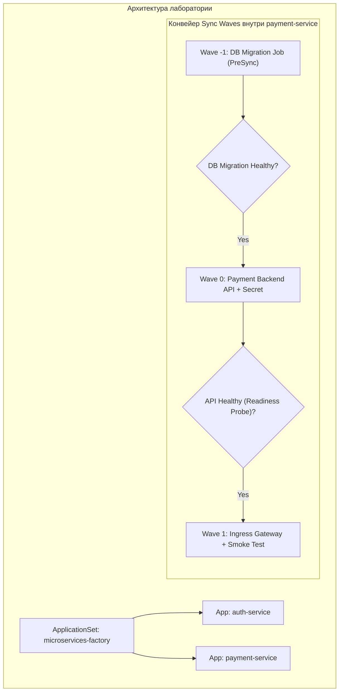

# 🧪 29. Лабораторная работа: Развертывание ArgoCD, ApplicationSet, Sync Waves и Lua Health Checks

## 🎯 Цель лабораторной работы

Построить полноценный GitOps-пайплайн на базе **ArgoCD**:
1. Развернуть и защитить инстанс ArgoCD.
2. Создать изолированный `AppProject` с ограничениями неймспейсов.
3. Развернуть микросервисы через **ApplicationSet Git Directory Generator**.
4. Настроить поэтапную синхронизацию через **Sync Waves** (Миграция БД $\rightarrow$ Бэкенд $\rightarrow$ Фронтенд).
5. Написать и протестировать кастомный **Lua Health Check** для стороннего CRD.



---

## 🛠️ Пошаговое руководство выполнения

### Шаг 1: Установка ArgoCD и настройка доступа

```bash
# 1. Создание неймспейса и установка официального манифеста
kubectl create namespace argocd
kubectl apply -n argocd -f https://raw.githubusercontent.com/argoproj/argo-cd/stable/manifests/install.yaml

# 2. Ожидание готовности подов
kubectl wait --for=condition=ready pod --all -n argocd --timeout=300s

# 3. Получение пароля администратора по умолчанию
export ARGO_ADMIN_PASSWORD=$(kubectl -n argocd get secret argocd-initial-admin-secret -o jsonpath="{.data.password}" | base64 -d)
echo "Admin Password: $ARGO_ADMIN_PASSWORD"

# 4. Проброс порта для доступа к Web UI / CLI
kubectl port-forward svc/argocd-server -n argocd 8080:443 &

# 5. Вход через CLI
argocd login localhost:8080 --username admin --password $ARGO_ADMIN_PASSWORD --insecure
```

---

### Шаг 2: Создание защищенного `AppProject`

Создайте манифест `project-ecommerce.yaml`:

```yaml
apiVersion: argoproj.io/v1alpha1
kind: AppProject
metadata:
  name: ecommerce-core
  namespace: argocd
spec:
  description: "E-Commerce Microservices Domain"
  sourceRepos:
    - "https://github.com/argoproj/argocd-example-apps.git"
    - "https://github.com/company/ecommerce-fleet.git"
  destinations:
    - server: https://kubernetes.default.svc
      namespace: "ecom-*"
  clusterResourceBlacklist:
    - group: "*"
      kind: "*"
  namespaceResourceWhitelist:
    - group: "apps"
      kind: "Deployment"
    - group: "batch"
      kind: "Job"
    - group: ""
      kind: "Service"
    - group: ""
      kind: "ConfigMap"
    - group: ""
      kind: "Secret"
```

Примените манифест:
```bash
kubectl apply -f project-ecommerce.yaml
```

---

### Шаг 3: Автоматизация деплоя через ApplicationSet

Создайте манифест `appset-microservices.yaml`:

```yaml
apiVersion: argoproj.io/v1alpha1
kind: ApplicationSet
metadata:
  name: ecom-microservices
  namespace: argocd
spec:
  generators:
    - list:
        elements:
          - service: "payments"
            namespace: "ecom-payments"
            replicas: "2"
          - service: "catalog"
            namespace: "ecom-catalog"
            replicas: "3"
  template:
    metadata:
      name: 'ecom-{{service}}'
    spec:
      project: ecommerce-core
      source:
        repoURL: https://github.com/argoproj/argocd-example-apps.git
        targetRevision: HEAD
        path: guestbook
      destination:
        server: https://kubernetes.default.svc
        namespace: '{{namespace}}'
      syncPolicy:
        automated:
          prune: true
          selfHeal: true
        syncOptions:
          - CreateNamespace=true
```

Примените ApplicationSet:
```bash
kubectl apply -f appset-microservices.yaml
```

---

### Шаг 4: Настройка Sync Waves и PreSync Hook

Создайте манифест с упорядоченными волнами `payment-stack.yaml`:

```yaml
# 1. Волна -1: Миграция БД (Запускается первой)
apiVersion: batch/v1
kind: Job
metadata:
  name: db-schema-migration
  namespace: ecom-payments
  annotations:
    argocd.argoproj.io/hook: PreSync
    argocd.argoproj.io/sync-wave: "-1"
spec:
  template:
    spec:
      restartPolicy: Never
      containers:
        - name: migrate
          image: busybox
          command: ["sh", "-c", "echo 'Migrating DB schema...'; sleep 5; echo 'Done!'"]
---
# 2. Волна 0: Основной микросервис API
apiVersion: apps/v1
kind: Deployment
metadata:
  name: payment-api
  namespace: ecom-payments
  annotations:
    argocd.argoproj.io/sync-wave: "0"
spec:
  replicas: 2
  selector:
    matchLabels:
      app: payment-api
  template:
    metadata:
      labels:
        app: payment-api
    spec:
      containers:
        - name: server
          image: nginx:alpine
          ports:
            - containerPort: 80
          readinessProbe:
            httpGet:
              path: /
              port: 80
            initialDelaySeconds: 2
```

---

### Шаг 5: Добавление кастомного Lua Health Check

Добавьте проверку для Custom Resource в `argocd-cm`:

```bash
kubectl patch configmap argocd-cm -n argocd --type merge -p '{
  "data": {
    "resource.customizations.health.batch_Job": "hs = {}\nif obj.status ~= nil then\n  if obj.status.succeeded ~= nil and obj.status.succeeded > 0 then\n    hs.status = \"Healthy\"\n    return hs\n  end\n  if obj.status.failed ~= nil and obj.status.failed > 0 then\n    hs.status = \"Degraded\"\n    return hs\n  end\nend\nhs.status = \"Progressing\"\nreturn hs"
  }
}'
```

---

## 🔍 Валидация и проверка результатов

```bash
# 1. Просмотр созданных через ApplicationSet приложений
argocd app list

# 2. Проверка состояния синхронизации и волн
argocd app get ecom-payments

# 3. Запуск ручной синхронизации с отображением фаз
argocd app sync ecom-payments --show-operation

# 4. Проверка созданных подов в изолированных неймспейсах
kubectl get pods -n ecom-payments
kubectl get pods -n ecom-catalog
```
