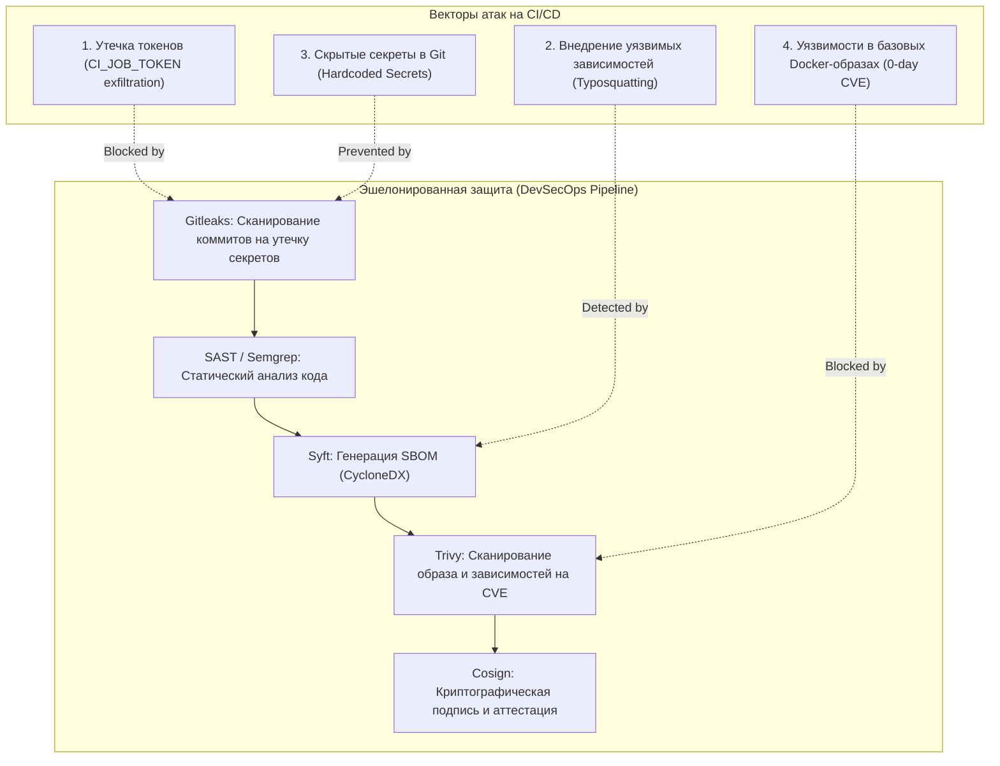

# 🛡️ 30. Харденинг CI/CD и безопасность цепочки поставок: SBOM (Syft), Trivy и защита токенов

## ⚔️ Модель угроз CI/CD пайплайнов

CI/CD инфраструктура является одной из самых привлекательных целей для злоумышленников (инциденты SolarWinds, Codecov). Получив доступ к пайплайну, атакующий может внедрить бэкдор в продакшн артефакт, похитить секреты доступа к облаку или использовать раннеры для скрытого майнинга.



---

## 🔒 4 Столпа безопасности CI/CD

| Направление | Инструмент | Роль в пайплайне |
| :--- | :--- | :--- |
| **Поиск секретов (Secret Scanning)** | **Gitleaks / TruffleHog** | Блокирует пайплайн, если разработчик случайно закомитил токен, SSH-ключ или пароль. |
| **Генерация SBOM (Software Bill of Materials)** | **Syft (Anchore)** | Создает полный инвентарный список всех библиотек, пакетов и ОС-зависимостей в формате CycloneDX / SPDX. |
| **Сканирование уязвимостей (Vulnerability Scanning)** | **Trivy (Aqua Security)** | Анализирует SBOM и Docker-образ, блокирует билд при наличии `CRITICAL` / `HIGH` CVE. |
| **Защита токенов и раннеров (Token Hardening)** | **Least Privilege CI Tokens** | Ограничение области действия `CI_JOB_TOKEN`, использование эфемерных OIDC токенов вместо постоянных паролей. |

---

## 📑 Production `.gitlab-ci.yml` со встроенным контуром безопасности

```yaml
stages:
  - secret-scan
  - build
  - security-audit
  - release

variables:
  DOCKER_IMAGE: "$CI_REGISTRY_IMAGE:$CI_COMMIT_SHORT_SHA"
  TRIVY_NO_PROGRESS: "true"
  TRIVY_CACHE_DIR: ".trivycache/"

# 1. Сканирование коммитов на утечку паролей и API-ключей
gitleaks-scan:
  stage: secret-scan
  image:
    name: zricethezav/gitleaks:v8.18.4
    entrypoint: [""]
  script:
    - gitleaks detect --source="${CI_PROJECT_DIR}" --verbose --redact

# 2. Сборка контейнера через изолированный Kaniko
build-image:
  stage: build
  image:
    name: gcr.io/kaniko-project/executor:v1.23.0-debug
    entrypoint: [""]
  script:
    - /kaniko/executor
        --context "${CI_PROJECT_DIR}"
        --dockerfile "${CI_PROJECT_DIR}/Dockerfile"
        --destination "${DOCKER_IMAGE}"

# 3. Генерация SBOM спецификации через Syft
generate-sbom:
  stage: security-audit
  image:
    name: anchore/syft:v1.10.0
    entrypoint: [""]
  script:
    - syft "${DOCKER_IMAGE}" -o cyclonedx-json=sbom.cdx.json
  artifacts:
    name: "sbom-${CI_COMMIT_SHORT_SHA}"
    paths:
      - sbom.cdx.json
    reports:
      cyclonedx: sbom.cdx.json

# 4. Проверка на уязвимости через Trivy (Блокировка при CRITICAL)
trivy-vulnerability-scan:
  stage: security-audit
  needs: [generate-sbom]
  image:
    name: aquasec/trivy:0.53.0
    entrypoint: [""]
  cache:
    key: trivy-db-cache
    paths: [.trivycache/]
  script:
    # Сканирование с генерацией отчета в формате GitLab Security Dashboard
    - trivy image --cache-dir .trivycache/ --format template --template "@/contrib/gitlab.tpl" --output gl-container-scanning-report.json "${DOCKER_IMAGE}"
    # Жесткий гейт: падение джобы при наличии исправляемых критических уязвимостей
    - trivy image --cache-dir .trivycache/ --exit-code 1 --severity CRITICAL --ignore-unfixed "${DOCKER_IMAGE}"
  artifacts:
    reports:
      container_scanning: gl-container-scanning-report.json
```

---

## 🛡️ Защита от эксфильтрации токенов (Token Hardening)

### Ограничение `CI_JOB_TOKEN` в GitLab
По умолчанию токен джобы может опрашивать другие проекты группы. В настройках каждого проекта необходимо включить:
`Settings -> CI/CD -> Token Access -> Limit access to this project`.

### Запрет вывода секретов в логи сборки
```yaml
# Никогда не использовать echo $SECRET_VAR или env/set без фильтрации!
sanitize_debug:
  script:
    - set +x                          # Отключить печать выполняемых команд в лог
    - ./deploy-script.sh > /dev/null  # Перенаправлять чувствительный вывод
```

---

## 🛠️ CLI шпаргалка: Локальный аудит безопасности

```bash
# 1. Сканирование локальной директории на секреты
gitleaks detect --source . --verbose

# 2. Генерация SBOM из локального образа
syft docker:my-app:latest -o table
syft docker:my-app:latest -o cyclonedx-json > sbom.json

# 3. Сканирование сгенерированного SBOM на известные CVE
trivy sbom sbom.json --severity HIGH,CRITICAL

# 4. Сканирование Dockerfile на мисконфигурации безопасности (Root user, exposed ports)
trivy config Dockerfile
```

---

## 🚨 Break-Fix: Разбор частых проблем DevSecOps

### Инцидент 1: Trivy падает по таймауту при скачивании базы уязвимостей (DB Rate Limit)

**Симптом:**
```text
FATAL: init error: DB error: failed to download vulnerability DB: GET https://ghcr.io/v2/aquasecurity/trivy-db/manifests/2: TOOMANYREQUESTS
```

**Решение:**
1. Настроить кэширование каталога `.trivycache/` в GitLab CI (см. манифест выше).
2. Поднять внутреннее зеркало базы Trivy в Harbor или локальном Registry:
```bash
trivy image --db-repository registry.company.internal/security/trivy-db:2 my-app:latest
```

---

### Инцидент 2: Ложноположительное срабатывание (False Positive) блокирует релиз

**Симптом:**
Trivy находит `CRITICAL` уязвимость в тестовой утилите, которая не используется в production рантайме.

**Решение:**
Создать файл `.trivyignore` в корне проекта с указанием CVE, обоснования и срока действия:
```text
# .trivyignore
# Уязвимость в тестовом пакете, не попадает в runtime сборку. Тикет: SEC-1422
CVE-2026-12345
```
