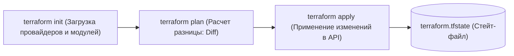
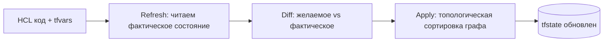

# 🏗️ 01. Основы Terraform/OpenTofu, HCL и Провайдеры

## ⚙️ Рабочий цикл (Terraform Lifecycle)

Terraform / OpenTofu реализует подход Infrastructure as Code (IaC), преобразуя декларативные HCL файлы в реальные вызовы облачных API.



---

## 📝 Синтаксис HCL и структура проекта

Типовая структура модуля:
```text
terraform-module/
├── versions.tf     # Версии Terraform и провайдеров
├── variables.tf    # Входные переменные
├── main.tf         # Основные ресурсы
├── outputs.tf      # Выходные данные
└── terraform.tfvars # Фактические значения переменных (не коммитится, если есть секреты)
```

### 1. `versions.tf`
```hcl
terraform {
  required_version = ">= 1.6.0"
  required_providers {
    aws = {
      source  = "hashicorp/aws"
      version = "~> 5.30"
    }
  }
}

provider "aws" {
  region = var.aws_region
  default_tags {
    tags = {
      Environment = var.environment
      ManagedBy   = "Terraform"
    }
  }
}
```

### 2. `main.tf` (Ресурсы, Data Sources и Meta-arguments)
```hcl
# Получение актуального ID базового образа AMI
data "aws_ami" "ubuntu" {
  most_recent = true
  filter {
    name   = "name"
    values = ["ubuntu/images/hvm-ssd/ubuntu-jammy-22.04-amd64-server-*"]
  }
  owners = ["099720109477"] # Canonical
}

# Локальные вычисляемые переменные
locals {
  name_prefix = "${var.project_name}-${var.environment}"
}

# Создание инстансов с помощью for_each
resource "aws_instance" "web_nodes" {
  for_each = var.node_configurations

  ami           = data.aws_ami.ubuntu.id
  instance_type = each.value.instance_type
  subnet_id     = var.subnet_id

  tags = {
    Name = "${locals.name_prefix}-${each.key}"
    Role = each.value.role
  }

  lifecycle {
    create_before_destroy = true # Создать новый сервер до удаления старого
    ignore_changes = [
      tags["LastUpdated"] # Игнорировать сторонние изменения определенных тегов
    ]
  }
}
```

---

## ⚡ Terraform CLI Cheat Sheet

```bash
# Форматирование и валидация кода
terraform fmt -recursive
terraform validate

# Генерация плана с сохранением в бинарный файл
terraform plan -out=tfplan.binary

# Применение строго того плана, который был сгенерирован
terraform apply tfplan.binary

# Точечный таргетинг (применить только один конкретный ресурс)
terraform apply -target=aws_instance.web_nodes["worker-1"]

# Просмотр графа зависимостей
terraform graph | dot -Tpng > graph.png
```

---

## 🔬 Deep Dive: жизненный цикл плана и граф зависимостей



- `plan` уже делает refresh: если кто-то руками поменял ресурс — вы увидите дрейф ДО apply.
- Параллелизм: `-parallelism=10`; зависимости берутся из ссылок `resource.attr` (неявные), либо `depends_on` (явные).

### Функции и выражения, которые решают 80% задач

```hcl
# for_each против count: count ломает индексы при удалении элемента
resource "aws_subnet" "this" {
  for_each = toset(var.azs)
  availability_zone = each.value
}

# conditional + coalescelist для дефолтов
cidr = try(var.cidr_overrides[name], cidrsubnet(var.vpc_cidr, 4, idx))

# dynamic блоки внутри ресурсов
dynamic "ingress" {
  for_each = var.rules
  content {
    from_port = ingress.value.from_port
    to_port   = ingress.value.to_port
  }
}
```

### Работа с дрейфом и импортом (TF ≥ 1.5)

```bash
terraform plan -refresh-only              # показать только дрейф
terraform import 'aws_instance.web[0]' i-0abc123   # импорт без кода
# или декларативно:
echo 'import { to = aws_instance.web  id = "i-0abc123" }' >> import.tf && terraform plan -generate-config-out=generated.tf
```

---

<!-- enriched:v1 -->

## 🧨 Типовые грабли Production (Terraform — только эта тема)

| Симптом | Причина | Быстрое решение |
| :--- | :--- | :--- |
| `terraform apply` висит `Acquiring state lock` | Умерший CI держит DynamoDB lock | `terraform force-unlock <ID>` после `aws dynamodb get-item` проверки что владелец мёртв |
| `Error: Inconsistent dependency lock file` | `hashicorp/aws v5.80` vs `~> 5.0` без `terraform init -upgrade` | `terraform init -upgrade` + коммит `terraform.lock.hcl` |
| `plan` показывает 10 ресурсов на `update in-place` | `ignore_changes` не указан | `lifecycle { ignore_changes = [tags] }` для дрейфующих полей |
| `drift` после ручной правки в консоли | Правка мимо Git | `terraform plan -detailed-exitcode`, `terraform apply -refresh-only` |

!!! warning «Идемпотентность — закон»
    Любой скрипт/плейбук/модуль должен быть безопасно перезапускаемым. Если второй прогон меняет состояние — это баг, который однажды уронит прод.

## 🧪 Hands-on Lab (30 минут): полный цикл на бесплатных провайдерах

!!! abstract "Формат"
    **Стенд:** только локальный файловый backend — облако не нужно. **Легенда:** создаём, изменяем, импортируем и уничтожаем ресурс так, как это будет выглядеть в облаке.

### Шаг 1. Проект с двумя ресурсами и зависимостью

```bash
mkdir tf-lab && cd tf-lab && cat > main.tf <<'EOF'
resource "local_file" "config" {
  filename = "app.conf"
  content  = "host=${random_pet.name.id}\nenv=demo\n"
}
resource "random_pet" "name" { prefix = "web" }
EOF

terraform init && terraform plan     # +2 to add — читаем план ДО apply
terraform apply -auto-approve && cat app.conf
```

**Ожидаемый вывод:** `Plan: 2 to add`, после apply — файл с именем `web-<pet>`.

??? question "В каком порядке создались ресурсы и почему Terraform знает порядок?"
    Сначала `random_pet` (нет зависимостей), потом `local_file` — неявная зависимость через ссылку `random_pet.name.id`. Граф: `terraform graph | dot -Tpng > g.png`.

### Шаг 2. Изменение и чтение диффа

```bash
sed -i 's/env=demo/env=prod/' main.tf
terraform plan    # ~1 to change: content меняется
```

**Ожидаемый вывод:** план показывает ровно одно поле. Умение читать `-/+/~` в плане — навык №1.

### Шаг 3. Импорт существующего (TF ≥ 1.5)

```bash
echo 'manual' > legacy.txt && cat >> main.tf <<'EOF'
resource "local_file" "legacy" {
  filename = "legacy.txt"
  content  = "manual"
}
EOF
cat > import.tf <<'EOF'
import {
  to = local_file.legacy
  id = "legacy.txt"
}
EOF
terraform plan -generate-config-out=generated.tf   # HCL сгенерирован!
terraform apply && terraform plan                  # no changes — импорт успешен
```

### Шаг 4. Уничтожение и state-гигиена

```bash
terraform destroy && ls                    # файлов нет, стейт пуст
terraform state list                       # []
rm import.tf generated.tf
# Проверь себя командой: terraform show → empty state
```

### Шаг 5. Проверь себя (ответы вслух до раскрытия)

1. Чем plan опасен «на глаз»? Что покажет `-detailed-exitcode`?
2. Почему `count` ломает индексы при удалении элемента списка?
3. Кто выигрывает, если кто-то руками изменил файл: код или реальность?

<details><summary>Ответы</summary>

1. План читают построчно: каждый `-`/`+` — потенциальный инцидент. `-detailed-exitcode`: 0=нет изменений, 1=ошибка, 2=есть diff — база для CI-автоматизации.
2. count использует индекс: удаление элемента сдвигает индексы всех последующих → пересоздание. for_each хранит по ключу.
3. Реальность до apply: refresh покажет дрейф в плане; после apply — код перепишет ручные правки.
</details>

## ✅ Чек-лист зрелости темы

- [ ] Все изменения проходят через PR с обязательным review

    ??? tip "Как закрыть пункт"
        Branch protection + Atlantis/TFC plan на каждый MR. Никаких apply из ноутбука против shared-стейта — даже «срочных». Проверка: история apply'ев соответствует истории мержей.

- [ ] Секреты никогда не хранятся в коде/стейте (Vault/SOPS/secret manager)

    ??? tip "Как закрыть пункт"
        Провайдер берёт креды из Vault OIDC/env; чувствительные outputs — sensitive=true; бэкенд зашифрован. Аудит: gitleaks по репозиторию + проверка, что стейт недоступен широкой группе.

- [ ] Есть dry-run/plan этап и он виден в MR

    ??? tip "Как закрыть пункт"
        План публикуется комментарием/джобой прямо в MR, ревьюер видит diff инфраструктуры до approve. Артефакт плана используется для apply (не пересчитывается).

- [ ] Откат воспроизводим одной командой (< 10 минут)

    ??? tip "Как закрыть пункт"
        Git revert MR + pipeline apply = откат. Проверено учением: таймер от решения до восстановления сервиса. Если откат требует ручных шагов — runbook их фиксирует.

- [ ] Логи пайплайна содержат версии артефактов (image digest, commit SHA)

    ??? tip "Как закрыть пункт"
        В apply-джобе echo: TF версия, версии провайдеров, commit SHA, plan hash. Это связывает «что в проде» с «какой код» при разборе инцидентов.

---

## 🧭 Что дальше

| Шаг | Материал |
| :--- | :--- |
| 🔬 Закрепить | [Lab 05: Terraform без облака](../16-guided-labs/05-lab-terraform-localstack.md) |
| 💪 Практика | [Задачи по Terraform](../15-hands-on-practice/02-100-devops-practical-tasks-part2.md) |
