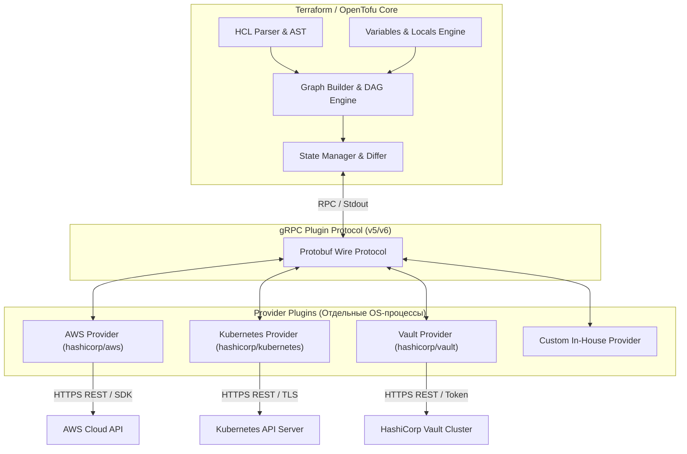
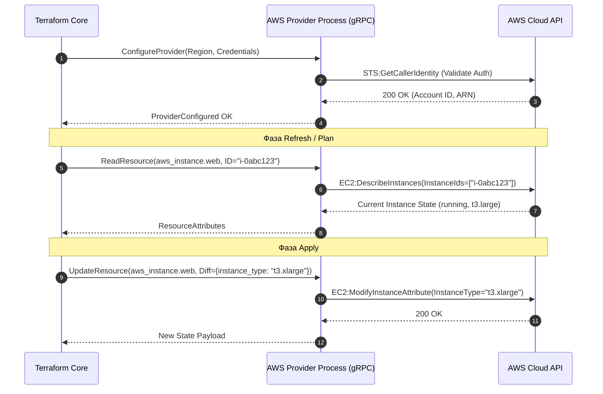
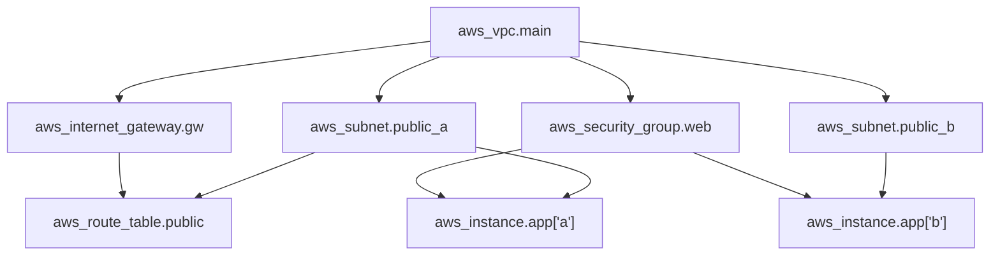

# 🏗️ 01. Основы Terraform/OpenTofu: Архитектура, HCL2 и Жизненный цикл Ресурсов

## ⚙️ Архитектура Terraform/OpenTofu: Core и Провайдеры

Terraform и OpenTofu построены на модульной двухуровневой архитектуре с четким разделением ответственности между движком вычисления графа (**Core**) и плагинами взаимодействия с внешними API (**Providers**).



### 1. Архитектурное разделение обязанностей

1. **Terraform Core (написан на Go):**
   - Читает и парсит конфигурационные файлы HCL2, строит абстрактное синтаксическое дерево (AST).
   - Вычисляет интерполяцию переменных, locals, функции и зависимости.
   - Формирует **Directed Acyclic Graph (DAG)** ресурсов и выполняет его топологическую сортировку.
   - Сравнивает желаемое состояние (код) с текущим состоянием (**State**) и вычисляет разницу (**Diff** / Speculative Plan).
   - Формирует RPC-запросы к плагинам провайдеров и оркеструет порядок их исполнения с учетом параллелизма (`-parallelism=N`).
   - Управляет блокировками стейта и транзакционным сохранением результатов.

2. **Provider Plugins (автономные Go-бинарники):**
   - Запускаются Core как дочерние OS-процессы и общаются с Core через локальный RPC/gRPC по протоколу **Plugin Protocol v5/v6**.
   - Экспортируют схему ресурсов и data source (`Schema`): типы полей, обязательность, вычисляемость (`computed`), чувствительность (`sensitive`).
   - Транслируют CRUD-операции Core (`Create`, `Read`, `Update`, `Delete`) в конкретные HTTP/gRPC-вызовы к SDK целевого сервиса (AWS SDK for Go, client-go, OCI SDK и др.).
   - Изолированы от Core: падение плагина не повреждает память Core, а Core ничего не знает о специфике облачных API.



---

### 2. Разрешение и блокировка провайдеров (Lock File)

Terraform загружает провайдеры из публичного реестра (`registry.terraform.io`), корпоративного приватного реестра или локального файлового зеркала (Filesystem Mirror).

Файл `.terraform.lock.hcl` фиксирует точные криптографические контрольные суммы (хеши `h1:` и `zh:`) для используемых платформ (Linux amd64/arm64, Darwin amd64/arm64). Он **обязательно должен коммититься в Git** для гарантии воспроизводимости сборок в CI/CD:

```hcl
# .terraform.lock.hcl
provider "registry.terraform.io/hashicorp/aws" {
  version     = "5.35.0"
  constraints = "~> 5.30"
  hashes = [
    "h1:Z8rQ4c8kYxU5z1J7p2d8Y0a3e5b6c7d8e9f0a1b2c3d=",
    "zh:18b32948f2195f2a1705d8f615e4785461c2ba4313f8c5b36484a56a6a9b44a2",
  ]
}
```

---

### 3. Мультипровайдерные конфигурации (Aliasing)

Когда требуется развернуть ресурсы в разных регионах, аккаунтах AWS или под разными учетными записями, используется механизм **псевдонимов (`alias`)**:

```hcl
# versions.tf
terraform {
  required_version = ">= 1.6.0"
  required_providers {
    aws = {
      source  = "hashicorp/aws"
      version = "~> 5.35"
    }
  }
}

# Провайдер по умолчанию (Default Provider): Франкфурт (eu-central-1)
provider "aws" {
  region = "eu-central-1"
  default_tags {
    tags = {
      Environment = var.environment
      ManagedBy   = "Terraform"
      Project     = "CoreInfrastructure"
    }
  }
}

# Дополнительный провайдер: Вирджиния (us-east-1) — для CloudFront / ACM сертификатов
provider "aws" {
  alias  = "us_east_1"
  region = "us-east-1"
  default_tags {
    tags = {
      Environment = var.environment
      ManagedBy   = "Terraform"
      RegionRole  = "EdgeCertificates"
    }
  }
}

# Провайдер для аудиторского аккаунта через AssumeRole
provider "aws" {
  alias  = "security_account"
  region = "eu-central-1"
  assume_role {
    role_arn     = "arn:aws:iam::999999999999:role/TerraformCrossAccountAdmin"
    session_name = "TerraformSecurityAudit"
  }
}
```

Привязка ресурса к алиасу провайдера:
```hcl
resource "aws_acm_certificate" "edge_cert" {
  provider                  = aws.us_east_1 # Принудительное создание в us-east-1
  domain_name               = "api.example.com"
  validation_method         = "DNS"
  subject_alternative_names = ["*.api.example.com"]

  lifecycle {
    create_before_destroy = true
  }
}
```

---

## 🔄 Граф зависимостей и фазы жизненного цикла

Terraform преобразует всю кодовую базу в **направленный ациклический граф (DAG)**. Вершины графа — это ресурсы, data source и модули; ребра — зависимости между ними.



### Фазы работы движка:

1. **`terraform init`:**
   - Скачивает провайдеры в каталог `.terraform/providers/`.
   - Клонирует внешние модули в `.terraform/modules/`.
   - Инициализирует бэкенд (настраивает связь с S3/GCS/Consul).

2. **`terraform refresh` (встроен в `plan` и `apply`):**
   - Вызывает `ReadResource` для каждого элемента в текущем стейте.
   - Обновляет стейт в памяти реальными данными из облака для выявления внешнего дрейфа (**drift**).

3. **`terraform plan` (Dry-run / Speculative Execution):**
   - Вычисляет разницу: `Diff = Desired State (HCL) - Real State (API)`.
   - Выводит план изменений:
     - `+` **Create**: ресурс будет создан.
     - `~` **Update in-place**: ресурс будет изменен без пересоздания.
     - `-` **Destroy**: ресурс будет удален.
     - `-/+` **Replace (Destroy and then Create)** или `+/-` **Replace (Create before Destroy)**: изменение неизменяемого (immutable) атрибута приводит к пересозданию.

4. **`terraform apply`:**
   - Выполняет параллельный обход графа зависимостей с максимальным пулом воркеров (`-parallelism=10`).
   - Применяет изменения в облачном API.
   - Фиксирует новое состояние в `terraform.tfstate` с обязательным снятием блокировки (`State Unlock`).

---

## 🎛️ Мета-аргументы и управление жизненным циклом (Lifecycle)

### 1. Блок `lifecycle`

Позволяет точно управлять поведением Terraform при модификации и удалении ресурсов.

```hcl
resource "aws_instance" "app_server" {
  ami           = data.aws_ami.ubuntu.id
  instance_type = var.instance_type
  subnet_id     = var.subnet_id

  tags = {
    Name        = "${var.environment}-app-server"
    LastPatched = timestamp() # Динамическое значение
  }

  lifecycle {
    # 1. Создать новый инстанс до удаления старого (Zero Downtime)
    create_before_destroy = true

    # 2. Запретить удаление критичного ресурса (ошибка при terraform destroy)
    prevent_destroy = false # Включать true для Production БД и Storage

    # 3. Игнорировать изменения определенных атрибутов (избегает конфликтов с AWS ASG/K8s)
    ignore_changes = [
      tags["LastPatched"],
      ami, # Не пересоздавать сервер при выходе нового базового AMI
    ]

    # 4. Принудительное пересоздание при изменении внешнего триггера (TF >= 1.2)
    replace_triggered_by = [
      aws_security_group.app_firewall.id,
      terraform_data.user_data_checksum.id
    ]

    # 5. Предусловия (Preconditions) — проверка инвариантов ДО выполнения plan/apply
    precondition {
      condition     = contains(["t3.medium", "t3.large", "c6i.xlarge"], var.instance_type)
      error_message = "Instance type ${var.instance_type} недопустим для окружения ${var.environment}!"
    }

    # 6. Постусловия (Postconditions) — проверка ответа API ПОСЛЕ создания/чтения
    postcondition {
      condition     = self.associate_public_ip_address == false
      error_message = "КРИТИЧЕСКАЯ ОШИБКА: Сервер приложения получил публичный IP в приватной подсети!"
    }
  }
}

# Вспомогательный ресурс для отслеживания контрольной суммы UserData
resource "terraform_data" "user_data_checksum" {
  input = sha256(templatefile("${path.module}/templates/userdata.sh.tpl", {
    app_port = var.app_port
  }))
}
```

---

### 2. Сравнение: `count` vs `for_each`

| Критерий | `count` | `for_each` |
| :--- | :--- | :--- |
| **Идентификация в State** | По числовому индексу: `aws_instance.nodes[0]`, `[1]`, `[2]` | По уникальному строковому ключу: `aws_instance.nodes["web-a"]` |
| **Удаление из середины** | 💥 **Катастрофа:** удаление `[1]` приводит к сдвигу индексов и пересозданию всех последующих ресурсов `[2] -> [1]` | ✅ **Безопасно:** удаляется ровно тот ресурс, чей ключ удален из карты/множества |
| **Тип входных данных** | Целое число `number` или `length(list)` | `map` или `set(string)` (`toset(["a", "b"])`) |
| **Идеальный сценарий** | Включение/выключение одного ресурса (`count = var.enabled ? 1 : 0`) | Коллекции однотипных ресурсов (подсети, диски, пользователи, правила) |

#### Антипаттерн с `count`:
```hcl
# ОПАСНО ДЛЯ СЕРВЕРОВ И ПОД Camino!
variable "subnets" {
  default = ["subnet-a", "subnet-b", "subnet-c"]
}

resource "aws_subnet" "bad_example" {
  count      = length(var.subnets)
  cidr_block = "10.0.${count.index}.0/24"
}
# Если удалить "subnet-a", Terraform удалит subnet-c и изменит CIDR у subnet-b!
```

#### Эталонный подход с `for_each`:
```hcl
variable "subnets_config" {
  type = map(object({
    cidr_block        = string
    availability_zone = string
    is_public         = bool
  }))
  default = {
    "public-eu-central-1a" = {
      cidr_block        = "10.0.1.0/24"
      availability_zone = "eu-central-1a"
      is_public         = true
    }
    "public-eu-central-1b" = {
      cidr_block        = "10.0.2.0/24"
      availability_zone = "eu-central-1b"
      is_public         = true
    }
    "private-eu-central-1a" = {
      cidr_block        = "10.0.10.0/24"
      availability_zone = "eu-central-1a"
      is_public         = false
    }
  }
}

resource "aws_subnet" "production" {
  for_each = var.subnets_config

  vpc_id            = aws_vpc.main.id
  cidr_block        = each.value.cidr_block
  availability_zone = each.value.availability_zone

  map_public_ip_on_launch = each.value.is_public

  tags = {
    Name = each.key
    Type = each.value.is_public ? "Public" : "Private"
  }
}
```

---

## 💻 HCL2 Deep Dive: Переменные, Locals, Expressions и Функции

### 1. Строгая типизация и кастомная валидация (`variables.tf`)

```hcl
variable "environment" {
  type        = string
  description = "Целевое окружение развертывания (dev, stage, prod)"

  validation {
    condition     = contains(["dev", "stage", "prod"], var.environment)
    error_message = "Значение environment должно быть строго: 'dev', 'stage' или 'prod'."
  }
}

variable "vpc_cidr" {
  type        = string
  description = "Базовый IPv4 CIDR для создания VPC"
  default     = "10.100.0.0/16"

  validation {
    condition     = can(cidrnetmask(var.vpc_cidr)) && split("/", var.vpc_cidr)[1] == "16"
    error_message = "VPC CIDR должен быть валидным IPv4 диапазоном с маской /16 (например, 10.100.0.0/16)."
  }
}

variable "database_credentials" {
  type = object({
    username  = string
    password  = string
    port      = optional(number, 5432) # Опциональное поле со значением по умолчанию
    engine    = optional(string, "postgres")
    allocated = optional(number, 50)
  })
  sensitive   = true  # Значения не будут выводиться в CLI логах и UI
  nullable    = false # Запрет передачи null
  description = "Учетные данные и параметры базы данных"

  validation {
    condition     = length(var.database_credentials.password) >= 16
    error_message = "Пароль базы данных должен содержать не менее 16 символов!"
  }
}
```

---

### 2. Вычисляемые структуры в `locals.tf`

Блок `locals` используется для исключения дублирования и трансформации сложных структур данных:

```hcl
locals {
  name_prefix = "${var.project_name}-${var.environment}"

  # Стандартизированный набор тегов для всех ресурсов
  common_tags = {
    Project     = var.project_name
    Environment = var.environment
    ManagedBy   = "Terraform"
    GitRepo     = "github.com/company/infra-core"
  }

  # Фильтрация только приватных подсетей с помощью For-выражения
  private_subnets_map = {
    for name, config in var.subnets_config : name => config
    if config.is_public == false
  }

  # Преобразование списка объектов в карту с группировкой по роли
  instances_by_role = {
    for instance in var.instances_list : instance.role => instance.id...
  }

  # Динамический расчет подсетей через функцию cidrsubnet
  calculated_subnets = [
    for idx, az in ["eu-central-1a", "eu-central-1b", "eu-central-1c"] : {
      az   = az
      cidr = cidrsubnet(var.vpc_cidr, 4, idx) # 10.100.0.0/20, 10.100.16.0/20...
    }
  ]
}
```

---

### 3. Динамические блоки (`dynamic`)

Динамические блоки генерируют повторяющиеся вложенные конфигурационные секции (например, правила Security Group, дисковые массивы или HTTP-заголовки):

```hcl
variable "firewall_ingress_rules" {
  type = list(object({
    description = string
    port        = number
    protocol    = string
    cidr_blocks = list(string)
  }))
  default = [
    {
      description = "HTTPS from Internet"
      port        = 443
      protocol    = "tcp"
      cidr_blocks = ["0.0.0.0/0"]
    },
    {
      description = "Internal Metrics scrape"
      port        = 9100
      protocol    = "tcp"
      cidr_blocks = ["10.100.0.0/16"]
    }
  ]
}

resource "aws_security_group" "web_lb" {
  name        = "${locals.name_prefix}-alb-sg"
  description = "Security Group with dynamic rules"
  vpc_id      = aws_vpc.main.id

  # Генерация правил ingress на основе списка объектов
  dynamic "ingress" {
    for_each = var.firewall_ingress_rules
    iterator = rule # Именование итератора (по умолчанию имя блока)

    content {
      description = rule.value.description
      from_port   = rule.value.port
      to_port     = rule.value.port
      protocol    = rule.value.protocol
      cidr_blocks = rule.value.cidr_blocks
    }
  }

  egress {
    from_port   = 0
    to_port     = 0
    protocol    = "-1"
    cidr_blocks = ["0.0.0.0/0"]
  }

  tags = locals.common_tags
}
```

---

### 4. Встроенные функции Terraform (Top-15 для продакшна)

```hcl
# 1. try & can — безопасная обработка отсутствующих полей и ошибок
port = try(var.override_port, 8080)
is_valid_ipv4 = can(regex("^(\\d{1,3}\\.){3}\\d{1,3}$", var.ip_address))

# 2. coalesce & coalescelist — выбор первого непустого значения
db_user = coalesce(var.custom_db_user, var.default_db_user, "admin")

# 3. flatten — разворачивание вложенных списков
all_subnet_ids = flatten([aws_subnet.public[*].id, aws_subnet.private[*].id])

# 4. merge — слияние карт с переопределением
effective_tags = merge(locals.common_tags, var.custom_tags, { Tier = "Backend" })

# 5. cidrsubnet & cidrhost — вычисление IP адресов
subnet_cidr = cidrsubnet("10.0.0.0/16", 8, 2) # -> "10.0.2.0/24"
gateway_ip  = cidrhost(aws_subnet.production["public-eu-central-1a"].cidr_block, 1) # -> "10.0.1.1"

# 6. jsonencode & yamldecode — сериализация структур
config_payload = jsonencode({
  server_port = 8080
  workers     = 4
  endpoints   = [for s in aws_subnet.private : s.id]
})

# 7. templatefile — рендеринг внешних шаблонов с передачей переменных
rendered_script = templatefile("${path.module}/userdata.sh.tpl", {
  cluster_name = locals.name_prefix
  region       = var.aws_region
})
```

---

## ⚡ Terraform CLI: Production Cheat Sheet

```bash
# ==========================================
# 1. Инициализация и управление зависимостями
# ==========================================
# Стандартная инициализация
terraform init

# Обновление провайдеров и модулей до разрешенных верхних версий
terraform init -upgrade

# Инициализация с принудительной сменой бэкенда без копирования стейта
terraform init -reconfigure

# Инициализация с локальным кэшем плагинов (для Air-gapped сред)
export TF_PLUGIN_CACHE_DIR="$HOME/.terraform.d/plugin-cache"
terraform init

# ==========================================
# 2. Валидация и форматирование
# ==========================================
# Рекурсивное форматирование HCL кода в каноничный вид
terraform fmt -recursive

# Проверка форматирования без изменения файлов (для CI/CD линтера)
terraform fmt -check -diff -recursive

# Синтаксическая и структурная валидация без вызова внешних облачных API
terraform validate -json

# ==========================================
# 3. Планирование и применение
# ==========================================
# Генерация бинарного плана с фиксацией входных данных
terraform plan -out=tfplan.binary -detailed-exitcode

# Чтение и инспекция сгенерированного бинарного плана
terraform show -no-color tfplan.binary > tfplan.txt
terraform show -json tfplan.binary | jq '.resource_changes[] | {address: .address, actions: .change.actions}'

# Применение строго того плана, который был сгенерирован и проверен в CI
terraform apply -auto-approve tfplan.binary

# Точечное создание или обновление конкретного ресурса (State Isolation)
terraform apply -target=aws_security_group.web_lb

# Запуск плана в режиме обновления стейта без внесения изменений (проверка дрейфа)
terraform plan -refresh-only

# ==========================================
# 4. Отладка, граф и интерактивная консоль
# ==========================================
# Интерактивная HCL консоль для тестирования функций и интерполяции
terraform console

# Построение визуального графа зависимостей (требуется graphviz)
terraform graph -type=plan | dot -Tsvg > dependencies.svg

# Включение подробного трейсинга RPC вызовов Core <-> Providers
export TF_LOG=DEBUG
export TF_LOG_PATH="./terraform_debug.log"
terraform apply
```

---

## 🧨 Production Break-Fix: Реальные сбои и их устранение

### Сценарий 1: Каскадное удаление ресурсов из-за сдвига индексов `count`

```text
СИМПТОМ:
Инженер удалил один элемент из списка `var.availability_zones` (первую зону "eu-central-1a").
Команда `terraform plan` неожиданно показывает:
Plan: 2 to add, 2 to change, 3 to destroy.
Terraform собирается уничтожить боевые базы данных и пересоздать подсети!
```

- **Root Cause:** Ресурсы были объявлены через `count = length(var.availability_zones)`. При удалении нулевого элемента индекс 1 стал индексом 0, индекс 2 стал индексом 1. Terraform считает, что ресурс `[0]` изменил параметры, а последний ресурс `[2]` должен быть уничтожен.
- **Диагностика:**
  ```bash
  terraform state list | grep aws_subnet
  # aws_subnet.db[0] -> eu-central-1a
  # aws_subnet.db[1] -> eu-central-1b
  # aws_subnet.db[2] -> eu-central-1c
  ```
- **Решение:**
  1. Немедленно отменить изменение и остановить `apply`.
  2. Переписать ресурс на `for_each`:
     ```hcl
     resource "aws_subnet" "db" {
       for_each          = toset(var.availability_zones)
       availability_zone = each.value
       # ...
     }
     ```
  3. Использовать декларативные блоки `moved` (TF >= 1.1) для бескровной миграции адресов в стейте:
     ```hcl
     moved {
       from = aws_subnet.db[0]
       to   = aws_subnet.db["eu-central-1a"]
     }
     moved {
       from = aws_subnet.db[1]
       to   = aws_subnet.db["eu-central-1b"]
     }
     moved {
       from = aws_subnet.db[2]
       to   = aws_subnet.db["eu-central-1c"]
     }
     ```
  4. Запустить `terraform plan`. План покажет: `0 to add, 0 to change, 0 to destroy` (адреса в стейте обновятся автоматически).

---

### Сценарий 2: Циклическая зависимость в графе (Cycle Error)

```text
СИМПТОМ:
Error: Cycle: aws_security_group.app, aws_security_group.db, aws_security_group_rule.app_to_db
```

- **Root Cause:** Ресурс `aws_security_group.app` ссылается на `aws_security_group.db` внутри встроенных `ingress` блоков, а `aws_security_group.db` ссылается на `aws_security_group.app`. Создается неразрешимый цикл в DAG.
- **Диагностика:**
  ```bash
  terraform graph | grep "Cycle"
  ```
- **Решение:** Вынести правила файрвола из тела `aws_security_group` в отдельные атомарные ресурсы `aws_security_group_rule` или `aws_vpc_security_group_ingress_rule`:
  ```hcl
  # 1. Создаем пустые контейнеры Security Group
  resource "aws_security_group" "app" {
    name   = "app-sg"
    vpc_id = aws_vpc.main.id
  }

  resource "aws_security_group" "db" {
    name   = "db-sg"
    vpc_id = aws_vpc.main.id
  }

  # 2. Правила создаются после появления обоих SG (цикл разорван)
  resource "aws_security_group_rule" "app_to_db" {
    type                     = "ingress"
    from_port                = 5432
    to_port                  = 5432
    protocol                 = "tcp"
    security_group_id        = aws_security_group.db.id
    source_security_group_id = aws_security_group.app.id
  }
  ```

---

### Сценарий 3: Конфликт имен при `create_before_destroy`

```text
СИМПТОМ:
Error: creating Security Group (web-app-sg): ResourceAlreadyExistsException:
The security group 'web-app-sg' already exists for VPC 'vpc-0123456789abcdef0'.
```

- **Root Cause:** У ресурса задан `create_before_destroy = true`, но имя ресурса жестко зафиксировано (`name = "web-app-sg"`). Terraform пытается создать новый SG со старым именем до того, как удалит старый. Облачный провайдер отклоняет создание из-за уникальности имени.
- **Решение:** Использовать префикс имени `name_prefix` вместо фиксированного `name`:
  ```hcl
  resource "aws_security_group" "web_app" {
    name_prefix = "${var.environment}-web-app-" # AWS добавит случайный суффикс
    vpc_id      = aws_vpc.main.id

    lifecycle {
      create_before_destroy = true
    }
  }
  ```

---

## 🧪 Hands-on Lab: Полный цикл на встроенных провайдерах

!!! abstract "Параметры стенда"
    - **Провайдеры:** `local`, `random`, `tls` (работает автономно, облачные учетные записи не требуются).
    - **Цель:** Создать самоподписанный TLS-сертификат, сгенерировать конфиг Nginx, применить мета-аргументы `lifecycle`, `for_each` и валидацию `precondition`.

```bash
# 1. Создание каталога лаборатории
mkdir -p /tmp/tf-lab-01 && cd /tmp/tf-lab-01

# 2. Создание файла versions.tf
cat <<'EOF' > versions.tf
terraform {
  required_version = ">= 1.6.0"
  required_providers {
    local = {
      source  = "hashicorp/local"
      version = "~> 2.4"
    }
    random = {
      source  = "hashicorp/random"
      version = "~> 3.6"
    }
    tls = {
      source  = "hashicorp/tls"
      version = "~> 4.0"
    }
  }
}
EOF

# 3. Создание переменных variables.tf
cat <<'EOF' > variables.tf
variable "app_ports" {
  type        = list(number)
  description = "Список портов для веб-сервера"
  default     = [8080, 8443]

  validation {
    condition     = alltrue([for p in var.app_ports : p > 1024 && p < 65535])
    error_message = "Все порты должны быть в непривилегированном диапазоне (1025-65534)!"
  }
}

variable "domains" {
  type    = set(string)
  default = ["api.internal.local", "auth.internal.local"]
}
EOF

# 4. Основной файл main.tf
cat <<'EOF' > main.tf
# Генерация приватного RSA ключа
resource "tls_private_key" "ca" {
  algorithm = "RSA"
  rsa_bits  = 2048
}

# Генерация самоподписанного сертификата
resource "tls_self_signed_cert" "ca" {
  private_key_pem = tls_private_key.ca.private_key_pem

  subject {
    common_name  = "Internal Local Root CA"
    organization = "DevOps Labs Inc"
  }

  validity_period_hours = 24
  is_ca_certificate     = true

  allowed_uses = [
    "cert_signing",
    "crl_signing",
  ]
}

# Генерация сертификатов доменов через for_each
resource "tls_private_key" "domains" {
  for_each  = var.domains
  algorithm = "RSA"
  rsa_bits  = 2048
}

# Генерация итогового конфигурационного файла Nginx
resource "local_file" "nginx_config" {
  filename        = "${path.module}/generated_nginx.conf"
  file_permission = "0640"

  content = templatestring(<<-EOT
    # Auto-generated by Terraform Core Engine
    # Generated at: $${timestamp}
    %{ for domain in var.domains ~}
    server {
      server_name ${domain};
      %{ for port in var.app_ports ~}
      listen ${port} ssl;
      %{ endfor ~}

      ssl_certificate     /etc/ssl/${domain}.crt;
      ssl_certificate_key /etc/ssl/${domain}.key;

      location /healthz {
        return 200 "OK from ${domain}\n";
      }
    }
    %{ endfor ~}
  EOT
  , {
    timestamp = timestamp()
    domains   = var.domains
    app_ports = var.app_ports
  })

  lifecycle {
    create_before_destroy = true
    postcondition {
      condition     = fileexists(self.filename)
      error_message = "Файл конфигурации Nginx не был сформирован на диске!"
    }
  }
}
EOF

# 5. Инициализация и применение
terraform init
terraform validate
terraform plan -out=tfplan
terraform apply tfplan

# 6. Проверка результата
cat generated_nginx.conf
```

---

## ✅ Чек-лист зрелости: Управление HCL и Архитектурой

- [ ] **`.terraform.lock.hcl` закоммичен в репозиторий:** Все версии провайдеров зафиксированы с мультиплатформенными хешами.
- [ ] **Никаких `count` для разнородных ресурсов:** Для коллекций серверов, дисков и сетевых компонентов используется исключительно `for_each`.
- [ ] **Строгая типизация всех `variables`:** Отсутствуют переменные типа `any` без крайней необходимости, добавлены блоки `validation` с понятными `error_message`.
- [ ] **Защита данных через `sensitive = true`:** Все пароли, токены и приватные ключи помечены как чувствительные.
- [ ] **`lifecycle { prevent_destroy = true }` для Production State:** Включен на ключевых RDS инстансах, S3 бакетах со стейтом и KMS ключах.
- [ ] **`name_prefix` при `create_before_destroy`:** Исключены конфликты уникальных имен ресурсов в облачных API.
- [ ] **Чистый вывод `terraform fmt -check`:** Код стандартизирован и проверяется в Git pre-commit хуках и CI пайплайне.

---

## 🧭 Что дальше

| Шаг | Тема | Ссылка |
| :--- | :--- | :--- |
| ➡️ Следующий шаг | Архитектура State, Модульный Дизайн и Terragrunt | [02-state-modules-and-terragrunt.md](file:///mnt/c/Users/aazimov/Desktop/qek/doka/docs/06-terraform/02-state-modules-and-terragrunt.md) |
| 🧪 Практикум | Интеграционное тестирование и GitOps CI | [03-terraform-testing-ci-and-state-ops.md](file:///mnt/c/Users/aazimov/Desktop/qek/doka/docs/06-terraform/03-terraform-testing-ci-and-state-ops.md) |

---

## ❓ Проверь себя

**В1. Чем отличаются протоколы провайдеров Plugin Protocol v5 и v6 в Terraform/OpenTofu?**
<details><summary>Ответ</summary>
Plugin Protocol v5 базировался на старом SDKv2 и передавал структуры данных через трансляцию в плоские типы с ограниченной поддержкой Null/Unknown значений. Plugin Protocol v6 (вместе с современным <code>terraform-plugin-framework</code>) полностью построен на gRPC и Protobuf v3, поддерживает нативные структуры типов фреймворка (tftypes), динамические псевдотипы, вложенные объекты с опциональными атрибутами и прямое разграничение между <code>null</code> и <code>unknown</code> значениями на этапе Plan.
</details>

**В2. Что произойдет, если выполнить `terraform apply -target=...` в production-проекте?**
<details><summary>Ответ</summary>
Таргетированный apply обновляет только указанный ресурс и его прямые зависимости, игнорируя остальную часть графа. Это приводит к тому, что стейт-файл начинает расходиться с реальным кодом других ресурсов (дрейф), data source могут вернуть устаревшие данные, а последующий стандартный <code>terraform apply</code> попытается применить накопившиеся непроверенные изменения для всех остальных ресурсов сразу. Таргетинг допустим только для аварийного восстановления (break-fix).
</details>

**В3. В чем разница между `try()` и `can()` в HCL2?**
<details><summary>Ответ</summary>
<code>can(expression)</code> вычисляет выражение и возвращает булево значение (<code>true</code>, если выражение вычислено без ошибок, и <code>false</code>, если возникла ошибка обращения к несуществующему ключу/индексу или несовпадение типов). Используется в блоках <code>validation</code>. <code>try(expr1, expr2, ..., fallback)</code> вычисляет список выражений по очереди и возвращает результат первого успешного выражения или резервное значение (fallback), если все предыдущие завершились ошибкой.
</details>

**В4. Почему `terraform refresh` может быть опасен перед `terraform destroy`?**
<details><summary>Ответ</summary>
Если ресурс был изменен вне Terraform (например, удален вручную в консоли AWS), <code>refresh</code> обнаружит его отсутствие и удалит запись из стейта. Если другие ресурсы в графе зависели от него, операция <code>destroy</code> для связанных ресурсов может завершиться ошибкой из-за отсутствия необходимых атрибутов или повиснуть в неконсистентном состоянии.
</details>
