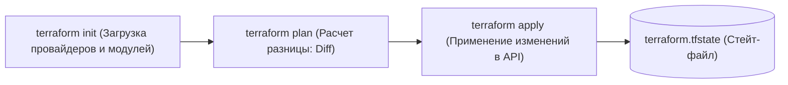
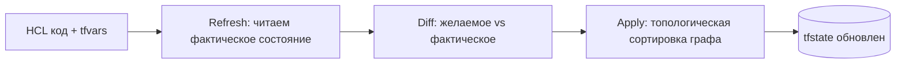

# 🏗️ 01. Основы Terraform/OpenTofu, HCL и Провайдеры

## ⚙️ Рабочий цикл (Terraform Lifecycle)

Terraform / OpenTofu реализует подход Infrastructure as Code (IaC), преобразуя декларативные HCL файлы в реальные вызовы облачных API.



---

## 📝 Синтаксис HCL и структура проекта

Типовая структура модуля:
```text
terraform-module/
├── versions.tf     # Версии Terraform и провайдеров
├── variables.tf    # Входные переменные
├── main.tf         # Основные ресурсы
├── outputs.tf      # Выходные данные
└── terraform.tfvars # Фактические значения переменных (не коммитится, если есть секреты)
```

### 1. `versions.tf`
```hcl
terraform {
  required_version = ">= 1.6.0"
  required_providers {
    aws = {
      source  = "hashicorp/aws"
      version = "~> 5.30"
    }
  }
}

provider "aws" {
  region = var.aws_region
  default_tags {
    tags = {
      Environment = var.environment
      ManagedBy   = "Terraform"
    }
  }
}
```

### 2. `main.tf` (Ресурсы, Data Sources и Meta-arguments)
```hcl
# Получение актуального ID базового образа AMI
data "aws_ami" "ubuntu" {
  most_recent = true
  filter {
    name   = "name"
    values = ["ubuntu/images/hvm-ssd/ubuntu-jammy-22.04-amd64-server-*"]
  }
  owners = ["099720109477"] # Canonical
}

# Локальные вычисляемые переменные
locals {
  name_prefix = "${var.project_name}-${var.environment}"
}

# Создание инстансов с помощью for_each
resource "aws_instance" "web_nodes" {
  for_each = var.node_configurations

  ami           = data.aws_ami.ubuntu.id
  instance_type = each.value.instance_type
  subnet_id     = var.subnet_id

  tags = {
    Name = "${locals.name_prefix}-${each.key}"
    Role = each.value.role
  }

  lifecycle {
    create_before_destroy = true # Создать новый сервер до удаления старого
    ignore_changes = [
      tags["LastUpdated"] # Игнорировать сторонние изменения определенных тегов
    ]
  }
}
```

---

## ⚡ Terraform CLI Cheat Sheet

```bash
# Форматирование и валидация кода
terraform fmt -recursive
terraform validate

# Генерация плана с сохранением в бинарный файл
terraform plan -out=tfplan.binary

# Применение строго того плана, который был сгенерирован
terraform apply tfplan.binary

# Точечный таргетинг (применить только один конкретный ресурс)
terraform apply -target=aws_instance.web_nodes["worker-1"]

# Просмотр графа зависимостей
terraform graph | dot -Tpng > graph.png
```

---

## 🔬 Deep Dive: жизненный цикл плана и граф зависимостей



- `plan` уже делает refresh: если кто-то руками поменял ресурс — вы увидите дрейф ДО apply.
- Параллелизм: `-parallelism=10`; зависимости берутся из ссылок `resource.attr` (неявные), либо `depends_on` (явные).

### Функции и выражения, которые решают 80% задач

```hcl
# for_each против count: count ломает индексы при удалении элемента
resource "aws_subnet" "this" {
  for_each = toset(var.azs)
  availability_zone = each.value
}

# conditional + coalescelist для дефолтов
cidr = try(var.cidr_overrides[name], cidrsubnet(var.vpc_cidr, 4, idx))

# dynamic блоки внутри ресурсов
dynamic "ingress" {
  for_each = var.rules
  content {
    from_port = ingress.value.from_port
    to_port   = ingress.value.to_port
  }
}
```

### Работа с дрейфом и импортом (TF ≥ 1.5)

```bash
terraform plan -refresh-only              # показать только дрейф
terraform import 'aws_instance.web[0]' i-0abc123   # импорт без кода
# или декларативно:
echo 'import { to = aws_instance.web  id = "i-0abc123" }' >> import.tf && terraform plan -generate-config-out=generated.tf
```

---

<!-- enriched:v1 -->

## 🧨 Типовые грабли Production

| Симптом | Причина | Быстрое решение |
| :--- | :--- | :--- |
| Пайплайн зеленый, прод сломан | Разница окружений / secrets не из Vault | Проверять конфиги через `conftest` + smoke-тесты после деплоя |
| `terraform apply` висит на lock | Умерший CI оставил lock | `force-unlock` после проверки активности |
| Ansible «работает» но ничего не меняет | `changed_when` не настроен | Явные `changed_when`/`failed_when` для команд |
| GitOps откатывает ручной фикс | Drift между Git и кластером | Править только в Git; `selfHeal` оставить включенным |

!!! warning «Идемпотентность — закон»
    Любой скрипт/плейбук/модуль должен быть безопасно перезапускаемым. Если второй прогон меняет состояние — это баг, который однажды уронит прод.

## 🧪 Hands-on Lab

```bash
terraform fmt -check -recursive && terraform validate && \
terraform providers schema -json > /tmp/schema.json 2>/dev/null; terraform plan -out=/dev/null 2>&1 | tail -5
```

## ✅ Чек-лист зрелости темы

- [ ] Все изменения проходят через PR с обязательным review
- [ ] Секреты никогда не хранятся в коде/стейте (Vault/SOPS/secret manager)
- [ ] Есть dry-run/plan этап и он виден в MR
- [ ] Откат воспроизводим одной командой (< 10 минут)
- [ ] Логи пайплайна содержат версии артефактов (image digest, commit SHA)
