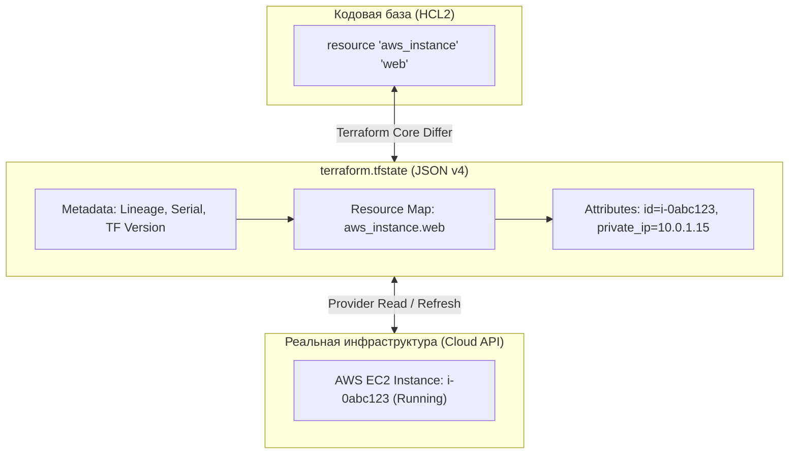
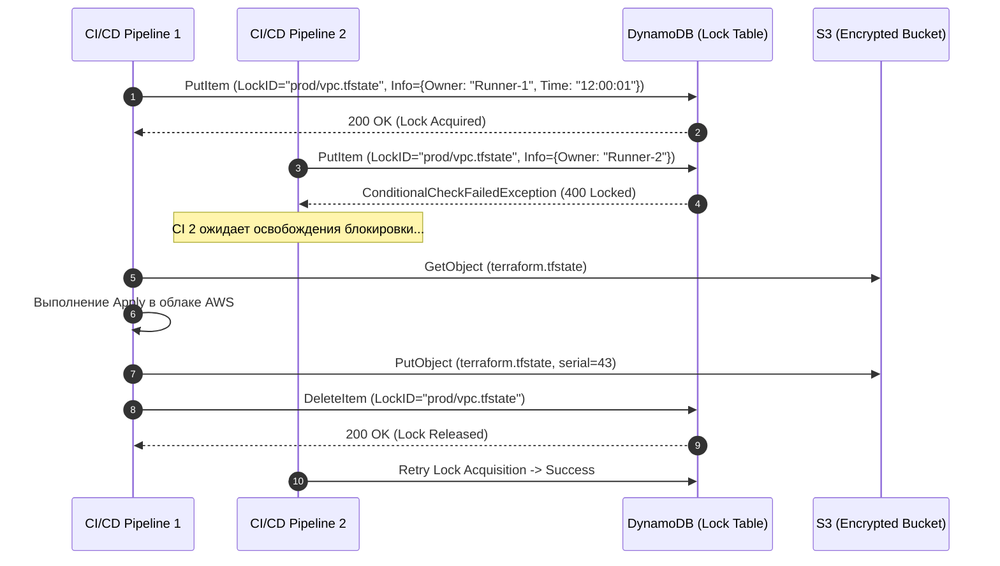
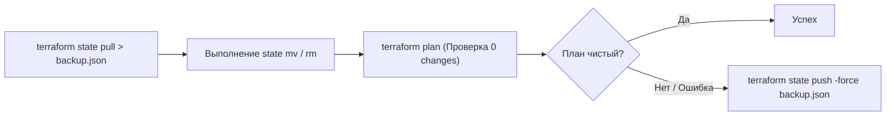
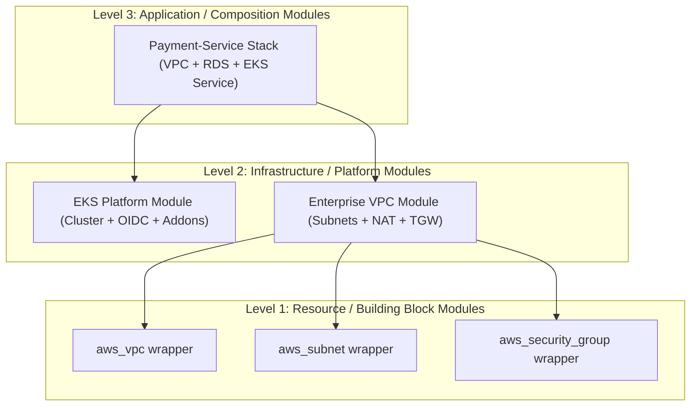
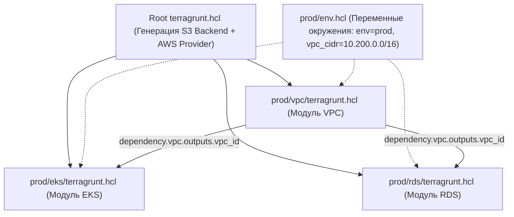

# 🏗️ 02. Архитектура State, Модульный Дизайн и Terragrunt

## 🔒 Внутреннее устройство Terraform State (State Internals)

Стейт-файл (`terraform.tfstate`) — это единый источник правды (**Single Source of Truth**), связывающий декларативный HCL-код с реальными идентификаторами ресурсов в облачных API.



---

### 1. Анатомия `terraform.tfstate` (JSON Schema v4)

Файл стейта представляет собой строго структурированный JSON-документ:

```json
{
  "version": 4,
  "terraform_version": "1.7.5",
  "serial": 42,
  "lineage": "c8e4d29f-3e1b-4f91-b9a2-98471b058e12",
  "outputs": {
    "vpc_id": {
      "value": "vpc-0123456789abcdef0",
      "type": "string"
    }
  },
  "resources": [
    {
      "mode": "managed",
      "type": "aws_instance",
      "name": "web",
      "provider": "provider[\"registry.terraform.io/hashicorp/aws\"]",
      "instances": [
        {
          "schema_version": 1,
          "attributes": {
            "id": "i-0abc123def456",
            "ami": "ami-0c55b159cbfafe1f0",
            "instance_type": "t3.xlarge",
            "private_ip": "10.100.1.50",
            "tags": {
              "Environment": "production",
              "Name": "prod-web-01"
            }
          },
          "sensitive_attributes": [],
          "dependencies": [
            "aws_security_group.web_sg",
            "aws_subnet.private_a"
          ]
        }
      ]
    }
  ],
  "check_results": null
}
```

#### Ключевые поля метаданных:
- **`lineage` (UUID):** Уникальный неизменяемый идентификатор жизненного цикла стейта. Генерируется при первом создании. Защищает от случайного применения стейта одного окружения (например, dev) поверх другого (prod).
- **`serial` (uint):** Монотонно возрастающий счетчик версий стейта. При каждом успешном изменении инфраструктуры инкрементируется (`serial = serial + 1`). Если клиент отправляет стейт с `serial`, меньшим или равным текущему на удаленном сервере, бэкенд отклоняет запись (**Optimistic Concurrency Control**).
- **`dependencies`:** Массив адресов ресурсов, от которых зависит данный объект, используемый для вычисления порядка удаления при обратном обходе графа.

---

## 🛡️ Remote Backends и механизм State Locking

В корпоративной среде локальный стейт строго запрещен. Remote Backend решает три задачи:
1. **Централизованное хранение:** Доступ всей команды и CI/CD раннеров к актуальному состоянию.
2. **State Locking:** Атомарная блокировка стейта на время операций `plan` и `apply`, предотвращающая одновременное изменение и повреждение стейта (**Race Conditions**).
3. **Шифрование данных (Encryption at Rest & in Transit):** Защита секретов, попадающих в стейт в открытом виде.



---

### Сравнение реализаций Remote Backends

| Бэкенд | Механизм хранения | Механизм блокировки | Аутентификация / Безопасность |
| :--- | :--- | :--- | :--- |
| **AWS S3 + DynamoDB** | S3 Bucket (Object Storage) | DynamoDB Table (Primary Key: `LockID`) | IAM Roles, OIDC, KMS CMK, Bucket Policy |
| **Google Cloud Storage (GCS)** | GCS Bucket | Native Generation Preconditions (`x-goog-if-generation-match`) | Workload Identity Federation, Cloud KMS |
| **Azure Blob Storage** | Storage Container | Azure Blob Leases (Native Lease ID) | Azure Managed Identity, Storage Key |
| **HashiCorp Consul** | Consul KV Store | Distributed Sessions & K/V Locks | Consul ACL Tokens, TLS Mutual Auth |
| **Terraform Cloud / Spacelift** | Managed State Service | Встроенный оркестратор выполнения | OIDC, RBAC, VCS Integrations |

---

### Production-конфигурация S3 + DynamoDB:

```hcl
# backend.tf
terraform {
  required_version = ">= 1.6.0"

  backend "s3" {
    bucket         = "company-tfstate-production-eu-central-1"
    key            = "platform/network/vpc.tfstate"
    region         = "eu-central-1"
    encrypt        = true
    dynamodb_table = "company-tfstate-locks"

    # Использование выделенной роли через AssumeRole (Least Privilege)
    assume_role = {
      role_arn       = "arn:aws:iam::111122223333:role/TerraformStateWriterRole"
      session_name   = "TerraformNetworkApply"
      external_id    = "production-platform-env"
    }
  }
}
```

---

## 🔬 Хирургия стейта (State Surgery & Recovery)

Любые манипуляции со стейтом вручную в JSON запрещены. Для безопасной модификации структуры стейта используется встроенный набор CLI-команд.



### 1. Золотые команды инспекции и модификации

```bash
# 1. ОБЯЗАТЕЛЬНЫЙ ЭТАП: Выгрузка резервной копии стейта перед операциями
terraform state pull > "state-backup-$(date +%Y%m%d%H%M%S).json"

# 2. Просмотр списка всех зарегистрированных ресурсов
terraform state list

# 3. Детальный вывод всех атрибутов конкретного ресурса
terraform state show 'aws_db_instance.postgres["primary"]'

# 4. Переименование ресурса без уничтожения в облаке
terraform state mv 'aws_instance.legacy_web' 'aws_instance.web_v2'

# 5. Перемещение ресурса внутрь модуля
terraform state mv 'aws_security_group.app' 'module.app_cluster.aws_security_group.app'

# 6. Перенос ресурса между РАЗНЫМИ стейтами (выделение сети в отдельный стек)
terraform state mv \
  -state-out="../network-layer/terraform.tfstate" \
  aws_vpc.main aws_vpc.main

# 7. Отвязка ресурса от Terraform (удаление из стейта, но ресурс в облаке ОСТАЕТСЯ РАБОТАТЬ)
terraform state rm 'aws_s3_bucket.user_avatars'

# 8. Замена провайдера (миграция с HashiCorp на OpenTofu или смену namespace)
terraform state replace-provider \
  'registry.terraform.io/hashicorp/aws' \
  'registry.opentofu.org/hashicorp/aws'

# 9. Снятие зависшей блокировки (если CI/CD процесс был принудительно убит по OOM/Timeout)
# ВНИМАНИЕ: Сначала убедиться, что ни один раннер сейчас не выполняет apply!
terraform force-unlock 9a4e8d21-4f12-9c1a-84b2-019284716281
```

---

## 🏛️ Модульный дизайн: Паттерны и Архитектурные уровни

### 1. Трехуровневая иерархия модулей (3-Tier Module Hierarchy)



1. **Level 1 (Resource Modules):** Тонкие обертки над единичными ресурсами облака с принудительными стандартами именования и безопасности (например, S3 бакет с гарантированным включением шифрования и блокировки публичного доступа).
2. **Level 2 (Platform Modules):** Композиции ресурсов, реализующие законченный инфраструктурный паттерн (High-Availability VPC с тремя AZ, отказоустойчивый кластер PostgreSQL, EKS кластер с управляемыми нод-группами).
3. **Level 3 (Application Modules):** Финальная сборка стека под конкретный бизнес-сервис (база данных + очередь SQS + IAM роли + деплоймент).

---

### 2. Эталонный переиспользуемый модуль VPC

Структура каталогов модуля:
```text
modules/aws-vpc/
├── main.tf         # Основные ресурсы
├── variables.tf    # Входные параметры с валидацией
├── outputs.tf      # Экспортируемые атрибуты
├── versions.tf     # Ограничения версий провайдеров
└── README.md       # Автогенерируемая документация (terraform-docs)
```

```hcl
# modules/aws-vpc/variables.tf
variable "cidr_block" {
  type        = string
  description = "IPv4 CIDR для VPC (например, 10.100.0.0/16)"
}

variable "availability_zones" {
  type        = list(string)
  description = "Список зон доступности (например, ['eu-central-1a', 'eu-central-1b'])"
}

variable "enable_nat_gateway" {
  type        = bool
  default     = true
  description = "Флаг создания NAT Gateway для приватных подсетей"
}

variable "tags" {
  type        = map(string)
  default     = {}
  description = "Дополнительные теги ресурсов"
}
```

```hcl
# modules/aws-vpc/main.tf
resource "aws_vpc" "this" {
  cidr_block           = var.cidr_block
  enable_dns_hostnames = true
  enable_dns_support   = true

  tags = merge(var.tags, {
    Name = "vpc-${var.cidr_block}"
  })
}

resource "aws_internet_gateway" "this" {
  vpc_id = aws_vpc.this.id
  tags   = merge(var.tags, { Name = "igw-main" })
}

# Публичные подсети
resource "aws_subnet" "public" {
  for_each = { for idx, az in var.availability_zones : az => idx }

  vpc_id                  = aws_vpc.this.id
  cidr_block              = cidrsubnet(var.cidr_block, 4, each.value)
  availability_zone       = each.key
  map_public_ip_on_launch = true

  tags = merge(var.tags, {
    Name = "public-subnet-${each.key}"
    Tier = "Public"
  })
}

# Выделение EIP и создание NAT Gateway (условно, 1 шт на всю VPC для экономии в dev)
resource "aws_eip" "nat" {
  count  = var.enable_nat_gateway ? 1 : 0
  domain = "vpc"
  tags   = merge(var.tags, { Name = "nat-eip" })
}

resource "aws_nat_gateway" "this" {
  count         = var.enable_nat_gateway ? 1 : 0
  allocation_id = aws_eip.nat[0].id
  subnet_id     = values(aws_subnet.public)[0].id

  tags = merge(var.tags, { Name = "main-nat-gateway" })
  depends_on = [aws_internet_gateway.this]
}
```

```hcl
# modules/aws-vpc/outputs.tf
output "vpc_id" {
  description = "ID созданной VPC"
  value       = aws_vpc.this.id
}

output "public_subnet_ids" {
  description = "Список ID публичных подсетей"
  value       = [for s in aws_subnet.public : s.id]
}

output "nat_gateway_ip" {
  description = "Публичный IP адрес NAT Gateway"
  value       = try(aws_eip.nat[0].public_ip, null)
}
```

---

## ⚡ Terragrunt Masterclass: DRY-Архитектура

Terragrunt — это тонкая оркестровая обертка над Terraform/OpenTofu, которая исключает дублирование конфигураций бэкенда, провайдеров и переменных, обеспечивая соблюдение принципа **DRY (Don't Repeat Yourself)** в мульти-окружениях.



---

### 1. Архитектура репозитория `infrastructure-live`

```text
infrastructure-live/
├── terragrunt.hcl           # Корневой конфиг: генерация backend & provider
├── envs/
│   ├── dev/
│   │   ├── env.hcl          # Специфика dev: дешевые инстансы, 1 NAT GW
│   │   ├── vpc/
│   │   │   └── terragrunt.hcl
│   │   └── rds/
│   │       └── terragrunt.hcl
│   └── prod/
│       ├── env.hcl          # Специфика prod: Multi-AZ, Multi-NAT, Multi-Region
│       ├── vpc/
│       │   └── terragrunt.hcl
│       └── rds/
│           └── terragrunt.hcl
```

---

### 2. Корневой `terragrunt.hcl`

```hcl
# infrastructure-live/terragrunt.hcl
locals {
  # Автоматический парсинг env.hcl из родительских директорий
  env_vars = read_terragrunt_config(find_in_parent_folders("env.hcl", "fallback_env.hcl"), {
    locals = { environment = "default", aws_region = "eu-central-1" }
  })

  environment = local.env_vars.locals.environment
  aws_region  = local.env_vars.locals.aws_region
}

# 1. Автогенерация backend.tf в каждом подмодуле
remote_state {
  backend = "s3"
  generate = {
    path      = "backend.tf"
    if_exists = "overwrite_terragrunt"
  }
  config = {
    bucket         = "company-tfstate-${local.environment}-${local.aws_region}"
    key            = "${path_relative_to_include()}/terraform.tfstate"
    region         = local.aws_region
    encrypt        = true
    dynamodb_table = "company-tfstate-locks-${local.environment}"
  }
}

# 2. Автогенерация provider.tf с дефолтными тегами
generate "provider" {
  path      = "provider.tf"
  if_exists = "overwrite_terragrunt"
  contents  = <<-EOF
    provider "aws" {
      region = "${local.aws_region}"
      default_tags {
        tags = {
          Environment = "${local.environment}"
          ManagedBy   = "Terragrunt"
          Path        = "${path_relative_to_include()}"
        }
      }
    }
  EOF
}
```

---

### 3. Зависимости и Mock Outputs (`prod/rds/terragrunt.hcl`)

Terragrunt выстраивает межстековый DAG зависимостей и передает выходы одного модуля на входы другого:

```hcl
# infrastructure-live/envs/prod/rds/terragrunt.hcl
include "root" {
  path = find_in_parent_folders()
}

terraform {
  source = "git::git@github.com:company/tf-modules.git//aws-rds-postgres?ref=v2.4.0"
}

# Объявление зависимости от стека VPC
dependency "vpc" {
  config_path = "../vpc"

  # Моковые данные для выполнения 'terragrunt plan' ДО фактического создания VPC
  mock_outputs = {
    vpc_id             = "vpc-mock-00000000000000000"
    private_subnet_ids = ["subnet-mock-1", "subnet-mock-2"]
  }
  mock_outputs_allowed_terraform_commands = ["validate", "plan"]
  mock_outputs_merge_strategy_with_state  = "shallow"
}

inputs = {
  allocated_storage = 100
  instance_class    = "db.r6g.xlarge"
  vpc_id            = dependency.vpc.outputs.vpc_id
  subnet_ids        = dependency.vpc.outputs.private_subnet_ids
  multi_az          = true
}
```

---

### 4. Terragrunt CLI: Массовое управление

```bash
# Форматирование всех HCL файлов Terragrunt
terragrunt hclfmt

# Параллельный расчет плана по всем модулям окружения
terragrunt run-all plan --terragrunt-parallelism 8

# Применение изменений с автоматическим соблюдением графа зависимостей
terragrunt run-all apply --terragrunt-non-interactive

# Вывод графа зависимостей Terragrunt
terragrunt graph-dependencies | dot -Tsvg > terragrunt-dag.svg
```

---

## 🧨 Production Break-Fix: State & Terragrunt Scenarios

### Сценарий 1: Конфликт версий стейта (`State Snapshot was created by newer version`)

```text
СИМПТОМ:
Error: Failed to load state: state snapshot was created by Terraform v1.7.5,
which is newer than current Terraform v1.6.2; upgrade to Terraform v1.7.5 or greater.
```

- **Root Cause:** Один из разработчиков применил изменения локально новой версией Terraform. Поле `terraform_version` в стейте обновилось, и CI раннеры со старой версией упали.
- **Решение:**
  1. Немедленно обновить версию бинарника в CI/CD контейнере до актуальной.
  2. Зафиксировать `required_version = "= 1.7.5"` в `versions.tf` для блокировки локальных запусков со старыми/новыми версиями.

---

### Сценарий 2: Зависшая блокировка DynamoDB (Deadlock)

```text
СИМПТОМ:
Error acquiring the state lock: ConditionalCheckFailedException: The conditional request failed.
Lock Info:
  ID:        b1d83c24-118c-4f81-8b8e-128490a19c32
  Path:      company-tfstate-production/platform/network/vpc.tfstate
  Operation: OperationTypeApply
  Who:       runner-482@gitlab-ci-node-12
  Created:   2026-09-02 08:30:15 UTC
```

- **Root Cause:** CI/CD Job упал по таймауту или OOM Killer завершил процесс Terraform сигналом `SIGKILL` (9), не дав отработать обработчику освобождения блокировки.
- **Диагностика:**
  ```bash
  # Проверка статуса джобы в CI: убедиться, что runner-482 мертв
  aws dynamodb get-item \
    --table-name company-tfstate-locks-prod \
    --key '{"LockID": {"S": "company-tfstate-production/platform/network/vpc.tfstate-md5"}}'
  ```
- **Безопасное решение:**
  ```bash
  terraform force-unlock b1d83c24-118c-4f81-8b8e-128490a19c32
  ```

---

## 🧪 Hands-on Lab: Локальная симуляция Remote State & Terragrunt

```bash
# 1. Создание локальной структуры модулей и live-окружения
mkdir -p /tmp/tg-lab/{modules/app,live/dev/app}
cd /tmp/tg-lab

# 2. Модуль приложения
cat <<'EOF' > modules/app/main.tf
variable "app_name" { type = string }
variable "port" { type = number }

resource "local_file" "app_manifest" {
  filename = "${path.module}/app_${var.app_name}.json"
  content  = jsonencode({
    application = var.app_name
    listen_port = var.port
    deployed_at = timestamp()
  })
}

output "manifest_path" {
  value = local_file.app_manifest.filename
}
EOF

# 3. Корневой terragrunt.hcl
cat <<'EOF' > live/terragrunt.hcl
remote_state {
  backend = "local"
  generate = {
    path      = "backend.tf"
    if_exists = "overwrite_terragrunt"
  }
  config = {
    path = "${path_relative_to_include()}/terraform.tfstate"
  }
}
EOF

# 4. terragrunt.hcl для dev окружения
cat <<'EOF' > live/dev/app/terragrunt.hcl
include "root" {
  path = find_in_parent_folders()
}

terraform {
  source = "../../../modules/app"
}

inputs = {
  app_name = "payment-gateway"
  port     = 8443
}
EOF

# 5. Применение через Terragrunt
cd live/dev/app
terragrunt plan
terragrunt apply --terragrunt-non-interactive
cat app_payment-gateway.json
```

---

## ✅ Чек-лист зрелости: State Management & Модульность

- [ ] **State заблокирован и зашифрован:** Используется S3+DynamoDB / GCS / Azure Leases с KMS CMK.
- [ ] **Минимизирован Blast Radius:** Инфраструктура разбита на изолированные стеки (сеть, кластеры, базы данных), а не свалена в один мега-стейт.
- [ ] **Модули версионируются по SemVer:** Все ссылки на модули содержат явный тег версии `?ref=v1.2.0`.
- [ ] **Включен `create_before_destroy` на критичных абстракциях:** Исключены простои при смене сетевых интерфейсов и групп безопасности.
- [ ] **Mock Outputs настроены:** `terragrunt run-all plan` успешно отрабатывает на пустом окружении без предварительного деплоя зависимостей.
- [ ] **Настроены алерты на зависшие блокировки стейта:** Мониторинг времени удержания LockID в DynamoDB > 30 минут.

---

## 🧭 Что дальше

| Шаг | Тема | Ссылка |
| :--- | :--- | :--- |
| ➡️ Следующий шаг | Тестирование, CI/CD Автоматизация и Рефакторинг | [03-terraform-testing-ci-and-state-ops.md](file:///mnt/c/Users/aazimov/Desktop/qek/doka/docs/06-terraform/03-terraform-testing-ci-and-state-ops.md) |
| 🛡️ OpenTofu | Разработка провайдеров и детекция дрейфа | [04-opentofu-providers-and-drift.md](file:///mnt/c/Users/aazimov/Desktop/qek/doka/docs/06-terraform/04-opentofu-providers-and-drift.md) |

---

## ❓ Проверь себя

**В1. Зачем в структуре Terraform State нужны поля `lineage` и `serial`?**
<details><summary>Ответ</summary>
<code>lineage</code> — это глобально уникальный идентификатор жизненного цикла конкретного стейта. Он гарантирует, что стейт не будет случайно перезаписан стейтом из другого окружения (например, dev поверх prod). <code>serial</code> — это монотонно возрастающий счетчик изменений. Он реализует механизм оптимистической блокировки: если два процесса одновременно пытаются обновить стейт, бэкенд отклонит запись с меньшим или равным <code>serial</code>, предотвращая затирание параллельных изменений.
</details>

**В2. Что произойдет, если выполнить `terraform state rm` над боевым инстансом RDS?**
<details><summary>Ответ</summary>
Команда <code>terraform state rm</code> удалит метаданные ресурса из стейт-файла Terraform, но <strong>не выполнит никаких действий в облачном API AWS</strong>. Инстанс RDS продолжит работать и обслуживать трафик. Однако Terraform перестанет управлять этим ресурсом: последующие <code>apply</code> могут попытаться создать его заново (конфликт имен), а чтобы вернуть контроль, потребуется выполнить <code>terraform import</code>.
</details>

**В3. В чем опасность использования `terraform force-unlock` без предварительного аудита?**
<details><summary>Ответ</summary>
Если блокировка была установлена реально работающим процессом (например, долгий apply RDS в CI пайплайне), принудительное снятие блокировки позволит другому инженеру запустить параллельный <code>apply</code>. Это приведет к гонке процессов (Race Condition), одновременной модификации облачных ресурсов и повреждению стейт-файла (Split-Brain / State Corruption).
</details>
