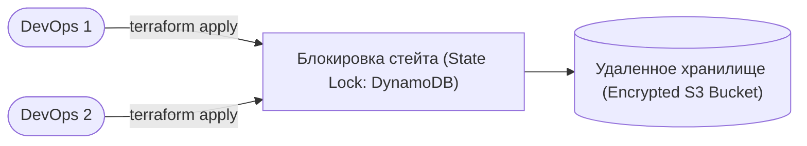

# 🏗️ 02. Remote State, Модульность и Terragrunt

## 🔒 Безопасное хранение стейта (Remote State & Locking)

Стейт-файл (`terraform.tfstate`) хранит полное соответствие реальной инфраструктуры вашему коду и содержит конфиденциальные данные (пароли, ключи, приватные IP).



### Конфигурация бэкенда в S3 + DynamoDB:
```hcl
terraform {
  backend "s3" {
    bucket         = "mycompany-terraform-states"
    key            = "production/vpc/terraform.tfstate"
    region         = "eu-central-1"
    encrypt        = true
    dynamodb_table = "terraform-state-locks" # Предотвращает одновременный apply
  }
}
```

### Команды работы со стейтом:
```bash
# Список всех ресурсов в текущем стейте
terraform state list

# Детальный просмотр параметров ресурса в стейте
terraform state show aws_instance.web_nodes["worker-1"]

# Переименование ресурса без его пересоздания
terraform state mv aws_instance.old_name aws_instance.new_name

# Удаление ресурса из-под управления Terraform (ресурс в облаке остается жить!)
terraform state rm aws_security_group.legacy_sg

# Снятие зависшей блокировки (если упал CI)
terraform force-unlock <LOCK-ID>
```

---

## 🏗️ Создание переиспользуемых модулей

Структура модуля `modules/vpc`:
```hcl
# modules/vpc/variables.tf
variable "cidr_block" {
  type        = string
  description = "IPv4 CIDR block for VPC"
}

# modules/vpc/main.tf
resource "aws_vpc" "this" {
  cidr_block           = var.cidr_block
  enable_dns_hostnames = true
  enable_dns_support   = true
}

# modules/vpc/outputs.tf
output "vpc_id" {
  value       = aws_vpc.this.id
  description = "ID созданной VPC"
}
```

Вызов модуля:
```hcl
module "production_vpc" {
  source     = "./modules/vpc"
  cidr_block = "10.100.0.0/16"
}
```

---

##  DRY инфраструктура с Terragrunt

Terragrunt — это обертка над Terraform, которая убирает дублирование конфигураций бэкенда и провайдеров (DRY: Don't Repeat Yourself).

### Пример `terragrunt.hcl` для модуля приложения с зависимостью:
```hcl
# Автоматически наследует S3 бэкенд и генерацию провайдера из корневого terragrunt.hcl
include "root" {
  path = find_in_parent_folders()
}

# Ссылка на исходный модуль
terraform {
  source = "git::git@github.com:company/tf-modules.git//app-cluster?ref=v1.2.0"
}

# Зависимость от модуля VPC (передает output vpc_id на вход текущему модулю)
dependency "vpc" {
  config_path = "../vpc"
  mock_outputs = {
    vpc_id = "vpc-mock-12345"
  }
}

# Входные переменные для модуля
inputs = {
  vpc_id        = dependency.vpc.outputs.vpc_id
  instance_type = "t3.xlarge"
  min_size      = 3
  max_size      = 10
}
```

---
## 🔬 Deep Dive: структура стейта и blast radius

| Антипаттерн | Последствие | Решение |
| :--- | :--- | :--- |
| Один стейт на всю компанию | любой apply трогает всё, 40+ минут plan | стейт на окружение+компонент |
| Стейт локально у инженера | потеря = пересоздание инфры | remote backend сразу же |
| Секреты в outputs | пароли в открытом виде в стейте | Vault / ephemeral ресурсы |
| `default` теги забыт | нет ownership ресурсов | `provider default_tags` |

### Terragrunt: иерархия каталогов как DRY-конфигурация

```text
infrastructure-live/
├── terragrunt.hcl            # корневой: генерация провайдера+backend
├── prod/
│   ├── env.hcl               # environment inputs
│   ├── vpc/
│   │   └── terragrunt.hcl
│   └── eks/
│       └── terragrunt.hcl    # dependency на ../vpc
└── staging/
    └── ...
```

```bash
terragrunt run-all plan --terragrunt-detect-root    # план по всем модулям параллельно
terragrunt run-all apply --queue-exclude-no-changes # применить только измененное
```

!!! danger «State surgery»
    `state mv/rm` выполняется мгновенно и без плана. Делайте backup: `terraform state pull > backup.tfstate` перед любыми операциями.

---

<!-- enriched:v1 -->

## 🧨 Типовые грабли Production

| Симптом | Причина | Быстрое решение |
| :--- | :--- | :--- |
| Пайплайн зеленый, прод сломан | Разница окружений / secrets не из Vault | Проверять конфиги через `conftest` + smoke-тесты после деплоя |
| `terraform apply` висит на lock | Умерший CI оставил lock | `force-unlock` после проверки активности |
| Ansible «работает» но ничего не меняет | `changed_when` не настроен | Явные `changed_when`/`failed_when` для команд |
| GitOps откатывает ручной фикс | Drift между Git и кластером | Править только в Git; `selfHeal` оставить включенным |

!!! warning «Идемпотентность — закон»
    Любой скрипт/плейбук/модуль должен быть безопасно перезапускаемым. Если второй прогон меняет состояние — это баг, который однажды уронит прод.

## 🧪 Hands-on Lab

```bash
terragrunt hclfmt --check 2>/dev/null || terraform fmt -check -recursive; \
terraform state list | head -20 && terraform output -json | jq 'keys'
```

## ✅ Чек-лист зрелости темы

- [ ] Все изменения проходят через PR с обязательным review

    ??? tip "Как закрыть пункт"
        Branch protection запрещает push в main; изменения инфраструктуры/конфигов — только через MR с review. Проверка: история применений соответствует истории мержей, «горячие правки на сервере» отсутствуют как класс.

- [ ] Секреты никогда не хранятся в коде/стейте (Vault/SOPS/secret manager)

    ??? tip "Как закрыть пункт"
        Vault/ESO как источник; gitleaks в pre-commit и CI. Для стейтов — шифрование бэкенда и ограничение доступа IAM. Аудит: grep по репозиторию находит ссылки на переменные, но не значения.

- [ ] Есть dry-run/plan этап и он виден в MR

    ??? tip "Как закрыть пункт"
        plan/--check --diff выполняется CI на каждый MR и публикуется в комментарий — ревьюер видит изменения инфраструктуры до approve. Артефакт плана переиспользуется при apply.

- [ ] Откат воспроизводим одной командой (< 10 минут)

    ??? tip "Как закрыть пункт"
        git revert + pipeline = откат инфраструктуры; helm rollback/GitOps revert для релизов. Отработано учением с таймером: решение → восстановленный сервис. Если есть ручные шаги — они в runbook.

- [ ] Логи пайплайна содержат версии артефактов (image digest, commit SHA)

    ??? tip "Как закрыть пункт"
        Deploy-джоба печатает: SHA коммита, digest образа, версии инструментов. При инциденте вы точно знаете, какой код где исполнялся. Проверка: по логу можно восстановить состояние прода на любой момент.

---

## 🧭 Что дальше

| Шаг | Материал |
| :--- | :--- |
| 🔬 Закрепить | [Lab 05: remote state](../16-guided-labs/05-lab-terraform-localstack.md) |
| ➡️ Дальше | [Тестирование и CI для IaC](03-terraform-testing-ci-and-state-ops.md) |

---

## ✅ Проверь себя

**В1. Почему remote state обязателен команде и что даёт locking?**
<details><summary>Ответ</summary>
Локальный state не делится между инженерами. Remote backend (S3+DynamoDB/GCS/TFC) хранит его централизованно; lock запрещает параллельный apply — иначе два плана перезапишут изменения друг друга и инфра разъедется со state'ом.
</details>

**В2. State содержит секреты. Действия?**
<details><summary>Ответ</summary>
Шифрование бакета (SSE-KMS), жёсткий IAM; минимизировать сами секреты в tf (Vault/ESO вместо provider-паролей). Утечка state считается компрометацией всего содержимого → ротация.
</details>

**В3. Какую проблему решает Terragrunt?**
<details><summary>Ответ</summary>
DRY мультиэнва: общий конфиг backend/провайдеров/версий в одном месте, автогенерация remote state per-env, зависимости стеков (dependency outputs) вместо копипасты root-модулей.
</details>

**В4. Как правильно прокинуть значение из одного стека в другой?**
<details><summary>Ответ</summary>
outputs + terraform_remote_state data source или terragrunt dependency. Явные outputs документируют контракт слоёв (network → cluster → apps); ручное чтение чужого state — антипаттерн.
</details>

**В5. Ломающее изменение модуля v1.x. Стратегия релиза?**
<details><summary>Ответ</summary>
Новая major-версия отдельным путём/тегом (modules/vpc/v2), consumers мигрируют по расписанию, старая версия живёт рядом до завершения. Breaking change = новая версия, а не правка существующей.
</details>
