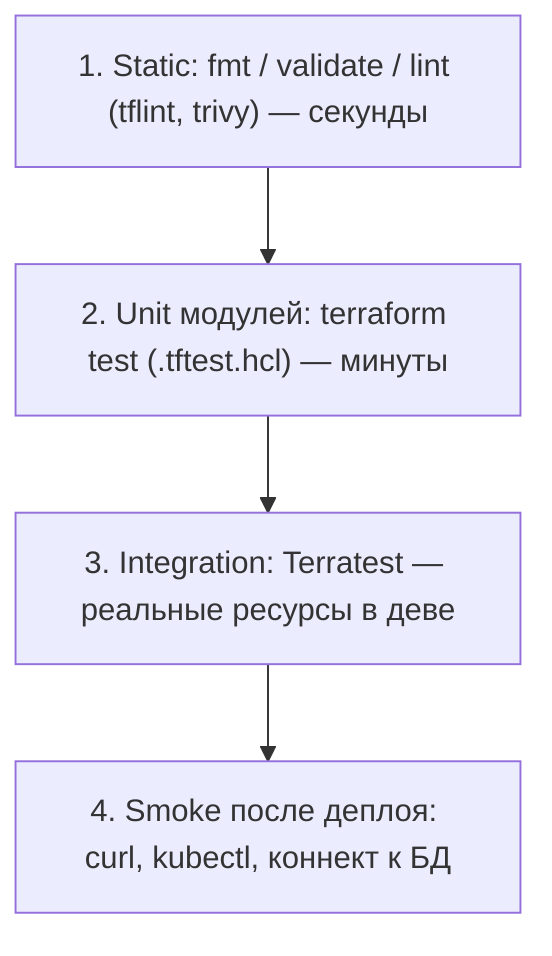
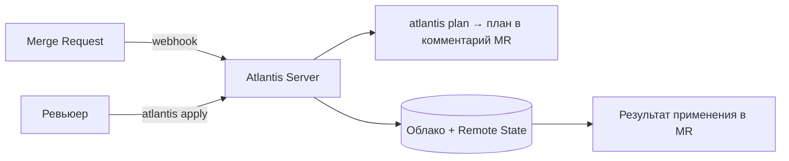

# 🧪 03. Terraform: Тестирование, CI-автоматизация и Операции со Стейтом

## ⚙️ Уровни тестирования IaC

Тесты для инфраструктуры — это пирамида: чем выше уровень, тем дороже прогон.



| Уровень | Инструмент | Что ловит |
| :--- | :--- | :--- |
| Static | `tflint`, `trivy config`, `conftest` (OPA) | Ошибки провайдера, небезопасные Security Groups, отсутствие тегов |
| Unit | `terraform test` (нативный, TF ≥ 1.6) | Логика locals/for_each/функций без облака |
| Integration | Terratest (Go) | Что ресурс реально создаётся и работает |
| Policy as Code | OPA/conftest, Sentinel, Checkov | Соответствие политикам компании |

---

## 📝 Нативное тестирование: `terraform test` (TF ≥ 1.6)

Файлы `*.tftest.hcl` рядом с модулем. Работают с mock-провайдерами — облако не нужно.

```hcl
# tests/vpc.tftest.hcl
mock_provider "aws" {}

run "defaults" {
  command = plan

  assert {
    condition     = aws_vpc.main.cidr_block == "10.0.0.0/16"
    error_message = "VPC CIDR должен быть 10.0.0.0/16 по умолчанию"
  }

  assert {
    condition     = length(aws_subnet.private) == 3
    error_message = "Ожидаем 3 приватные подсети (по AZ)"
  }
}

variables {
  environment = "test"
  vpc_cidr    = "10.0.0.0/16"
}
```

```bash
terraform test                          # все тесты каталога tests/
terraform test -verbose                 # с выводом плана каждого run
```

!!! tip "Что тестировать unit-тестами"
    Только чистую логику: вычисления CIDR через `cidrsubnet`, маппинги `locals`, условия `count`/`for_each`. Проверять «создастся ли EC2» юнит-тестом бессмысленно — это работа интеграционного уровня.

---

## 🐬 Интеграционные тесты: Terratest

Terratest создаёт реальные ресурсы в отдельном аккаунте/проекте, проверяет их и **обязательно уничтожает** (`defer terraform.Destroy`).

```go
// test/vpc_test.go
package test

import (
	"testing"

	"github.com/gruntwork-io/terratest/modules/terraform"
	"github.com/stretchr/testify/assert"
)

func TestVpcModule(t *testing.T) {
	t.Parallel()

	opts := &terraform.Options{
		TerraformDir: "../examples/vpc",
		Vars: map[string]interface{}{
			"environment": "terratest",
		},
	}

	defer terraform.Destroy(t, opts)
	terraform.InitAndApply(t, opts)

	vpcID := terraform.Output(t, opts, "vpc_id")
	assert.Regexp(t, "^vpc-[a-f0-9]+$", vpcID)
}
```

```bash
cd test && go mod init github.com/company/tf-tests && go get github.com/gruntwork-io/terratest && go test -timeout 45m
```

- Запускать только на MR и по расписанию (nightly) — прогон стоит реальных денег.
- Всегда уникальные имена ресурсов (`terratest.RandomUniqueIdentifier`) — иначе гонки между джобами.

---

## 🤖 Atlantis: PR-driven автоматизация

Atlantis слушает вебхуки GitLab/GitHub и сам выполняет `plan`/`apply` в комментариях MR. Альтернатива Terraform Cloud.



Минимальный `repos.yaml`:

```yaml
repos:
  - id: /.*/
    allowed_overrides: [workflow]
    apply_requirements: [approved, mergeable]   # apply только из одобренного MR
    workflow: default
workflows:
  default:
    plan:
      steps:
        - init
        - plan
    apply:
      steps:
        - apply
```

Ключевые настройки безопасности:

- **`apply_requirements: [approved, mergeable]`** — никто не применяет стейт без ревью.
- **Server-side workspace config** вместо репозиториев — не доверять `.yml` из чужих веток.
- Секреты облачных провайдеров — только через Vault/IRSA/Workload Identity, не переменными Atlantis.
- Для monorepo — `autoplan` по изменённым каталогам (`when_modified`).

---

## 🚚 Операции со стейтом: миграции, импорт, дрейф

### Перенос ресурсов между стейтами (без пересоздания)

```bash
# Вынести VPC из общего стейта в отдельный network-стейт
terraform state mv -state-out=network.tfstate module.network.aws_vpc.main aws_vpc.main

# В новом проекте подключить выгруженное как remote state data source
terraform state pull > backup-before-mv.json   # ВСЕГДА бэкап перед операциями
```

### Импорт существующей инфраструктуры (TF ≥ 1.5, декларативно)

```hcl
# import.tf
import {
  to = aws_instance.app
  id = "i-0abc123def456"
}

import {
  to = module.rds.aws_db_instance.main
  id = "prod-postgres-01"
}
```

```bash
terraform plan -generate-config-out=generated.tf   # HCL сгенерирован автоматически
# Ревизия generated.tf руками → привести к стандартам модуля → apply
```

### Борьба с дрейфом

```bash
terraform plan -refresh-only                    # показать только изменения вне кода
terraform apply -refresh-only                   # принять факт (стейт догнал реальность)
terraform apply -refresh-only -target=aws_instance.app   # точечно
```

Регламент: **ночной cron** `plan -detailed-exitcode`; exit code `2` (есть diff) → алерт в Slack. Дрейф либо устраняется (откат рукам), либо легализуется (импорт в код).

---

## ⚡ CI-пайплайн для Terraform (GitLab CI)

```yaml
tf:
  stage: verify
  image: hashicorp/terraform:1.9
  before_script:
    - terraform init -backend-config="key=${CI_PROJECT_PATH}/${TF_DIR}"
  script:
    - terraform fmt -check -recursive
    - terraform validate
    - tflint --recursive
    - conftest verify --policy policies/        # OPA-политики
    - terraform plan -out=tfplan -detailed-exitcode || export RC=$?
    - 'if [ "$RC" == "2" ]; then echo "Есть изменения"; fi'
    - terraform show -json tfplan > plan.json
  artifacts:
    paths: [tfplan]
    reports:
      terraform: plan.json
    expire_in: 1 week
```

Правила хорошего пайплайна:

1. `plan` — на каждый MR, артефакт плана прикладывается к MR.
2. `apply` — только из защищённой ветки/тега, вручную (`when: manual`).
3. Locking через backend (S3+DynamoDB / PG / GCS) — обязательное условие параллельных пайплайнов.
4. Версии провайдеров пинить (`~>`, не `>=`) и кэшировать `.terraform` по ключу lockfile.

---

## 🔬 Deep Dive: почему стейт-операции опаснее самого кода

Большинство инцидентов с IaC — не плохой HCL, а операции со стейтом вслепую:

- **`state rm` ≠ удаление ресурса** — ресурс отвязывается от управления, но живёт в облаке («осиротевшая» инфраструктура). Обратно — только через `import`.
- **Порядок миграций**: сначала `state pull` бэкап → потом `mv` → потом `push`. Никогда не редактировать стейт руками в JSON.
- **Два человека + один стейт** = повреждение. Lock обязателен даже локально (`terraform plan` уже берёт lock в remote backend).
- **Sensitive-данные в стейте** (`aws_db_instance.password`): стейт шифровать на бэкенде (S3 SSE-KMS) + доступ к бакету = доступ ко всем секретам проекта. Это надо учитывать в threat model.

---

## 🧨 Типовые грабли Production

| Симптом | Причина | Быстрое решение |
| :--- | :--- | :--- |
| `Error acquiring the state lock` после падения CI | Джоба умерла, не сняв lock | `terraform force-unlock <LOCK_ID>` после проверки, что ничего не выполняется |
| После `state mv` всё «пересоздаётся» | Разные адреса модулей/индексы | Сверить адреса через `terraform state list` до и после; план должен быть пустым |
| Terratest оставил мусор в облаке | Тест упал до `defer Destroy` | Nightly-джоба поиска ресурсов с тегом `terratest` старше 1 дня |
| Atlantis apply прошёл, а стейт в другом workspace | Разные workspaces локально и на сервере | Зафиксировать workspace-маппинг в server-side конфиге |
| `plan` зелёный, `apply` красный «429 rate limit» | Провайдер упёрся в лимиты API | Увеличить retry провайдера, снизить `-parallelism`, разнести проекты по времени |
| Импорт сгенерировал 3000 строк generated.tf | Импорт «как есть», без абстракций | Рефакторинг в модуль с переменными, а не коммит генерации |

## 🧪 Hands-on Lab

```bash
# 1. Юнит-тест модуля без облака
mkdir -p demo && cd demo
cat > main.tf <<'EOF'
resource "aws_vpc" "main" { cidr_block = var.cidr }
variable "cidr" { default = "10.0.0.0/16" }
EOF
cat > tests/main.tftest.hcl <<'EOF'
mock_provider "aws" {}
run "cidr" {
  command = plan
  assert { condition = aws_vpc.main.cidr_block == "10.0.0.0/16"
           error_message = "CIDR mismatch" }
}
EOF
terraform init && terraform test

# 2. Безопасная миграция стейта (на локальном file backend)
terraform state list
terraform state pull > backup.json
terraform state mv aws_vpc.main aws_vpc.renamed && terraform plan   # ожидаем: no changes
```

## ✅ Чек-лист зрелости темы

- [ ] Каждый модуль покрыт `terraform test` (логика) или Terratest (ресурсы)
- [ ] Plan виден в MR автоматически (Atlantis/TFC/CI-бот), apply — только после approve
- [ ] Ночной контроль дрейфа с алертом
- [ ] Бэкап стейта делается перед любой state-операцией
- [ ] Стейт зашифрован на бэкенде, доступ ограничен IAM-политикой
- [ ] Политики (OPA/Checkov) блокируют merge, а не просто предупреждают

---

## 🧭 Что дальше

| Шаг | Материал |
| :--- | :--- |
| 🔬 Закрепить | [Lab 05: план на MR](../16-guided-labs/05-lab-terraform-localstack.md) |
| 🎤 Проверить себя | [Вопросы: Terraform](../14-interview-prep/04-100-devops-interview-questions-bank-part2.md) |

---

## ✅ Проверь себя

**В1. Что проверяет terraform validate против plan?**
<details><summary>Ответ</summary>
validate — статика: синтаксис HCL, типы, обязательные аргументы, БЕЗ обращения к API/state. plan — динамика: реальный diff против инфры, интерполяция данных, refresh state. В CI: fmt → validate → plan (комментарий в MR), apply — только по мержу.
</details>

**В2. Terratest: как устроен типовой тест модуля?**
<details><summary>Ответ</summary>
go test: terraform.InitAndApply(stagingOptions) → assert'ы по outputs/реальным ресурсам (HTTP-проверка LB, SSH) → terraform.Destroy в defer. Медленно (реальная инфра!), поэтому гоняют nightly/stage-only, а в MR — plan-diff + policy checks.
</details>

**В3. Atlantis решает какую проблему?**
<details><summary>Ответ</summary>
GitOps для Terraform: plan выполняется автоматически по комментарию/PR и результат публикуется в MR; apply — комментарием atlantis apply с RBAC. Исчезают локальные запуски с продовыми кредами; locking встроенно защищает от параллельных планов.
</details>

**В4. Стейт разъехался с реальностью (drift). Команды приведения?**
<details><summary>Ответ</summary>
terraform plan показывает diff. Ручные правки вне tf: либо импортировать их (terraform import / import block), либо удалить из стейта (state rm) чтобы tf создал заново, либо вернуть инфру apply'ем. Профилактика: запрет ручных изменений IAM'ом + периодический plan по расписанию.
</details>

**В5. Как безопасно переименовать ресурс в коде без пересоздания?**
<details><summary>Ответ</summary>
moved block (Terraform 1.1+): moved { from = aws_instance.old, to = aws_instance.new } — план перенесёт адрес в стейте без destroy/create. Для legacy — terraform state mv.
</details>
