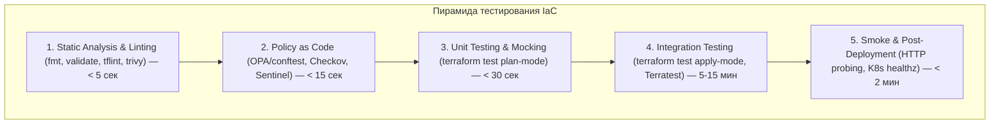
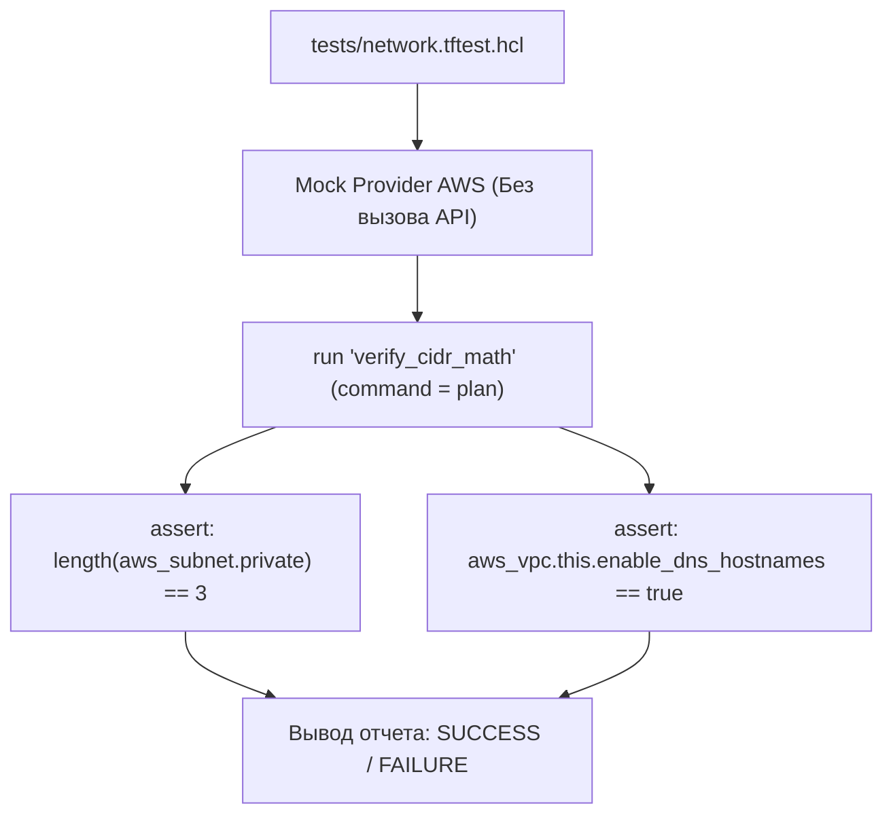
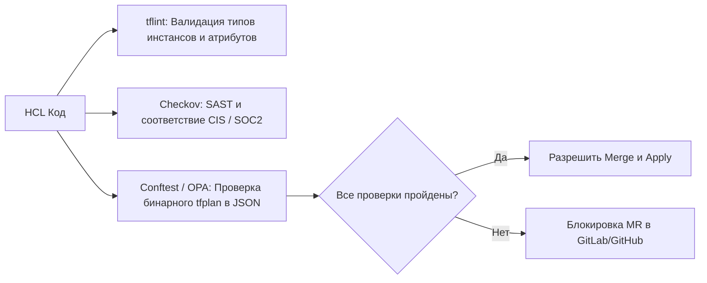
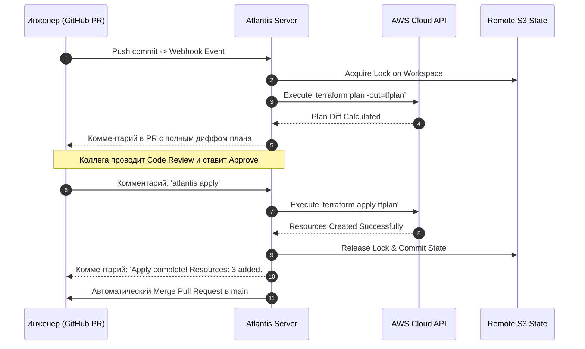

# 🧪 03. Тестирование, CI/CD Автоматизация, Рефакторинг и Импорт в Terraform

## ⚙️ Пирамида тестирования Infrastructure as Code

Надежность инфраструктурного кода строится на многоуровневой системе проверок: от мгновенного статического анализа синтаксиса до интеграционных тестов с реальным созданием ресурсов в изолированных песочницах (Sandbox Accounts).



---

### Сравнение инструментов тестирования и валидации

| Уровень | Инструмент | Скорость | Требует облако? | Что проверяет |
| :--- | :--- | :--- | :--- | :--- |
| **Lint & Syntax** | `terraform fmt`, `tflint` | ~1-3 сек | Нет | Форматирование, недопустимые типы инстансов, устаревший HCL синтаксис |
| **Security SAST** | `checkov`, `tfsec`, `trivy` | ~5-10 сек | Нет | Открытые порты 0.0.0.0/0, отсутствие шифрования S3/EBS, утечки секретов |
| **Policy as Code** | `conftest` (OPA/Rego), `Sentinel` | ~5 сек | Нет | Корпоративные политики: обязательные теги, допустимые регионы |
| **Unit Testing** | `terraform test` (TF >= 1.6) | ~10-20 сек | Нет (с mock-провайдерами) | Логика locals, вычисление CIDR, условия `for_each`, assertions |
| **Integration** | `Terratest` (Go), `tftest apply` | ~5-30 мин | **Да** (Sandbox) | Реальное создание ресурсов, сквозная маршрутизация, DNS резолв |

---

## 🧪 Нативное тестирование: `terraform test` (TF ≥ 1.6)

Встроенный фреймворк тестирования оперирует файлами `*.tftest.hcl` в каталоге `tests/`. Он поддерживает как сухой прогон плана (**Unit Test** с мок-провайдерами), так и реальное развертывание (**Integration Test**).



### Пример файла тестов `tests/vpc_unit.tftest.hcl`:

```hcl
# tests/vpc_unit.tftest.hcl
# Мокирование провайдера AWS — тесты запускаются локально и в CI без облачных ключей!
mock_provider "aws" {}

# Входные тестовые переменные
variables {
  environment        = "test"
  vpc_cidr           = "10.50.0.0/16"
  availability_zones = ["eu-central-1a", "eu-central-1b", "eu-central-1c"]
  enable_nat_gateway = true
}

# Тестовый шаг 1: Проверка базовых вычислений подсетей в режиме plan
run "verify_subnets_calculation" {
  command = plan

  # Проверка создания ровно 3 подсетей
  assert {
    condition     = length(aws_subnet.public) == 3
    error_message = "Количество публичных подсетей должно строго соответствовать числу AZ!"
  }

  # Проверка расчета CIDR блоков через cidrsubnet
  assert {
    condition     = aws_subnet.public["eu-central-1a"].cidr_block == "10.50.0.0/20"
    error_message = "Неверный расчет CIDR блока для первой публичной подсети!"
  }

  # Проверка обязательных тегов
  assert {
    condition     = aws_vpc.this.tags["Environment"] == "test"
    error_message = "Тег Environment в VPC не соответствует входной переменной!"
  }
}

# Тестовый шаг 2: Проверка переопределения переменных и отключения NAT
run "verify_nat_disabled" {
  command = plan

  variables {
    enable_nat_gateway = false
  }

  assert {
    condition     = length(aws_nat_gateway.this) == 0
    error_message = "NAT Gateway не должен создаваться при enable_nat_gateway = false!"
  }
}
```

```bash
# Запуск всех тестов в каталоге tests/
terraform test

# Запуск с подробным выводом этапов выполнения
terraform test -verbose
```

---

## 🐬 Интеграционное тестирование: Terratest (Go)

Terratest позволяет писать интеграционные тесты на языке Go. Фреймворк выполняет полный цикл: инициализация -> создание реальной инфраструктуры в AWS/GCP/Azure -> проверка работоспособности (Healthchecks, HTTP-запросы, подключение к БД) -> **гарантированное уничтожение** ресурсов (`defer terraform.Destroy`).

```go
// test/vpc_cluster_test.go
package test

import (
	"crypto/tls"
	"fmt"
	"strings"
	"testing"
	"time"

	http_helper "github.com/gruntwork-io/terratest/modules/http-helper"
	"github.com/gruntwork-io/terratest/modules/random"
	"github.com/gruntwork-io/terratest/modules/terraform"
	"github.com/stretchr/testify/assert"
)

func TestVpcAndAlbDeployment(t *testing.T) {
	t.Parallel()

	// Генерация уникального префикса для предотвращения конфликтов в параллельных CI
	uniqueID := strings.ToLower(random.UniqueId())
	expectedClusterName := fmt.Sprintf("terratest-%s", uniqueID)

	terraformOptions := terraform.WithDefaultRetryableErrors(t, &terraform.Options{
		TerraformDir: "../examples/complete-alb-vpc",

		Vars: map[string]interface{}{
			"environment":  "sandbox",
			"cluster_name": expectedClusterName,
			"aws_region":   "eu-central-1",
		},

		// Автоматические повторы при временных сбоях AWS API (Rate Limiting)
		MaxRetries:         3,
		TimeBetweenRetries: 10 * time.Second,
	})

	// Гарантированное уничтожение ресурсов после окончания теста
	defer terraform.Destroy(t, terraformOptions)

	// Выполнение terraform init && terraform apply
	terraform.InitAndApply(t, terraformOptions)

	// Получение выходных параметров
	albDNS := terraform.Output(t, terraformOptions, "alb_dns_name")
	vpcID := terraform.Output(t, terraformOptions, "vpc_id")

	// 1. Проверка формата VPC ID
	assert.True(t, strings.HasPrefix(vpcID, "vpc-"), "VPC ID должен начинаться с vpc-")

	// 2. Сквозная проверка доступности веб-сервиса через ALB по HTTP
	targetURL := fmt.Sprintf("http://%s/healthz", albDNS)
	tlsConfig := tls.Config{}

	// Ожидание ответа 200 OK в течение 3 минут (с прогревом ALB и регистрацией таргетов)
	http_helper.HttpGetWithRetryWithCustomValidation(
		t,
		targetURL,
		&tlsConfig,
		30,               // 30 попыток
		6*time.Second,    // интервал 6 сек
		func(statusCode int, body string) bool {
			return statusCode == 200 && strings.Contains(body, "healthy")
		},
	)
}
```

```bash
# Инициализация и запуск Terratest
cd test
go mod tidy
go test -v -timeout 45m -run TestVpcAndAlbDeployment
```

---

## 🛡️ Policy as Code и Статический Анализ (Security Gate)

Внедрение статических проверок в CI/CD блокирует небезопасные конфигурации до того, как они попадут в `terraform apply`.



### 1. Checkov: Конфигурация и исключения

```yaml
# .checkov.yaml
framework:
  - terraform
quiet: true
compact: true
soft-fail: false # Упасть с ненулевым кодом возврата при нахождении HIGH/CRITICAL уязвимостей
download-external-modules: true
check:
  - CKV_AWS_18  # S3 bucket access logging
  - CKV_AWS_19  # S3 bucket SSE encryption
  - CKV_AWS_144 # S3 cross-region replication
  - CKV_AWS_260 # Ingress port 22 disabled to 0.0.0.0/0
```

Подавление ложноположительных срабатываний прямо в коде:
```hcl
resource "aws_security_group_rule" "allow_ssh_bastion" {
  type        = "ingress"
  from_port   = 22
  to_port     = 22
  protocol    = "tcp"
  cidr_blocks = ["198.51.100.1/32"] # Ограниченный корпоративный IP

  #checkov:skip=CKV_AWS_24: "SSH разрешен только с корпоративного VPN/Бастиона"
  security_group_id = aws_security_group.bastion.id
}
```

---

### 2. OPA / Conftest: Корпоративные Rego-политики

Политика запрещает создание открытых Security Group с портом 0.0.0.0/0 для всего, кроме HTTP/HTTPS:

```rego
# policy/terraform_sg.rego
package terraform.security

import future.keywords.in

default allow = true

# Поиск всех создаваемых правил Security Group в tfplan
deny[msg] {
    resource := input.resource_changes[_]
    resource.type == "aws_security_group_rule"
    resource.change.actions[_] in ["create", "update"]

    cidr := resource.change.after.cidr_blocks[_]
    cidr == "0.0.0.0/0"

    port := resource.change.after.from_port
    not port in [80, 443]

    msg := sprintf("НАРУШЕНИЕ ПОЛИТИКИ: Ресурс '%v' открывает порт %v для всего мира (0.0.0.0/0)!", [resource.address, port])
}
```

```bash
# Валидация плана через Conftest
terraform show -json tfplan.binary > tfplan.json
conftest test tfplan.json -p policy/
```

---

## 🚚 Декларативный рефакторинг (`moved`) и современный `import`

### 1. Декларативный рефакторинг с блоком `moved` (TF ≥ 1.1)

Больше не нужно вручную запускать `terraform state mv` на машинах инженеров. Блоки `moved` фиксируются в коде и выполняют перенос адресов в стейте автоматически при очередном `terraform plan/apply`.

```hcl
# 1. Переименование одиночного ресурса
moved {
  from = aws_instance.web_server
  to   = aws_instance.frontend_app
}

# 2. Вынос существующего ресурса внутрь нового модуля
moved {
  from = aws_security_group.legacy_sg
  to   = module.security.aws_security_group.app_sg
}

# 3. Бесшовный перевод с count на for_each
moved {
  from = aws_subnet.public[0]
  to   = aws_subnet.public["eu-central-1a"]
}
moved {
  from = aws_subnet.public[1]
  to   = aws_subnet.public["eu-central-1b"]
}
```

---

### 2. Декларативный импорт с генерацией кода (`import` blocks, TF ≥ 1.5)

Ранее `terraform import` требовал вручную писать HCL-код до импорта. Теперь Terraform умеет генерировать HCL-код автоматически.

```hcl
# import.tf
import {
  to = aws_s3_bucket.legacy_data
  id = "company-legacy-archive-bucket"
}

import {
  to = aws_instance.billing_worker
  id = "i-0987654321fedcba0"
}
```

```bash
# 1. Автоматическая генерация HCL-кода для импортируемых ресурсов
terraform plan -generate-config-out=generated_resources.tf

# 2. Инспекция и приведение сгенерированного generated_resources.tf к стандартам проекта
# 3. Применение импорта в стейт
terraform apply -auto-approve

# 4. Удаление временного import.tf
rm import.tf
```

---

## 🤖 Production GitOps: Atlantis и GitHub Actions с OIDC

### 1. Архитектура Atlantis (PR-driven Automation)

Atlantis слушает вебхуки из GitHub/GitLab, блокирует окружение от параллельных правок и выполняет `plan`/`apply` по командам в комментариях Pull Request.



```yaml
# repos.yaml (Server-Side Config)
repos:
  - id: github.com/company/infrastructure-live
    branch: /main/
    apply_requirements:
      - approved     # Apply запрещен без аппрува от ревьюера
      - mergeable    # Apply запрещен, если есть конфликты с main
    allow_custom_workflows: false
    allowed_overrides: []
    workflow: production_secure

workflows:
  production_secure:
    plan:
      steps:
        - init
        - run: tflint --recursive
        - run: checkov -d . --framework terraform
        - plan:
            extra_args: ["-detailed-exitcode"]
    apply:
      steps:
        - apply
```

---

### 2. GitHub Actions Production Pipeline с AWS OIDC (Без паролей и ключей!)

```yaml
# .github/workflows/terraform.yml
name: "Terraform Production GitOps"

on:
  pull_request:
    branches: [main]
  push:
    branches: [main]

permissions:
  id-token: write # Требуется для запроса AWS OIDC JWT токена
  contents: read
  pull-requests: write

jobs:
  terraform-ci:
    name: "Validate, Lint & Plan"
    runs-on: ubuntu-latest
    steps:
      - name: Checkout Code
        uses: actions/checkout@v4

      # Аутентификация в AWS через OIDC Federation (Zero Hardcoded Secrets)
      - name: Configure AWS Credentials (OIDC)
        uses: aws-actions/configure-aws-credentials@v4
        with:
          role-to-assume: arn:aws:iam::111122223333:role/GitHubActionsTerraformRole
          aws-region: eu-central-1

      - name: Setup Terraform
        uses: hashicorp/setup-terraform@v3
        with:
          terraform_version: 1.7.5

      - name: Terraform Format Check
        run: terraform fmt -check -recursive

      - name: Terraform Init
        run: terraform init

      - name: Terraform Validate
        run: terraform validate

      - name: Run Checkov Security Scan
        uses: bridgecrewio/checkov-action@master
        with:
          framework: terraform
          soft_fail: false

      - name: Terraform Plan
        id: plan
        if: github.event_name == 'pull_request'
        run: |
          terraform plan -no-color -out=tfplan.binary
          terraform show -no-color tfplan.binary > tfplan.txt

      - name: Post Plan Diff to PR
        uses: actions/github-script@v7
        if: github.event_name == 'pull_request'
        with:
          script: |
            const fs = require('fs');
            const planOutput = fs.readFileSync('tfplan.txt', 'utf8');
            const maxLen = 60000;
            const truncated = planOutput.length > maxLen ? planOutput.substring(0, maxLen) + '\n...[TRUNCATED]' : planOutput;
            github.rest.issues.createComment({
              issue_number: context.issue.number,
              owner: context.repo.owner,
              repo: context.repo.repo,
              body: `### 📋 Terraform Plan Output\n\`\`\`hcl\n${truncated}\n\`\`\``
            });

      - name: Terraform Apply (On Merge to Main)
        if: github.ref == 'refs/heads/main' && github.event_name == 'push'
        run: |
          terraform plan -out=tfplan.binary
          terraform apply -auto-approve tfplan.binary
```

---

## 🧨 Production Break-Fix Scenarios

### Сценарий 1: Утечка стейта в логах CI из-за `sensitive = false`

```text
СИМПТОМ:
В публичных логах GitHub Actions / GitLab CI отобразился мастер-пароль RDS базы данных:
master_password: "SuperSecretPassword123!"
```

- **Root Cause:** Выходная переменная `output "rds_password"` или входная `variable "db_password"` не содержали модификатора `sensitive = true`.
- **Решение:**
  1. Немедленно выполнить ротацию скомпрометированного пароля в AWS Secrets Manager / Vault.
  2. Добавить `sensitive = true` во входные и выходные переменные:
     ```hcl
     output "db_password" {
       value     = aws_db_instance.main.password
       sensitive = true
     }
     ```
  3. В CI-пайплайне использовать маскирование (`::add-mask::`).

---

### Сценарий 2: Гонка пайплайнов (Race Condition) при одновременном Merge

```text
СИМПТОМ:
Два Pull Request были смержены одновременно. Первый apply прошел успешно,
второй упал с ошибкой 'Error acquiring the state lock'.
```

- **Root Cause:** Отсутствие механизма Concurrency Groups в GitHub Actions.
- **Решение:** Добавить ограничение конкурентности в workflow:
  ```yaml
  concurrency:
    group: terraform-production-lock
    cancel-in-progress: false # Дождаться окончания первого apply, не отменяя его!
  ```

---

## 🧪 Hands-on Lab: Написание Unit-теста для модуля

```bash
# 1. Создание каталога лабораторной
mkdir -p /tmp/tf-test-lab/tests && cd /tmp/tf-test-lab

# 2. Создание файла модуля main.tf
cat <<'EOF' > main.tf
variable "environment" {
  type    = string
  default = "production"
}

variable "base_cidr" {
  type    = string
  default = "10.0.0.0/16"
}

locals {
  tier_name = var.environment == "production" ? "prod-tier" : "non-prod-tier"
}

resource "local_file" "config" {
  filename = "${path.module}/output_config.json"
  content = jsonencode({
    tier = locals.tier_name
    cidr = var.base_cidr
  })
}

output "calculated_tier" {
  value = locals.tier_name
}
EOF

# 3. Написание unit-теста tests/config.tftest.hcl
cat <<'EOF' > tests/config.tftest.hcl
run "verify_prod_tier" {
  command = plan

  variables {
    environment = "production"
    base_cidr   = "10.100.0.0/16"
  }

  assert {
    condition     = output.calculated_tier == "prod-tier"
    error_message = "Tier для production окружения должен быть строго prod-tier!"
  }
}

run "verify_dev_tier" {
  command = plan

  variables {
    environment = "development"
  }

  assert {
    condition     = output.calculated_tier == "non-prod-tier"
    error_message = "Tier для development окружения должен быть non-prod-tier!"
  }
}
EOF

# 4. Запуск теста
terraform init
terraform test
```

---

## ✅ Чек-лист зрелости: Тестирование и CI/CD

- [ ] **Модули покрыты `terraform test`:** Проверена логика locals, валидации переменных и граничные условия.
- [ ] **Статический анализ в pre-commit:** `tflint` и `terraform fmt` запускаются до отправки коммита.
- [ ] **Security Gate блокирует PR:** Checkov / Trivy настроены с `soft-fail: false` на уязвимости HIGH/CRITICAL.
- [ ] **Zero Hardcoded Secrets в CI:** Аутентификация в облаке работает исключительно через OIDC (AssumeRoleWithWebIdentity).
- [ ] **Планы публикуются в PR:** Ревьюер видит полный дифф создаваемых/изменяемых ресурсов до Approve.
- [ ] **Apply изолирован:** Прямой запуск `terraform apply` с локальных ноутбуков инженеров запрещен правами доступа IAM.

---

## 🧭 Что дальше

| Шаг | Тема | Ссылка |
| :--- | :--- | :--- |
| 🛡️ Следующий шаг | OpenTofu, Разработка Провайдеров и Управление Дрейфом | [04-opentofu-providers-and-drift.md](file:///mnt/c/Users/aazimov/Desktop/qek/doka/docs/06-terraform/04-opentofu-providers-and-drift.md) |
| 📜 Ansible | Архитектура Ansible и управление серверами | [01-ansible-architecture-and-playbooks.md](file:///mnt/c/Users/aazimov/Desktop/qek/doka/docs/07-ansible/01-ansible-architecture-and-playbooks.md) |

---

## ❓ Проверь себя

**В1. Чем отличается тестирование через `terraform test` в режиме `command = plan` от `command = apply`?**
<details><summary>Ответ</summary>
В режиме <code>command = plan</code> выполняется синтаксический анализ, интерполяция выражений, locals, условий и генерация плана (включая работу с mock-провайдерами) без обращения к реальным облачным API и без выделения инфраструктуры. Это быстро и бесплатно (Unit Testing). В режиме <code>command = apply</code> Terraform реально создает ресурсы в тестовом аккаунте, проверяет постусловия и уничтожает созданное после окончания тестов (Integration Testing).
</details>

**В2. Какую проблему решает блок `moved` по сравнению с командой `terraform state mv`?**
<details><summary>Ответ</summary>
Команда <code>terraform state mv</code> является императивной и модифицирует стейт локально или удаленно вне системы контроля версий. Если в команде несколько инженеров или работает CI, каждый должен синхронизировать свои действия. Блок <code>moved</code> декларативен: он коммитится в Git вместе с рефакторингом кода, автоматически и безопасно применяется в любом окружении и пайплайне ровно один раз при вызове <code>plan/apply</code> без риска сбоев.
</details>

**В3. Почему при интеграции CI/CD с AWS рекомендуется использовать OIDC вместо постоянных IAM Access Keys?**
<details><summary>Ответ</summary>
Постоянные Access Keys (AKIA...) имеют неограниченный срок действия, могут утечь через логи, артефакты или недобросовестных сотрудников и требуют регулярной ручной ротации. OIDC (OpenID Connect) позволяет GitHub Actions или GitLab CI запрашивать короткоживущие временные токены (STS AssumeRoleWithWebIdentity) на время работы конкретной джобы с жестким ограничением по репозиторию, ветке и окружению.
</details>
