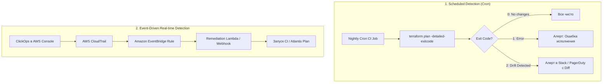

# 🛡️ 04. OpenTofu, Разработка Провайдеров и Управление Дрейфом (Drift)

## 🌐 OpenTofu vs Terraform: Архитектурные различия и Эволюция

В августе 2023 года HashiCorp сменила лицензию Terraform с Mozilla Public License v2.0 (MPL-2.0) на Business Source License v1.1 (BUSL / BSL). В ответ сообщество создало форк **OpenTofu** под эгидой **Linux Foundation**, гарантирующий вечную открытость и совместимость.

```mermaid
graph TD
    TF["Terraform (до v1.5.7, MPL-2.0)"] --> Fork{"BSL Лицензионная развилка"}
    Fork -->|HashiCorp (BSL 1.1 / Коммерческие ограничения)| TFModern["Terraform >= 1.6 (Vendor Lock-in риск)"]
    Fork -->|Linux Foundation (MPL-2.0, Open Governance)| OpenTofu["OpenTofu >= 1.6 (100% Open Source)"]

    OpenTofu --> Feat1["State Encryption at Rest (KMS / AES-GCM)"]
    OpenTofu --> Feat2["Early Variable Evaluation (Variables in Backend)"]
    OpenTofu --> Feat3["OpenTofu Registry (registry.opentofu.org)"]
```

---

### Сравнительный анализ: OpenTofu vs Terraform

| Параметр | OpenTofu (Linux Foundation) | Terraform (HashiCorp) |
| :--- | :--- | :--- |
| **Лицензия** | **MPL-2.0** (Полностью открытая, без ограничений) | **BSL 1.1** (Ограничение на коммерческое использование конкурентами) |
| **Управление** | Linux Foundation (Нейтральное сообщество) | HashiCorp / IBM (Корпоративное управление) |
| **Шифрование стейта** | **Нативное сквозное шифрование** (KMS, AES-GCM, PBKDF2) в State и Plan файлах | Отсутствует на уровне движка (только на уровне диска/бэкенда) |
| **Переменные в бэкенде** | Поддерживается (Early Evaluation `var.environment` в `backend`) | Требует хаков, `-backend-config` или Terragrunt |
| **Реестр провайдеров** | `registry.opentofu.org` (Независимый) | `registry.terraform.io` (Контролируется HashiCorp) |
| **Совместимость** | 100% совместимость с HCL2 и существующими модулями | Оригинальная реализация |

---

### Нативное шифрование стейта в OpenTofu (State Encryption)

В отличие от классического Terraform, где секреты хранятся в JSON-файле стейта в открытом виде, OpenTofu умеет шифровать стейт и бинарные планы на уровне приложения с использованием локальных ключей или облачных KMS:

```hcl
# encryption.tofu
terraform {
  encryption {
    key_provider "aws_kms" "production_key" {
      kms_key_id = "arn:aws:kms:eu-central-1:111122223333:key/a1b2c3d4-e5f6-7a8b-9c0d-1e2f3a4b5c6d"
      region     = "eu-central-1"
    }

    # Настройка шифрования самого файла стейта
    method "aes_gcm" "state_encryption" {
      keys = key_provider.aws_kms.production_key
    }

    # Настройка шифрования бинарных планов (tfplan)
    method "aes_gcm" "plan_encryption" {
      keys = key_provider.aws_kms.production_key
    }

    state {
      method   = method.aes_gcm.state_encryption
      enforced = true # Запретить запись незашифрованного стейта
    }

    plan {
      method   = method.aes_gcm.plan_encryption
      enforced = true
    }
  }
}
```

---

## 🛠️ Разработка кастомных провайдеров (Terraform Plugin Framework)

Современные провайдеры для Terraform и OpenTofu разрабатываются на языке Go с использованием библиотеки `terraform-plugin-framework` и взаимодействуют с ядром через gRPC по протоколу **Plugin Protocol v6**.

```mermaid
graph LR
    Core["Terraform / OpenTofu Core"] <-->|gRPC (Protocol v6)| Framework["terraform-plugin-framework"]
    Framework --> Schema["Схема типов (Schema & Attr Types)"]
    Framework --> CRUD["CRUD Методы (Create, Read, Update, Delete)"]
    CRUD --> CloudSDK["Внешний HTTP / REST API клиент"]
```

### 1. Архитектура и интерфейс ресурса (`resource.Resource`)

Каждый ресурс провайдера обязан реализовать интерфейс жизненного цикла:
- **`Metadata`:** Задает имя ресурса (например, `customcloud_virtual_machine`).
- **`Schema`:** Описывает структуру HCL-аргументов, их типы, обязательность и вычисляемость (`computed`).
- **`Create`:** Выполняет создание объекта во внешнем API и сохраняет полученные данные в стейт.
- **`Read`:** Считывает текущее состояние объекта из API для обнаружения дрейфа.
- **`Update`:** Модифицирует существующий объект без его пересоздания.
- **`Delete`:** Удаляет объект во внешнем сервисе.
- **`ImportState`:** Позволяет импортировать существующий ресурс по идентификатору.

---

### 2. Реализация минимального рабочего ресурса на Go

```go
// internal/provider/resource_kv_item.go
package provider

import (
	"context"
	"fmt"
	"net/http"

	"github.com/hashicorp/terraform-plugin-framework/resource"
	"github.com/hashicorp/terraform-plugin-framework/resource/schema"
	"github.com/hashicorp/terraform-plugin-framework/resource/schema/planmodifier"
	"github.com/hashicorp/terraform-plugin-framework/resource/schema/stringplanmodifier"
	"github.com/hashicorp/terraform-plugin-framework/types"
)

var _ resource.Resource = &KVItemResource{}
var _ resource.ResourceWithImportState = &KVItemResource{}

type KVItemResource struct {
	client *http.Client
}

// Модель стейта ресурса
type KVItemModel struct {
	Key       types.String `tfsdk:"key"`
	Value     types.String `tfsdk:"value"`
	Version   types.Int64  `tfsdk:"version"`
	UpdatedAt types.String `tfsdk:"updated_at"`
}

func (r *KVItemResource) Metadata(ctx context.Context, req resource.MetadataRequest, resp *resource.MetadataResponse) {
	resp.TypeName = req.ProviderTypeName + "_kv_item"
}

func (r *KVItemResource) Schema(ctx context.Context, req resource.SchemaRequest, resp *resource.SchemaResponse) {
	resp.Schema = schema.Schema{
		Description: "Управляет записью Key-Value в централизованном хранилище конфигураций.",
		Attributes: map[string]schema.Attribute{
			"key": schema.StringAttribute{
				Description: "Уникальный ключ записи.",
				Required:    true,
				PlanModifiers: []planmodifier.String{
					stringplanmodifier.RequiresReplace(), // Смена ключа требует пересоздания
				},
			},
			"value": schema.StringAttribute{
				Description: "Значение ключа.",
				Required:    true,
				Sensitive:   true, // Скрытие паролей в CLI
			},
			"version": schema.Int64Attribute{
				Description: "Версия записи в KV хранилище.",
				Computed:    true,
			},
			"updated_at": schema.StringAttribute{
				Description: "Временная метка последнего обновления.",
				Computed:    true,
			},
		},
	}
}

func (r *KVItemResource) Create(ctx context.Context, req resource.CreateRequest, resp *resource.CreateResponse) {
	var plan KVItemModel
	diags := req.Plan.Get(ctx, &plan)
	resp.Diagnostics.Append(diags...)
	if resp.Diagnostics.HasError() {
		return
	}

	// Симуляция вызова внешнего REST API
	keyStr := plan.Key.ValueString()
	valStr := plan.Value.ValueString()

	// Установка вычисленных атрибутов
	plan.Version = types.Int64Value(1)
	plan.UpdatedAt = types.StringValue("2026-09-02T12:00:00Z")

	// Сохранение итогового состояния в стейт
	diags = resp.State.Set(ctx, plan)
	resp.Diagnostics.Append(diags...)
}

func (r *KVItemResource) Read(ctx context.Context, req resource.ReadRequest, resp *resource.ReadResponse) {
	var state KVItemModel
	diags := req.State.Get(ctx, &state)
	resp.Diagnostics.Append(diags...)
	if resp.Diagnostics.HasError() {
		return
	}

	// Запрос актуального состояния из API
	// Если ресурс удален во внешнем API:
	// resp.State.RemoveResource(ctx)
}

func (r *KVItemResource) Update(ctx context.Context, req resource.UpdateRequest, resp *resource.UpdateResponse) {
	var plan KVItemModel
	diags := req.Plan.Get(ctx, &plan)
	resp.Diagnostics.Append(diags...)
	if resp.Diagnostics.HasError() {
		return
	}

	plan.Version = types.Int64Value(plan.Version.ValueInt64() + 1)
	diags = resp.State.Set(ctx, plan)
	resp.Diagnostics.Append(diags...)
}

func (r *KVItemResource) Delete(ctx context.Context, req resource.DeleteRequest, resp *resource.DeleteResponse) {
	// Вызов DELETE /api/v1/keys/{key}
}

func (r *KVItemResource) ImportState(ctx context.Context, req resource.ImportStateRequest, resp *resource.ImportStateResponse) {
	resource.ImportStatePassthroughID(ctx, path.Root("key"), req, resp)
}
```

---

## 🔍 Управление Дрейфом (Drift Detection & Automated Remediation)

Дрейф инфраструктуры (**Infrastructure Drift**) — это расхождение между реальным состоянием ресурсов в облаке и состоянием, зафиксированным в коде и стейте.

### Причины возникновения дрейфа:
1. **ClickOps:** Ручные изменения инженеров через веб-консоль облака во время инцидентов.
2. **Auto-mutations:** Сторонние контроллеры (AWS Auto Scaling, Kubernetes mutating webhooks, Spot-прерывания).
3. **Обновления по умолчанию:** Облачный провайдер изменяет дефолтные значения параметров API.



---

### 1. Периодический аудит через Exit-коды (`-detailed-exitcode`)

Команда `plan` со специальным флагом возвращает специфические коды возврата:
- **`0`:** Успех, изменений нет (**Diff = 0**).
- **`1`:** Критическая ошибка синтаксиса или соединения с API.
- **`2`:** Успех, **обнаружен дрейф инфраструктуры** (есть ресурсы на добавление, изменение или удаление).

```bash
#!/usr/bin/env bash
# scripts/detect_drift.sh
set -uo pipefail

echo "==> Запуск детекции дрейфа для окружения ${ENVIRONMENT}..."
terraform init -backend-config="env/${ENVIRONMENT}/backend.tfvars" > /dev/null

# Выполнение плана с сохранением exit code
EXIT_CODE=0
terraform plan -detailed-exitcode -no-color -out=drift.plan > drift_output.txt || EXIT_CODE=$?

if [ "$EXIT_CODE" -eq 0 ]; then
  echo "✅ Дрейф не обнаружен. Реальная инфраструктура полностью соответствует коду."
  exit 0
elif [ "$EXIT_CODE" -eq 2 ]; then
  echo "⚠️ ОБНАРУЖЕН ДРЕЙФ ИНФРАСТРУКТУРЫ!"
  
  # Извлечение JSON диффа для отправки в систему мониторинга
  terraform show -json drift.plan | jq '{resource_changes: [.resource_changes[] | select(.change.actions != ["no-op"]) | {address: .address, actions: .change.actions}]}' > drift_summary.json
  
  # Отправка уведомления в Slack Webhook
  curl -X POST -H 'Content-type: application/json' \
    --data "{\"text\": \"🚨 *Внимание:* Обнаружен дрейф в окружении *${ENVIRONMENT}*!\n\`\`\`$(cat drift_summary.json)\`\`\`\"}" \
    "${SLACK_WEBHOOK_URL}"
    
  exit 2
else
  echo "❌ Ошибка при выполнении terraform plan!"
  cat drift_output.txt
  exit 1
fi
```

---

### 2. Стратегии автоматического устранения дрейфа (Remediation)

```mermaid
graph LR
    Drift["Дрейф обнаружен"] --> Strategy{"Выбор стратегии"}
    Strategy -->|Критичный Production| StrategyAlert["Alert & Manual Review (Безопасно)"]
    Strategy -->|Тестовые среды (Dev/Stage)| StrategyAutoApply["Auto-Revert Apply (Жесткая синхронизация)"]
    Strategy -->|Легитимные ручные правки| StrategyPR["Auto-PR / Import (Синхронизация в код)"]
```

1. **Auto-Revert (Автоматический откат):**
   Применяется в dev/stage средах. CI автоматически запускает `terraform apply -auto-approve`, затирая любые ручные изменения и возвращая систему к состоянию из Git.
2. **Alert & Review (Уведомление и ручной аудит):**
   Применяется в production. Инженер анализирует дифф, выясняет причину ручной правки и либо откатывает ее через apply, либо вносит правку в Git.
3. **Auto-PR Generation:**
   Специальный бот выполняет `import` или корректирует переменные в HCL и создает Pull Request на рассмотрение команды.

---

## ⚡ CLI Cheat Sheet: OpenTofu & Drift Operations

```bash
# ==========================================
# 1. OpenTofu CLI команды
# ==========================================
# Инициализация с использованием открытого реестра OpenTofu
tofu init

# Просмотр статуса шифрования стейта
tofu state show

# Миграция существующего стейта Terraform на шифрование OpenTofu
tofu init -reconfigure

# Тестирование HCL логики
tofu test

# ==========================================
# 2. Управление и аудит дрейфа
# ==========================================
# Показать ТОЛЬКО дрейф без генерации плана изменений кода
tofu plan -refresh-only

# Принять факт дрейфа и обновить стейт под реальность (без изменения облака)
tofu apply -refresh-only -auto-approve

# Генерация отчета по дрейфу в формате JSON
tofu plan -out=drift.tfplan
tofu show -json drift.tfplan | jq '.resource_changes[] | select(.change.actions != ["no-op"])'
```

---

## 🧨 Production Break-Fix Scenarios

### Сценарий 1: Утеря ключа шифрования OpenTofu State

```text
СИМПТОМ:
Error: Failed to decrypt state snapshot: KMS.NotFoundException: Key does not exist.
```

- **Root Cause:** AWS KMS ключ, использовавшийся для шифрования стейта в блоке `encryption`, был удален или деактивирован в IAM.
- **Решение:**
  1. Немедленно отменить удаление KMS ключа через AWS CLI (`aws kms cancel-key-deletion --key-id ...`).
  2. Для защиты от случайного удаления ключей всегда включать KMS Key Deletion Window 30 дней и назначать `prevent_destroy = true` на сам KMS ключ в коде.

---

### Сценарий 2: Зацикливание Auto-Revert из-за автоскейлинга AWS

```text
СИМПТОМ:
Ночной Cron apply бесконечно меняет параметр 'desired_capacity' у Auto Scaling Group с 5 на 2,
а утром сервисы падают под нагрузкой.
```

- **Root Cause:** AWS ASG динамически масштабирует инстансы под нагрузкой, а Terraform имеет в коде жестко зафиксированное `desired_capacity = 2`. При каждом запуске детекции дрейфа Terraform считает динамическое масштабирование дрейфом и сбрасывает размер пула.
- **Решение:** Добавить `desired_capacity` в блок `ignore_changes`:
  ```hcl
  resource "aws_autoscaling_group" "app" {
    # ...
    lifecycle {
      ignore_changes = [
        desired_capacity,
        target_group_arns
      ]
    }
  }
  ```

---

## 🧪 Hands-on Lab: Настройка детекции дрейфа на локальных файлах

```bash
# 1. Создание лабораторного каталога
mkdir -p /tmp/drift-lab && cd /tmp/drift-lab

# 2. Создание базового HCL файла
cat <<'EOF' > main.tf
terraform {
  required_providers {
    local = {
      source  = "hashicorp/local"
      version = "~> 2.4"
    }
  }
}

resource "local_file" "app_config" {
  filename = "${path.module}/config.ini"
  content  = "mode=production\nlog_level=info\n"
}
EOF

# 3. Первичное развертывание
terraform init
terraform apply -auto-approve

# 4. Симуляция несанкционированного ClickOps дрейфа (ручная правка)
echo "mode=hacked_by_manual_edit" > config.ini

# 5. Детекция дрейфа через exit code
EXIT_CODE=0
terraform plan -detailed-exitcode -no-color || EXIT_CODE=$?

echo "Exit Code детекции: $EXIT_CODE" # Ожидается 2 (Дрейф найден)

# 6. Автоматическое устранение (Auto-Remediation)
terraform apply -auto-approve
cat config.ini # Файл вернулся к каноничному виду mode=production
```

---

## ✅ Чек-лист зрелости: OpenTofu и Управление Дрейфом

- [ ] **State зашифрован на уровне приложения:** В OpenTofu настроен блок `encryption` с KMS ключом.
- [ ] **Настроен регулярный Scheduled Drift Detection:** Cron-джоба в CI запускается не реже 1 раза в сутки.
- [ ] **Exit Code `2` обрабатывается корректно:** Настроен алерт в Slack/PagerDuty с JSON-диффом изменений.
- [ ] **Исключены динамические атрибуты:** В `ignore_changes` внесены теги автоскейлинга, размеры пулов и динамические метаданные.
- [ ] **Кастомные провайдеры покрыты юнит-тестами:** Для in-house провайдеров реализован `resource.Test` с проверкой CRUD.

---

## 🧭 Что дальше

| Шаг | Тема | Ссылка |
| :--- | :--- | :--- |
| 📜 Ansible | Архитектура Ansible, SSH и Диспетчеризация | [01-ansible-architecture-and-playbooks.md](file:///mnt/c/Users/aazimov/Desktop/qek/doka/docs/07-ansible/01-ansible-architecture-and-playbooks.md) |
| 🎭 Ansible Roles | Роли, Jinja2, Vault и Безопасность | [02-roles-vault-and-best-practices.md](file:///mnt/c/Users/aazimov/Desktop/qek/doka/docs/07-ansible/02-roles-vault-and-best-practices.md) |

---

## ❓ Проверь себя

**В1. В чем ключевое преимущество нативного шифрования стейта в OpenTofu перед стандартным шифрованием S3 бакета в Terraform?**
<details><summary>Ответ</summary>
Шифрование S3 бакета (SSE-S3 или SSE-KMS) защищает данные только в момент покоя на дисках Amazon (Encryption at Rest). Однако во время передачи по сети, в локальном кэше раннера и в сгенерированных файлах планов (<code>tfplan</code>) данные находятся в открытом JSON виде. Любой пользователь или процесс с правами чтения S3 бакета видит все секреты. Нативное шифрование OpenTofu шифрует полезную нагрузку (payload) алгоритмом AES-GCM непосредственно внутри движка Core: стейт и планы хранятся в виде зашифрованного шифротекста, а для чтения требуется доступ к KMS ключу независимо от прав на бакет.
</details>

**В2. Что означает exit code `2` при выполнении `terraform plan -detailed-exitcode`?**
<details><summary>Ответ</summary>
Exit code <code>2</code> указывает, что выполнение команды прошло без системных сбоев, но в инфраструктуре обнаружен <strong>дифф (дрейф)</strong>: есть ресурсы, которые требуют создания, изменения или удаления для достижения желаемого состояния. Код <code>0</code> означает полное отсутствие различий, а код <code>1</code> — ошибку выполнения (fatal error).
</details>

**В3. Зачем в кастомном провайдере нужен метод `ImportState`?**
<details><summary>Ответ</summary>
Метод <code>ImportState</code> позволяет связать существующий в облаке ресурс с адресом в конфигурации Terraform (через <code>terraform import</code> или блок <code>import</code>) без необходимости удалять и создавать объект заново. Провайдер считывает переданный ID, парсит его и заполняет первичный стейт, после чего вызывается метод <code>Read</code> для загрузки всех актуальных атрибутов.
</details>
