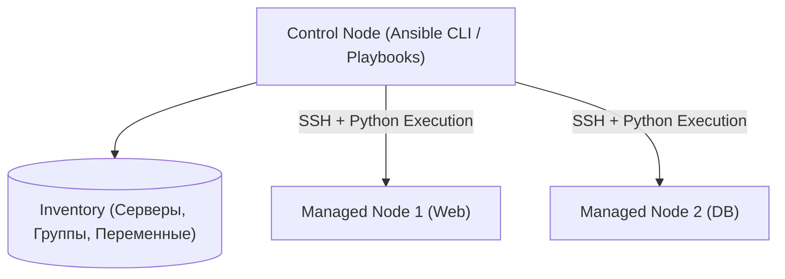

# 📜 01. Архитектура Ansible, Inventory и Плейбуки

## ⚙️ Архитектура Ansible

Ansible — это безагентная (agentless) система управления конфигурациями. Она подключается к управляемым узлам по SSH, копирует скомпилированные Python-модули, исполняет их и удаляет за собой временные файлы.



---

## 🗂️ Инвентарь (Inventory): Статический и Динамический

### Пример `inventory.yaml` с группами и переменными:
```yaml
all:
  children:
    webservers:
      hosts:
        web-01.prod.internal:
          ansible_host: 192.168.10.11
          http_port: 80
        web-02.prod.internal:
          ansible_host: 192.168.10.12
          http_port: 80
      vars:
        app_env: production
    dbservers:
      hosts:
        db-primary.prod.internal:
          ansible_host: 192.168.20.5
          db_role: master
```

---

## 📝 Эталонный Playbook с Handlers и Условиями

Файл `deploy_web.yaml`:
```yaml
---
- name: Настройка и запуск Nginx веб-серверов
  hosts: webservers
  become: true # Запуск под sudo
  gather_facts: true

  vars:
    nginx_worker_connections: 2048
    enable_ssl: true

  tasks:
    - name: Установка Nginx и зависимостей
      ansible.builtin.apt:
        name:
          - nginx
          - curl
        state: present
        update_cache: true
        cache_valid_time: 3600

    - name: Генерация конфигурационного файла из Jinja2 шаблона
      ansible.builtin.template:
        src: templates/nginx.conf.j2
        dest: /etc/nginx/nginx.conf
        owner: root
        group: root
        mode: '0644'
        validate: 'nginx -t -c %s' # Валидация синтаксиса перед заменой!
      notify: Reload Nginx # Вызовет handler только если файл РЕАЛЬНО изменился

    - name: Гарантировать запуск и автозагрузку сервиса Nginx
      ansible.builtin.systemd:
        name: nginx
        state: started
        enabled: true

  # Handlers вызываются один раз в самом конце плейбука
  handlers:
    - name: Reload Nginx
      ansible.builtin.systemd:
        name: nginx
        state: reloaded
```

---

## ⚡ Ad-hoc команды и CLI Cheat Sheet

```bash
# Проверка доступности всех серверов (Ping модуль)
ansible all -i inventory.yaml -m ping

# Быстрый перезапуск сервиса на группе хостов
ansible webservers -i inventory.yaml -b -m systemd -a "name=nginx state=restarted"

# Проверка синтаксиса плейбука
ansible-playbook -i inventory.yaml deploy_web.yaml --syntax-check

# Сухой прогон без внесения изменений (Dry-run / Check mode)
ansible-playbook -i inventory.yaml deploy_web.yaml --check --diff

# Запуск только с определенного шага (Step) или по тегам
ansible-playbook -i inventory.yaml deploy_web.yaml --tags "config"
```

---

## 🔬 Deep Dive: выполнение плейбука изнутри

1. **Inventory parse** → hosts/groups (INI/YAML/dynamic plugin из облака).
2. **Facts gather** (`setup`) → переменные узла, если `gather_facts: true`.
3. **Task execution:** каждый task → template module → Python zip → SSH exec → JSON stdout обратно.
4. **Strategy plugin:** linear (дефолт, батчи по `serial`) / free / host_pinned.

### Управление сложностью

```yaml
- name: Настроить веб-серверы поэтапно (rolling)
  hosts: webservers
  serial: "25%"                    # батчами — живая половина всегда принимает трафик
  max_fail_percentage: 0           # остановиться при первой ошибке
  strategy: linear
  vars_files:
    - "vars/{{ ansible_fqdn }}.yml"   # переопределение per-host
  tasks:
    - name: Проверить, что сервис отвечает до ухода ноды из LB
      ansible.builtin.uri:
        url: "http://{{ inventory_hostname }}/healthz"
      delegate_to: localhost
      register: health
      until: health.status == 200
      retries: 10
      delay: 6
```

```bash
ansible-inventory --graph --vars | head -40      # что реально резолвится
ansible all -m setup -a 'filter=ansible_memtotal_mb'
ansible-playbook site.yml --start-at-task="Install nginx" --step
```

!!! tip «Check mode»
    `--check` + `--diff`: dry-run с показом изменений файлов. Если роль не поддерживает check_mode — это техдолг, фиксируйте `check_mode: false` осознанно.

---

<!-- enriched:v1 -->

## 🧨 Типовые грабли Production

| Симптом | Причина | Быстрое решение |
| :--- | :--- | :--- |
| Пайплайн зеленый, прод сломан | Разница окружений / secrets не из Vault | Проверять конфиги через `conftest` + smoke-тесты после деплоя |
| `terraform apply` висит на lock | Умерший CI оставил lock | `force-unlock` после проверки активности |
| Ansible «работает» но ничего не меняет | `changed_when` не настроен | Явные `changed_when`/`failed_when` для команд |
| GitOps откатывает ручной фикс | Drift между Git и кластером | Править только в Git; `selfHeal` оставить включенным |

!!! warning «Идемпотентность — закон»
    Любой скрипт/плейбук/модуль должен быть безопасно перезапускаемым. Если второй прогон меняет состояние — это баг, который однажды уронит прод.

## 🧪 Hands-on Lab

```bash
ansible-inventory --graph | head && ansible all -m ping -o && \
ansible-playbook site.yml --syntax-check --list-tasks | head -30
```

## ✅ Чек-лист зрелости темы

- [ ] Все изменения проходят через PR с обязательным review
- [ ] Секреты никогда не хранятся в коде/стейте (Vault/SOPS/secret manager)
- [ ] Есть dry-run/plan этап и он виден в MR
- [ ] Откат воспроизводим одной командой (< 10 минут)
- [ ] Логи пайплайна содержат версии артефактов (image digest, commit SHA)
