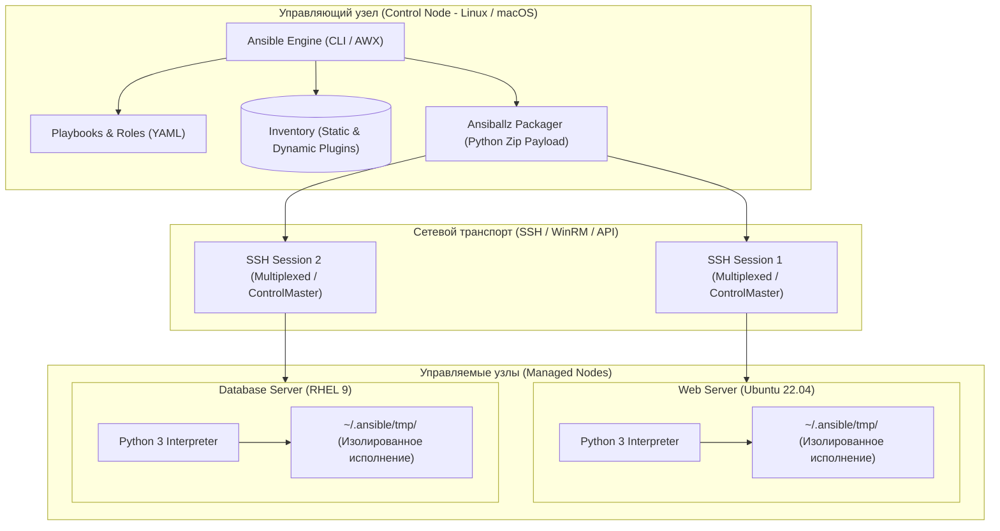
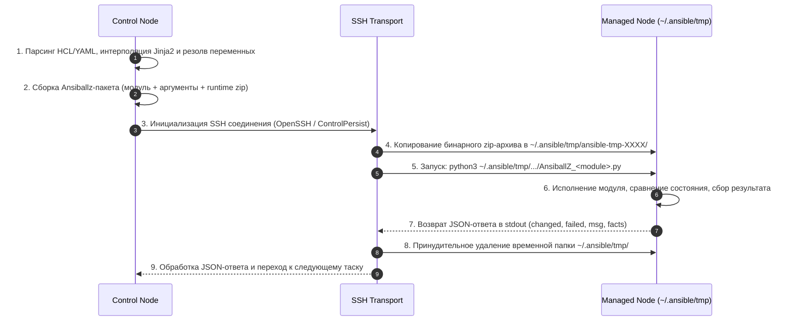
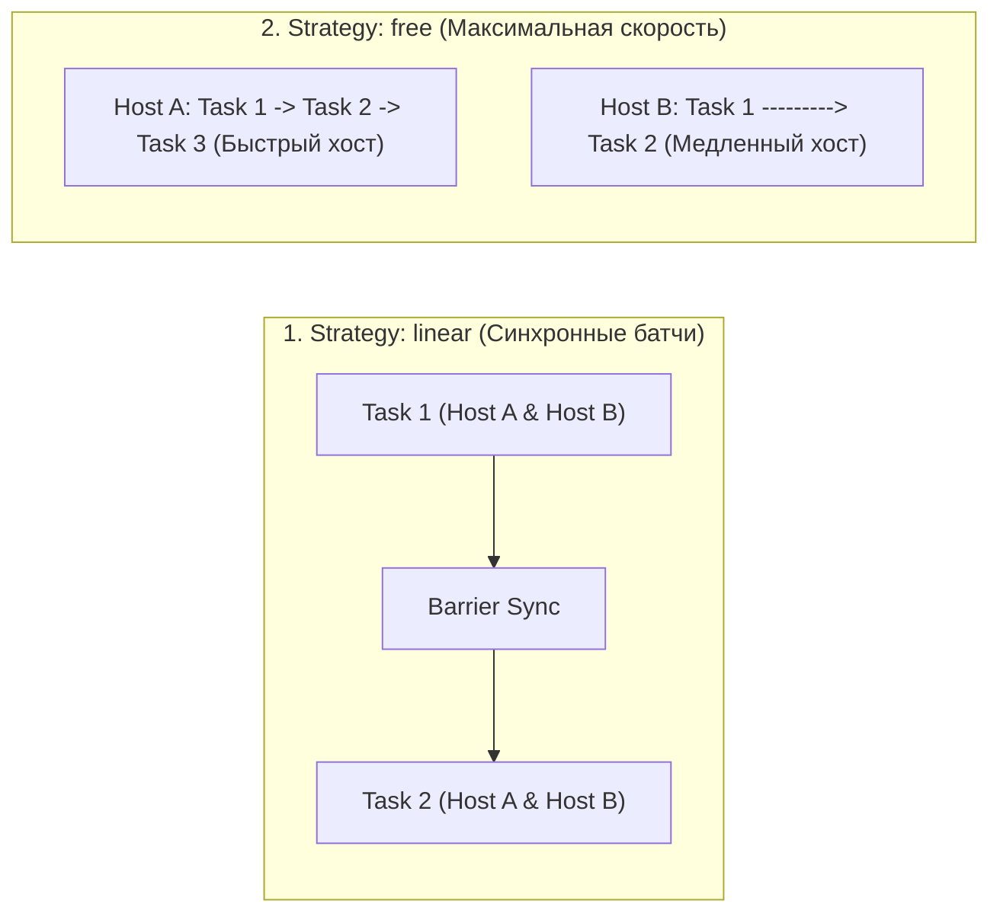
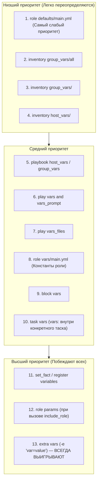
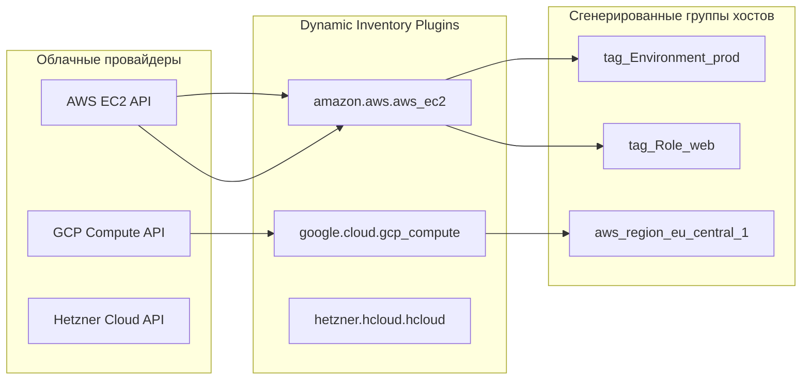

# 📜 01. Архитектура Ansible, Диспетчеризация и Плейбуки

## ⚙️ Архитектура Ansible: Движок выполнения и Agentless-модель

Ansible — это безагентная (**agentless**) система управления конфигурацией и оркестрации. В отличие от агентных решений (Chef, Puppet, SaltStack), Ansible не требует установки и поддержания постоянных фоновых демонов на управляемых узлах.



---

### 1. Жизненный цикл выполнения задачи (Ansiballz Execution Lifecycle)

Каждое действие в плейбуке проходит строгий конвейер трансформации и исполнения:



1. **Генерация полезной нагрузки (Ansiballz):** Ansible упаковывает Python-код модуля (`ansible.builtin.template`, `ansible.builtin.apt` и т.д.) вместе с аргументами в компактный zip-файл, кодирует его в base64 и подготавливает скрипт-обертку.
2. **Передача и запуск:** По SFTP/SCP скрипт загружается на целевой хост во временную директорию `~/.ansible/tmp/`, где выполняется стандартным системным интерпретатором Python.
3. **Безопасная очистка:** После завершения задачи временная директория гарантированно удаляется.

---

### 2. Bootstrap "голых" серверов (Zero Python Bootstrapping)

Если на свежеустановленном сервере отсутствует Python, стандартные модули Ansible завершатся ошибкой. Для первичной инициализации используются низкоуровневые модули `raw` или `script`, исполняющие команды напрямую через SSH-шелл:

```yaml
# bootstrap.yml
---
- name: Подготовка голого сервера (Bootstrap Python)
  hosts: all
  gather_facts: false # Факты собирать нельзя, пока нет Python!
  become: true

  tasks:
    - name: Установка Python 3 через модуль raw (Debian/Ubuntu)
      ansible.builtin.raw: |
        test -e /usr/bin/python3 || (apt-get update && apt-get install -y python3 python3-apt)
      changed_when: false
      when: ansible_os_family is not defined or ansible_os_family == "Debian"

    - name: Первичный сбор фактов после появления Python
      ansible.builtin.setup:
```

---

## 📋 Анатомия Playbook и стратегии диспетчеризации

### 1. Структура Playbook

```yaml
# deploy_app.yml
---
- name: Развертывание и обновление кластера приложений
  hosts: app_servers
  strategy: linear          # linear (дефолт) | free | host_pinned
  serial: "25%"             # Rolling update: по 25% серверов за шаг
  max_fail_percentage: 0    # Остановить rollout при любой ошибке
  become: true              # Эскалация привилегий (sudo)
  gather_facts: true        # Сбор системных фактов (setup)

  vars:
    app_version: "v2.14.0"
    app_port: 8080

  vars_files:
    - "vars/environment_{{ env_name }}.yml"

  pre_tasks:
    - name: Исключение ноды из балансировщика нагрузки (Drain)
      ansible.builtin.command: /usr/local/bin/lb-cli drain --node {{ inventory_hostname }}
      delegate_to: load_balancer_master # Делегирование выполнения на балансировщик
      changed_when: true

  tasks:
    - name: Установка пакета приложения
      ansible.builtin.package:
        name: "mycompany-backend={{ app_version }}"
        state: present
      notify: Перезапуск службы бэкенда

    - name: Генерация конфигурации приложения
      ansible.builtin.template:
        src: app_config.json.j2
        dest: /etc/mycompany/config.json
        owner: appuser
        group: appuser
        mode: '0600'
        validate: '/usr/local/bin/app-validator --check %s'
      notify: Перезапуск службы бэкенда

  post_tasks:
    - name: Проверка работоспособности сервиса (Healthcheck)
      ansible.builtin.uri:
        url: "http://127.0.0.1:{{ app_port }}/healthz"
        status_code: 200
      register: health
      until: health.status == 200
      retries: 12
      delay: 5

    - name: Возврат ноды в балансировщик нагрузки
      ansible.builtin.command: /usr/local/bin/lb-cli enable --node {{ inventory_hostname }}
      delegate_to: load_balancer_master
      changed_when: true

  handlers:
    - name: Перезапуск службы бэкенда
      ansible.builtin.systemd:
        name: mycompany-backend
        state: restarted
        daemon_reload: true
```

---

### 2. Стратегии выполнения (Strategies)



| Стратегия | Поведение | Сценарий применения |
| :--- | :--- | :--- |
| **`linear` (Default)** | Все хосты синхронно выполняют Task 1, ждут самый медленный хост, затем переходят к Task 2. | Кластерные настройки, где важен строгий порядок. |
| **`free`** | Каждый хост выполняет весь плейбук на максимальной скорости без ожидания соседей. | Массовые независимые патчи сотен серверов. |
| **`host_pinned`** | Хосты исполняются параллельно в рамках лимита `forks`, при этом каждый хост проходит задачи последовательно. | Оптимизация памяти на Control Node. |

---

## 🎯 Идемпотентность и управление состоянием

Главный закон Ansible: **любой запуск плейбука обязан быть идемпотентным**. Если целевая система уже находится в требуемом состоянии, повторный запуск должен вернуть `changed=0` и ничего не нарушить.

### Как сделать `command` и `shell` идемпотентными:

```yaml
# 1. Защита через параметр creates / removes (Проверка наличия файла-маркера)
- name: Распаковка бинарного дистрибутива
  ansible.builtin.unarchive:
    src: "https://dl.example.com/app-{{ app_version }}.tar.gz"
    dest: /opt/app/
    remote_src: true
    creates: "/opt/app/bin/app-{{ app_version }}" # Не скачивать и не распаковывать повторно!

# 2. Использование changed_when и failed_when для точного контроля статуса
- name: Инициализация кластерного узла
  ansible.builtin.command: /usr/local/bin/cluster-admin init-node --id {{ node_id }}
  register: init_result
  changed_when: "'Node initialized successfully' in init_result.stdout"
  failed_when:
    - init_result.rc != 0
    - "'Node is already a member of cluster' not in init_result.stderr"

# 3. Принудительное подавление статуса changed для чисто информационных запросов
- name: Получение статуса репликации базы данных
  ansible.builtin.command: patronictl topology
  register: patroni_status
  changed_when: false # Никогда не помечать как changed!
```

---

## 🔔 Жизненный цикл Handlers

Хендлеры (обработчики событий) предназначены для выполнения отложенных реакций (перезапуск демонов, сборка кэша):
- **Срабатывают только при изменении:** Вызываются директивой `notify`, только если задача завершилась со статусом `changed: true`.
- **Дедупликация:** Даже если 10 задач вызвали `notify: Restart Nginx`, хендлер выполнится **ровно один раз** в самом конце текущего Play.
- **Принудительный сброс (Flush Handlers):** Если перезапуск сервиса необходим немедленно в середине плейбука (например, перед запуском зависимого компонента), используется `meta: flush_handlers`.

```yaml
- name: Обновление конфигурации TLS
  ansible.builtin.copy:
    src: ssl.conf
    dest: /etc/nginx/conf.d/ssl.conf
  notify: Restart Web Stack

- name: Обновление upstream пула
  ansible.builtin.template:
    src: upstreams.j2
    dest: /etc/nginx/conf.d/upstreams.conf
  notify: Restart Web Stack

# Принудительное выполнение всех накопленных хендлеров прямо сейчас!
- name: Применение изменений до запуска тестов
  ansible.builtin.meta: flush_handlers

- name: Проверка доступности сайта
  ansible.builtin.uri:
    url: https://example.com/
    status_code: 200

handlers:
  - name: Restart Web Stack
    listen: "Restart Web Stack" # Несколько задач могут слушать один топик
    ansible.builtin.systemd:
      name: nginx
      state: reloaded
```

---

## ⚖️ Приоритет переменных: Все 22 уровня (Variable Precedence)

В Ansible переменные могут определяться во множестве мест. При возникновении конфликта имен побеждает переменная с наивысшим приоритетом.



### Полный список 22 уровней приоритета (от низшего к высшему):

1. `role defaults` (файлы `roles/*/defaults/main.yml`)
2. `inventory file or script group vars`
3. `inventory group_vars/all`
4. `playbook group_vars/all`
5. `inventory group_vars/*`
6. `playbook group_vars/*`
7. `inventory file or script host vars`
8. `inventory host_vars/*`
9. `playbook host_vars/*`
10. `host facts / cached set_facts`
11. `play vars`
12. `play vars_prompt`
13. `play vars_files`
14. `role vars` (файлы `roles/*/vars/main.yml`)
15. `block vars` (переменные блока `block`)
16. `task vars` (переменные таска `vars:`)
17. `include_vars`
18. `set_facts` / `registered vars`
19. `role (and include_role) params`
20. `include params`
21. `extra vars` (флаги `-e` или `--extra-vars` в CLI) — **абсолютный приоритет!**

---

## 🌐 Dynamic Inventory: Подключение к Cloud-провайдерам

Статические INI/YAML файлы инвентаря неприменимы в облаках с динамически сменяющимися IP и автоскейлингом. **Inventory Plugins** опрашивают API провайдеров в реальном времени.



### 1. Конфигурация плагина AWS EC2 (`inventory/aws_ec2.yml`)

```yaml
# inventory/aws_ec2.yml
plugin: amazon.aws.aws_ec2
regions:
  - eu-central-1
  - eu-west-1

# Фильтрация только инстансов, находящихся в статусе running
filters:
  instance-state-name: running
  tag:ManagedBy: Terraform

# Автоматическое формирование групп по тегам и параметрам
keyed_groups:
  # Создаст группы: env_prod, env_stage
  - key: tags.Environment
    prefix: env
    separator: "_"
  # Создаст группы: role_web, role_db
  - key: tags.Role
    prefix: role
    separator: "_"
  # Группировка по типу инстанса
  - key: instance_type
    prefix: type

# Приоритет выбора DNS имени или IP адреса для SSH подключения
hostnames:
  - tag:Name
  - private-ip-address

# Вычисляемые переменные хоста (Jinja2)
compose:
  ansible_host: private_ip_address
  ansible_user: "'ubuntu'"
  ansible_ssh_common_args: "'-o ProxyJump=bastion.company.com'"
```

---

### 2. Конфигурация плагина Google Cloud (`inventory/gcp_compute.yml`)

```yaml
# inventory/gcp_compute.yml
plugin: google.cloud.gcp_compute
projects:
  - corporate-production-project
zones:
  - europe-west3-a
  - europe-west3-b
auth_kind: serviceaccount
service_account_file: /etc/ansible/gcp-sa-key.json

keyed_groups:
  - key: labels.environment
    prefix: gcp_env
  - key: machine_type
    prefix: gcp_type

hostnames:
  - name

compose:
  ansible_host: networkInterfaces[0].networkIP
```

---

## ⚡ CLI Cheat Sheet: Ansible Operations

```bash
# ==========================================
# 1. Ad-Hoc команды и проверка доступности
# ==========================================
# Пинг всех серверов группы webservers
ansible webservers -i inventory/ -m ping

# Сбор фактов конкретного сервера с фильтрацией
ansible web-01.prod -i inventory/ -m setup -a "filter=ansible_distribution*"

# Выполнение shell команды под sudo
ansible db_servers -i inventory/ -b -m shell -a "uptime && free -m"

# Перезапуск сервиса на всех узлах
ansible app_servers -i inventory/ -b -m systemd -a "name=nginx state=reloaded"

# ==========================================
# 2. Управление динамическим инвентарем
# ==========================================
# Просмотр дерева групп динамического инвентаря
ansible-inventory -i inventory/aws_ec2.yml --graph

# Выгрузка всех переменных хостов в формате JSON
ansible-inventory -i inventory/aws_ec2.yml --list

# ==========================================
# 3. Запуск и отладка плейбуков
# ==========================================
# Синтаксическая проверка плейбука
ansible-playbook -i inventory/ site.yml --syntax-check

# Сухой прогон (Dry-run) с выводом диффа изменяемых файлов
ansible-playbook -i inventory/ site.yml --check --diff

# Запуск с ограничением по конкретному хосту и тегам
ansible-playbook -i inventory/ site.yml --limit "web-01.prod" --tags "config,tls"

# Пошаговое интерактивное выполнение задач
ansible-playbook -i inventory/ site.yml --step

# Запуск начиная с конкретного упавшего таска
ansible-playbook -i inventory/ site.yml --start-at-task="Generate TLS Certificate"
```

---

## 🧨 Production Break-Fix Scenarios

### Сценарий 1: Зависание SSH-подключений при `become: true`

```text
СИМПТОМ:
Ansible зависает на первом таске 'Gathering Facts' и падает по таймауту SSH:
fatal: [web-01]: UNREACHABLE! => {"msg": "Failed to connect to the host via ssh: Shared connection to 10.0.1.10 closed."}
```

- **Root Cause:** На целевом узле включен параметр `requiretty` в `/etc/sudoers`, запрещающий выполнение `sudo` без выделенного псевдо-терминала (TTY), либо `pipelining = True` в `ansible.cfg` конфликтует с `requiretty`.
- **Диагностика:**
  ```bash
  ansible web-01 -i inventory/ -m ping -vvvv
  # В отладочном логе видно: sudo: a terminal is required to read the password
  ```
- **Решение:**
  1. В `/etc/sudoers` на серверах удалить или закомментировать: `Defaults requiretty`.
  2. Добавить `Defaults:ansible !requiretty` для пользователя автоматизации.

---

### Сценарий 2: Ложная модификация в `check_mode` для `shell`/`command`

```text
СИМПТОМ:
При запуске 'ansible-playbook --check' шаг с регистрацией узла завершается с ошибкой:
fatal: [db-01]: FAILED! => {"msg": "The conditional check 'reg_output.stdout' failed. Variable is undefined."}
```

- **Root Cause:** В режиме `--check` модуль `command` или `shell` пропускается и не выполняется. Зарегистрированная переменная `reg_output` не получает поле `stdout`. Следующий таск пытается обратиться к `reg_output.stdout` и падает.
- **Решение:** Использовать директиву `check_mode: false` на таске сбора данных:
  ```yaml
  - name: Проверка статуса сервиса
    ansible.builtin.command: /usr/local/bin/check-status
    register: reg_output
    check_mode: false # Выполнять команду даже в режиме dry-run --check!
    changed_when: false
  ```

---

## 🧪 Hands-on Lab: Создание отказоустойчивого Rolling Update плейбука

```bash
# 1. Создание каталога лаборатории
mkdir -p /tmp/ansible-lab-01 && cd /tmp/ansible-lab-01

# 2. Создание инвентаря с localhost-целями
cat <<'EOF' > hosts.ini
[webservers]
node-01 ansible_connection=local app_port=8081
node-02 ansible_connection=local app_port=8082
node-03 ansible_connection=local app_port=8083

[loadbalancer]
lb-01 ansible_connection=local
EOF

# 3. Создание конфигурации ansible.cfg
cat <<'EOF' > ansible.cfg
[defaults]
inventory = hosts.ini
host_key_checking = False
nocows = 1
stdout_callback = yaml
EOF

# 4. Создание rolling-плейбука
cat <<'EOF' > rolling_deploy.yml
---
- name: Zero-Downtime Rolling Update Demonstration
  hosts: webservers
  serial: 1 # Строго по одному серверу за раз
  gather_facts: false

  tasks:
    - name: 1. Имитация вывода сервера из пула балансировки
      ansible.builtin.debug:
        msg: "==> Дрейн трафика с хоста {{ inventory_hostname }} (порт {{ app_port }})"

    - name: 2. Развертывание фиктивного конфигурационного файла
      ansible.builtin.copy:
        dest: "/tmp/app_{{ inventory_hostname }}.conf"
        content: |
          PORT={{ app_port }}
          VERSION=v3.0.0
          UPDATED_AT={{ ansible_date_time.iso8601 | default('now') }}
        mode: '0644'
      notify: Restart App Instance

    - name: 3. Принудительный сброс хендлеров для немедленного перезапуска
      ansible.builtin.meta: flush_handlers

    - name: 4. Проверка доступности (Healthcheck)
      ansible.builtin.wait_for:
        path: "/tmp/app_{{ inventory_hostname }}.conf"
        state: present
        timeout: 5

    - name: 5. Возврат сервера в пул балансировки
      ansible.builtin.debug:
        msg: "==> Хост {{ inventory_hostname }} успешно обновлен и возвращен в строй!"

  handlers:
    - name: Restart App Instance
      ansible.builtin.debug:
        msg: "🔄 ПЕРЕЗАПУСК СЛУЖБЫ на {{ inventory_hostname }}"
EOF

# 5. Запуск плейбука и наблюдение за последовательным обновлением
ansible-playbook rolling_deploy.yml
```

---

## ✅ Чек-лист зрелости: Плейбуки и Диспетчеризация

- [ ] **Все плейбуки идемпотентны:** Повторный запуск плейбука выдает `changed=0`.
- [ ] **Команды `command`/`shell` защищены:** Используются `creates`, `removes`, `changed_when` и `failed_when`.
- [ ] **Плейбуки развертывания используют `serial`:** Продакшн сервисы обновляются батчами с контролем `max_fail_percentage`.
- [ ] **Настроены таймауты и проверки работоспособности:** Перед возвратом в LB проверяется `uri` healthcheck.
- [ ] **Динамический инвентарь кэшируется:** В `ansible.cfg` включен `fact_caching` и `inventory_cache`.
- [ ] **Включен `ansible-lint` в CI:** Все плейбуки проходят проверку лучших практик до слияния в `main`.

---

## 🧭 Что дальше

| Шаг | Тема | Ссылка |
| :--- | :--- | :--- |
| 🎭 Следующий шаг | Роли, Jinja2, Ansible Vault и Безопасность | [02-roles-vault-and-best-practices.md](file:///mnt/c/Users/aazimov/Desktop/qek/doka/docs/07-ansible/02-roles-vault-and-best-practices.md) |
| 🚀 Advanced | Производительность, AWX/AAP и Molecule | [03-ansible-collections-performance-and-awx.md](file:///mnt/c/Users/aazimov/Desktop/qek/doka/docs/07-ansible/03-ansible-collections-performance-and-awx.md) |

---

## ❓ Проверь себя

**В1. Что такое Ansiballz и почему Ansible использует именно этот механизм?**
<details><summary>Ответ</summary>
Ansiballz — это внутренний механизм упаковки Ansible, который собирает весь Python-код исполняемого модуля, его вспомогательные библиотеки (<code>ansible.module_utils</code>) и сериализованные аргументы в единый ZIP-архив. Этот архив передается по SSH на целевой узел и исполняется одним вызовом Python. Это кардинально снижает число SSH-команд туда-обратно (Roundtrips), изолирует переменные окружения и ускоряет выполнение задач в разы.
</details>

**В2. В чем разница между `include_tasks` и `import_tasks`?**
<details><summary>Ответ</summary>
<code>import_tasks</code> — статический механизм: задачи из внешнего файла импортируются и парсятся на этапе предварительной компиляции плейбука до начала выполнения (нельзя использовать переменные из предыдущих тасков в имени файла). <code>include_tasks</code> — динамический механизм: файл парсится непосредственно в момент дохождения очереди до этой задачи во время исполнения (поддерживает динамические имена файлов <code>include_tasks: "{{ os_family }}.yml"</code> и циклы <code>loop</code>).
</details>

**В3. Почему переменные из флага `-e` (extra vars) считаются антипаттерном при злоупотреблении?**
<details><summary>Ответ</summary>
Переменные <code>extra vars</code> обладают абсолютным 22-м приоритетом и переопределяют значения из <code>vars</code>, <code>group_vars</code>, <code>host_vars</code> и даже <code>set_fact</code>. Злоупотребление ими делает логику плейбуков непрозрачной, ломает инкапсуляцию ролей и затрудняет тестирование, превращая код в хрупкую конструкцию. Флаг <code>-e</code> должен использоваться только для временных параметров запуска (например, <code>-e "app_version=1.2.3"</code>).
</details>
