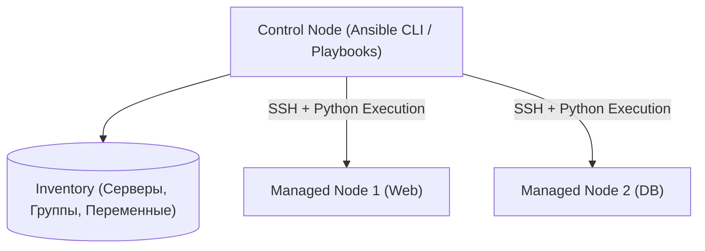

# 📜 01. Архитектура Ansible, Inventory и Плейбуки

## ⚙️ Архитектура Ansible

Ansible — это безагентная (agentless) система управления конфигурациями. Она подключается к управляемым узлам по SSH, копирует скомпилированные Python-модули, исполняет их и удаляет за собой временные файлы.



---

## 🗂️ Инвентарь (Inventory): Статический и Динамический

### Пример `inventory.yaml` с группами и переменными:
```yaml
all:
  children:
    webservers:
      hosts:
        web-01.prod.internal:
          ansible_host: 192.168.10.11
          http_port: 80
        web-02.prod.internal:
          ansible_host: 192.168.10.12
          http_port: 80
      vars:
        app_env: production
    dbservers:
      hosts:
        db-primary.prod.internal:
          ansible_host: 192.168.20.5
          db_role: master
```

---

## 📝 Эталонный Playbook с Handlers и Условиями

Файл `deploy_web.yaml`:
```yaml
---
- name: Настройка и запуск Nginx веб-серверов
  hosts: webservers
  become: true # Запуск под sudo
  gather_facts: true

  vars:
    nginx_worker_connections: 2048
    enable_ssl: true

  tasks:
    - name: Установка Nginx и зависимостей
      ansible.builtin.apt:
        name:
          - nginx
          - curl
        state: present
        update_cache: true
        cache_valid_time: 3600

    - name: Генерация конфигурационного файла из Jinja2 шаблона
      ansible.builtin.template:
        src: templates/nginx.conf.j2
        dest: /etc/nginx/nginx.conf
        owner: root
        group: root
        mode: '0644'
        validate: 'nginx -t -c %s' # Валидация синтаксиса перед заменой!
      notify: Reload Nginx # Вызовет handler только если файл РЕАЛЬНО изменился

    - name: Гарантировать запуск и автозагрузку сервиса Nginx
      ansible.builtin.systemd:
        name: nginx
        state: started
        enabled: true

  # Handlers вызываются один раз в самом конце плейбука
  handlers:
    - name: Reload Nginx
      ansible.builtin.systemd:
        name: nginx
        state: reloaded
```

---

## ⚡ Ad-hoc команды и CLI Cheat Sheet

```bash
# Проверка доступности всех серверов (Ping модуль)
ansible all -i inventory.yaml -m ping

# Быстрый перезапуск сервиса на группе хостов
ansible webservers -i inventory.yaml -b -m systemd -a "name=nginx state=restarted"

# Проверка синтаксиса плейбука
ansible-playbook -i inventory.yaml deploy_web.yaml --syntax-check

# Сухой прогон без внесения изменений (Dry-run / Check mode)
ansible-playbook -i inventory.yaml deploy_web.yaml --check --diff

# Запуск только с определенного шага (Step) или по тегам
ansible-playbook -i inventory.yaml deploy_web.yaml --tags "config"
```

---

## 🔬 Deep Dive: выполнение плейбука изнутри

1. **Inventory parse** → hosts/groups (INI/YAML/dynamic plugin из облака).
2. **Facts gather** (`setup`) → переменные узла, если `gather_facts: true`.
3. **Task execution:** каждый task → template module → Python zip → SSH exec → JSON stdout обратно.
4. **Strategy plugin:** linear (дефолт, батчи по `serial`) / free / host_pinned.

### Управление сложностью

```yaml
- name: Настроить веб-серверы поэтапно (rolling)
  hosts: webservers
  serial: "25%"                    # батчами — живая половина всегда принимает трафик
  max_fail_percentage: 0           # остановиться при первой ошибке
  strategy: linear
  vars_files:
    - "vars/{{ ansible_fqdn }}.yml"   # переопределение per-host
  tasks:
    - name: Проверить, что сервис отвечает до ухода ноды из LB
      ansible.builtin.uri:
        url: "http://{{ inventory_hostname }}/healthz"
      delegate_to: localhost
      register: health
      until: health.status == 200
      retries: 10
      delay: 6
```

```bash
ansible-inventory --graph --vars | head -40      # что реально резолвится
ansible all -m setup -a 'filter=ansible_memtotal_mb'
ansible-playbook site.yml --start-at-task="Install nginx" --step
```

!!! tip «Check mode»
    `--check` + `--diff`: dry-run с показом изменений файлов. Если роль не поддерживает check_mode — это техдолг, фиксируйте `check_mode: false` осознанно.

---

<!-- enriched:v1 -->

## 🧨 Типовые грабли Production (Ansible playbooks — только эта тема)

| Симптом | Причина | Быстрое решение |
| :--- | :--- | :--- |
| `changed=0` хотя файл изменился | `template` с `validate: nginx -t %s` падает → rollback | `ansible-playbook --check --diff`, `validate` путь верный? |
| `UNREACHABLE! => { "msg": "Failed to connect to the host via ssh" }` | `inventory` `ansible_host` не резолвится / `ProxyJump` | `ansible -i inventory all --list-hosts`, `ansible -m ping` + `ssh -J bastion user@host` |
| `serial: 25%` деплой 1 час на 8 хостах | Линейная стратегия vs `free` | `strategy: free` + `max_fail_percentage: 25` |
| `gather_facts` 30с на каждом хосте | `fact_caching` выключен | `fact_caching = jsonfile` + `gathering = smart` |

!!! warning «Идемпотентность — закон»
    Любой скрипт/плейбук/модуль должен быть безопасно перезапускаемым. Если второй прогон меняет состояние — это баг, который однажды уронит прод.

## 🧪 Hands-on Lab (30 минут): плейбук с нуля до идемпотентности

!!! abstract "Формат"
    **Стенд:** Docker-контейнер как цель (SSH не нужен). **Легенда:** ставим nginx на «сервер», ломаем, чиним, доказываем идемпотентность.

### Шаг 1. Цель и первый ad-hoc

```bash
docker run --rm -d --name lab-target -p 2222:22 python:3.12-slim sleep 100000
# Для простоты используем connection=local через inventory:
mkdir -p lab && cat > lab/hosts.ini <<'EOF'
[target]
lab-target ansible_connection=docker
EOF

cat > lab/setup.yml <<'EOF'
---
- hosts: target
  tasks:
    - name: Установить nginx (в slim-образе нет apt-кэша)
      ansible.builtin.raw: apt-get update && apt-get install -y nginx procps
      args: { executable: /bin/bash }
      changed_when: true
EOF
ansible-playbook -i lab/hosts.ini lab/setup.yml
```

??? question "Почему здесь raw, а обычно package?"
    `raw` работает без Python на цели — bootstrap-случай. После установки интерпретатора все следующие шаги должны использовать нормальные модули (package/apt) — иначе теряешь идемпотентность и проверки.

### Шаг 2. Плейбук с шаблоном, handler'ом и валидацией

```bash
cat > lab/nginx.conf.j2 <<'EOF'
server {
  listen {{ nginx_port }};
  location /healthz { return 200 "ok\n"; }
}
EOF
cat >> lab/setup.yml <<'EOF'
    - name: Конфиг с валидацией перед применением
      ansible.builtin.template:
        src: nginx.conf.j2
        dest: /etc/nginx/conf.d/default.conf
        validate: nginx -t -c %s
      notify: Reload nginx
      vars: { nginx_port: 8080 }
  handlers:
    - name: Reload nginx
      ansible.builtin.service: { name: nginx, state: reloaded }
EOF
ansible-playbook -i lab/hosts.ini lab/setup.yml
docker exec lab-target curl -s localhost:8080/healthz   # ok
```

### Шаг 3. Доказательство идемпотентности (главный тест)

```bash
ansible-playbook -i lab/hosts.ini lab/setup.yml | grep 'changed='
# Ожидаем: changed=1 (только template? нет!) — если template тоже changed,
# значит модуль считает конфиг изменённым каждый раз — ищите ошибку.
# Третий прогон обязан дать changed=0 полностью.
```

**Критерий успеха:** второй прогон ≤1 changed (handler), третий — 0.

### Шаг 4. Ломаем и диагностируем

```bash
sed -i 's/listen {{ nginx_port }}/listen {{ nginx_port };\n  broken/' lab/nginx.conf.j2
ansible-playbook -i lab/hosts.ini lab/setup.yml   # FAIL на validate!
# Вывод покажет вывод nginx -t — сломанный конфиг НЕ применился к серверу
git checkout -- lab/nginx.conf.j2 2>/dev/null || sed -i '/broken/d' lab/nginx.conf.j2
```

### Шаг 5. Проверь себя (ответы вслух до раскрытия)

1. Чем handler отличается от обычной задачи и когда он выполнится?
2. `--check` показывает changes на пустом изменении — ошибка ли это?
3. Почему validate критичен именно для конфигов сервисов?

<details><summary>Ответы</summary>

1. Handler выполняется один раз в конце плея, только если его нотифицировали изменившиеся задачи; рестарты не «на всякий случай».
2. Да: shell/command всегда changed без creates/changed_when. Это ложь в отчётах — чинить через creates или changed_when.
3. Сервис с битым конфигом не стартует при рестарте — а validate ловит это на этапе деплоя, а не в 03:00.
</details>

## ✅ Чек-лист зрелости темы

- [ ] Все изменения проходят через PR с обязательным review

    ??? tip "Как закрыть пункт"
        Плейбуки — код: ветки, MR, обязательный прогон `ansible-lint` + `--syntax-check` в CI. Ручные запуски с ноутбука против прода запрещены политикой.

- [ ] Секреты никогда не хранятся в коде/стейте (Vault/SOPS/secret manager)

    ??? tip "Как закрыть пункт"
        Vault + lookup-плагин или ansible-vault для файлов; gitleaks в pre-commit. Проверка: `grep -r password roles/` находит только ссылки на переменные, не значения.

- [ ] Есть dry-run/plan этап и он виден в MR

    ??? tip "Как закрыть пункт"
        CI-джоба `ansible-playbook --check --diff` на каждый MR — ревьюер видит, какие файлы изменятся на целях. Для docker-целей можно гонять реально.

- [ ] Откат воспроизводим одной командой (< 10 минут)

    ??? tip "Как закрыть пункт"
        Git revert + повторный прогон = откат (роль вернёт прежний конфиг). Для миграций БД внутри ролей — down-миграции. Учение: откатить последний релиз по таймеру.

- [ ] Логи пайплайна содержат версии артефактов (image digest, commit SHA)

    ??? tip "Как закрыть пункт"
        Джоба пишет: commit SHA, версию коллекций из requirements.yml, имя артефакта+хэш. При разборе инцидента вы точно знаете, какой код исполнялся на каких хостах.

---

## 🧭 Что дальше

| Шаг | Материал |
| :--- | :--- |
| 🔬 Закрепить | [Lab 08: роль с нуля](../16-guided-labs/08-lab-ansible-molecule.md) |
| 💪 Практика | [Задачи по Ansible](../15-hands-on-practice/02-100-devops-practical-tasks-part2.md) |
