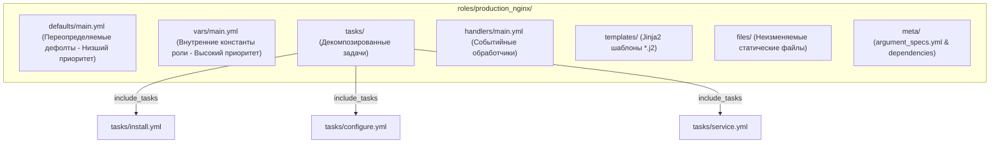
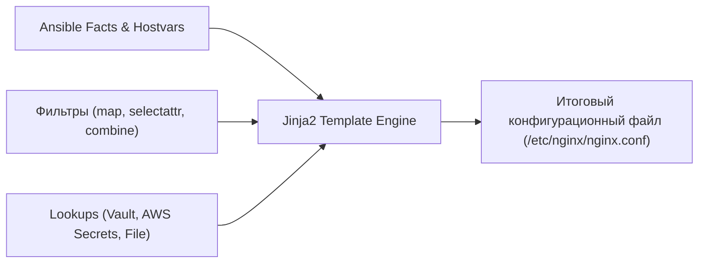
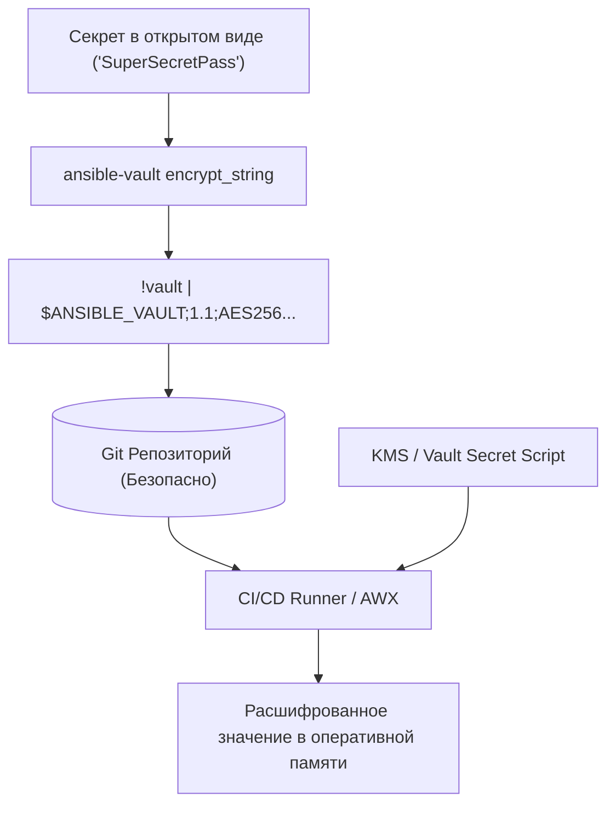

# 🎭 02. Архитектура Ролей, Jinja2, Ansible Vault и Безопасность

## 📂 Архитектура Ansible Role: Структура и Стандарты

Роли (**Ansible Roles**) — это основной механизм декомпозиции и переиспользования кода в Ansible. Роль инкапсулирует задачи, переменные, шаблоны, статические файлы, обработчики событий и метаданные в строгой файловой структуре.



---

### 1. Эталонная структура директорий роли

```text
roles/production_nginx/
├── defaults/
│   └── main.yml         # Переопределяемые пользователем переменные (Lowest Precedence)
├── vars/
│   └── main.yml         # Внутренние константы роли (High Precedence, не переопределять!)
├── tasks/
│   ├── main.yml         # Главная точка входа (включает остальные task-файлы)
│   ├── install.yml      # Установка пакетов и зависимостей
│   ├── configure.yml    # Генерация конфигов и сертификатов
│   └── service.yml      # Управление состоянием systemd
├── handlers/
│   └── main.yml         # Реакции на notify (reload, restart)
├── templates/
│   ├── nginx.conf.j2    # Основной шаблон
│   └── vhost.conf.j2    # Шаблон виртуальных хостов
├── files/
│   └── security-headers.conf # Статический файл правил
├── meta/
│   ├── main.yml         # Зависимости роли и метаданные Galaxy
│   └── argument_specs.yml # Спецификация валидации входных аргументов (Ansible >= 2.11)
```

---

### 2. Строгая валидация аргументов роли (`meta/argument_specs.yml`)

Начиная с Ansible 2.11, роли поддерживают встроенную спецификацию аргументов. При вызове роли движок автоматически проверяет типы и обязательность переданных параметров:

```yaml
# roles/production_nginx/meta/argument_specs.yml
argument_specs:
  main:
    short_description: "Управление отказоустойчивым веб-сервером Nginx"
    description: "Устанавливает Nginx, генерирует виртуальные хосты и настраивает TLS."
    author: "DevOps Platform Team"
    options:
      nginx_worker_processes:
        type: "str"
        default: "auto"
        description: "Число воркеров Nginx или 'auto'."
      nginx_listen_port:
        type: "int"
        default: 80
        description: "HTTP порт для входящих подключений."
      nginx_enable_ssl:
        type: "bool"
        default: true
        description: "Флаг активации HTTPS."
      nginx_vhosts:
        type: "list"
        elements: "dict"
        required: true
        description: "Список обслуживаемых доменов и конфигураций upstream."
        options:
          server_name:
            type: "str"
            required: true
          backend_nodes:
            type: "list"
            elements: "str"
            required: true
```

---

### 3. Декомпозиция задач (`tasks/main.yml`)

```yaml
# roles/production_nginx/tasks/main.yml
---
- name: Проверка соответствия операционной системы
  ansible.builtin.assert:
    that:
      - ansible_os_family in ['Debian', 'RedHat']
    fail_msg: "Роль production_nginx поддерживает только ОС семейств Debian и RedHat!"

- name: Установка пакетов Nginx
  ansible.builtin.include_tasks: install.yml
  tags: [nginx, install]

- name: Настройка конфигурационных файлов и виртуальных хостов
  ansible.builtin.include_tasks: configure.yml
  tags: [nginx, config]

- name: Управление состоянием службы
  ansible.builtin.include_tasks: service.yml
  tags: [nginx, service]
```

---

## 🎨 Jinja2 Templating: Продвинутые фильтры и Lookups

Jinja2 — это шаблонизатор, используемый Ansible для генерации конфигурационных файлов и динамических выражений.



---

### 1. Топ-10 продвинутых Jinja2-фильтров

```jinja2
{# 1. map и selectattr — извлечение и фильтрация списков объектов #}


{# 2. combine — глубокое рекурсивное слияние словарей #}
{{ default_settings | combine(override_settings, recursive=True) | to_nice_yaml }}

{# 3. ipaddr — работа с сетевыми адресами (требует netaddr) #}
{{ '192.168.1.10/24' | ansible.utils.ipaddr('network') }}       {# -> '192.168.1.0' #}
{{ '192.168.1.10/24' | ansible.utils.ipaddr('netmask') }}       {# -> '255.255.255.0' #}
{{ '192.168.1.10' | ansible.utils.ipaddr('public') }}           {# -> False #}

{# 4. to_json & to_nice_yaml — форматирование структур данных #}
{{ app_config_dict | to_nice_json(indent=2) }}

{# 5. regex_replace — подстановка по регулярному выражению #}
{{ inventory_hostname | regex_replace('^node-(\\d+).*', 'srv-\\1') }}

{# 6. b64encode & b64decode — работа с Base64 #}
{{ certificate_raw_data | b64encode }}

{# 7. hash — вычисление криптографических контрольных сумм #}
{{ app_secret_key | hash('sha256') }}
```

---

### 2. Продвинутый шаблон `templates/nginx.conf.j2`

```jinja2
# Auto-generated by Ansible. Do not edit manually!
# Managed host: {{ inventory_hostname }} ({{ ansible_distribution }} {{ ansible_distribution_version }})

user {{ nginx_user | default('www-data') }};
worker_processes {{ nginx_worker_processes }};
pid /run/nginx.pid;

events {
    worker_connections {{ nginx_worker_connections | default(4096) }};
    multi_accept on;
    use epoll;
}

http {
    include /etc/nginx/mime.types;
    default_type application/octet-stream;

    log_format main_json escape=json '{'
        '"time_local":"$time_local",'
        '"remote_addr":"$remote_addr",'
        '"request":"$request",'
        '"status": "$status",'
        '"body_bytes_sent":"$body_bytes_sent",'
        '"request_time":"$request_time",'
        '"upstream_response_time":"$upstream_response_time"'
    '}';

    access_log /var/log/nginx/access.json main_json;
    error_log /var/log/nginx/error.log warn;

    sendfile on;
    tcp_nopush on;
    tcp_nodelay on;
    keepalive_timeout 65;

    
    gzip on;
    gzip_vary on;
    gzip_proxied any;
    gzip_comp_level 6;
    gzip_types text/plain text/css application/json application/javascript text/xml;
    

    # Динамическая генерация upstream пулов на основе инвентаря
    
    upstream backend_{{ vhost.name }} {
        
        server {{ hostvars[host]['ansible_host'] | default(host) }}:{{ vhost.backend_port }} max_fails=3 fail_timeout=10s;
        
        keepalive 32;
    }

    server {
        listen {{ nginx_listen_port }};
        server_name {{ vhost.server_name }};

        
        listen 443 ssl http2;
        ssl_certificate /etc/ssl/certs/{{ vhost.name }}.crt;
        ssl_certificate_key /etc/ssl/private/{{ vhost.name }}.key;
        ssl_protocols TLSv1.2 TLSv1.3;
        ssl_ciphers HIGH:!aNULL:!MD5;
        

        location / {
            proxy_pass http://backend_{{ vhost.name }};
            proxy_set_header Host $host;
            proxy_set_header X-Real-IP $remote_addr;
            proxy_set_header X-Forwarded-For $proxy_add_x_forwarded_for;
            proxy_set_header X-Forwarded-Proto $scheme;
        }

        location /healthz {
            access_log off;
            return 200 "healthy\n";
        }
    }
    
}
```

---

### 3. Использование Lookups в задачах

Lookups выполняются **на управляющем узле (Control Node)** и позволяют затягивать данные из внешних источников:

```yaml
- name: Чтение публичного SSH-ключа с управляющей машины
  ansible.posix.authorized_key:
    user: deployer
    key: "{{ lookup('file', '~/.ssh/id_rsa.pub') }}"

- name: Извлечение пароля базы данных из HashiCorp Vault
  ansible.builtin.set_fact:
    db_password: "{{ lookup('community.hashi_vault.hashi_vault', 'secret=secret/data/production/db:password token=' ~ vault_token ~ ' url=https://vault.company.com:8200') }}"

- name: Получение секрета из AWS Secrets Manager
  ansible.builtin.set_fact:
    api_token: "{{ lookup('amazon.aws.aws_secret', 'production/payment/api_key', region='eu-central-1') }}"
```

---

## 🔐 Ansible Vault: Безопасность и управление секретами

Ansible Vault обеспечивает симметричное шифрование конфиденциальных данных алгоритмом **AES-256 (Cipher Block Chaining + SHA256 HMAC)**, позволяя безопасно хранить секреты в Git-репозитории.



---

### 1. Файловое шифрование vs Inline-шифрование

| Подход | Команда | Плюсы | Минусы |
| :--- | :--- | :--- | :--- |
| **Файл целиком** | `ansible-vault encrypt secrets.yml` | Просто зашифровать существующий файл. | В Git виден бинарный блоб, невозможно смотреть `git diff` изменений несекретных ключей. |
| **Inline Variable** | `ansible-vault encrypt_string` | Имена ключей и структура YAML остаются читаемыми в `git diff`, шифруется только само значение. | Требует копирования шифротекста в YAML. |

#### Пример Inline-шифрования в `group_vars/all/vault.yml`:

```yaml
# group_vars/all/vault.yml
---
# Несекретная конфигурация читается легко:
database_host: "postgres-primary.prod.internal"
database_port: 5432
database_user: "app_production"

# Зашифровано ровно одно секретное значение:
database_password: !vault |
          $ANSIBLE_VAULT;1.1;AES256
          62343833633139366266396434616238616439363532393864383164303362373335343534633734
          3136363065366465363435643431626330366432616239320a323337613634336136343135323032
          37373966396662366166323136653265383563646663363462613537336531326462313364373431
          6138656133376261300a393963353065633663623265323865323062376239353932643739343330
```

---

### 2. Мульти-хранилища (Multi-Vault IDs)

В крупных проектах для разных окружений (dev, prod, security) используются **разные ключи шифрования**:

```bash
# 1. Шифрование секрета специфичным Vault ID
ansible-vault encrypt_string \
  --vault-id prod@/etc/ansible/keys/prod_vault.key \
  --name 'prod_api_key' 'ProductionSecretValue123'

ansible-vault encrypt_string \
  --vault-id dev@/etc/ansible/keys/dev_vault.key \
  --name 'dev_api_key' 'DevelopmentSecretValue123'

# 2. Запуск плейбука с указанием нескольких Vault ID
ansible-playbook -i inventory/ site.yml \
  --vault-id dev@/etc/ansible/keys/dev_vault.key \
  --vault-id prod@prompt
```

---

### 3. Автоматизированная расшифровка в CI/CD через KMS-скрипт

Хранить пароль Vault в текстовом файле в CI опасно. Ansible позволяет использовать исполняемый клиентский скрипт, запрашивающий мастер-ключ из AWS KMS или HashiCorp Vault:

```bash
#!/usr/bin/env bash
# scripts/vault_keyring_client.sh
# Скрипт получает зашифрованный мастер-ключ и расшифровывает его через AWS KMS
set -eo pipefail

CIPHERTEXT="AQICAHh1..." # Зашифрованный мастер-ключ
aws kms decrypt \
  --ciphertext-blob fileb://<(echo "$CIPHERTEXT" | base64 --decode) \
  --output text \
  --query Plaintext | base64 --decode
```

Настройка в `ansible.cfg`:
```ini
[defaults]
vault_password_file = scripts/vault_keyring_client.sh
```

---

## ⚡ CLI Cheat Sheet: Galaxy & Vault Operations

```bash
# ==========================================
# 1. Управление ролями и коллекциями (Galaxy)
# ==========================================
# Инициализация новой роли по стандартному шаблону
ansible-galaxy role init roles/my_new_role

# Установка всех зависимостей из requirements.yml
ansible-galaxy install -r requirements.yml --force

# Установка конкретной коллекции в проект
ansible-galaxy collection install community.docker:3.8.0 -p ./collections

# ==========================================
# 2. Операции с Ansible Vault
# ==========================================
# Создание нового зашифрованного файла
ansible-vault create vars/vault.yml

# Редактирование зашифрованного файла в $EDITOR
ansible-vault edit vars/vault.yml

# Просмотр содержимого зашифрованного файла без изменения
ansible-vault view vars/vault.yml

# Шифрование строки для вставки в YAML
ansible-vault encrypt_string 'SuperSecret123' --name 'db_password'

# Ротация мастер-пароля (смена ключа шифрования)
ansible-vault rekey vars/vault.yml

# Расшифровка файла обратно в открытый текст
ansible-vault decrypt vars/vault.yml
```

---

## 🧨 Production Break-Fix Scenarios

### Сценарий 1: Сбой `Decryption failed` в CI пайплайне

```text
СИМПТОМ:
fatal: [web-01]: FAILED! => {"msg": "Attempting to decrypt but no vault secrets found"}
```

- **Root Cause:** В CI/CD переменная `ANSIBLE_VAULT_PASSWORD` не была передана в раннер, либо файл пароля не имеет прав на исполнение (`chmod +x`).
- **Решение:**
  1. Проверить права скрипта: `chmod +x scripts/vault_pass.sh`.
  2. В GitLab CI/GitHub Actions передать пароль через защищенную переменную:
     ```bash
     ansible-playbook -i inventory site.yml --vault-password-file <(echo "$VAULT_PASSWORD")
     ```

---

### Сценарий 2: Переопределение переменной роли из неожиданного места

```text
СИМПТОМ:
Параметр 'nginx_port' упорно равен 80, несмотря на то, что в 'group_vars/webservers.yml'
явно задано 'nginx_port: 8080'.
```

- **Root Cause:** Переменная была объявлена в файле `roles/nginx/vars/main.yml`. В соответствии с 22 уровнями приоритета, `role vars` имеют более высокий приоритет (14 уровень), чем `group_vars` (3-5 уровень).
- **Решение:** Перенести дефолтные значения из `roles/nginx/vars/main.yml` в `roles/nginx/defaults/main.yml` (1 уровень приоритета), оставив в `vars/` только неизменяемые платформенные константы.

---

## 🧪 Hands-on Lab: Создание роли и шифрование Vault

```bash
# 1. Создание каталога лаборатории
mkdir -p /tmp/ansible-roles-lab/{roles/motd/{tasks,defaults,templates},group_vars/all}
cd /tmp/ansible-roles-lab

# 2. Создание дефолтных переменных роли
cat <<'EOF' > roles/motd/defaults/main.yml
motd_company_name: "DevOps Global Operations"
motd_environment: "Sandbox"
EOF

# 3. Создание Jinja2 шаблона /etc/motd
cat <<'EOF' > roles/motd/templates/motd.j2
============================================================
  Welcome to {{ inventory_hostname }}
  Organization: {{ motd_company_name }}
  Environment : {{ motd_environment }}
  Admin Email : {{ secret_admin_email | default('noc@company.local') }}
============================================================
EOF

# 4. Задачи роли
cat <<'EOF' > roles/motd/tasks/main.yml
- name: Генерация баннера дня (/etc/motd)
  ansible.builtin.template:
    src: motd.j2
    dest: /tmp/lab_motd_output
    mode: '0644'
EOF

# 5. Шифрование секретной переменной через Vault
echo "MyVaultSecretPass123" > .vault_pass
ansible-vault encrypt_string 'security-officer@company.com' \
  --name 'secret_admin_email' \
  --vault-password-file .vault_pass > group_vars/all/vault.yml

# 6. Создание плейбука
cat <<'EOF' > site.yml
---
- name: Применение роли MOTD
  hosts: localhost
  connection: local
  gather_facts: false
  roles:
    - motd
EOF

# 7. Применение с паролем Vault
ansible-playbook site.yml --vault-password-file .vault_pass
cat /tmp/lab_motd_output
```

---

## ✅ Чек-лист зрелости: Роли и Безопасность

- [ ] **Четкое разделение `defaults/` и `vars/`:** Все переопределяемые параметры лежат строго в `defaults/main.yml`.
- [ ] **Входные аргументы роли валидируются:** Создан файл `meta/argument_specs.yml`.
- [ ] **Секреты зашифрованы Ansible Vault:** В репозитории отсутствуют пароли и приватные ключи в открытом виде.
- [ ] **Используется `encrypt_string` для точечных секретов:** Сохранена читаемость Git Diff.
- [ ] **Зафиксированы версии ролей в `requirements.yml`:** Запрещено использование неверсионированных веток `master/main`.
- [ ] **Интегрирован Gitleaks в pre-commit:** Исключена случайная отправка незашифрованных секретов в Git.

---

## 🧭 Что дальше

| Шаг | Тема | Ссылка |
| :--- | :--- | :--- |
| 🚀 Следующий шаг | Производительность, AWX/AAP, Mitogen и Тестирование с Molecule | [03-ansible-collections-performance-and-awx.md](file:///mnt/c/Users/aazimov/Desktop/qek/doka/docs/07-ansible/03-ansible-collections-performance-and-awx.md) |
| 🏗️ Terraform | Архитектура Terraform и HCL | [01-terraform-fundamentals.md](file:///mnt/c/Users/aazimov/Desktop/qek/doka/docs/06-terraform/01-terraform-fundamentals.md) |

---

## ❓ Проверь себя

**В1. В чем принципиальная разница между `defaults/main.yml` и `vars/main.yml` внутри роли?**
<details><summary>Ответ</summary>
<code>defaults/main.yml</code> имеет самый низкий 1-й приоритет в системе переменных Ansible. Значения из defaults легко переопределяются через <code>group_vars</code>, <code>host_vars</code>, параметры плейбука или вызова роли. <code>vars/main.yml</code> имеет высокий 14-й приоритет: переменные оттуда предназначены для внутренних констант роли (например, пути к пакетам под разные OS) и не могут быть переопределены через инвентарь.
</details>

**В2. Почему вызов lookup-плагина `lookup('file', '...')` происходит на Control Node, а модуля `copy` — на Managed Node?**
<details><summary>Ответ</summary>
Все lookup-плагины в Ansible по архитектуре исполняются локально на управляющей машине (Control Node) на этапе вычисления шаблонов и переменных перед отправкой полезной нагрузки. Модуль <code>ansible.builtin.copy</code> или <code>ansible.builtin.template</code> отправляет полезную нагрузку и выполняет запись файла непосредственно на целевом узле (Managed Node).
</details>

**В3. Как работает ротация паролей `ansible-vault rekey`?**
<details><summary>Ответ</summary>
Команда <code>rekey</code> расшифровывает зашифрованный файл старым паролем в оперативной памяти и немедленно заново зашифровывает его новым паролем с генерацией новой соли (salt) и контрольной суммы HMAC, после чего атомарно перезаписывает файл на диске.
</details>
