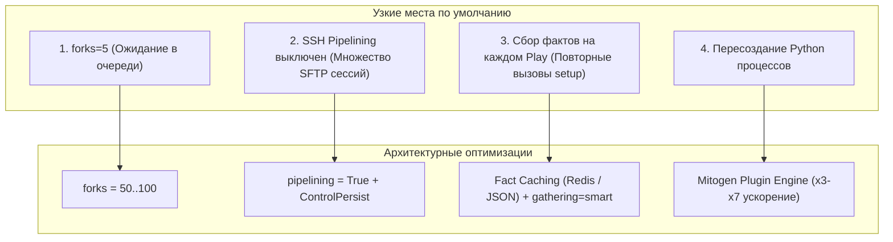
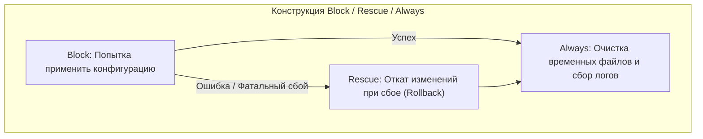
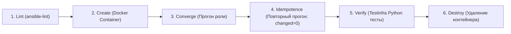
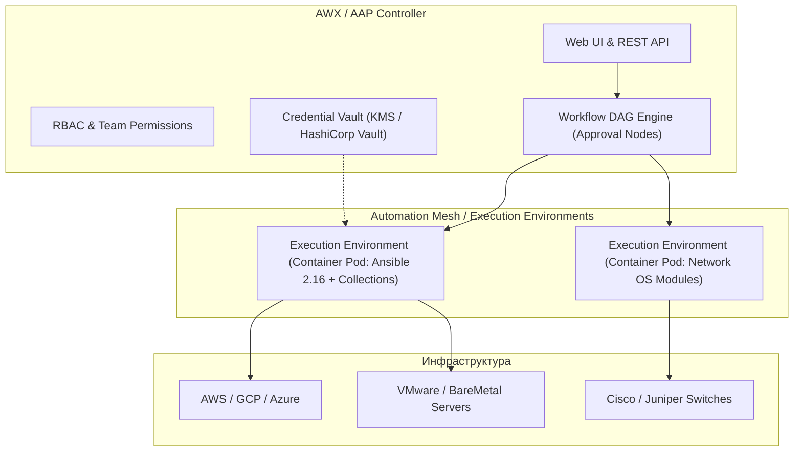

# 🚀 03. Производительность, Тестирование с Molecule, AWX/AAP и Error Handling

## 🏎️ Тюнинг производительности Ansible на масштабе (1000+ хостов)

По умолчанию Ansible настроен крайне консервативно (всего 5 параллельных процессов `forks=5` и медленная передача файлов без конвейеризации). При управлении сотнями и тысячами серверов правильный тюнинг `ansible.cfg` ускоряет время выполнения плейбуков в 5–10 раз.



---

### 1. Эталонный production `ansible.cfg`

```ini
[defaults]
# 1. Параллелизм (число одновременных SSH воркеров)
forks = 50

# 2. Оптимизация сбора фактов
gathering = smart
fact_caching = jsonfile
fact_caching_connection = /tmp/ansible_facts_cache
fact_caching_timeout = 86400

# 3. Форматирование вывода и профилирование задач
stdout_callback = yaml
callbacks_enabled = ansible.posix.profile_tasks, ansible.posix.timer

# 4. Повышение надежности
host_key_checking = False
timeout = 30

[ssh_connection]
# 5. SSH Pipelining: передача Python скрипта прямо в stdin интерпретатора
# Исключает промежуточное копирование файлов через SFTP/SCP!
pipelining = True

# 6. Мультиплексирование SSH соединений (ControlMaster)
ssh_args = -o ControlMaster=auto -o ControlPersist=600s -o PreferredAuthentications=publickey
control_path_dir = ~/.ansible/cp
control_path = %(directory)s/%%h-%%r
```

---

### 2. Сравнение производительности методов оптимизации

| Метод | Механизм действия | Выигрыш во времени | Требования / Ограничения |
| :--- | :--- | :--- | :--- |
| **`forks = 50`** | Увеличение пула процессов Fork | **Линейное ускорение** (до 10x) | Требует ~20-30 МБ RAM на каждый fork на Control Node. |
| **`pipelining = True`** | Исполнение через SSH stdin без создания файлов на диске | **~30–50%** быстрее | Требует отключения `requiretty` в `/etc/sudoers` на серверах. |
| **Fact Caching** | Кэширование фактов в Redis/JSON | **~15–30 сек** на каждом Play | Факты могут устаревать, если хост был переконфигурирован вручную. |
| **Mitogen Plugin** | Замена SSH-воркеров на постоянный Python-демон с UNIX-пайпами | **В 3–7 раз быстрее!** | Несовместим с некоторыми экзотическими модулями и стратегией `free`. |

---

### 3. Mitogen: Революционное ускорение выполнения

**Mitogen for Ansible** полностью заменяет стандартный механизм исполнения Ansible. Вместо порождения сотен тяжелых SSH-процессов и упаковки Ansiballz, Mitogen создает на управляемом узле легковесный Python-процесс и общается с ним по мультиплексированному бинарному протоколу через единый SSH-канал.

```ini
# ansible.cfg с плагином Mitogen
[defaults]
strategy_plugins = /opt/mitogen/ansible_mitogen/plugins/strategy
strategy = mitogen_linear
```

---

### 4. Асинхронные задачи (`async` и `poll`)

Для длительных операций (обновление ОС, сборка пакетов, переиндексация БД) используются асинхронные задачи, предотвращающие обрыв SSH-сессий:

```yaml
# 1. Запуск долгой фоновой задачи без ожидания (Fire and Forget)
- name: Запуск тяжелой миграции базы данных в фоне
  ansible.builtin.command: /usr/local/bin/heavy-db-migration.sh
  async: 3600 # Максимальное время выполнения: 1 час
  poll: 0     # Не ждать завершения, идти к следующему таску
  register: migration_job

# 2. Проверка статуса выполнения задачи позже в плейбуке
- name: Ожидание завершения миграции БД
  ansible.builtin.async_status:
    jid: "{{ migration_job.ansible_job_id }}"
  register: job_result
  until: job_result.finished
  retries: 60
  delay: 10
```

---

## 🛡️ Расширенная обработка ошибок и отказоустойчивость

В промышленном коде падение отдельного шага не должно приводить к повреждению всей инфраструктуры.



### 1. Паттерн "Try-Catch-Finally" (`block / rescue / always`)

```yaml
- name: Безопасное обновление конфигурации базы данных с авто-откатом
  block:
    - name: Создание резервной копии текущего конфига
      ansible.builtin.copy:
        src: /etc/postgresql/16/main/postgresql.conf
        dest: /etc/postgresql/16/main/postgresql.conf.bak
        remote_src: true

    - name: Применение новой конфигурации
      ansible.builtin.template:
        src: postgresql.conf.j2
        dest: /etc/postgresql/16/main/postgresql.conf
        validate: '/usr/lib/postgresql/16/bin/postgres -C config_file=%s'
      notify: Restart Postgres

    - name: Принудительный перезапуск сервиса
      ansible.builtin.meta: flush_handlers

  rescue:
    - name: ОТКАТ: Восстановление резервной копии при сбое
      ansible.builtin.copy:
        src: /etc/postgresql/16/main/postgresql.conf.bak
        dest: /etc/postgresql/16/main/postgresql.conf
        remote_src: true

    - name: Восстановление службы базы данных
      ansible.builtin.systemd:
        name: postgresql
        state: started

    - name: Отправка критического алерта в систему мониторинга
      ansible.builtin.uri:
        url: "https://alerts.company.com/api/v1/incidents"
        method: POST
        body_format: json
        body:
          host: "{{ inventory_hostname }}"
          msg: "Сбой обновления конфигурации PostgreSQL! Выполнен автоматический откат."

    - name: Принудительное завершение плейбука с ошибкой
      ansible.builtin.fail:
        msg: "Конфигурация PostgreSQL сломана, откат выполнен успешно."

  always:
    - name: Удаление временных бэкапов
      ansible.builtin.file:
        path: /etc/postgresql/16/main/postgresql.conf.bak
        state: absent
```

---

## 🧪 Тестирование ролей: Molecule и Testinfra

**Molecule** — стандарт разработки и автоматизированного тестирования Ansible-ролей в изолированных Docker/Podman контейнерах или облачных VM.



---

### 1. Конфигурация сценария Molecule (`molecule/default/molecule.yml`)

```yaml
# molecule/default/molecule.yml
dependency:
  name: galaxy
  options:
    requirements-file: requirements.yml

driver:
  name: docker

platforms:
  - name: instance-ubuntu-2204
    image: geerlingguy/docker-ubuntu2204-ansible:latest
    pre_build_image: true
    privileged: true
    volumes:
      - /sys/fs/cgroup:/sys/fs/cgroup:rw
    cgroupns_mode: host
    command: /lib/systemd/systemd

provisioner:
  name: ansible
  options:
    vvv: false
  inventory:
    group_vars:
      all:
        nginx_port: 8080

verifier:
  name: testinfra

scenario:
  test_sequence:
    - dependency
    - lint
    - cleanup
    - destroy
    - syntax
    - create
    - prepare
    - converge
    - idempotence     # ПРОВЕРКА ИДЕМПОТЕНТНОСТИ: второй прогон обязан дать 0 changes!
    - verify          # Запуск Python тестов Testinfra
    - cleanup
    - destroy
```

---

### 2. Тестирование инфраструктуры на Python (`molecule/default/test_default.py`)

**Testinfra** позволяет писать элегантные Unit-тесты для верификации реального состояния системы после выполнения роли:

```python
# molecule/default/test_default.py
import pytest

def test_nginx_package_is_installed(host):
    nginx = host.package("nginx")
    assert nginx.is_installed
    assert nginx.version.startswith("1.")

def test_nginx_service_running_and_enabled(host):
    service = host.service("nginx")
    assert service.is_running
    assert service.is_enabled

def test_nginx_listening_port(host):
    socket = host.socket("tcp://0.0.0.0:8080")
    assert socket.is_listening

def test_nginx_config_syntax(host):
    cmd = host.run("nginx -t")
    assert cmd.rc == 0
    assert "syntax is ok" in cmd.stderr

def test_http_endpoint_response(host):
    res = host.run("curl -s -o /dev/null -w '%{http_code}' http://127.0.0.1:8080/healthz")
    assert res.stdout.strip() == "200"
```

```bash
# Запуск полного матричного теста роли
molecule test

# Быстрый итеративный цикл разработки
molecule converge && molecule verify
```

---

## 🏢 Корпоративная оркестрация: AWX и Automation Platform (AAP)

**AWX** (Open Source upstream проект Red Hat Ansible Automation Platform) переводит использование Ansible с локальных CLI-скриптов на уровень корпоративной платформы с централизованным UI, RBAC, аудитом и управлением учетными данными.



---

### 1. Сборка Execution Environments (`execution-environment.yml`)

Execution Environment (EE) — это стандартизированный OCI-контейнер, содержащий фиксированные версии Ansible Core, Python-библиотек и Galaxy-коллекций. Собирается с помощью утилиты `ansible-builder`:

```yaml
# execution-environment.yml
version: 3

images:
  base_image:
    name: quay.io/ansible/ansible-runner:latest

dependencies:
  ansible_core:
    package_pip: ansible-core==2.16.4
  ansible_runner:
    package_pip: ansible-runner==2.3.4
  galaxy:
    collections:
      - name: amazon.aws
        version: "7.3.0"
      - name: community.docker
        version: "3.8.0"
      - name: community.general
        version: "8.4.0"
  python:
    - boto3>=1.34.0
    - botocore>=1.34.0
    - requests>=2.31.0
    - psycopg2-binary>=2.9.9
  system:
    - git
    - openssh-clients
```

```bash
# Сборка контейнера Execution Environment
ansible-builder build --tag registry.company.local/ansible/ee-production:v1.0.0
docker push registry.company.local/ansible/ee-production:v1.0.0
```

---

### 2. Автоматизация AWX через REST API

AWX предоставляет полноценный REST API, позволяющий запускать плейбуки и оркестровать Workflows из любого CI/CD конвейера:

```bash
#!/usr/bin/env bash
# scripts/launch_awx_job.sh
set -eo pipefail

AWX_HOST="https://awx.company.internal"
TEMPLATE_ID="42" # ID Job Template в AWX
AUTH_HEADER="Authorization: Bearer ${AWX_OAUTH_TOKEN}"

echo "==> Запуск AWX Job Template #${TEMPLATE_ID}..."
LAUNCH_RESPONSE=$(curl -s -X POST \
  -H "${AUTH_HEADER}" \
  -H "Content-Type: application/json" \
  -d '{"extra_vars": {"target_environment": "production", "app_version": "v2.5.0"}}' \
  "${AWX_HOST}/api/v2/job_templates/${TEMPLATE_ID}/launch/")

JOB_ID=$(echo "${LAUNCH_RESPONSE}" | jq -r '.job')
echo "==> Запущен Job ID: ${JOB_ID}. Ожидание завершения..."

# Опрос статуса выполнения
while true; do
  STATUS=$(curl -s -H "${AUTH_HEADER}" "${AWX_HOST}/api/v2/jobs/${JOB_ID}/" | jq -r '.status')
  echo "Текущий статус джобы: ${STATUS}"
  
  if [ "${STATUS}" == "successful" ]; then
    echo "✅ Джоба AWX завершилась успешно!"
    exit 0
  elif [ "${STATUS}" == "failed" ] || [ "${STATUS}" == "error" ] || [ "${STATUS}" == "canceled" ]; then
    echo "❌ Ошибка выполнения джобы AWX!"
    exit 1
  fi
  sleep 10
done
```

---

## ⚡ CLI Cheat Sheet: Performance, Molecule & AWX

```bash
# ==========================================
# 1. Профилирование и замер времени
# ==========================================
# Запуск плейбука с замером времени выполнения каждого таска
ANSIBLE_CALLBACKS_ENABLED=profile_tasks ansible-playbook -i inventory site.yml

# Запуск с параллелизмом на 100 потоков
ansible-playbook -i inventory site.yml -f 100

# ==========================================
# 2. Управление тестами Molecule
# ==========================================
# Инициализация нового сценария тестирования роли
molecule init scenario default -d docker

# Создание контейнера окружения
molecule create

# Накатывание роли на контейнер (быстрая отладка)
molecule converge

# Проверка идемпотентности (второй прогон)
molecule idempotence

# Запуск верификационных тестов Testinfra
molecule verify

# Полный цикл тестирования от сборки до удаления
molecule test

# ==========================================
# 3. Управление через awx-cli
# ==========================================
# Авторизация в AWX
export TOWER_HOST="https://awx.company.internal"
export TOWER_OAUTH_TOKEN="your-secret-token"

# Запуск шаблона задачи
awx-cli job launch --job_template "Deploy Production API" --monitor
```

---

## 🧨 Production Break-Fix Scenarios

### Сценарий 1: SSH ControlPath Too Long

```text
СИМПТОМ:
fatal: [srv-01]: UNREACHABLE! => {"msg": "Failed to connect to the host via ssh: 
unix_listener: path '/root/.ansible/cp/srv-01.internal.company.production-22-root.sock' too long for Unix domain socket"}
```

- **Root Cause:** Стандартное ограничение ядра Linux на длину пути UNIX domain socket составляет 104 или 108 символов (`sun_path`). При глубокой вложенности директорий или длинных FQDN именах сокет переполняет буфер.
- **Решение:** Сократить путь `control_path` в `ansible.cfg`:
  ```ini
  [ssh_connection]
  control_path_dir = /tmp/cp
  control_path = %(directory)s/%%h-%%p-%%r
  ```

---

### Сценарий 2: Тест Molecule Idempotence падает из-за динамических дат

```text
СИМПТОМ:
CRITICAL: Idempotence test failed because of the following tasks:
* [production_nginx : Update header timestamp] => changed=true
```

- **Root Cause:** В Jinja2 шаблоне использовалась функция генерации текущего времени `{{ ansible_date_time.iso8601 }}`. При каждом прогоне файл генерировал новое содержимое и вызывал статус `changed: true`.
- **Решение:** Исключить генерацию нестатических данных или использовать `changed_when: false` / фиксированные версии вместо динамических меток времени.

---

## 🧪 Hands-on Lab: Тестирование отказоустойчивости с `block/rescue`

```bash
# 1. Создание лабораторного каталога
mkdir -p /tmp/ansible-rescue-lab && cd /tmp/ansible-rescue-lab

# 2. Создание плейбука с блоком rescue
cat <<'EOF' > rescue_demo.yml
---
- name: Демонстрация отказоустойчивого обновления с авто-откатом
  hosts: localhost
  connection: local
  gather_facts: false

  tasks:
    - name: Основной блок обновления сервиса
      block:
        - name: 1. Создание оригинального файла конфигурации
          ansible.builtin.copy:
            dest: /tmp/production_app.conf
            content: "DATABASE_URL=postgres://db.prod:5432/main\n"

        - name: 2. Попытка применить заведомо ошибочную конфигурацию
          ansible.builtin.copy:
            dest: /tmp/production_app.conf
            content: "DATABASE_URL=broken_syntax\n"

        - name: 3. Валидация конфигурации (Имитация падения)
          ansible.builtin.command: /bin/false # Имитирует сбой валидатора
          changed_when: false

      rescue:
        - name: 4. [RESCUE] Восстановление корректной конфигурации
          ansible.builtin.copy:
            dest: /tmp/production_app.conf
            content: "DATABASE_URL=postgres://db.prod:5432/main_recovered\n"

        - name: 5. [RESCUE] Уведомление об успешном откате
          ansible.builtin.debug:
            msg: "⚠️ Произошел сбой на шаге валидации! Успешно выполнен откат на рабочую версию."

      always:
        - name: 6. [ALWAYS] Финальная проверка статуса
          ansible.builtin.debug:
            msg: "🏁 Блок always выполнен независимо от результатов."
EOF

# 3. Запуск плейбука
ansible-playbook rescue_demo.yml
cat /tmp/production_app.conf
```

---

## ✅ Чек-лист зрелости: Производительность и Оркестрация

- [ ] **Настроен `ansible.cfg`:** `forks >= 50`, `pipelining = True`, `ControlPersist = 600s`.
- [ ] **Включен Fact Caching:** Сбор фактов оптимизирован (`gathering = smart`).
- [ ] **Все роли покрыты тестами Molecule:** В CI настроен прогон `molecule test` с проверкой `idempotence`.
- [ ] **Написаны инфраструктурные ассерты Testinfra:** Проверяются порты, службы и конфигурации.
- [ ] **Критические таски защищены `block/rescue`:** Реализован автоматический откат при аварии.
- [ ] **Развертывание автоматизировано в AWX/AAP:** Используются Execution Environments и RBAC.

---

## 🧭 Что дальше

| Шаг | Тема | Ссылка |
| :--- | :--- | :--- |
| 🏗️ Terraform | Архитектура и HCL основы | [01-terraform-fundamentals.md](file:///mnt/c/Users/aazimov/Desktop/qek/doka/docs/06-terraform/01-terraform-fundamentals.md) |
| 🛡️ OpenTofu | OpenTofu, Разработка провайдеров и Drift | [04-opentofu-providers-and-drift.md](file:///mnt/c/Users/aazimov/Desktop/qek/doka/docs/06-terraform/04-opentofu-providers-and-drift.md) |

---

## ❓ Проверь себя

**В1. За счет чего SSH Pipelining ускоряет выполнение задач в Ansible?**
<details><summary>Ответ</summary>
В стандартном режиме без pipelining для выполнения каждого таска Ansible выполняет до 4–5 последовательных SSH-сессий: подключение -> создание временной директории в <code>~/.ansible/tmp</code> -> передача Python-скрипта через SFTP/SCP -> вызов Python на выполнение -> удаление временной папки. При включении <code>pipelining = True</code> Ansible передает скомпилированный код модуля напрямую в стандартный поток ввода (stdin) одного SSH-процесса <code>python3 -</code>, полностью исключая передачу файлов на диск целевого узла.
</details>

**В2. Что такое Execution Environment (EE) в AWX/AAP и какую проблему оно решает?**
<details><summary>Ответ</summary>
Execution Environment — это стандартизированный OCI-контейнер, в который упакованы Ansible Core, определенные версии Python-библиотек (например, boto3, requests) и коллекции Ansible. Это решает проблему конфликта зависимостей («Dependency Hell»): разные команды могут запускать свои плейбуки в изолированных средах с нужными версиями библиотек без необходимости модифицировать хостовую ОС контроллера AWX.
</details>

**В3. Чем этап `idempotence` в Molecule отличается от этапа `converge`?**
<details><summary>Ответ</summary>
На этапе <code>converge</code> Molecule применяет роль к чистому тестовому контейнеру (создавая файлы, устанавливая пакеты и меняя конфигурацию — статус <code>changed > 0</code>). На этапе <code>idempotence</code> та же самая роль применяется к тому же контейнеру повторно: если роль написана правильно и идемпотентно, второй прогон обязан вернуть <code>changed = 0</code>. Если есть хотя бы одно изменение, тест завершается аварийно.
</details>
