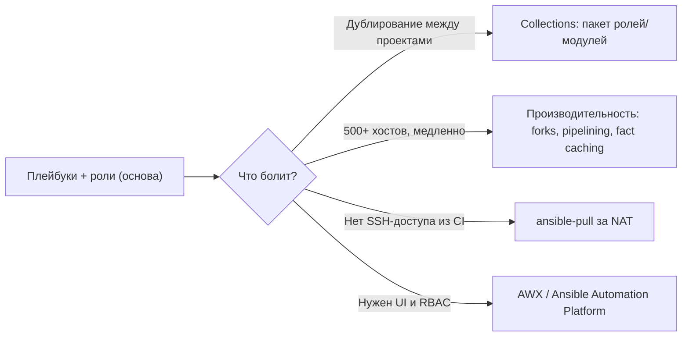

# 🚀 03. Ansible Advanced: Collections, Производительность, AWX и Pull-модель

## ⚙️ Когда базовых плейбуков перестаёт хватать



---

## 📝 Collections: переиспользование на уровне организации

Коллекция — устанавливаемый пакет (роли, модули, плагины). Формат заменил «галактические» разрозненные роли.

```text
myorg.baseline/
├── galaxy.yml              # метаданные и версия (semver!)
├── roles/
│   ├── hardening/          # роль CIS-харденинга
│   └── monitoring-agent/
├── plugins/
│   ├── modules/myapp_config.py      # кастомный модуль
│   ├── filter/timefmt.py            # Jinja2-фильтры
│   └── lookup/vault_kv.py
└── requirements.yml
```

```yaml
# galaxy.yml
namespace: myorg
name: baseline
version: 1.3.0
dependencies:
  community.general: ">=8.0.0"
  ansible.posix: ">=1.5.0"
```

Управление зависимостями:

```bash
ansible-galaxy collection install -r requirements.yml          # из requirements
ansible-galaxy collection install myorg.baseline:1.3.0         # конкретная версия
ansible-galaxy collection build && \
ansible-galaxy collection publish myorg-baseline-1.3.0.tar.gz  # публикация в Galaxy/AH

# В плейбуке:
collections:
  - myorg.baseline
  - community.docker
```

!!! tip "requirements.yml — это lock-файл для Ansible"
    Все внешние коллекции и роли проекта фиксируйте в `requirements.yml` с версиями и ставьте их в CI. «Глобально установленная коллекция последней версии» = «работает только на моей машине».

---

## 🏎️ Производительность: ускоряем прогон в разы

### Профилирование — сначала измерить, потом крутить ручки

```bash
ANSIBLE_STDOUT_CALLBACK=profile_tasks ansible-playbook site.yml
# Покажет TOP задач по времени — оптимизировать именно их
```

### Главные рычаги

```ini
# ansible.cfg
[defaults]
forks = 50                        # параллельных хостов (дефолт 5!)
gathering = smart                 # собирать факты только раз за play-run
fact_caching = jsonfile
fact_caching_connection = /tmp/facts
fact_caching_timeout = 86400
callback_result_format = yaml     # читаемый вывод ошибок

[ssh_connection]
pipelining = True                 # минус одна SSH-сессия на модуль (~30% быстрее)
ssh_args = -o ControlMaster=auto -o ControlPersist=300s   # мультиплексирование соединений
```

| Приём | Эффект | Риск |
| :--- | :--- | :--- |
| `forks` ↑ до 20–50 | Линейное ускорение | Нагрузка на контроллер и сеть; большие `forks` + `serial` не смешивать бездумно |
| `pipelining` | ~30% быстрее | Требует `requiretty` off на цели (почти везде уже off) |
| Fact caching | Меньше gather_facts-пауз | Устаревшие факты после ребута — следить за timeout |
| `strategy: free` | Хосты не ждут друг друга | Сложнее отлаживать порядок шагов |
| Асинхронные задачи (`async`, `poll: 0`) | Долгие установки без ожидания | Нужен явный `async_status: mode: poll` |

### Стратегии выполнения

```yaml
# Rolling update без простоя: батчами по 2 хоста
- hosts: webservers
  serial: 2                       # или "30%" от группы
  max_fail_percentage: 0          # любая ошибка останавливает весь rollout

# any_errors_fatal — стоп всё при первой ошибке критичной группы
```

---

## 🔄 Динамический инвентарь и cloud-плагины

Статический inventory умирает там, где хосты живут минуты. Источники правды — облака, Consul, NetBox.

```yaml
# inventory/aws.yml (динамический плагин, запускать через -i каталог, не файл!)
plugin: amazon.aws.aws_ec2
regions: [eu-central-1]
filters:
  tag:ManagedBy: terraform
keyed_groups:
  - key: tags.Environment
    prefix: env
  - key: instance_type
    prefix: type
hostnames: [tag:Name, ip-address]
compose:
  ansible_host: private_ip_address
```

```bash
ansible-inventory -i inventory --graph        # проверить, как сгруппировалось
ansible-playbook -i inventory site.yml
```

Для Kubernetes/Nomad-целей — `kubernetes.core.k8s_inventory`; свой источник — скрипт, выводящий JSON (`--list`).

---

## 🧲 ansible-pull: управление хостами за NAT

Инверсия модели: **хост сам** забирает плейбук из Git и применяет локально.

```bash
# systemd timer на целевой машине (раз в 15 минут)
/usr/bin/ansible-pull -U https://git.company.local/infra/baseline.git \
  -i localhost, -C main --full site.yml >> /var/log/ansible-pull.log 2>&1
```

Когда выбирать pull:

- Тысячи агентов без входящих соединений (edge, IoT, магазины).
- Самозагрузка нового инстанса (bootstrap) до подключения к оркестратору.
- Минусы: нет централизованных логов (решается отправкой журнала), ошибки видны постфактум, секреты нужно доставлять отдельно (Vault Agent).

---

## 🖥️ AWX / Automation Platform: когда плейбуков стало много

```mermaid
graph TB
    Git[Git push] -->|webhook| AWX[AWX Controller]
    AWX -->|Job Template + Credentials| EE["Execution Environment (контейнер)"]
    EE -->|SSH/API| Hosts[Целевые хосты]
    AWX --> Schedules[(Расписания) + RBAC + Аудит]
```

Ключевые понятия AWX/AAP:

- **Execution Environment (EE)** — контейнер со своим Ansible + коллекциями + зависимостями Python. Конец эпохе «на сервере контроллера не та версия boto3». Собирается через `ansible-builder`.
- **Job Template** = плейбук + инвентарь + credentials + extrа-vars. Запускается руками, по расписанию или вебхуком.
- **Workflow** — DAG из шаблонов с условиями (успех/фейл) и approvals.
- **Surveys** — форма параметров запуска вместо свободных extra-vars.
- **RBAC**: команда инфраструктуры может запускать, но не видеть credentials.

```bash
awx-cli job launch --job_template "Deploy Nginx" --extra_vars '{"env":"staging"}'
# или API:
curl -X POST "$AWX/api/v2/job_templates/42/launch/" -H "Authorization: Bearer $TOKEN" \
  -d '{"extra_vars":{"env":"staging"}}'
```

---

## 🔬 Deep Dive: почему плейбук «работает», но ничего не делает

Три источника ложной идемпотентности:

1. **`shell`/`command` всегда `changed`.** Лечится проверками:
   ```yaml
   - name: Регистрация runner если ещё не зарегистрирован
     ansible.builtin.command: gitlab-runner register ...
     args:
       creates: /etc/gitlab-runner/config.toml   # идемпотентность через файл-маркер
     changed_when: false
   ```
2. **`changed_when`/`failed_when`** для команд, чей статус надо интерпретировать (REST-вызовы, скрипты миграции БД).
3. **Порядок handlers**: `listen:`-группы хендлеров вместо цепочки `notify` по именам — один `restart stack` вместо пяти отдельных нотификаций.

Проверка идемпотентности обязательна в CI:

```bash
ansible-playbook site.yml && \
ansible-playbook site.yml --diff | tee run2.log
! grep -E 'changed=[1-9]' run2.log    # второй прогон обязан быть зелёным и пустым
```

---

## 🧨 Типовые грабли Production

| Симптом | Причина | Быстрое решение |
| :--- | :--- | :--- |
| Прогон 1000 хостов длится час | Дефолт `forks=5`, нет pipelining | `forks=50`, `pipelining=True`, ControlMaster, profile_tasks для поиска топ-задач |
| Коллекция обновилась и сломала прод | Нет пина версий | `requirements.yml` с `version: "==x.y.z"`, установка в EE/CI |
| AWX джоба падает с «module not found» | Зависимости вне EE | Добавить коллекцию/pip-пакет в Execution Environment через ansible-builder |
| Хосты за NAT недостижимы из CI | Push-модель невозможна | ansible-pull + таймер, логи наружу |
| Второй прогон меняет состояние | shell/command без creates/changed_when | Идемпотентность-тест в CI (двойной прогон) |
| Facts устарели после пересоздания VM | Кэш фактов живёт дольше жизни хоста | `gathering=smart` + чистка кэша по инвентарю, короткий timeout |

## 🧪 Hands-on Lab

```bash
# 1. Замер производительности до/после тюнинга
time ANSIBLE_STDOUT_CALLBACK=profile_tasks ansible-playbook -i inventory site.yml
# включите forks=50 + pipelining и сравните время и топ медленных задач

# 2. Динамический инвентарь из Docker (без облака)
cat > inventory/docker.yml <<'EOF'
plugin: community.docker.docker_containers
connection_type: ansible.builtin.docker
EOF
ansible-inventory -i inventory/ --graph

# 3. Проверка идемпотентности двойным прогоном
ansible-playbook site.yml >/dev/null && ansible-playbook site.yml | grep -c changed=0
```

## ✅ Чек-лист зрелости темы

- [ ] Все зависимости — collections/roles в `requirements.yml` с зафиксированными версиями
- [ ] `forks`, `pipelining`, fact caching настроены; время прогона известно и стабильно
- [ ] Каждый плейбук проходит тест двойного прогона (второй — zero changes)
- [ ] Динамический инвентарь синхронизирован с источником правды (облако/NetBox)
- [ ] Запуски идут через AWX/AAP (или эквивалент): аудит, RBAC, расписания, EE
- [ ] Для хостов за NAT есть pull-механизм с централизованными логами

---

## 🧭 Что дальше

| Шаг | Материал |
| :--- | :--- |
| 🔬 Закрепить | [Lab 08: идемпотентность](../16-guided-labs/08-lab-ansible-molecule.md) |
| 🎤 Проверить себя | [Вопросы: AWX, EE](../14-interview-prep/04-100-devops-interview-questions-bank-part2.md) |
